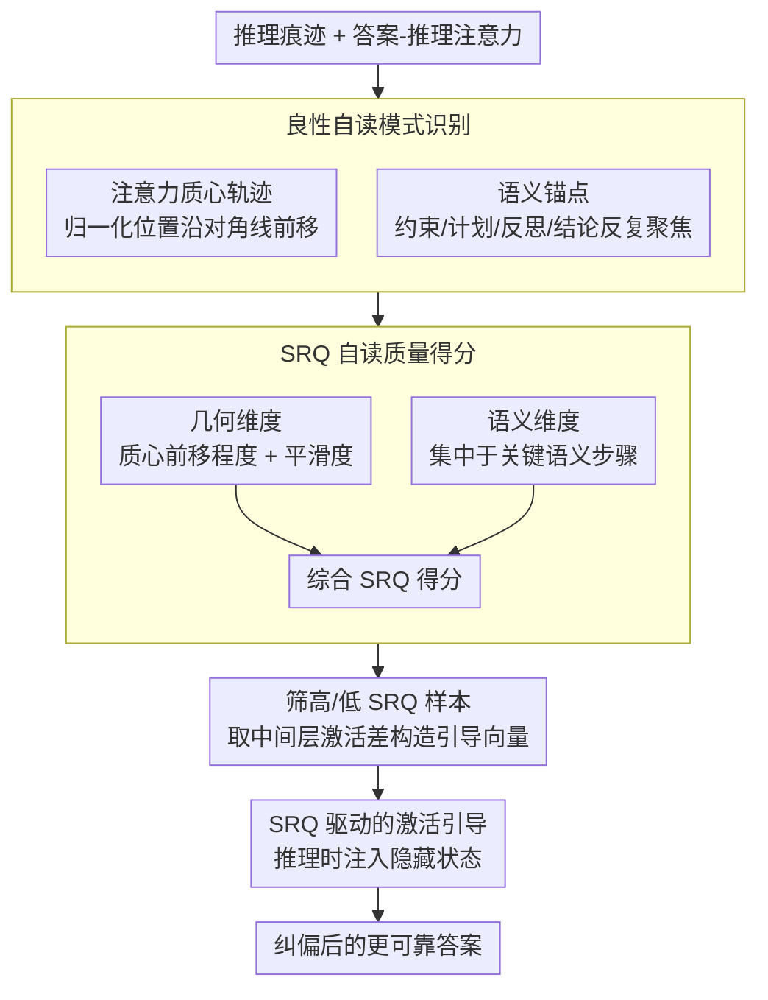

# How Do Answer Tokens Read Reasoning Traces? Self-Reading Patterns in Thinking LLMs

**会议**: ACL 2026 Findings  
**arXiv**: [2604.19149](https://arxiv.org/abs/2604.19149)  
**代码**: 无  
**领域**: LLM/NLP  
**关键词**: 推理模型, 自读模式, 注意力分析, 激活引导, 定量推理

## 一句话总结

本文发现推理 LLM（如 DeepSeek-R1）在定量推理中存在"良性自读"模式——答案 token 对推理痕迹的注意力呈现前移漂移（沿推理链逐步推进）和语义锚点集中（反复回顾关键步骤），且此模式与正确性强相关；基于此提出 SRQ（自读质量）驱动的免训练激活引导方法，在多个基准上提升准确率最高 2.6%。

## 研究背景与动机

**领域现状**：推理 LLM（如 DeepSeek-R1、GPT-5、Gemini 3）在生成答案前先产生推理痕迹（</think> 分隔）。激活引导已被证明可以控制推理痕迹的行为（如压缩冗余输出、引导验证和回溯）。

**现有痛点**：现有工作主要关注如何塑造推理痕迹本身，但答案 token 如何"阅读"和整合推理痕迹来产生可靠输出仍然不清楚。在推理链长达数千 token 的情况下，答案 token 如何在噪声中导航并利用关键信息是一个关键问题。

**核心矛盾**：推理痕迹中既有关键推理步骤也有探索性尝试和冗余内容。答案 token 需要"选择性阅读"——但我们不知道模型是如何做到的，也不知道阅读模式与正确性的关系。

**本文目标**：(1) 理解答案 token 如何阅读推理痕迹；(2) 建立自读模式与正确性的关联；(3) 利用自读质量信号进行免训练引导。

**切入角度**：分析答案 token 对推理 token 的注意力分布——注意力质心的轨迹和集中点揭示了模型的"阅读策略"。

**核心 idea**：良性自读 = 内部确定性的行为签名——模型已选定一条解题路径并依赖少数关键推理步骤作为生成答案的证据。注意力质心的前移漂移反映"控制"（沿选定分支推进），语义锚点的持续聚焦反映"监控"（反复验证证据）。

## 方法详解

### 整体框架

本文要回答的问题是"答案 token 到底怎么阅读前面那条几千 token 的推理痕迹，且这种阅读方式跟答对与否有没有关系"。围绕这一点，方法从分析走到应用：先在 GSM8K 上观察三个推理 LLM 的答案-推理注意力，从中提炼出"良性自读"的几何与语义特征；再把这两类特征量化成 SRQ（自读质量）得分，用它衡量一个样本的阅读是否有序；最后用高 SRQ 与低 SRQ 样本的激活差构造引导向量，在推理时注入隐藏状态，把模型从混乱阅读推向良性自读。输入是模型的推理痕迹与注意力，中间产物是 SRQ 得分与引导向量，输出则是被纠偏后的更可靠答案。

### 关键设计

**1. 良性自读模式识别：把答案 token 的阅读轨迹可视化成可判别的几何签名**

问题在于推理痕迹里既有关键步骤也有探索弯路和冗余，没人知道答案 token 是如何在其中导航的。作者对每个答案 token 计算它对推理 token 注意力分布的加权平均位置——即注意力质心，并归一化到 $[0,1]$。在正确样本里，质心轨迹随答案生成沿对角线前移，阅读焦点稳步推进；同时注意力反复落在少数"语义锚点"（问题约束、解题计划、反思、最终结论）上；而错误样本的注意力则分散无规律。这一对比把抽象的"阅读策略"落成可观测的几何模式，并能用元认知框架解释：推理 token 做对象层计算，答案 token 做元层操作——质心前移对应"控制"（沿选定分支推进），锚点回顾对应"监控"（反复验证证据），与 Nelson 1990 / Koriat 1997 的认知理论一致。

**2. SRQ（自读质量）得分：几何与语义两维互补地量化阅读质量**

要把"良性自读"用于样本筛选和向量构造，就得先把它打成分数。SRQ 由两维组成：几何维度度量注意力质心轨迹的前移程度与平滑度（是否沿对角线推进），语义维度度量注意力是否集中于关键语义步骤（约束、计划、结论），两者组合成最终得分。之所以两维并用，是因为单看几何会选到"平滑但语义无意义"的样本，单看语义又会选到"锚定对了但过程混乱"的样本，只有几何与语义同时达标才说明阅读既有序又抓在了正确证据上。

**3. SRQ 驱动的激活引导：用对比样本的激活差免训练地纠偏阅读**

既然良性自读与正确性强相关（人工验证 159/171 正确样本展示良性自读），那么主动把模型推向良性自读就应当提升准确率。具体做法是选出高 SRQ 与低 SRQ 两组样本，提取它们在中间层的激活差作为引导向量，推理时把该向量加到目标层隐藏状态上，使模型远离混乱阅读、趋向有序阅读。整个过程不改模型参数、不需额外训练，是一种 inference-time 的轻量干预。

### 损失函数 / 训练策略

完全免训练。引导向量从高/低 SRQ 对比样本的激活差异中提取，推理时添加到目标层的隐藏状态上即可。

## 实验关键数据

### 主实验

**SRQ 引导在多个基准上的准确率提升**

| 模型 | 基准 | 基线准确率 | + SRQ 引导 | 提升 |
|------|------|----------|-----------|------|
| R1-Distill-Llama-8B | GSM8K | ~82% | ~84.6% | +2.6% |
| R1-Distill-Qwen-7B | GSM8K | ~83% | ~85% | +2% |
| Qwen3-4B-Thinking | GSM8K | ~80% | ~81.5% | +1.5% |

### 消融实验

| 配置 | 效果 | 说明 |
|------|------|------|
| 仅几何维度 | 提升较小 | 缺少语义锚定信号 |
| 仅语义维度 | 提升中等 | 缺少过程结构信号 |
| **几何+语义** | **最优** | 两维度互补 |

**人工标注验证（200 样本）**

| 类型 | 数量 | 说明 |
|------|------|------|
| 正确+良性自读 | 159/171 正确 | 93% 的正确样本展示良性自读 |
| 错误+良性自读 | 3/26 错误 | 仅 12% 的错误样本有良性自读 |
| 平衡子集（50+50）| 48 正确有良性 vs 46 错误无良性 | 趋势一致 |

### 关键发现

- 良性自读模式在正确样本中几乎普遍存在（93%），在错误样本中罕见（12%）
- 聚合 100 个正确样本的注意力图仍保持清晰的对角线脊——证明是稳定的系统性行为
- SRQ 引导在不修改参数的情况下一致提升准确率，验证了自读模式与正确性的因果关联
- 几何和语义维度互补——单独使用任一维度的效果都不如组合

## 亮点与洞察

- 发现推理 LLM 的"自读"行为及其与正确性的关联是对 LLM 内部机制理解的重要贡献
- 元认知框架（控制+监控）的引入为解释 LLM 行为提供了认知科学的理论基础
- SRQ 驱动的激活引导展示了从理解到应用的完整闭环

## 局限与展望

- 仅在定量推理任务上验证，其他推理类型（逻辑、常识）的适用性未知
- 准确率提升幅度有限（最高 2.6%）
- 语义锚点的识别可能是任务特定的
- 未来可探索如何在训练阶段引导模型学习更好的自读模式

## 相关工作与启发

- **vs Venhoff et al. (2025)**: 引导推理痕迹中的验证和回溯行为，本文引导答案阶段的阅读行为
- **vs Azizi et al. (2025)**: 压缩推理长度的引导，本文关注答案如何利用推理
- **vs Zhang et al. (2025)**: 确认答案-推理注意力链接的存在，本文深入分析其结构模式和功能意义

## 评分

- 新颖性: ⭐⭐⭐⭐⭐ 首次系统分析推理 LLM 答案 token 的自读行为，概念新颖且有认知科学深度
- 实验充分度: ⭐⭐⭐⭐ 三个模型、人工验证、激活引导验证，但任务范围有限
- 写作质量: ⭐⭐⭐⭐⭐ 可视化精美，分析深入，认知类比恰当
- 价值: ⭐⭐⭐⭐ 为理解和改进推理 LLM 提供了新的分析视角和实用工具

<!-- RELATED:START -->

## 相关论文

- [\[NeurIPS 2025\] AceSearcher: Bootstrapping Reasoning and Search for LLMs via Reinforced Self-Play](../../NeurIPS2025/llm_nlp/acesearcher_bootstrapping_reasoning_and_search_for_llms_via_reinforced_self-play.md)
- [\[ACL 2025\] How Numerical Precision Affects Arithmetical Reasoning Capabilities of LLMs](../../ACL2025/llm_nlp/how_numerical_precision_affects_arithmetical_reasoning_capabilities_of_llms.md)
- [\[ACL 2025\] Unlocking Recursive Thinking of LLMs: Alignment via Refinement](../../ACL2025/llm_nlp/unlocking_recursive_thinking_of_llms_alignment_via_refinement.md)
- [\[ICLR 2026\] How Far Are LLMs from Professional Poker Players? Revisiting Game-Theoretic Reasoning with Agentic Tool Use](../../ICLR2026/llm_nlp/how_far_are_llms_from_professional_poker_players_revisiting_game-theoretic_reaso.md)
- [\[ICML 2026\] Reasoning on the Manifold: Bidirectional Consistency for Self-Verification in Diffusion Language Models](../../ICML2026/llm_nlp/reasoning_on_the_manifold_bidirectional_consistency_for_self-verification_in_dif.md)

<!-- RELATED:END -->
