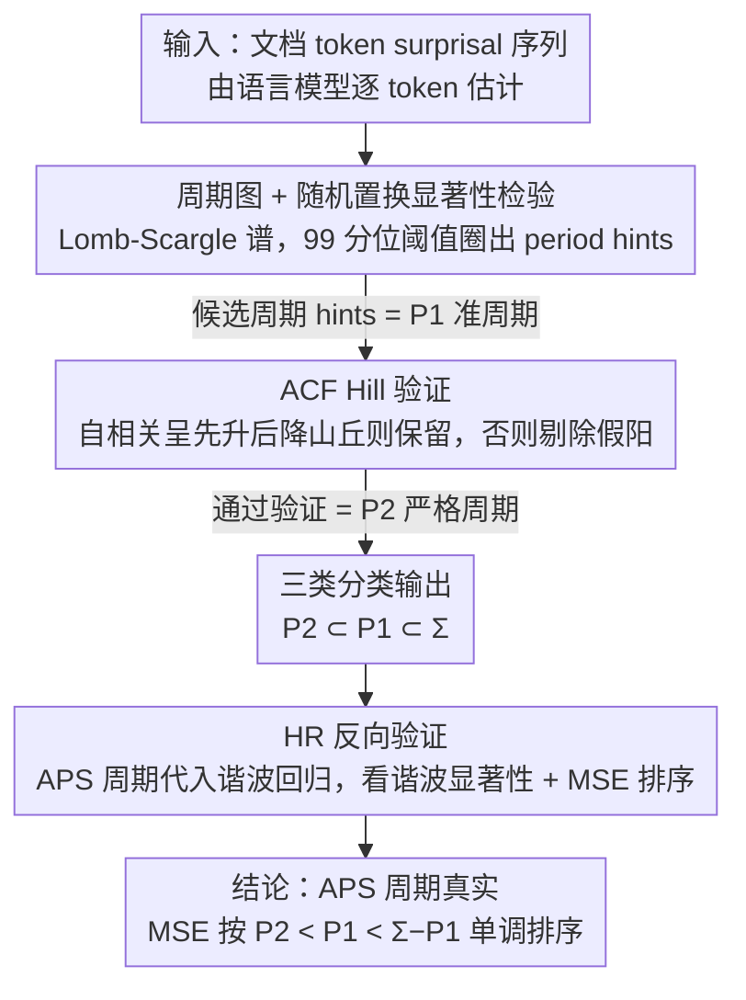

<!-- 由 src/gen_stubs.py 自动生成 -->
# Identifying the Periodicity of Information in Natural Language

**会议**: ACL 2026  
**arXiv**: [2510.27241](https://arxiv.org/abs/2510.27241)  
**代码**: <https://github.com/CLCS-SUSTech/APS>  
**领域**: 信息论语言学 / 信息密度 / 机器生成检测  
**关键词**: 信息周期性, surprisal, AutoPeriod, 谐波回归, LLM 检测

## 一句话总结
本文把信号处理领域的 AutoPeriod 周期检测算法搬到 token-surprisal 序列上，提出 APS（AutoPeriod of Surprisal）能在单文档级别**直接检测**出自然语言信息密度的周期（如 "每 53 个 token 一个周期"），发现人类文本中约 11% 的文档存在严格周期，且 LLM 生成文本的周期性比人类强 2 倍（30% vs 14.8%），为 UID 理论提供了直接证据并给 AI 文本检测提供了可解释特征。

## 研究背景与动机

**领域现状**：自 Shannon 1948 以来，信息论语言学的核心假设是 UID（Uniform Information Density, Aylett & Turk 2004; Jaeger 2010）——出于高效沟通的需要，自然语言会让 token-level surprisal 趋于均匀。但 UID 是渐进性质，短窗口下 surprisal 自然会有波动（fluctuation），Genzel & Charniak 2002/2003 发现段落开头 surprisal 高、结尾骤降。最近的工作进一步把"波动"升级为"周期性"假设——Xu & Reitter 2017 / Yang et al. 2023（FACE）用 Fourier 频谱发现 text surprisal 频谱可区分白噪声；Tsipidi et al. 2025 用谐波回归（HR）验证了离散结构单元（句子、段落、EDU）对应的周期信号显著。

**现有痛点**：(1) Fourier 方法（频域）只能给出"频谱不是白噪声"的间接证据，没把频谱转回时域的"具体周期长度是多少"；(2) HR 方法依赖**预先选定的候选周期**（必须先指定"句子/段落/EDU 的长度"作为 $U_t$），无法发现训练时没指定的周期，且不能判断单个文档是否真的周期；(3) 没有 doc-level 的周期检测器，无法与 genre / authorship / human-vs-LLM 这些 doc-level 变量相关联。

**核心矛盾**：要回答"自然语言信息是否周期"这一问题，必须 (a) 在单文档级别给出可拒绝的统计判断（有 / 无 / 是哪些周期）、(b) 周期发现要无候选先验、(c) 既能与已知结构单元对照又能找到结构外的"未知周期"。现有方法三者都不满足。

**本文目标**：(1) 设计单文档级周期检测算法，能用置信度阈值返回"所有"显著周期；(2) 在 4 个语料库上量化"有多少文档真的周期"；(3) 与已知结构单元比较；(4) 用 HR 反向验证 APS 的发现；(5) 用 APS 找出人类 vs LLM 文本的周期差异。

**切入角度**：Vlachos et al. 2005 在金融/社科时间序列上提出的 AutoPeriod 算法——先用周期图（periodogram）找候选周期，再用 ACF（自相关函数）"hill" 过滤掉假阳——成熟可靠。把它适配到 surprisal 序列（用 Lomb-Scargle 周期图提升长周期分辨率）即可。

**核心 idea**：用经典信号处理 AutoPeriod + surprisal 序列 = 单文档信息周期检测器；周期图选候选 + ACF hill 验证保证假阳率低；最后用 HR 反向验证 APS 的发现，并探索 human vs LLM 差异。

## 方法详解

### 整体框架
APS 的输入是一篇文档的 token surprisal 序列 $\mathbf{x} = (x_0, \dots, x_{N-1})$，其中 $x_n = -\log p(t_n \mid t_{<n})$ 由语言模型估计（英语用 LLaMA3-8B / Yarn-LLaMA2-7B，中文用 Qwen2-7B），输出则是该文档的有效周期集 $\{\tau_1, \tau_2, \dots\}$ 或空集。它把信号处理里成熟的 AutoPeriod 两步走搬到 surprisal 上：先用周期图在频域圈出统计显著的候选周期（period hints），再用 ACF 的几何形态在时域过滤掉假阳，留下经双重确认的周期。据此可把全部文档切成三类——$P_1$（至少一个 hint，准周期）、$P_2 \subseteq P_1$（hint 通过 ACF 验证，严格周期）、$\Sigma - P_1$（无 hint，非周期）；这套分类既是 APS 的输出，也是后续与 genre / human-vs-LLM 等 doc-level 变量关联的实验切片工具，并被进一步用谐波回归（HR）做反向验证以坐实"检出的周期是真"。

### 关键设计

**1. 基于 surprisal 的周期图 + 随机置换显著性检验（Step 1）：在频域圈出"显著高于噪声"的候选周期**

直接对 surprisal 做 DFT $X_k = \sum_n x_n e^{-i 2\pi k n / N}$、取前一半的 $\|X_k\|$ 得到周期图 $\bm{\mathcal{P}}$（实际用 Lomb-Scargle 版本以增强长周期分辨率），但频谱里能量高的峰未必是真周期、也可能是随机噪声。为此做 $m=100$ 次随机置换 $\text{Permute}(\mathbf{x})$，记录每次置换序列的 max power 得到一个零分布，取其 99 分位作阈值 $P_{\text{threshold}}$，凡 $\bm{\mathcal{P}}[k] > P_{\text{threshold}}$ 的频率 $k$ 就把对应周期 $\tau = N/k$ 收为 period hint。置换打散了周期结构，这个 model-free 的置换检验直接回答"若信号本无周期，最大功率能有多大"，比绝对阈值或 Bonferroni 更稳健且置信度可调；全文默认 CL=.90，比传统 .95 更敏感、保留更多 hint。

**2. ACF Hill 验证过滤假阳（Step 2）：用自相关的山丘形态做时域二次确认**

周期图给出的候选里短周期尤其容易假阳，因为能量高不等于 self-similar。真周期 $\tau$ 在自相关曲线 $\text{ACF}(\tau) = \frac{1}{N}\sum_n x(n) \cdot x(n+\tau)$ 上一定表现为一个"山丘"（局部极大）。于是对每个 hint $\tau' = N/k$ 划出邻域窗 $W = [(\tau + \tau_{\text{next}})/2 - 1, (\tau + \tau_{\text{prev}})/2 + 1]$，在窗内枚举分裂点 $t$ 跑线性回归，找到使 $\epsilon_L + \epsilon_R$ 最小的 $t_{\text{best}}$，再判断左斜率是否大于右斜率且斜率差 $|\theta_L - \theta_R| > 0.01$，即整段 ACF 是否呈"先升后降"的 hill；若 isHill 为真则用 findPeak 取窗内 ACF 局部极大作为 refined period，否则丢弃该 hint。频域显著叠加时域自相关的双重确认，使假阳率显著下降——Table 1 显示 $|P_2|/|P_1| \approx 66\%$，三分之二的 hint 通过验证、三分之一被剔除，证明过滤确实在起作用。

**3. HR 反向验证 + filter-based 增益：用谐波回归独立证明 APS 找到的是真"统计周期"**

APS 做的是 detection（"这里有周期"），需要一个独立工具证明它不是在乱报，于是借 Tsipidi et al. 2025 的谐波回归 HR 做 explanation（"这个周期能解释 surprisal"）。把 HR 公式 $s(w_t) \sim \text{baseline} + \text{HR}(U_t)$ 里的 $U_t$ 换成 APS 返回的 hint / valid period，看谐波项 $\beta_{1,k} \sin(k 2\pi t/U_t) + \beta_{2,k}\cos(k 2\pi t/U_t)$ 是否显著（amplitude $A_k = \sqrt{\beta_{1,k}^2 + \beta_{2,k}^2}$，p<0.001），同时按 APS 的分类 $P_2 \subset P_1 \subset \Sigma$ 切片，检查 HR 的 MSE 是否按 $P_2 < P_1 < \Sigma < \Sigma - P_1$ 排序。由于 APS 与 HR 完全独立，若 APS 找的周期既能让谐波项显著、又让 MSE 按预期单调排序，就反向坐实了 APS 的发现是真实的统计周期而非噪声伪影。

### 损失函数 / 训练策略
本文**无任何模型训练**——APS 是确定性算法（DFT + 置换 + 线性回归），HR 是 OLS 回归。涉及超参：$m=100$ 置换次数、percentile=99（默认） / 90（实际全文用）、HR 谐波项 $K=10$。语料：WSJ、Brown、CTB、GCDT、RST Discourse Treebank、FACE、EvoBench。语言模型只用来估 surprisal，不更新。

## 实验关键数据

### 主实验（4 个语料库的周期文档比例）

| 语料 | $|\Sigma|$ | $|P_1|$ | $|P_2|$ | $|P_1|/|\Sigma|$ | $|P_2|/|P_1|$ | $|P_2|/|\Sigma|$ |
|------|------------|---------|---------|------------------|----------------|------------------|
| WSJ (en) | 2499 | 221 | 131 | 8.84% | 59.28% | 5.24% |
| Brown (en) | 500 | 52 | 25 | 10.40% | 48.08% | 5.00% |
| GCDT (zh) | 50 | 15 | 13 | **30.00%** | **86.67%** | **26.00%** |
| CTB (zh) | 2773 | 304 | 212 | 10.96% | 69.74% | 7.65% |
| **Avg** | — | — | — | **15.05%** | **65.94%** | **10.97%** |

中文显著高于英语，GCDT 因为是多 genre 正式文本（学术/传记/访谈/新闻/how-to）周期性最强 26%。

### 消融实验（HR 反向验证：MSE 按 APS 切片，越严格越周期）

WSJ HR MSE：

| 数据切片 | Baseline (无 HR) | EDU 作 $U_t$ | Sentence 作 $U_t$ | Whole Text |
|----------|------------------|---------------|--------------------|-------------|
| $P_2$（严格周期） | **16.33** | **13.78** | **15.60** | 16.29 |
| $P_1$（准周期） | 16.87 | 14.14 | 16.14 | 16.84 |
| $\Sigma$（全语料） | 18.26 | 15.18 | 17.56 | 18.25 |
| $\Sigma - P_1$（非周期） | 18.59 | 15.42 | 17.89 | 18.57 |

MSE 完美按 $P_2 < P_1 < \Sigma < \Sigma - P_1$ 排序——APS 检测出的"周期"文档确实在 HR 下 surprisal 更可预测。GCDT 上同样规律。

HR 显著性（WSJ $P_2$ 部分，APS valid period 当 $U_t$）：$A_1 = 0.2022$（$\beta_{1,1}=0.1273$, p < 0.001; $\beta_{2,1}=0.1571$, p < 0.001），证明 1 阶谐波极其显著。

### 关键发现
- **5-11% 文档严格周期，15% 准周期**：周期性不是"普遍现象"但也绝不"罕见"——平均 10.97% 文档严格周期，对一个 subtle 信号来说是显著的发现。
- **中文 > 英语**：所有指标中文都比英语高，可能因为中文话题/段落结构更刚性，或者 LLM tokenizer / surprisal 估计在中文上行为不同。
- **GCDT 最高（26%）说明 genre 决定周期性**：正式文本（学术、传记、how-to）周期性远超新闻类，提示未来该按 verse vs prose、oral vs written 等维度系统研究。
- **APS 发现长周期超出结构单元解释**：33.33% valid periods 超过 150 tokens，21.84% 超过 200 tokens，而段落（最长结构单元）只 3.63% 超 150 tokens——**存在 EDU/句子/段落都无法解释的"长程周期"**，可能源于话题或语义场跨段的潜结构。
- **HR 反向验证 + MSE 排序完美**：$P_2 < P_1 < \Sigma < \Sigma - P_1$ 在 baseline / EDU / Sentence / Whole Text 四种 scaler 下都成立，证明 APS 不是噪声艺术。
- **EDU 仍然是最强 HR scaler**（WSJ $P_2$ MSE 13.78 < APS period 16.29）——APS 周期 amplitude 比 EDU 弱（因为它是 doc-level 固定值，不随 token 位置变），但 APS 找到的是 EDU 之外的全局周期，两者互补而非竞争。
- **LLM 文本周期性约为人类 2 倍**：FACE BBC News 上 LLaMA3-70B 生成文本 $|P_2|/|\Sigma| = 30.06\%$ vs 人类 14.80%；FACE 中文 Qwen2-72B 24.62% vs 人类 18.86%。即使排除明显重复（7.33% 文档含 repeated phrases），差距仍显著（27.86% vs 14.80%）。EvoBench XSum 上 GPT-4o 7.33% vs 人类 3.33%，趋势一致。
- **LLM 强周期主要在长周期段（>50 tokens）**：Figure 5 分布对比显示 LLM 在长程上多了显著的额外周期峰值，作者推测是 LLM 的"跨段落保持结构连贯"倾向。

## 亮点与洞察
- **把 50 年前的信号处理算法（AutoPeriod 2005 / Lomb-Scargle 1976）精准地适配到 NLP**——技术不必崭新，关键是问对问题（"自然语言信息密度是否真有周期"）并选对工具（"周期图 + ACF 双确认"是经典两步走的代表）。这是"借鉴邻近学科成熟工具解决 NLP 新问题"的范例。
- **置换检验作为 model-free 显著性判断**比绝对阈值 / Bonferroni 更稳健——它直接拿"无周期的零分布"比较，对 surprisal 序列的尺度 / 分布形态都不敏感，这个思路适合任何"看似有 pattern 但需统计判断" 的 NLP 任务（如句法 motif 检测、attention head 模式分析）。
- **APS 发现的 33% 长周期超出结构单元**是论文最有理论价值的发现——它暗示 surprisal 的长程结构来自话题流动、修辞结构、甚至作者风格等比 EDU 更抽象的潜变量，给 UID 理论补了一个"长程版本"。
- **LLM 周期性更强这一发现**为现有的 LLM 检测工具（Xu et al. 2024 spectrum、Liu et al. 2025 FACE-eval）提供了**可解释的依据**——不是黑盒的"频谱特征不一样"，而是"LLM 倾向于跨段保持结构连贯"这个可解释的语言学事实。
- **三种文档分类（$P_2, P_1, \Sigma - P_1$）**给后续研究提供了**直接可用的实验切片工具**——任何想研究"周期性是否影响 X"的工作（X 可以是阅读时间、可读性、翻译难度等）都可以用 APS 切片再分析。

## 局限与展望
- 作者承认：(1) 只测英语和中文，未验证形态丰富语言（如阿拉伯语、芬兰语）；(2) genre 对周期性的影响只观察未深入分析；(3) **短周期检测精度不足**——DFT 高频分辨率比低频差，置换检验在短周期更易假阳，所以高置信度时短周期峰值会萎缩。
- 自己看到的：**LLM 周期更强可能有 confounding**——LLM 文本平均长度 / 风格 / 词汇分布与人类不同，可能本来就更适合 surprisal 估计；建议控制长度、控制 prompt 后再比较。
- **完全依赖 LLaMA3-8B / Qwen2-7B 估 surprisal**：不同语言模型给出的 surprisal 序列不同（OOV、tokenizer、训练数据），APS 检测出的周期可能部分是 LM 的"投影"而非语言本身。
- **APS 是 detection 工具，没回答"为什么有周期"**——长周期来自话题？修辞？认知？论文留作 future work。
- **置信度 90% 的选择有点武断**——95% 更严格但漏报多，论文没系统消融 CL 对结果的影响。

## 相关工作与启发
- **vs Tsipidi et al. 2025 (HR)**：HR 需要**预先指定** $U_t$（句子 / 段落 / EDU 长度），APS 完全无候选先验直接发现周期。本文用 HR 反向验证 APS，证明两者互补——APS 适合 detection，HR 适合 explanation。
- **vs Yang et al. 2023 (FACE)**：FACE 用 cross-entropy 的 Fourier 频谱评 NLG 质量，是 APS 的前身但只在频域工作；APS 把频域结果转回时域具体周期值，可解释性大幅提升。
- **vs Xu et al. 2024 (spectrum-based LLM detection)**：他们用 surprisal 频谱区分 human/LLM 但是黑盒；APS 给出了具体的"LLM 周期更多更长"这一可解释依据。
- **vs Xu & Reitter 2016/2018**：对话场景下 surprisal 在话题边界处的 convergence 现象，APS 是其在单 doc 上的推广检测器。
- **启发**：APS 的"置换检验 + 几何过滤"框架可以推广到任何"NLP 序列中找 pattern" 的任务——attention 周期性、syntactic motif、对话回合周期等都能直接套用。

## 评分
- 新颖性: ⭐⭐⭐⭐ 算法本身借鉴成熟工具（AutoPeriod），但把它系统适配到 NLP 并把"信息周期性"从假设变成可检测的实证现象，是新颖的视角。
- 实验充分度: ⭐⭐⭐⭐ 4 个语料库 + 跨语言 + 与 3 种结构单元对比 + HR 反向验证 + human-vs-LLM 三个数据集，覆盖度高；缺超参 sensitivity（CL / 置换次数）。
- 写作质量: ⭐⭐⭐⭐⭐ 故事讲得极清晰——从 UID 现状 → 现有方法痛点 → 引入 AutoPeriod → 验证 → human/LLM 差异，逻辑流畅；公式和算法伪代码完整，可复现性高。
- 价值: ⭐⭐⭐⭐ 给信息论语言学社区第一个 doc-level 周期检测工具，且对 LLM 文本检测、NLG 评估直接可用；开源代码降低使用门槛。

<!-- RELATED:START -->

## 相关论文

- [\[ACL 2026\] Repeated Sequences Reveal Gaps between Large Language Models and Natural Language](repeated_sequences_reveal_gaps_between_large_language_models_and_natural_languag.md)
- [\[AAAI 2026\] Identifying and Analyzing Performance-Critical Tokens in Large Language Models](../../AAAI2026/llm_nlp/identifying_and_analyzing_performance-critical_tokens_in_large_language_models.md)
- [\[ACL 2025\] Cooperating and Competing Through Natural Language](../../ACL2025/llm_nlp/cooperating_and_competing_through_natural_language.md)
- [\[ACL 2025\] What Makes a Good Natural Language Prompt?](../../ACL2025/llm_nlp/good_natural_language_prompt.md)
- [\[ACL 2025\] Internal and External Impacts of Natural Language Processing Papers](../../ACL2025/llm_nlp/internal_and_external_impacts_of_natural_language_processing_papers.md)

<!-- RELATED:END -->
