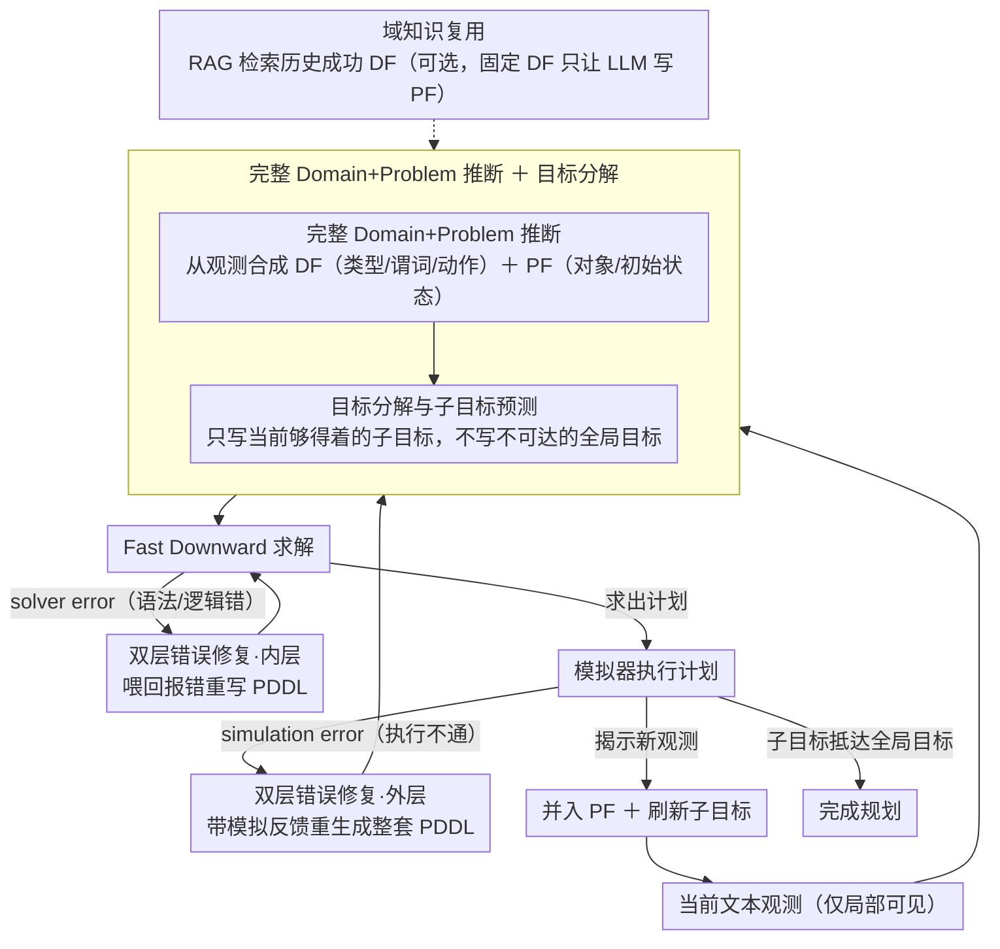

# Iterative Formalization and Planning in Partially Observable Environments

**会议**: ACL 2026  
**arXiv**: [2505.13126](https://arxiv.org/abs/2505.13126)  
**代码**: [GitHub](https://github.com/zharry29/pddlego-plus)  
**领域**: LLM NLP / AI Planning  
**关键词**: 部分可观测环境, PDDL形式化, 迭代规划, LLM-as-Formalizer, 错误修复

## 一句话总结

提出 PDDLego+ 框架，让 LLM 在部分可观测环境中迭代地生成和修正 PDDL（规划领域定义语言）表示，通过双层错误修复循环（solver error + simulation error）实现无需微调、无需示例的有效规划。

## 研究背景与动机

**领域现状**：利用大语言模型进行规划是 AI 规划领域的热门方向，现有方法主要分为两类：LLM-as-planner（直接生成动作计划）和 LLM-as-formalizer（将环境形式化为 PDDL 再用传统求解器规划）。后者因可解释性好、可控性强而受到青睐，但绝大多数工作仅关注完全可观测环境。

**现有痛点**：真实世界中的规划场景（如机器人探索未知房间、网页代理操作）通常是部分可观测的——agent 只能看到局部观测，无法一次性生成完整计划。少数处理部分可观测环境的工作存在三个缺陷：(1) 假设部分规划表示已知（如预定义的 predicates 或 domain file）；(2) 仅使用一次性形式化而非迭代改进；(3) 依赖现有轨迹作为 in-context 示例。

**核心矛盾**：PDDL 等规划语言基于封闭世界假设——要求初始状态和目标的完整定义。这与部分可观测环境中信息逐步揭示的本质直接矛盾。

**本文目标**：设计一个无需微调、无需示例、无需预设 domain file 的框架，让 LLM 在部分可观测环境中通过迭代探索和错误修复，逐步构建完整的 PDDL 表示并完成规划任务。

**核心 idea**：将部分可观测问题分解为一系列完全可观测的子问题，每次基于当前观测生成局部 PDDL，用求解器规划并执行，根据新观测和错误反馈迭代更新。

## 方法详解

### 整体框架

PDDLego+ 要解决的核心难题是：PDDL 这类规划语言基于封闭世界假设、要求一次性写全初始状态和目标，可现实里 agent 只能看到局部观测，没法一上来就形式化整个世界。它的办法是把"完整规划"拆成一连串"看一点、形式化一点、走一步"的小循环。每个时间步上，LLM 先根据当前文本观测生成 Domain File（$\mathbb{DF}$，定义类型、谓词、动作语义）和 Problem File（$\mathbb{PF}$，定义对象、初始状态、子目标），交给形式化求解器（Fast Downward）搜出一个动作计划，在模拟环境里执行，再拿执行后揭示的新观测回头修订 PDDL——如此往复直到抵达全局目标。与前作 PDDLego 最大的不同是：PDDLego+ 同时推断 DF 和 PF，不再假设 domain file 已经给好。

### 关键设计

**1. 双层错误修复循环：把"求解器报错"和"执行失败"分开治**

LLM 写出的 PDDL 几乎不可能一次正确，但错有两种、性质完全不同，混在一起修反而越改越乱。内层循环专治 solver error——PDDL 语法或逻辑写错导致 Fast Downward 根本求不出解，反馈即时、问题局部，直接把报错喂回去重写：$\mathrm{df}_i^{j,k+1}, \mathrm{pf}_i^{j,k+1} = \text{LLM}(\mathrm{err}_{\text{sol}}, \mathrm{df}_i^{j,k}, \mathrm{pf}_i^{j,k})$。外层循环治 simulation error——PDDL 语法没毛病、求解器也给出了计划，但计划在模拟器里执行不通（往往是缺了前置条件、动作语义不符现实这类更深的语义偏差），这时带着模拟器反馈重新生成整套 PDDL：$\mathrm{df}_i^{j+1}, \mathrm{pf}_i^{j+1} = \text{LLM}(\mathrm{err}_{\text{sim}}, \mathrm{df}_i^j, \mathrm{pf}_i^j)$。分层的好处是让"改一个括号"和"重想动作模型"走不同粒度的修复，避免拿语义层的反馈去瞎改语法。

**2. 目标分解与子目标预测：在看不全的世界里只追当前够得着的目标**

部分可观测环境里，全局目标（比如"找到金币")在还没探索完时根本写不进一个可解的 PDDL——求解器会因为目标不可达而失败。于是每个时间步 LLM 不写死全局目标，而是预测一个当前局部就能达成的子目标，靠它驱动探索逐步逼近终点。论文给了两档提示模板：simple prompt 只给粗略的分解指引，让 LLM 自己想子目标；detailed prompt 直接给出 PDDL 目标骨架（如 `(:goal (at ?location))`）让 LLM 填占位符。后者约束更强、更易求解，但前者更考验模型自身的规划直觉。

**3. 完整 Domain+Problem 推断：连动作模型都让 LLM 从观测里自己长出来**

PDDLego 之所以"作弊"地假设 DF 已知，是因为推断 DF 远比推断 PF 难——前者像是凭空合成一套类和函数，后者只是按既定接口填函数调用。但真实场景里没人会预先把每个环境的动作语义写好喂给你。PDDLego+ 让 LLM 直接吃自然语言观测（如"你在厨房，东边有一扇关着的门"），一口气吐出 PDDL 的类型定义、谓词、动作前置/效果（DF）连同对象实例、初始状态、子目标（PF）。这一步是整个框架最吃模型能力的地方，也是后面错误分析里大多数 bug 的来源。

**4. 域知识复用：把成功跑通的 DF 当"学到的世界规则"攒下来**

形式化方法相比 LLM-as-planner 的一个独特红利是知识可积累：一次试验成功后产出的 DF，其实就是一份被验证过的动作模型，完全可以喂给未来同类任务复用。论文用 RAG 从历史成功试验里检索 DF，固定住它、只让 LLM 预测 PF——相当于把"最难的那一半"换成查表。在 DeepSeek-R1、GPT-4.1 这些 DF 生成能力一般的模型上成功率显著上升；而 o3-mini 本身 DF 写得就好，复用反而略有下降。

### 一个完整示例：CoinCollector 里走一轮

以"在多个相连房间里找金币"为例感受这套循环：第 1 步 agent 只看到"你在厨房，东边有一扇关着的门"，LLM 据此生成 DF（定义 `room`、`door`、`open`/`go` 等谓词和动作）和 PF（子目标设为"打开东门并走进相邻房间"，而非不可达的"拿到金币"）。Fast Downward 求解，若 PDDL 漏了 `open` 的前置条件、求解器报错 → 内层循环按 solver error 把括号补上。计划执行后揭示新房间"客厅，北边有一扇门"——这是上一步无法预见的信息，于是把它并进 PF、刷新子目标，进入下一轮。若某次计划在模拟器里走不通（比如假设了一扇并不存在的门，属幻觉事实）→ 外层循环按 simulation error 重写。就这样一轮轮把局部观测拼成越来越完整的世界模型，直到子目标终于能直接写成"拿到金币"并求解成功。

## 实验关键数据

### 主实验

在 CoinCollector（导航任务）和 ALFWorld（物体操作任务）两个文本模拟环境上评估：

| 方法 | CoinCollector (o3-mini) | ALFWorld (o3-mini) |
|------|------------------------|-------------------|
| PlanGen (LLM-as-planner) | 52% | 5% |
| PDDLego (无修复) | 49% | 3% |
| PDDLego+ (本文) | **86%** | **38%** |

| 模型 | CoinCollector PlanGen/PDDLego+ | ALFWorld PlanGen/PDDLego+ |
|------|-------------------------------|--------------------------|
| DeepSeek-R1 | ~55% / ~75% | ~8% / ~25% |
| GPT-4.1 | ~60% / ~55% | ~3% / ~20% |
| o3-mini | 52% / 86% | 5% / 38% |
| o4-mini | ~65% / ~80% | ~10% / ~30% |

### 消融实验

- **复杂度鲁棒性**：CoinCollector 房间数从 3 增到 11 时，PDDLego+ 成功率保持稳定，PlanGen 和 PDDLego 逐渐下降
- **目标提示消融**：detailed prompt 优于 simple prompt，但 simple prompt 下 PDDLego+ 仍显著优于基线
- **域知识复用**：使用 RAG 检索的 DF，DeepSeek-R1 和 GPT-4.1 成功率提升，o3-mini 略有下降（已有足够强的 DF 生成能力）

### 关键发现

- PDDLego+ 在较复杂的 ALFWorld 上对所有模型都优于 PlanGen，说明形式化方法在复杂规划任务中的优势
- 大多数错误是 solver error（PDDL 语法问题），而非 simulation error，o3-mini 的错误修复率最高
- 错误分析显示主要瓶颈在 PF 的语义错误：幻觉事实、不可达目标、遗忘已观测信息

## 亮点与洞察

- **形式化方法在部分可观测环境中可行**：首次系统性证明 LLM-as-formalizer 在部分可观测环境中的有效性，打破了"PDDL 只能用于完全可观测环境"的认知
- **可解释性优势**：与 LLM-as-planner 不同，PDDLego+ 的每个失败都可以归因到具体的 PDDL 错误，支持因果错误分析
- **域知识可迁移**：成功试验产生的 DF 可复用，展示了形式化方法在知识积累方面的独特优势
- **推理模型的优势**：o3-mini 等推理模型在 PDDL 生成中显著优于常规模型，与 Huang & Zhang (2025) 的发现一致

## 局限与展望

- 依赖环境提供信息丰富的错误消息，在错误反馈模糊的环境中可能失效
- 需要针对特定环境设计提示词，泛化到未知领域的能力有限
- 需要高能力 LLM（如 o3-mini/DeepSeek-R1）且多次调用，计算成本高
- ALFWorld 上最高成功率仅 38%，仍有巨大提升空间
- PF 中的幻觉事实和遗忘问题是主要瓶颈，需要更好的世界状态维护机制

## 相关工作与启发

- **vs PDDLego (Zhang et al. 2024)**：PDDLego 假设 DF 已知且无错误修复，PDDLego+ 推断完整 DF+PF 并引入双层修复循环
- **vs PlanGen (LLM-as-planner)**：在简单任务上 PlanGen 有时更优（直接生成动作无需形式化），但在复杂任务（ALFWorld）上 PDDLego+ 全面领先
- **vs ReAct**：PDDLego+ 可视为 ReAct 的形式化升级版——用 PDDL 替代自然语言推理，获得形式保证

## 评分

- 新颖性: ⭐⭐⭐⭐ 首次在部分可观测环境中实现完整的迭代 PDDL 形式化，双层修复循环设计巧妙
- 实验充分度: ⭐⭐⭐⭐ 两个环境、四个模型、多维度分析和错误解剖，但 ALFWorld 成功率偏低
- 写作质量: ⭐⭐⭐⭐ 动机清晰，方法形式化完整，错误分析细致
- 价值: ⭐⭐⭐⭐ 为 LLM 驱动的形式化规划在真实场景中的应用提供了可行路径

<!-- RELATED:START -->

## 相关论文

- [\[ICML 2026\] SAC-Opt: Semantic Anchors for Iterative Correction in Optimization Modeling](../../ICML2026/llm_nlp/sac-opt_semantic_anchors_for_iterative_correction_in_optimization_modeling.md)
- [\[ACL 2025\] PlanGenLLMs: A Modern Survey of LLM Planning Capabilities](../../ACL2025/llm_nlp/plangenllms_planning_survey.md)
- [\[ACL 2025\] On the Limit of Language Models as Planning Formalizers](../../ACL2025/llm_nlp/limit_llm_planning_formalizer.md)
- [\[ACL 2025\] LLM as a Broken Telephone: Iterative Generation Distorts Information](../../ACL2025/llm_nlp/llm_broken_telephone.md)
- [\[ACL 2025\] An Empirical Study of Iterative Refinements for Non-Autoregressive Translation](../../ACL2025/llm_nlp/an_empirical_study_of_iterative_refinements_for_non-autoregressive_translation.md)

<!-- RELATED:END -->
