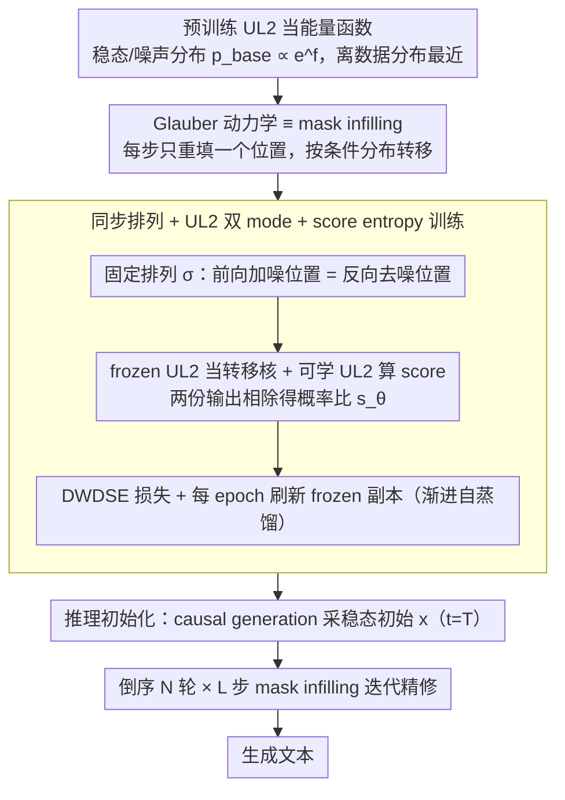

# Leveraging Pretrained Language Models as Energy Functions for Glauber Dynamics Text Diffusion

**会议**: ACL 2026  
**arXiv**: [2605.04291](https://arxiv.org/abs/2605.04291)  
**代码**: 待确认  
**领域**: 能量模型 / 文本生成 / 离散扩散  
**关键词**: Glauber 动力学、离散扩散语言模型、UL2、score entropy loss、能量函数

## 一句话总结
本文用统计物理中的 Glauber 动力学构造离散文本扩散：把预训练 UL2 模型当成"能量函数 / 噪声分布"，每一步把 mask infilling 当 Markov 转移核，训出的 Glauber-UL2 在生成 perplexity 上**首次匹配 GPT-2-M/L 同尺寸 AR 模型**，并在 Sudoku/Zebra 等搜索规划任务上击败 MDLM，同 compute 下 best-of-N 也优于 AR。

## 研究背景与动机
**领域现状**：自回归 (AR) LM 主导文本生成，但在全局规划、复杂结构约束和自我修正上有结构性短板（Bachmann & Nagarajan 2024）。离散扩散 LM（D3PM, SEDD, MDLM, GGM 等）是有前景的替代品，但目前要么不稳定、训练慢，要么理论基础弱，要么采样效率低。

**现有痛点**：当前最热的 masked diffusion LM（MDLM, SEDD-Absorb）虽然推理快，但 Zheng et al. 2025 严格证明它**不可能超越 AR**——其 loss 的最优解实际等价于一个 time-invariant masked LM，而所谓的 perplexity 优势在 64-bit 精度下消失（低精度下的"温度黑客"假象）。Liu et al. 2025 进一步证明某些问题本质不可并行化，MDLM 的并行采样优势是以质量为代价的。

**核心矛盾**：扩散模型作为**path-wise relative entropy 最小化的随机过程**（Föllmer 1985, Lehec 2013），性能高度依赖两件事——(a) noisy 分布与数据分布的距离，(b) 底层 Markov 链的曲率 / 熵衰减速度。现有离散扩散用 uniform / unigram / absorbing 作 noisy 分布，离真实数据分布太远；用独立 token 转移核，曲率差。

**本文目标**：(1) 让 noisy 分布尽量接近数据分布以减少所需步数；(2) 选一个有良好熵衰减性质的 Markov 链；(3) 复用 AR 预训练投入的算力，避免从头训扩散 LM 的样本低效。

**切入角度**：作者注意到——
- 比 uniform/unigram 更接近数据分布的**自然候选**就是预训练 LM 本身；
- 统计物理里专门为 "能量函数 $p(x) \propto e^{f(x)}$" 设计的采样器正是 **Glauber dynamics**，每步只更新一个位置 $x_k$ 给定其他位置 $x_{\setminus k}$；
- Glauber 的"条件采样"步骤本质就是 **mask infilling**；
- UL2 模型一套权重同时支持 causal generation（采近似稳态）和 mask infilling（做条件转移），是天造地设的 backbone。

**核心 idea**：把预训练 UL2 当 Glauber 动力学的能量函数，causal generation 给稳态初始化，mask infilling 当 Markov 转移核，整套用 score entropy loss 微调成扩散 transformer。

## 方法详解

### 整体框架
- **状态空间**：长度 $L=1024$ 的 token 序列，词表 $\Sigma$，数据分布 $p_D$
- **能量函数 / 稳态分布**：预训练 UL2 给出 $p_{\text{base}}(x) \propto e^{f(x)}$，其中 $f$ 由 UL2 隐式定义
- **前向 Markov 过程**：Glauber dynamics，$N$ 轮 × $L$ 步 = $T = N \cdot L$ 总步数；每轮预先固定一个 1..L 的随机排列 $\sigma_i$，第 $i$ 轮第 $j$ 步只更新位置 $\sigma_i(j)$，按 $p(x_k \mid x_{\setminus k})$（由 UL2 mask infilling 给出）采样
- **训练 loss**：Diffusion Weighted Denoising Score Entropy (DWDSE)，学的是概率比 $s_\theta(x, t)_y \approx p_{t|0}(y|x_0)/p_{t|0}(x_t|x_0)$
- **架构**：UL2 (FLAN-T5 encoder-decoder) + AdaLN-Zero 时间嵌入 + RoPE，加 ~15% 时间参数初始化为 0；冻结一份做转移核，另一份做可学习的反向 score
- **推理**：先用 UL2 在 $t=T$ 做 causal generation 得初始 $x$；然后倒序 $N$ 轮，每轮按排列倒序对每个 token 做 mask infilling，共 $L + N \cdot L = (N+1)L$ 次模型调用

### 关键设计

**1. 预训练 LM 当能量函数：把噪声分布从随机起点拉到离数据很近的地方**

离散扩散训得慢、效果输给 AR，根子在于它的 noisy 分布选得太差——uniform、unigram、absorbing 这些离真实文本分布太远，逆过程要从一片乱码走很长的"距离"才能回到数据，而扩散每步只有 1 个监督信号，远不如 AR 每步 $L$ 个 teacher-forcing 信号学得快。本文的破局点是：比 uniform/unigram 更接近数据分布的天然候选，就是预训练 LM 自己。把 UL2 的隐式分布 $p_{\text{base}}(x) \propto e^{f_{\text{UL2}}(x)}$ 直接拿来当扩散过程的稳态/噪声分布。由于扩散本质是 path-wise relative entropy 最小化的随机过程，起点离数据越近、逆过程要走的路越短、sample efficiency 越高；与其从头再训一个扩散 LM，不如把 AR/MLM 预训练已经学到的语言结构当现成起点复用。

**2. Glauber 动力学 ≡ mask infilling：让转移核和填空操作合二为一**

选好了能量函数，还得有个能从中采样的 Markov 链。统计物理里专为 "能量函数 $p(x)\propto e^{f(x)}$" 设计的采样器正是 Glauber dynamics：每步只更新一个位置 $x_k$、其余位置 $x_{\setminus k}$ 固定，按条件分布 $p(x_k\mid x_{\setminus k})$ 重采，配上 Metropolis filter 后接受概率为 $p(x_k=x\mid x_{\setminus k})=\min\{1, e^{f(x_{\setminus k}, x)}\}$。这一步"给定上下文、重填一个 token"恰恰就是 mask infilling。于是 UL2 的统一目标（R-/S-/X-denoising）在这里大放异彩：同一套权重既能 causal generation 采近似稳态、又能 mask infill 做条件转移，省掉了为这两件事各养一个模型的麻烦。从 Markov 链理论看，只要条件分布给定且满足轻度条件就有唯一稳态，Glauber 的收敛性天然有保证。

**3. 同步排列 + UL2 双 mode + score entropy 训练：让训和推在同一个位置对齐**

MDLM 的一大痛点是独立转移核导致"训推位置不对齐"——前向在哪加噪、反向在哪去噪对不上。本文的做法是不让 Glauber 每步随机选 index，而是预先固定一组排列 $\sigma_1,\dots,\sigma_N$，反向过程更新的 token 顺序与前向严格一致，把加噪位置和去噪位置精确耦合起来。训练时随机采一个 $t$，让 frozen UL2 跑 $t$ 步前向得到 $x_t$，可学 UL2 在 $x_t$ 上算 DWDSE loss；因为 mask infilling 输出本身就是 token 概率，所需的概率比 score $s_\theta = p_t(y)/p_t(x)$ 直接拿 frozen 与可学两份 UL2 的输出相除即可得到。每个 epoch 还会用当前可学副本刷新 frozen 副本，让稳态分布随训练 progressively 收敛到 score-entropy 拟合后的模型——本质是一种渐进式自蒸馏。

### 损失函数 / 训练策略
- **DWDSE loss** $\mathcal{L}_{\text{DWDSE}} = \mathbb{E}_{x_0, x_t \sim p_{t|0}}[\int_0^T \sum_{y \sim x_t} Q_t(x_t, y)(s_\theta(x_t, t)_y - p_{t|0}(y|x_0)/p_{t|0}(x_t|x_0) \log s_\theta(x_t, t)_y + K(\cdot))dt]$，其中 $K(a) = a(\log a - 1)$
- **训练数据**：OpenWebText
- **模型规模**：Glauber-UL2-M (419M, 对标 GPT-2-M)、Glauber-UL2-L (898M, 对标 GPT-2-L)
- **计算成本**：32 H100 × ~6 天训大模型；iso-TFLOPs 下与 GGM 24 H100 × 8 天 TPU 相当
- **超参**：$L=1024$、$N \in \{1, 3\}$（推理调用 $2L$ 和 $4L$）

## 实验关键数据

### 主实验：无条件生成 Perplexity（用 GPT-2-L/XL/NEO 评，越低越好）

| 模型 | 总参数 | 调用步数 | Gen PPL (GPT2-L) | Gen PPL (GPT2-XL) | Gen PPL (GPT-NEO) |
|------|--------|----------|-------------------|--------------------|--------------------|
| GPT-2-M (AR baseline) | 345M | $L=1024$ | 12.4 | 13.0 | 14.5 |
| GPT-2-L (AR baseline) | 774M | $L$ | 6.5 | — | 7.4 |
| SEDD-M | 424M | $T=2048$ | 27.3 | 28.0 | 25.2 |
| MDLM | 170M | $T=10$ | 4.2* | 45.4 | 40.9 |
| GGM | 387M | $T=4096$ | 19.5 | 19.9 | 18.0 |
| Plaid (continuous) | 1.3B | $T=4096$ | 19.7 | 19.7 | 17.9 |
| **Glauber-UL2-M ($N=1$)** | 419M | $T=2048$ | 17.1 | 17.5 | 16.6 |
| **Glauber-UL2-M ($N=3$)** | 419M | $T=4096$ | **13.2** | 13.7 | 14.9 |
| **Glauber-UL2-L ($N=1$)** | 898M | $T=2048$ | 9.5 | 9.9 | — |
| **Glauber-UL2-L ($N=3$)** | 898M | $T=4096$ | **6.9** | 7.8 | — |

(*MDLM 在 GPT-2-L 评估下的 4.2 实为低精度下的"温度黑客"假象，论文指出非公平比较)

**关键观察**：Glauber-UL2-M ($N=3$) 13.2 ≈ GPT-2-M 12.4，**首次让离散扩散 LM 匹配同尺寸 AR**；Glauber-UL2-L ($N=3$) 6.9 ≈ GPT-2-L 6.5，差距 < 0.5 PPL；远优于 SEDD/GGM/Plaid。

### 消融 / 关键发现表

| 配置 | LAMB | WT2 | WT103 | 1BW | 含义 |
|------|------|-----|-------|-----|------|
| GPT-2-M (AR) | 15.60 | 22.76 | 26.37 | 55.72 | 同尺寸 AR 参考 |
| UL2-M pre-SEDD (causal only) | 21.7 | — | — | — | 未训扩散的 baseline |
| UL2-M post-SEDD CAUSAL-GEN | 19.1 | — | — | — | SEDD 训完后 causal 也变强 |
| Glauber-UL2-M ($N=1$) | 17.89 | 23.95 | 30.21 | 56.12 | 一轮反向已比 baseline 好 |
| Glauber-UL2-M ($N=3$) | **17.14** | **20.98** | **25.47** | **52.18** | 三轮反向全面追上 GPT-2-M |
| Glauber-UL2-L ($N=3$) | **10.14** | 20.35 | 20.83 | **44.12** | 大模型接近 GPT-2-L |

### Iso-Compute Best-of-N（同 compute 预算，AR 采 $2K$ 候选 vs Glauber 采 $K$ 候选）

| 任务 | AR BoN=2 | AR BoN=4 | Glauber BoN=1 | Glauber BoN=2 |
|------|----------|----------|---------------|---------------|
| GSM8K | 43.9 | 46.1 | 46.9 | **50.4** |
| Winogrande | 68.3 | 69.7 | 69.4 | **71.2** |
| PIQA | 77.6 | 79.9 | 79.1 | **80.8** |
| SIQA | 48.9 | 50.3 | 49.5 | **50.2** |

Glauber BoN=1（一轮迭代自我修正）≈ AR BoN=2（两次独立采样），且 BoN=2 全面超过 AR BoN=4。

### 关键发现
- **轮数 $N$ 是关键调节旋钮**：$N=1$ 让 UL2 在大多数任务上和 GPT-2 同尺寸打平，$N=3$ 在 PPL 上**追平甚至反超**——说明"迭代精修"是离散扩散超越 AR 的真正路径，而非单步并行采样。
- **post-SEDD 的 causal generation 本身也比 pre-SEDD 强**（21.7→19.1 PPL）：score entropy 训练隐式提升了 UL2 自身的语言建模能力，这是个意外副产品。
- **同 compute 下扩散 > AR**：Iso-compute best-of-N 实验是这篇论文最有政策性的结论——既然 RL/test-time training 都已经把 BoN 当标准操作，Glauber 的"自我修正"比"多次独立采样"更省 compute。
- **常识推理（HellaSwag/Wino/PIQA/SIQA）**：Glauber-M ($N=3$) 全面优于 GPT-2-M 和 SEDD-M，说明迭代精修对真正需要前后一致性的任务有结构性优势。

## 亮点与洞察
- **把统计物理工具（Glauber + 能量函数）落地为可训练 LM** 是真正的跨学科创新——score entropy + Markov 链曲率分析为离散扩散给出了**第一性原理**式的解释，不是又一种 ad-hoc 转移核。
- **UL2 作为 backbone 是天才选择**：causal + mask infilling 同权重，一次预训练同时给出"稳态近似采样器"和"Glauber 转移核"，避免维护两个模型；从这个角度看 UL2 像是为 Glauber 量身定做的预训练目标，可能是 Tay et al. 没预料到的应用。
- **预定 permutation 而非随机 index** 解决了 MDLM 的训推 mismatch：前向加噪和反向去噪在同一位置发生，这个看似简单的细节是收敛性的关键。
- **Iso-compute 视角重写了扩散 vs AR 的比较框架**：不再纠结"单次生成谁更快"，而是给定 RL/BoN/test-time-training 预算下谁的样本质量更高——为扩散 LM 在 reasoning agent 场景找到了清晰的定位。
- **Sudoku/Zebra 等规划任务上无需"训练 token ordering"就能超过 MDLM + AR**：暗示 Glauber 的"backtracking"是结构性自带的，而 AR 需要靠 long CoT 模拟。

## 局限与展望
- **推理慢**：$2L \sim 4L$ 模型调用，比 AR 慢 2-4 倍。论文承认是 trade-off，但单次延迟敏感场景（chat）不适用。
- **训练贵**：32 H100 × 6 天才训一个 0.9B 模型，对学术界资源敏感；规模化到 7B+ 的成本未验证。
- **依赖能找到现成 UL2 checkpoint**：UL2 官方只放了 20B，作者只能自己用 FLAN-T5 重训 mixture-of-denoisers——复现门槛高。
- **N 是硬超参且必须预先固定 permutation**：动态 $N$（自适应判断"够了停"）未探索；permutation 选择策略也未调优。
- **没和最强闭源 AR（GPT-3.5/4 同规模）对标**：只赢了 GPT-2 时代的模型，扩散 LM 是否能在更大 scale 上保持优势开放。
- **展望**：(1) 用 flow matching 替代 score entropy 让训练更稳；(2) 用 Lee 2024 的并行 Glauber 把推理 $4L$ 砍到亚线性；(3) 用 Muon 二阶优化器加速训练；(4) 在 reasoning 微调阶段直接用 GRPO + Glauber 取代 AR + GRPO。

## 相关工作与启发
- **vs MDLM/SEDD-Absorb**: 它们用 absorbing/uniform Markov 链，noisy 分布离数据远、训推位置不对齐，Zheng et al. 已证明最优解退化为静态 MLM；Glauber-UL2 用预训练 LM 当能量函数 + 预定 permutation，从根上修复这两个问题。
- **vs GGM (Varma et al. 2024)**: 同为 Glauber 动力学，但 GGM 用 unigram 当 noisy 分布、训练成 $O(L)$ 二分类问题；本文用 UL2 当能量函数让 noisy 分布显著更接近数据，PPL 13.2 vs GGM 的 19.5。
- **vs Plaid / SSD-LM（连续扩散）**: 连续扩散依赖重退火/启发式才追得上 AR，且 inference 慢；Glauber-UL2 直接在离散空间工作，质量超 Plaid 且更原理化。
- **vs Diffusion via attention-mask annealing (Gong et al. 2025)**: 同样从 AR 权重转扩散，但停留在 MDLM 范式里，继承了 Zheng et al. 指出的根本局限；Glauber-UL2 跳出 MDLM 框架走能量模型路线。
- **启发**: "用预训练大模型当扩散的稳态分布" 这个思路可推广到任何离散生成（音频 token、图像 token、行为序列），把成熟的预训练投资重新利用起来，避免"扩散 LM 重新发明轮子"。

## 评分
- 新颖性: ⭐⭐⭐⭐⭐ 用统计物理的 Glauber + 能量函数视角重新定义离散扩散 LM，给出第一性原理基础
- 实验充分度: ⭐⭐⭐⭐ PPL + MAUVE + 4 个常识 + Sudoku/Zebra + iso-compute BoN，覆盖度好，但缺规模 scaling
- 写作质量: ⭐⭐⭐⭐ 理论动机清晰，符号略多但 motivation 一路推到设计很有说服力
- 价值: ⭐⭐⭐⭐⭐ 首次让离散扩散 LM 真正匹配 GPT-2 同尺寸 AR，且为扩散 LM 在 RL/BoN 时代找到了 compute-positive 的定位

<!-- RELATED:START -->

## 相关论文

- [\[ACL 2025\] EdiText: Controllable Coarse-to-Fine Text Editing with Diffusion Language Models](../../ACL2025/llm_nlp/editext_diffusion_text_editing.md)
- [\[ACL 2026\] Min-k Sampling: Decoupling Truncation from Temperature Scaling via Relative Logit Dynamics](min-k_sampling_decoupling_truncation_from_temperature_scaling_via_relative_logit.md)
- [\[ACL 2026\] Unlocking the Potential of Diffusion Language Models through Template Infilling](unlocking_the_potential_of_diffusion_language_models_through_template_infilling.md)
- [\[ACL 2026\] Text-to-Distribution Prediction with Quantile Tokens and Neighbor Context](text-to-distribution_prediction_with_quantile_tokens_and_neighbor_context.md)
- [\[AAAI 2026\] LILAD: Learning In-context Lyapunov-stable Adaptive Dynamics Models](../../AAAI2026/llm_nlp/lilad_learning_in-context_lyapunov-stable_adaptive_dynamics_models.md)

<!-- RELATED:END -->
