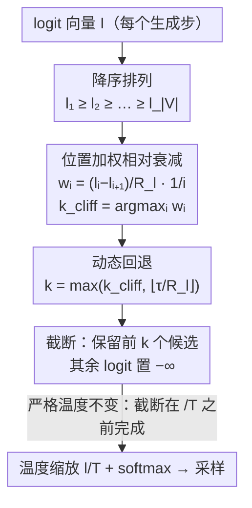

# Min-k Sampling: Decoupling Truncation from Temperature Scaling via Relative Logit Dynamics

**会议**: ACL 2026  
**arXiv**: [2604.11012](https://arxiv.org/abs/2604.11012)  
**代码**: [https://github.com/YecanLee/Mink](https://github.com/YecanLee/Mink)  
**领域**: LLM评测  
**关键词**: 采样策略, 温度不变性, 语义悬崖检测, 动态截断, logit空间

## 一句话总结

Min-k Sampling 通过分析排序 logit 分布的局部结构来检测"语义悬崖"（高置信候选与低质量尾部噪声的分界点），实现了严格的温度不变性截断，在极端温度下仍保持稳健的推理和创意写作质量。

## 研究背景与动机

**领域现状**：LLM 文本生成质量高度依赖解码采样策略。主流方法如 Top-k、Top-p（nucleus sampling）和 Min-p 通过概率空间截断平衡多样性与准确性。近期 Top-$n\sigma$ 将操作转移到 logit 空间以实现温度不变性。

**现有痛点**：(1) 概率空间方法（Top-k/p/Min-p）对温度极度敏感——温度超过 2.0 时噪声率 >90%，温度 10.0 时完全崩溃；(2) Top-$n\sigma$ 虽然温度不变，但依赖全局标准差 $\sigma$，容易被大量长尾噪声 token 干扰，无法精准定位高置信候选之间的细粒度信心差异；(3) Top-$n\sigma$ 对超参数 $n$ 高度敏感（$n=1.0$ 引入噪声，$n=2.0$ 放大噪声）。

**核心矛盾**：温度缩放同时控制两个本应独立的效应——在合理候选间增加多样性（期望的）和从尾部引入噪声 token（不期望的）。理想的截断机制应解耦这两个效应。

**本文目标**：设计一种既温度不变、又对超参数不敏感、且能精确捕捉模型置信度边界的动态截断策略。

**切入角度**：分析排序后 logit 序列的局部形态而非全局统计量。在 logit 从高到低排列的序列中，存在一个"语义悬崖"——从有意义的候选 token 到无关噪声 token 的急剧下降。通过检测这个悬崖的位置来确定截断边界。

**核心 idea**：用位置加权的相对衰减率检测排序 logit 的最大下降点（语义悬崖），该计算对温度缩放严格不变，实现了截断决策与温度的完全解耦。

## 方法详解

### 整体框架

Min-k 要解决的是「截断决策被温度污染」这一痛点：传统方法把候选集大小交给概率空间的阈值决定，而概率随温度剧烈变化，导致高温下噪声 token 大量涌入。Min-k 把视角搬回 logit 空间，在每个生成步骤拿到 logit 向量 $\mathbf{I}\in\mathbb{R}^{|V|}$ 后先降序排列，沿着这条由高到低的曲线寻找一个「语义悬崖」——有意义候选与尾部噪声之间最陡的那道落差，并把悬崖位置当作截断点 $k$。悬崖之后的 logit 置为 $-\infty$，剩下的才进入温度缩放与 softmax 去采样。由于悬崖检测只看 logit 之间的相对形态、且发生在除以 $T$ 之前，整条流水线的候选集构成与温度彻底解耦。

### 关键设计

**1. 位置加权相对衰减：用局部斜率而非全局统计量定位悬崖**

以往的 Top-$n\sigma$ 依赖全局标准差 $\sigma$ 划线，长尾里成百上千个噪声 token 会把 $\sigma$ 拖大，淹没头部候选之间真正重要的细微落差。Min-k 改为逐位置考察斜率：先算动态范围 $R_l = l_1 - l_{|V|}$ 做归一化基准，再对每个相邻间隔计算加权相对衰减率 $w_i = \frac{l_i - l_{i+1}}{R_l}\cdot\frac{1}{i}$，其中 $(l_i - l_{i+1})/R_l$ 是归一化后的局部跌幅、$1/i$ 是位置权重，截断点取 $k_{cliff}=\arg\max_i w_i$。$1/i$ 这个先验来自一个经验观察——最有判别意义的概率断层几乎总落在分布头部，于是越靠前的落差越该被放大。消融实验印证了两个因子缺一不可：去掉 $1/i$ 会让 $\arg\max$ 漂到尾部、放进噪声，去掉 $R_l$ 归一化则在高温下直接崩溃；而线性衰减 $1/i$ 也优于对数或二次形式。

**2. 动态回退机制：给「模型真的没主意」时留一条探索退路**

当模型高度不确定、logit 近乎均匀时，$w_i$ 序列没有明显峰值，$\arg\max$ 容易坍缩到 $i^*=1$，把采样退化成近似贪心。为此 Min-k 定义一个回退候选大小 $k_{fallback}=\lfloor \tau / R_l\rfloor$，最终取 $k=\max(k_{cliff}, k_{fallback})$：$\tau$ 是小常数，当动态范围 $R_l$ 很小（分布极平）时这一项自动放大，保证至少保留一个合理的最小探索范围。消融显示这条退路在结构化推理任务上几乎不起作用——主机制本身已足够稳健，但在高熵的开放式生成里它是防止多样性塌缩的必要安全网。

**3. 严格温度不变性：三行推导锁死截断与温度的解耦**

方法的核心承诺是截断点完全不被温度牵动，这一点可以严格证明。温度缩放 $l'_i = l_i/T$ 不改变排序；归一化衰减 $d'_i = (l'_i - l'_{i+1})/(l'_1 - l'_{|V|})$ 中分子分母同时含因子 $1/T$，相约后等于 $d_i$；进而加权衰减 $w'_i = d'_i/i = d_i/i = w_i$，于是 $\arg\max_i w'_i = \arg\max_i w_i$，截断位置 $k$ 对任意 $T$ 恒定。这条性质把「温度」这个旋钮的职责收窄到只调节已选候选集内部的多样性，而不再影响候选集本身由谁组成——正是温度缩放长期纠缠在一起的两个效应被真正拆开的地方。

### 损失函数 / 训练策略

Min-k 是纯推理时方法，无需任何训练。唯一超参数是回退常数 $\tau$（默认 $3.0$），实验中在 $1.0$–$10.0$ 区间内对性能几乎无影响。执行顺序是先在原始 logit 上完成悬崖检测与截断，再对保留下来的 logit 做 $l'/T$ 缩放与 softmax 得到采样分布，核心实现不到十行、计算开销可忽略。

## 实验关键数据

### 主实验

**数学推理准确率 (EM%, LLaMA3-8B-Instruct, GSM8K)**

| 方法 | T=1.0 | T=3.0 | T=5.0 | T=10.0 |
|------|-------|-------|-------|--------|
| Top-k | 75.44 | 9.86 | 0.08 | 0.00 |
| Top-p | 76.27 | 2.50 | 0.00 | 0.00 |
| Min-p | 75.36 | 28.81 | 0.38 | 0.00 |
| Top-$n\sigma$ | 75.44 | 72.55 | 74.07 | 73.77 |
| **Min-k** | **77.39** | **76.02** | **76.48** | **74.79** |

**AQuA 推理准确率 (EM%, LLaMA3-8B-Instruct)**

| 方法 | T=1.0 | T=5.0 | T=10.0 |
|------|-------|-------|--------|
| Top-$n\sigma$ | 48.03 | 44.49 | 49.61 |
| **Min-k** | **50.00** | **50.39** | **46.06** |

**创意写作胜率 (%, LLaMA3-8B-Instruct vs Greedy)**

| 方法 | T=1.0 | T=3.0 | T=10.0 |
|------|-------|-------|--------|
| Top-k | 50.80 | 1.40 | - |
| Top-p | 49.60 | 0.00 | - |
| Top-$n\sigma$ | 52.40 | 51.40 | 50.00 |
| **Min-k** | **58.60** | **53.60** | **52.80** |

### 消融实验

**人工评估 (200 对比较, Min-k vs Top-$n\sigma$)**

| 偏好 | LLaMA3-8B | Qwen3-4B | 总计 |
|------|-----------|----------|------|
| Min-k 胜 | 41 | 34 | 75 (37.5%) |
| Top-$n\sigma$ 胜 | 33 | 34 | 67 (33.5%) |
| 平局 | 26 | 32 | 58 (29.0%) |

### 关键发现

- 传统方法在 T>2.0 时几乎完全崩溃（噪声率 >90%），而 Min-k 在 T=10.0 时仍保持 GSM8K 74.79% 的准确率
- Min-k 在 T=1.0 的标准设置下也优于所有基线（GSM8K 77.39% vs Top-$n\sigma$ 75.44%），说明语义悬崖检测在正常温度下也有优势
- 创意写作中 Min-k 在 T=1.0 时达到 58.60% 胜率，显著优于所有方法
- 人工评估中 Min-k 在 LLaMA3 上有明显优势（41 vs 33），但在 Qwen3 上持平
- 超参数 $\tau$ 在 1.0-10.0 范围内对性能影响极小，验证了低超参数敏感性的声称

## 亮点与洞察

- 将"截断"与"温度"两个一直纠缠的效应彻底解耦，是方法论上的优雅解决
- 温度不变性的证明简洁有力：分子分母同时除以 $T$，仅需三行推导
- 算法极其简单——核心代码不超过 10 行，计算开销忽略不计
- $1/i$ 位置权重的设计直觉清晰且实验验证充分

## 局限与展望

- 二项检验未显示人工评估中 Min-k 与 Top-$n\sigma$ 的统计显著差异
- 极端情况下回退机制的 $\tau$ 选择缺乏理论指导
- 仅在 LLaMA3 和 Qwen3 系列上验证，未测试其他架构
- 未来可探索将语义悬崖检测与推测解码等加速技术结合

## 相关工作与启发

- 继 Top-$n\sigma$ 之后的 logit 空间方法新进展，但用局部统计量替代了全局 $\sigma$
- 与 Min-p（概率空间动态截断）同名但完全不同：Min-k 在 logit 空间操作且温度不变
- 为解码策略设计提供了新范式：关注分布的局部结构而非全局特征

## 评分

- 新颖性: ⭐⭐⭐⭐ 语义悬崖检测思路新颖且理论优雅，但整体是在已有 logit 空间方法上的改进
- 实验充分度: ⭐⭐⭐⭐ 覆盖推理和创意写作任务、4 个模型、含人工评估，但极端温度场景实用性存疑
- 写作质量: ⭐⭐⭐⭐⭐ 动机阐述清晰，温度不变性证明简洁，实验与理论配合紧密

<!-- RELATED:START -->

## 相关论文

- [\[ACL 2026\] Leveraging Pretrained Language Models as Energy Functions for Glauber Dynamics Text Diffusion](leveraging_pretrained_language_models_as_energy_functions_for_glauber_dynamics_t.md)
- [\[AAAI 2026\] STEM: Efficient Relative Capability Evaluation of LLMs through Structured Transitive Evaluation Model](../../AAAI2026/llm_nlp/stem_efficient_relative_capability_evaluation_of_llms_through_structured_transit.md)
- [\[AAAI 2026\] LILAD: Learning In-context Lyapunov-stable Adaptive Dynamics Models](../../AAAI2026/llm_nlp/lilad_learning_in-context_lyapunov-stable_adaptive_dynamics_models.md)
- [\[ACL 2026\] GRASS: Gradient-based Adaptive Layer-wise Importance Sampling for Memory-Efficient LLM Fine-tuning](grass_gradient-based_adaptive_layer-wise_importance_sampling_for_memory-efficien.md)
- [\[CVPR 2025\] Dora: Sampling and Benchmarking for 3D Shape Variational Auto-Encoders](../../CVPR2025/llm_nlp/dora_sampling_and_benchmarking_for_3d_shape_variational_auto-encoders.md)

<!-- RELATED:END -->
