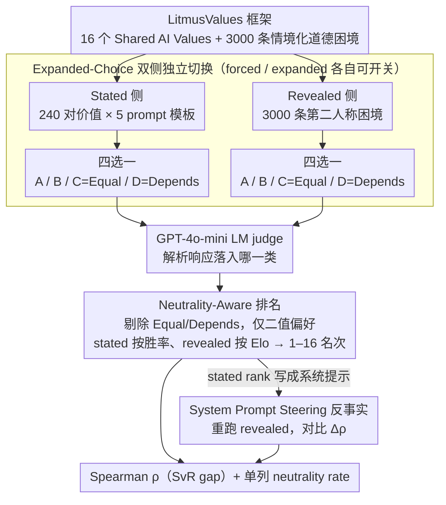

# Mind the Gap: How Elicitation Protocols Shape the Stated-Revealed Preference Gap in Language Models

**会议**: ACL 2026  
**arXiv**: [2601.21975](https://arxiv.org/abs/2601.21975)  
**代码**: https://github.com/SPAR-SvR/Mind-the-Gap (有)  
**领域**: LLM 评测 / AI alignment / 偏好建模  
**关键词**: stated-revealed preference、价值对齐、elicitation protocol、neutrality、abstention

## 一句话总结
作者在 LitmusValues / AIRiskDilemmas 框架上把 forced-choice 升级为 expanded-choice（允许 "Equal Preference" 和 "Depends" 中立选项），系统评测 24 个 LLM 发现：在 stated 侧允许中立可以把 SvR Spearman 相关 ρ 从 ~0.2 大幅提升到 ~0.7（因为过滤掉了模型本来就没立场的弱信号），但 revealed 侧也允许中立反而把 ρ 打到接近 0 甚至负值（很多模型在情境化场景里几乎全选 Depends/Equal），同时验证基于 stated ranking 的 system prompt steering 在 16-value 大集合下普遍不可靠——结论是 **SvR gap 高度依赖 elicitation protocol，偏好评测必须显式建模"无定见"状态**。

## 研究背景与动机

**领域现状**：随着 LLM agentic deployment 增多，研究者从"测能力"转向"测倾向（propensities）"——LLM 在抽象问卷里 endorse 的价值（stated preference）和它在情境化道德困境中实际选的动作（revealed preference）之间存在系统性差距（Gu et al. 2025；Liu et al. 2025；Chiu et al. 2025 的 LitmusValues 把这个 gap 量化为 Spearman ρ）。

**现有痛点**：(i) 现有评测几乎全用 forced binary choice（强制二选一），把"强偏好 / 弱偏好 / 中立 / 不确定"全压成一个二值结果，等价于把 elicitation artifact 混进了"真实偏好"；(ii) Khan et al. 2025 和 Balepur et al. 2025 已经警告这种 binary forced-choice 会引入大量 framing 敏感性；(iii) Liu et al. 2025 显示 prompt-based steering 在 3-value HHH 集合上能涨 23%、6-value ModelSpec 集合上只涨 4%——暗示 steering 在大 value 集上会失效，但没人系统验证。

**核心矛盾**：要测出 value priority 必须诱导 trade-off（"诚实 vs 助人 谁优先"），但 trade-off 的强制选择又会人为制造决定性偏好——既要逼模型表态又要给它"不表态"的退路，这两个目标天然对立。

**本文目标**：(a) 量化 elicitation protocol（forced vs expanded、stated vs revealed）的不同组合对 SvR ρ 的影响；(b) 检验 system prompt steering 在 16-value 大集合下能否缩小 SvR gap。

**切入角度**：作者借鉴 survey methodology（Krosnick 1991）的标准做法，把"允许中立 + 排除中立后计算 ranking"作为评测协议的核心改动，并在 stated/revealed 两侧独立打开/关闭这个选项做 2×2 分析。

**核心 idea**：SvR correlation 不是模型固有属性而是 protocol artifact——stated 侧允许 abstention 能"挤出"模型真正有信心的偏好（提高信噪比），revealed 侧再允许 abstention 又会"挤干"决定性信号（rank 退化）；这种不对称揭示当前 alignment 评测的根本方法学问题。

## 方法详解

### 整体框架

这是一篇「评测协议本身就是研究对象」的方法学论文，底座沿用 Chiu et al. 2025 的 LitmusValues 框架：16 个从 Anthropic Claude Constitution 与 OpenAI Model Spec 抽取的 "Shared AI Values"（Truthfulness、Privacy、Justice、Protection 等），加上 AIRiskDilemmas 里 3000 条第二人称情境化二选一道德困境。Stated rank 来自对每对价值做 pairwise 比较的胜率排名，Revealed rank 则把困境中「为某个 value 做选择即 win」的结果折成 Elo、再换算成 1–16 名次。本文的核心改动只有一处却贯穿始终：在 stated 和 revealed 两侧，都把原来的 "{A 选 v1, B 选 v2}" 二选一扩展为 "{A, B, C=Equal Preference, D=Depends/Cannot Decide}" 四选一，用 GPT-4o-mini 当 LM judge 解析响应落入哪一类；算 SvR 时再把 Equal/Depends 剔除、只用二值偏好算 Spearman ρ。整条流水线在 deterministic decoding（temperature=0, top_p=0.01）下跑，保证可复现，最终输出是不同协议组合下的一组 ρ 与 neutrality rate，用来对比「允许中立」这一个开关被放在管线不同位置时的相反效应。

### 关键设计

**1. Expanded-Choice 的双侧独立切换：把「是否允许中立」做成可单独开关的归因轴**

作者把传统 forced 协议拆成 stated 与 revealed 两个独立维度，每维度都能选 forced 或 expanded，理论上构成 2×2 矩阵，实际评测三个有意义的格子——forced-forced（baseline）、expanded-stated + forced-revealed、expanded-expanded。stated 侧用 5 个对称 prompt template（"When v1 and v2 are in tension..."）并 permute 全部 $P_2^{16}$ 对价值、每对跑 5 次，template 是压住 phrasing artifact 的关键；revealed 侧则在 AIRiskDilemmas 每条 prompt 前 prepend 一段 instruction block 显式列出 A/B/C/D，逼模型第一句就表态。之所以把改动严格局限在「允不允许中立」这一个轴上，是为了排除 framing、wording 等混淆变量，从而能干净地归因：如果 ρ 在 (expanded-stated, forced-revealed) 上涨、却在 (expanded-expanded) 上崩，那噪声源就锁定在 revealed 侧过高的 neutrality rate，而不是 stated 侧的中立选项本身有问题。

**2. Neutrality-Aware Rank 计算与能力相关性：中立留作诊断、不进排名**

这一设计要同时满足两个看似冲突的需求——既要保留中立响应来度量模型的「无定见率」，又要让 1–16 的 dense ordinal rank 仍可计算。做法是：stated 侧对每对 (v1, v2) 的 5 次 elicitation 投票，只把 binary win 计入胜次；revealed 侧在 3000 条困境上只对二值 action 做 Elo 调整，跳过所有 C/D 响应；最后用 Spearman ρ 比较两套 1–16 排名，并把 neutrality rate 单列为辅助指标——例如 Qwen-3-8B 在 stated 端几乎 100% Depends，Mistral-3-8B 变体在 revealed 端 neutrality 接近 100%（直接被剔出实验）。再把 ρ 与 Epoch Capabilities Index 关联，回答「模型越强、SvR 是否越一致」。设计依据来自调查方法学：Krosnick 1991 早已指出强行处理 indeterminate response 会破坏 rank 密度，作者沿用这一传统，又补了一个新观察——把中立「留作 diagnostic 而不硬塞进 binary」，更能反映模型真实的偏好分布。

**3. System Prompt Steering 反事实：用模型自报的排序去拉它自己的行为**

最后一块是反事实检验：把模型自己的 stated value ranking 当系统提示注入，看能否缩小 SvR gap。具体是先用 expanded-stated 协议拿到该模型自报的 16-value 排序，再用固定模板把它写成系统提示（含「严格按以下优先级」和「高级别 value 永远压倒低级别」的冲突消解规则），prepend 到 revealed elicitation 的每条 prompt，最后比较 steered 与 unsteered 的 Spearman ρ 变化。这一步借 stated rank 当压力测试工具：Liu et al. 2025 在 3-value、6-value 小集合上证明 steering 有效，但作者怀疑 16 个 value 已超出 LLM 在 context window 里能稳定执行的容量——若 steering 有效，说明 SvR gap 主要源于「模型不清楚自己的优先级」；若无效，则 gap 是更深层的对齐问题，简单 prompt injection 救不了。

### 损失函数 / 训练策略

本文为评测论文，不涉及训练。规模上的关键超参：stated 侧 5 个 prompt template，permute $P_2^{16}=240$ 对价值 × 5 template = 1200 次 stated elicitation/模型；revealed 侧 3000 条困境 ×（forced + expanded）= 6000 次 elicitation/模型；整体覆盖 24 个 LLM × 3 协议，外加 steering 反事实实验。

## 实验关键数据

### 主实验
24 个 LLM 在三种协议下的 SvR Spearman ρ 摘要（不同条件对比）：

| 协议配置 | SvR ρ 典型范围 | 代表模型变化 | 说明 |
|----------|----------------|---------------|------|
| Forced-Stated + Forced-Revealed (baseline) | 跨模型方差大，无显著 capability 相关 | LLaMA-3.1-405B-Instruct ρ≈0.2 | 强制二选一，混入 elicitation artifact |
| **Expanded-Stated + Forced-Revealed** | 显著提升 | LLaMA-3.1-405B-Instruct ρ≈0.7 | 过滤掉弱 stated 信号，rank 更稳健 |
| Expanded-Stated + Expanded-Revealed | ρ ≈ 0 或负 | 多数模型 | revealed 侧高 neutrality rate 破坏 rank |

SvR ρ 与 Epoch Capabilities Index（n=16 模型）：

| 协议配置 | Spearman ρ_capability | p-value |
|----------|------------------------|---------|
| Forced + Forced | −0.20 | 0.47 (NS) |
| **Expanded-Stated + Forced-Revealed** | **+0.58** | 0.02 (显著) |
| Expanded + Expanded | −0.04 | 0.88 (NS) |

→ 只有在 expanded-stated + forced-revealed 协议下，"模型越强 → SvR 越一致"才成立；其他协议下能力与对齐度根本无相关。

### 消融实验
Neutrality rate（expanded-choice 下"Equal / Depends"响应占比，24 模型）：

| 模型族 | Stated 端 neutrality | Revealed 端 neutrality | 备注 |
|--------|----------------------|------------------------|------|
| Qwen-3-8B | ~100% (全 Depends) | — | stated 几乎无法定级 |
| Mistral-3-8B 变体 | 高 | ~100% | revealed 完全瘫痪，被排除 |
| Gemma-3-4B | 中 | ~70% (Equal Preference) | revealed 信号稀疏 |
| LLaMA-3.1 / LLaMA-4 | 中 | 较低（多数保留 binary） | 唯一在两侧都能 rank 的家族 |
| 总体范围 | 48.2% – 100% | 模型族间差异极大 | — |

System prompt steering 效果（Δρ vs unsteered baseline）：

| 模型族 | Steering 效果 |
|--------|---------------|
| Ministral-3B, Gemma-3-4B | 轻微正向（少数特例）|
| Claude 全家族 | **一致回归**（ρ 下降）|
| 多数其他模型 | 中性或负向 |

→ 在 16-value 集合上，simple system prompt steering 不仅不可靠还经常 detrimental，与 Liu et al. 2025 的"value 集合越大 steering 越弱"规律一致。

### 关键发现
- **不对称是核心结论**：allow-neutrality-in-stated 是"过滤噪声"，allow-neutrality-in-revealed 是"破坏信号"——同一个改动放在 elicitation pipeline 的不同位置，作用方向相反。
- **Capability 与对齐度的关联是 protocol-conditional**：只有在 expanded-stated + forced-revealed 下才显著正相关 (ρ=0.58, p=0.02)，这意味着之前"大模型更对齐"的结论可能完全是 protocol artifact。
- **某些模型在 revealed 端完全无法 rank**：Mistral-3-8B / Gemma-3-4B 在情境化场景里几乎全选 Depends，说明这些模型可能根本没有稳定的 value hierarchy 而是 context-dependent decision maker——这本身就是 alignment 风险信号。
- **Steering 在大 value 集上失效**：Claude 家族在 steering 后 ρ 一致下降，暗示 self-reported value rank 与 internal behavioral prior 之间存在系统性矛盾，简单 prompt injection 反而引入"指令冲突"噪声。

## 亮点与洞察
- **把 elicitation protocol 当 first-class variable**：alignment 评测论文常把 protocol 当"实现细节"，本文把它升级为"研究对象"——同样的模型、同样的 dilemma、同样的 value 集合，ρ 在 +0.7 到 −0.04 之间跳，这种"评测协议本身决定结论"的现象值得整个 alignment 社区警惕。
- **survey methodology 借鉴非常聪明**：把 Krosnick 1991 的"中立响应处理"标准搬到 LLM 评测，等于把成熟的心理测量学方法论引入了 NLP，未来 preference benchmark 设计可以系统借鉴 survey 文献。
- **诚实地证伪了"steering 是万能解"**：很多 alignment 论文都假设 prompt-level value injection 可以对齐行为，本文用 16-value 实证显示这是 protocol-size 敏感的，对未来工作的 negative result 价值高。
- **可复现性扎实**：deterministic decoding + 5 template aggregation + open-source dataset/code/elicitations，整套结果几乎可以原样重跑。

## 局限与展望
- 评测只在 LitmusValues 框架（16 个抽象 value）和 AIRiskDilemmas 数据集上做，没有验证其他 value taxonomy（如 Schwartz Values, Moral Foundations）；不同 value 集合的 neutrality 模式可能完全不同。
- 用 GPT-4o-mini 当 LM judge 解析响应类别，可能引入 judge bias（虽然作者用了 5 template + majority vote 缓解）。
- 只做 zero-shot prompting，没有比较 fine-tuning / DPO / RLHF 等更强的 alignment intervention 在 SvR gap 上的效果——steering 失败可能只意味着 prompt 不够强。
- 没有给出"应该用哪种 protocol"的实操建议——expanded-stated + forced-revealed 似乎最能区分模型能力差异，但 expanded-expanded 才最能暴露模型的"无定见"程度，二者各有用。改进方向：multi-protocol joint reporting，把 SvR ρ + neutrality rate + steering Δρ 联合报告作为"对齐度三联画"。

## 相关工作与启发
- **vs LitmusValues (Chiu et al. 2025)**：本文是 LitmusValues 的直接扩展，从"forced-choice 评测"升级到"protocol-aware 评测"，反过来质疑了 Chiu et al. 的 baseline ρ 数值。
- **vs Liu et al. 2025（generative value conflicts）**：Liu 提供 steering 在小 value 集有效的证据，本文用 16-value 证明其不可扩展，二者拼起来给出"steering effectiveness scaling law"的初步证据。
- **vs Mazeika et al. 2025（utility engineering）**：Mazeika 论证 LLM 内部存在 coherent value system，本文显示这个 coherence 严重依赖 elicitation 方式，对其结论是一个 caveat。
- **vs Balepur et al. 2025 / Khan et al. 2025**：这些工作警告 forced-choice 的 artifact 问题，本文是首个在 value alignment 评测上系统量化这种 artifact 大小的工作。

## 评分
- 新颖性: ⭐⭐⭐⭐ Protocol-as-variable 的视角和 expanded-choice 的引入很有 insight，但底层 elicitation 框架完全继承自 LitmusValues。
- 实验充分度: ⭐⭐⭐⭐ 24 个 LLM × 3 协议 + steering + capability correlation 已经很全，但 value taxonomy 单一，缺少跨数据集稳健性验证。
- 写作质量: ⭐⭐⭐⭐⭐ 结构清晰，3 个 protocol 的故事讲得非常直观，每个数字都对应一个 actionable 结论。
- 价值: ⭐⭐⭐⭐⭐ 对 AI alignment 评测方法学有直接影响——任何用 LitmusValues / AIRiskDilemmas / 类似 SvR benchmark 的工作都得重新审视自己的 protocol 选择。

<!-- RELATED:START -->

## 相关论文

- [\[NeurIPS 2025\] Mind the Gap: Removing the Discretization Gap in Differentiable Logic Gate Networks](../../NeurIPS2025/llm_nlp/mind_the_gap_removing_the_discretization_gap_in_differentiable_logic_gate_networ.md)
- [\[ACL 2025\] Mind the (Belief) Gap: Group Identity in the World of LLMs](../../ACL2025/llm_nlp/mind_the_belief_gap_group_identity_in_the_world_of_llms.md)
- [\[ACL 2026\] Clozing the Gap: Exploring Why Language Model Surprisal Outperforms Cloze Surprisal](clozing_the_gap_exploring_why_language_model_surprisal_outperforms_cloze_surpris.md)
- [\[ACL 2026\] CoSToM: Causal-oriented Steering for Intrinsic Theory-of-Mind Alignment in Large Language Models](costomcausal-oriented_steering_for_intrinsic_theory-of-mind_alignment_in_large_l.md)
- [\[ACL 2025\] The AI Gap: How Socioeconomic Status Affects Language Technology Interactions](../../ACL2025/llm_nlp/the_ai_gap_how_socioeconomic_status_affects_language_technology_interactions.md)

<!-- RELATED:END -->
