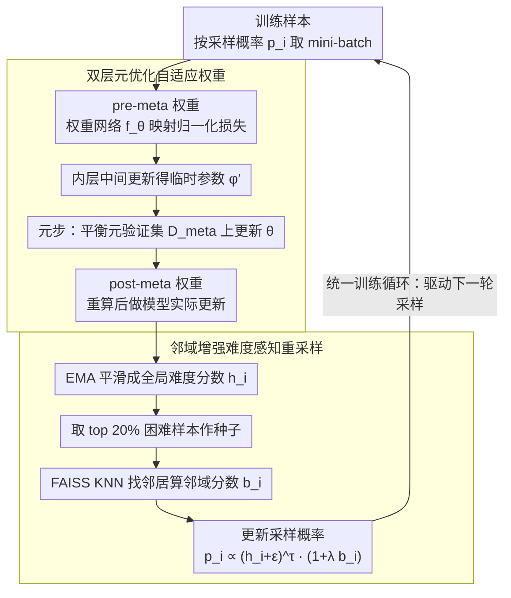

# Model-Agnostic Meta Learning for Class Imbalance Adaptation

**会议**: ACL 2026  
**arXiv**: [2604.18759](https://arxiv.org/abs/2604.18759)  
**代码**: [GitHub](https://github.com/trust-nlp/ImbalanceLearning)  
**领域**: 医学图像  
**关键词**: 类不平衡, 元学习, 自适应权重, 难度感知重采样, 双层优化

## 一句话总结

本文提出 HAMR（Hardness-Aware Meta-Resample），一个统一的元学习框架，通过双层优化动态估计实例级权重优先处理真正困难的样本，配合邻域感知重采样机制将训练焦点放在困难样本及其语义邻居上，在 6 个不平衡 NLP 数据集上持续超越强基线。

## 研究背景与动机

**领域现状**：类不平衡在文本分类、命名实体识别等 NLP 任务中普遍存在。现有方法主要分为两类：损失重加权（如 Focal Loss、Dice Loss）和数据重采样（过采样/合成生成）。

**现有痛点**：(1) 这些方法通常依赖预定义的静态启发式——对同一类别内的所有样本施加相同的调整比率；(2) 样本难度并不等同于类别归属——并非所有少数类实例都天然困难，也并非所有多数类样本都平凡；(3) 静态方案可能错误地降低有信息量的多数类样本权重，同时过度强调简单的少数类实例。

**核心矛盾**：需要一种能动态识别和优先处理真正困难样本的方法——不论其类别归属如何，根据模型不断演化的数据理解来调整学习策略。

**本文目标**：设计一个统一框架，同时解决类不平衡和实例级难度两个问题，动态引导模型学习焦点。

**切入角度**：将"模型应该关注什么"（自适应权重）和"模型应该看到什么"（重采样）解耦为两个互补模块，通过元学习框架统一优化。

**核心 idea**：用双层元优化动态学习实例重要性权重（内层用 pre-meta 权重做中间更新，外层在平衡元验证集上更新权重网络，得到 post-meta 权重做实际更新），配合基于 FAISS 的邻域增强重采样，将训练分布偏移到困难语义区域。

## 方法详解

### 整体框架

HAMR 的出发点是把类不平衡问题里两个常被混为一谈的问题拆开：「模型该看重哪个样本」（实例级难度）和「模型该看到哪些样本」（训练分布）。它由两个互补模块串成一条训练流水线——自适应权重估计先用一个轻量权重网络 $f_\theta$ 把归一化后的样本损失映射成实例重要性权重，并通过双层元优化让这个映射随训练动态校准；难度感知区域重采样再把这些权重经 EMA 平滑成全局难度分数、配合 KNN 邻域增强去改写下一轮的采样分布。两个模块在统一循环里彼此喂数据：权重估计输出「关注什么」的信号，重采样据此决定「让模型多看什么」，从而把训练焦点持续推向真正困难的语义区域，而非简单按类别一刀切地加权。

### 关键设计

**1. 双层元优化自适应权重：用「先试后改」取代静态启发式**

Focal/Dice 这类方法对同一类别内所有样本施加固定调整比率，但样本难度并不等于类别归属——少数类里也有平凡样本、多数类里也有信息量高的难例。HAMR 改用双层优化动态估权：内层先用当前权重网络给出的 pre-meta 权重 $w_i^{\text{pre}}$ 做一次中间梯度更新得到临时参数 $\phi'$，外层在一个类别平衡的元验证集 $\mathcal{D}_{\text{meta}}$ 上评估 $f_{\phi'}$ 的表现，反向更新权重网络参数 $\theta$，再用更新后的权重网络重算 post-meta 权重 $w_i^{\text{post}}$ 去做真正的模型更新（token 级任务取句子内最大 token 损失，分类任务取样本交叉熵作为权重网络的输入）。pre-meta 权重代表「更新前模型以为什么重要」，post-meta 权重则是「在平衡验证集这面镜子校正后什么才真正有利于泛化」——这种先试后改的闭环比任何静态比率都更贴合训练过程中不断变化的难度分布。

**2. 邻域增强难度感知重采样：把单点难度扩散成区域难度**

只盯着孤立的困难样本是不够的，因为它的语义邻居往往同样棘手。HAMR 先用 EMA 平滑 post-meta 权重得到稳定的全局难度分数 $h_i \leftarrow \gamma\cdot h_i + (1-\gamma)\cdot w_i^{\text{post}}$，再取 top 20% 困难样本作为「种子」，用 FAISS 加速的 KNN 找出每个种子的 $k$ 个语义邻居并据此计算邻域增强分数 $b_i$，最终采样概率为 $p_i \propto (h_i + \varepsilon)^\tau \cdot (1 + \lambda b_i)$。其中温度 $\tau<1$ 压低难度分数的尖锐度、鼓励平衡探索，$\lambda b_i$ 则把困难种子周围整片语义区域的采样概率一起抬高。如此一来，难度信号不再停留在单个样本，而是沿语义邻域扩散成区域级的训练焦点，对高不平衡比数据更稳健。

**3. 统一训练循环：让两个模块在一个端到端流程里互相增强**

两个模块通过一套固定节奏的循环耦合。为避免每步都跑 KNN 的开销，邻域增强每 $F$ 个 epoch 才重算一次；而每个 mini-batch 都走完整链路——按当前 $p_i$ 采样 → 算 pre-meta 权重 → 内层中间更新 → 元步在 $\mathcal{D}_{\text{meta}}$ 上更新权重网络 → 算 post-meta 权重做实际更新 → EMA 刷新全局难度分数。权重估计为重采样提供实例级重要性，重采样反过来保证权重网络能持续见到足够多的困难区域样本，二者形成正反馈而非各自为政。

### 一个完整示例

以高不平衡比的 Cyclone-Idai19 分类为例：训练初期某条罕见「紧急求助」样本损失很高，权重网络给出较大的 pre-meta 权重；内层据此做一次中间更新后，外层在平衡元验证集上发现「过度强调这条样本反而损害整体 Macro-F1」，于是回调权重网络，使其重算出更克制的 post-meta 权重。这个权重经 EMA 累积进全局难度分数 $h_i$；下一次邻域增强触发时，该样本若仍位列 top 20%，FAISS 会把它周围语义相近的其他求助样本一并抬高采样概率，于是后续 batch 里整片「困难求助区」被更密集地看到——既没有因单点高损失而过拟合个例，也没有像静态过采样那样无差别复制少数类。

### 损失函数 / 训练策略

主损失为加权交叉熵（分类）或 token 级加权损失（NER）。元验证集 $\mathcal{D}_{\text{meta}}$ 通过「验证集全量 + 按中位数类别数从训练集补采样」构造成类别平衡集，作为双层优化外层的校正信号。权重网络的输入先做 batch-wise z-score 归一化，输出再裁剪到固定范围以保证数值稳定。

## 实验关键数据

### 主实验

| 数据集 | 任务 | HAMR Macro-F1 | 最佳基线 Macro-F1 | 提升 |
|--------|------|-------------|----------------|------|
| BioNLP | NER | 72.7 | 70.6 (Dice) | +2.1 |
| TweetNER | NER | 60.2 | 59.0 (Dice/LNR) | +1.2 |
| MIT-Restaurant | NER | 81.1 | 80.4 (Dice) | +0.7 |
| Hurricane-Irma17 | CLS | 73.4 | 72.7 (ICF) | +0.7 |
| Cyclone-Idai19 | CLS | 65.7 | 63.8 (ICF) | +1.9 |
| SST-5 | CLS | 57.0 | 56.3 (ICF) | +0.7 |

### 消融实验

| 配置 | BioNLP F1 | Irma17 F1 | 说明 |
|------|----------|----------|------|
| HAMR (完整) | 72.7 | 73.4 | 完整模型 |
| w/o 重采样 | 71.4 | 72.1 | 去掉邻域重采样 |
| w/o 元权重 | 70.9 | 71.8 | 去掉自适应权重 |
| w/o 邻域增强 | 71.8 | 72.5 | 去掉KNN邻域boost |

### 关键发现

- HAMR 在所有 6 个数据集上均取得最佳 Macro-F1，且在高不平衡比数据集（Cyclone-Idai19 IR=98.4）上优势最大（+1.9pp）
- 两个模块协同贡献——单独去除任一模块都导致性能下降，但元权重的贡献略大于重采样
- 邻域增强提供了一致的边际提升（+0.6-0.9pp），证明了从单点难度到区域难度扩散的价值

## 亮点与洞察

- 双层元优化的"先试后改"策略很优雅——pre-meta 权重像是"草稿"，元验证集的反馈让权重网络学会什么样的权重分配真正有利于泛化。这个思路可迁移到任何需要动态调整训练优先级的场景
- 邻域增强重采样的思路有独到之处——将困难样本视为"种子"，通过语义邻域扩散难度信号，比只关注孤立困难样本更鲁棒
- 统一框架的设计解耦了"关注什么"和"看到什么"——权重决定how to learn，重采样决定what to learn from

## 局限与展望

- 依赖 FAISS 做 KNN，对非常大的数据集可能有计算瓶颈
- 元验证集的构建依赖于合理的类别分布假设
- 仅在 BERT 为基础的编码器上验证，LLM 时代的适用性未知
- 未探索与合成数据增强方法的结合

## 相关工作与启发

- **vs Focal Loss/Dice Loss**: 静态启发式不区分实例难度，HAMR 动态学习实例权重
- **vs Meta-Weight-Net**: 类似元学习框架但缺乏邻域重采样，HAMR 增加了区域级训练分布调整
- **vs SMOTE**: 合成新样本而非动态调整现有样本权重，HAMR 更轻量且无生成噪声

## 评分

- 新颖性: ⭐⭐⭐⭐ 双层元优化+邻域重采样的组合新颖，但各组件有先例
- 实验充分度: ⭐⭐⭐⭐ 6数据集2任务+详细消融，但缺少与更多最新方法的对比
- 写作质量: ⭐⭐⭐⭐ 方法清晰，算法伪代码完整
- 价值: ⭐⭐⭐⭐ 对NLP类不平衡问题提供了通用且有效的解决方案

<!-- RELATED:START -->

## 相关论文

- [\[NeurIPS 2025\] System Prompt Optimization with Meta-Learning](../../NeurIPS2025/llm_nlp/system_prompt_optimization_with_meta-learning.md)
- [\[ACL 2025\] Cultural Learning-Based Culture Adaptation of Language Models](../../ACL2025/llm_nlp/cultural_learning-based_culture_adaptation_of_language_models.md)
- [\[ACL 2026\] Automatic Combination of Sample Selection Strategies for Few-Shot Learning](automatic_combination_of_sample_selection_strategies_for_few-shot_learning.md)
- [\[NeurIPS 2025\] C²Prompt: Class-aware Client Knowledge Interaction for Federated Continual Learning](../../NeurIPS2025/llm_nlp/c2prompt_class-aware_client_knowledge_interaction_for_federated_continual_learni.md)
- [\[ICLR 2026\] Meta-RL Induces Exploration in Language Agents](../../ICLR2026/llm_nlp/meta-rl_induces_exploration_in_language_agents.md)

<!-- RELATED:END -->
