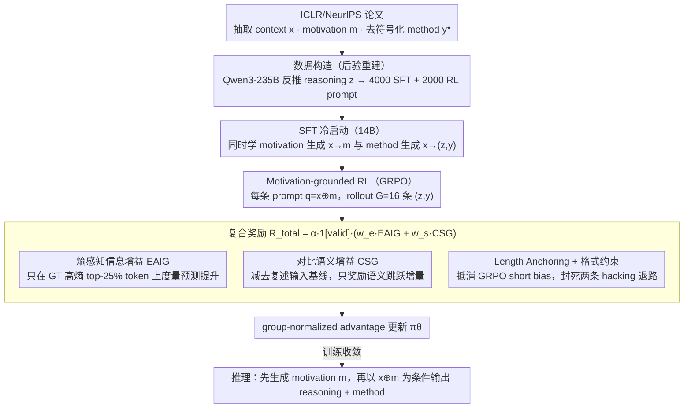

# MoRI: Learning Motivation-Grounded Reasoning for Scientific Ideation in Large Language Models

**会议**: ACL 2026  
**arXiv**: [2603.19044](https://arxiv.org/abs/2603.19044)  
**代码**: 见论文 GitHub（论文内提到 "The code is available on GitHub"，未给具体地址）  
**领域**: 科学创意 / LLM 推理 / RL for Reasoning  
**关键词**: 科学 Ideation, Motivation-grounded Reasoning, GRPO, 熵感知信息增益, 对比语义增益

## 一句话总结
把科学 ideation 显式建模为「context → motivation → reasoning → method」的两阶段条件推理任务，在 SFT 冷启动基础上用 GRPO + 一对新型可验证奖励（**熵感知信息增益 EAIG** + **对比语义增益 CSG**）训练 14B 模型，让其在 ICLR/NeurIPS 留出测试集上同时超越 GPT-4o、Claude-3.5-Sonnet 与 AI-Scientist-V2 等 agentic 框架。

## 研究背景与动机

**领域现状**：LLM 正从聊天机器人走向"科学助手 / 自主科研者"，scientific ideation（输入研究 context，输出新方法）被视为最上游任务；现有方案以 **agentic 流水线**为主——AI-Scientist-V2、ResearchAgent、VirSci 用多 agent 辩论 / 树搜索 / 同行评议来模拟人类研究流程。

**现有痛点**：（1）这些 agentic 框架本质是用启发式 scaffolding 把基础 LLM"凑合"成研究者，没有提升模型内在的科学推理能力，产出常常是**表面新颖的概念重组**，缺乏技术深度；（2）大规模人评（Si et al. 2024 / Kumar et al. 2025）证实，原生 LLM 想得到"新点子"但实现细节 / 可行性差；（3）Sutton 的 Bitter Lesson 警告：靠外部 scaffolding 不可持续，必须把推理内化。

**核心矛盾**：科学 ideation 没有"标准答案"——同一 context 可以有多个合法的 Method section，且这些 method 在词面上差异很大。这意味着 RL 训练面临两个困难：（a）没有 deterministic verifier（不像数学/代码可以单元测试）；（b）用 reference 概率 / 困惑度做奖励噪声极大；（c）用 LLM-judge 做 reward 又贵又易被 hack。

**本文目标**：放弃 agentic scaffolding，转而**用 RL 把科学推理过程"内化"进模型**——让模型显式学习"从研究动机推出方法"这一思维链。

**切入角度**：作者注意到——高质量的 method section 里"信息量大、不可预测"的 token 才是真正承载创新的"硬知识"（如具体算法 / 新参数），而 "we propose to" 这种 boilerplate 几乎零信息；同时，方法应当让模型在语义空间里**从 context 向 ground-truth method 移动**，而不是把 context 复述一遍。

**核心 idea**：把 ideation 显式拆成 $x \to m \to (z, y)$ 两阶段，并用两个**互补的可验证奖励**做 RL——EAIG（在 ground-truth method 的高熵 token 上度量推理是否真的让模型预测得更准）+ CSG（用对比基线度量生成 method 是否真在语义空间里"前进"），辅以 length anchoring 和格式约束防 reward hacking。

## 方法详解

### 整体框架
MoRI 是个三阶段 pipeline（Figure 2 + 7）：
（1）**数据构造**：从 ICLR 2024-2025 papers 抽取 context $x$、motivation $m$、去符号化的 method $y^*$，再用"posterior reconstruction"——先让 Qwen3-235B-Thinking 单看 context 产生初始 reasoning $z_{\text{init}}$，再让 Qwen3-235B-Instruct 在已知 $(x, y^*)$ 的条件下把 $z_{\text{init}}$ 改写成与 ground-truth 对齐的 $z$，反向工程出 4000 样本 SFT 集 + 2000 样本 RL prompt 集。
（2）**SFT 冷启动**：在 DeepSeek-R1-Distilled-Qwen-14B 上同时训两个任务——motivation 生成 ($x \to m$) 和 method 生成 ($x \to (z, y)$)。
（3）**Motivation-grounded RL**：用 GRPO + token-level loss + clip-higher 优化，每个 prompt 拼成 $q = x \oplus m$，rollout $G=16$ 条 $(z_i, y_i)$，按下述复合奖励算 group-normalized advantage。
**推理时**：先生成 motivation $m$，再以 $x \oplus m$ 为条件做 reasoning + 输出 method。

### 关键设计

**1. 熵感知信息增益 EAIG：只奖励"硬 token"上的预测提升，把信号锚死在 ground-truth 上**

开放式 ideation 的根本困难是没有 deterministic verifier——method 没有标准答案，用整段 method 的概率当奖励噪声极大、还偏向短输出。EAIG 的思路是：不看整段，只看 ground-truth method 里真正"硬"的 token。先用固定的 SFT 模型在 teacher-forced 条件下算出每个位置的熵 $H_t = -\sum_v \pi_{\text{sft}}(v \mid x, m, y^*_{<t}) \log \pi_{\text{sft}}(\cdot)$，取熵最高的 top-25% 形成 mask $\mathcal{M}_t$——实证里这把 34.2% 的 technical terms 选了进来，而 common words 只占 14.5%、numbers 只占 5.5%，说明 mask 抓的正是承载创新的技术细节。然后逐 token 算"加了 reasoning $z$ 之后预测得准了多少"：

$$g_t(z) = \log \pi_\theta(y^*_t \mid x, m, z, y^*_{<t}) - \log \pi_{\text{sft}}(y^*_t \mid x, m, y^*_{<t})$$

最终在 mask 上取平均 $\Delta_{IG}(z) = \frac{1}{\sum \mathcal{M}_t} \sum_t \mathcal{M}_t \cdot g_t(z)$。和 Beyond 80/20 那类"在 reasoning token 上过滤高熵"不同，MoRI 把高熵 mask 用在 **ground-truth method** 上而非生成的 reasoning 上——奖励锚在固定的 GT 而非模型自己写的内容上，从结构上切断了 reward hacking 的路径：模型再怎么乱写也改变不了 GT 的硬 token 是哪些。

**2. 对比语义增益 CSG：减掉"复述输入"的基线，逼模型做真实的语义跳跃**

EAIG 管的是微观技术深度，但还需要一个宏观信号保证生成的 method 是在朝 ground-truth 的解空间移动，而不是堆细节原地打转。直接用 $S_{gen} = \cos(\mathbf{E}(\hat{y}), \mathbf{E}(y^*))$（Qwen3-Embedding-8B 嵌入）会有个偷懒漏洞：把 context 改写一遍也能拿到不低的相似度。CSG 的关键是引入一个反事实基线 $S_{base} = \cos(\mathbf{E}(x \oplus m), \mathbf{E}(y^*))$，即"原封不动复述输入 $x \oplus m$"本来就能拿到的相似度，奖励只给增量 $\Delta_{sem} = S_{gen} - S_{base}$。这样 $\Delta_{sem} > 0$ 才意味着模型把语义重心从问题空间真正推到了解空间——必须产生超越输入的内容才有正奖励，这正是把 reward shaping 和"创新"概念对齐的那一笔。

**3. Length Anchoring + 格式约束：抵消 GRPO 的隐式 short bias，封死两条 hacking 退路**

EAIG 方差天然偏高，单独用会诱发两种崩溃：reasoning chain 越缩越短、或者乱写一通去"hack 熵"。先看格式约束——指示函数 $\mathds{1}[\text{valid}]$ 要求 CoT 非空、≥ 1000 字符且不含 `##`/`###`，后者是为了防止把 method 内容偷渡进 reasoning 段冒充推理。再看长度锚定，调制因子

$$\alpha(z) = \min\Big(1,\ 1 - \lambda \frac{L_{anchor} - |z|}{L_{anchor}}\Big)$$

在 $|z| < L_{anchor}$ 时给奖励打折，倒逼 reasoning 保持深度。三者合成复合奖励 $R_{\text{total}} = \alpha(z) \cdot \mathds{1}[\text{valid}] \cdot (w_e f_{\text{step}}(\Delta_{IG}) + w_s f_{\text{step}}(\Delta_{sem}))$，最佳权重落在 $w_s = 0.7, w_e = 0.3$——CSG 当主导、EAIG 做配料。为什么非要 length anchoring？附录 F 给了形式化解释：GRPO 的 group normalization 本质是隐式的 Sharpe ratio 最大化，会偏好低方差策略，而长 reasoning chain 的奖励方差天然更高、于是被系统性压短；length anchoring 提供一个正向梯度去抵消这个 bias，把训练动力学稳定在 $L_{anchor}$ 附近。

### 损失函数 / 训练策略
GRPO with token-mean loss、$\varepsilon_{\text{low}}/\varepsilon_{\text{high}} = 0.2/0.28$（clip-higher）、KL 系数 0.001、rollout $G=16$、lr $5 \times 10^{-7}$ + 10% warmup cosine、global batch 8、temperature 1.0、max prompt/response 各 5000。奖励 step-shaping 把连续 gain 量化为 4 档以抗噪：EAIG 阈值 $[1.0, 1.5, 2.0]$，CSG 阈值 $[0.01, 0.05, 0.1]$，奖励档 $[0, 0.5, 0.8, 1.0]$。

## 实验关键数据

### 主实验
在 83 篇 ICLR 2025 in-domain 测试集 + 67 篇 NeurIPS 2025 OOD 测试集上跑（评分维度：Novelty / Tech Rigor / Feasibility / Mean，1-5 分，Gemini-2.5-Pro 检索增强 LLM-judge + 3 位 PhD 人工评）：

| 模型 / 框架 | ICLR Mean | NeurIPS OOD Mean | Combined Mean | Δ vs MoRI |
|------------|-----------|------------------|---------------|-----------|
| GPT-4o | 2.69 | 2.77 | 2.74 | +16.1% |
| Claude-3.5-Sonnet | 3.09 | 3.13 | 3.11 | +2.3% |
| AI-Scientist-V2† (Sonnet, ICLR only) | 3.14 | – | – | +1.6% |
| AI-Scientist-V2 (GPT-4o) | 2.71 | 2.48 | 2.60 | +22.3% |
| ResearchAgent | 2.60 | 2.37 | 2.50 | +27.2% |
| VirSci | 2.25 | 2.23 | 2.24 | +42.0% |
| Full-SFT (x → m → y) | 2.99 | 2.85 | 2.93 | +8.5% |
| **MoRI** | **3.19** | **3.15** | **3.18** | — |
| Ground Truth (oracle) | 3.58 | 3.59 | 3.59 | – |

ICLR 上 MoRI Feasibility 3.11 比 Claude-3.5-Sonnet 的 2.82 高 10.3%，Rigor 高 2.9%；唯一被 Claude Sonnet（3.39）和 AI-Scientist-V2†(Sonnet) (3.45) 反超的是 Novelty 维度。人评-LLM 评相关性 Pearson r = 0.715（p < 0.001），且 95% bootstrap CI [3.11, 3.25] 与所有 agentic baseline 完全不重叠。

### 消融实验

| 配置 | Novelty | Rigor | Feas. | Mean | 现象 |
|------|---------|-------|-------|------|------|
| Full-SFT (direct $x \to y$) | 2.80 | 2.69 | 2.81 | 2.75 | 不显式建模 motivation |
| Full-SFT (two-stage $x \to m \to y$) | 2.85 | 2.76 | 2.94 | 2.85 | +0.10，motivation 条件化有用 |
| MoRI (full) | 3.30 | 3.00 | 3.16 | 3.15 | +0.30 vs two-stage SFT |
| EAIG only ($w_s=0, w_e=1$) | 2.68 | 2.22 | 2.63 | 2.51 | reward 崩溃 + length explosion |
| CSG only ($w_s=1, w_e=0$) | 3.16 | 2.93 | 3.06 | 3.05 | 稳定但次优 |
| Balanced ($w_s=w_e=0.5$) | 3.32 | 2.96 | 2.98 | 3.09 | 接近最优 |
| **Optimal ($w_s=0.7, w_e=0.3$)** | **3.34** | **3.04** | 3.07 | **3.15** | EAIG 做配料、CSG 当主导 |
| Top-50% 熵 mask | 3.16 | 2.78 | 3.00 | 2.98 | 噪声 token 拖累 |
| **Top-25% 熵 mask** | **3.32** | **2.96** | 2.98 | **3.09** | +3.7%，技术 token 信号更纯 |
| Optimal w/o Length Anchor | 3.22 | 2.94 | 3.00 | 3.05 | -0.10 |
| Optimal **w/ Length Anchor** | **3.34** | **3.04** | **3.07** | **3.15** | +3.2% |
| Balanced w/o LA | 2.96 | 2.76 | 2.95 | 2.89 | -0.20，no LA 全面崩 |

### 关键发现
- **EAIG 单飞会爆炸**：纯 EAIG 训练时 CoT 长度 explosion + 内容退化成 gibberish（"hack 熵"），证明 macro-level direction signal 不可或缺。
- **CSG 是底盘，EAIG 是装饰**：$w_s : w_e = 7 : 3$ 比 5:5 还要好，说明 CSG 提供的"语义方向"才是稳定信号；EAIG 只在保证方向的前提下补技术深度。
- **熵 mask 必须严**：top-50% 把 common words 也算进去，反而引入噪声让 CoT 长度衰减；top-25% 让信号更纯，方法学到的是"解释 hard token"而非"刷字数"。
- **Length Anchoring 是抗 GRPO 隐式 short bias 的必需品**：附录 F 给出形式化解释——GRPO 的 group normalization 是隐式 Sharpe ratio 最大化，会偏好低方差→短 CoT；anchor 提供正梯度抵消，无 LA 时 Balanced 配置直接掉 0.20。
- **OOD 几乎不掉点**：ICLR 3.19 → NeurIPS 3.15，Δ = 0.04 不显著，证明学到的不是 venue 模板而是真正的推理模式；并且生成的 CoT 自发出现 3 种推理行为（目标分解 / 自我批评循环 / 范式质疑）。
- **碾压 agentic 框架**：MoRI 单模型 14B + RL 内化推理 > AI-Scientist-V2 + GPT-4o 多 agent + tree search（3.18 vs 2.60，+22.3%），且 Bonferroni-corrected p < 0.001 显著。

## 亮点与洞察
- **"motivation 当 RL 条件"是关键的概念解耦**：把 $(z, y) \sim \pi_\theta(\cdot | x, m)$ 显式条件在 motivation 上，让 RL 不用同时学"提问 + 解题"，只优化"从问题到方案"的推理——这是 RLVR 在开放式任务里的通用启发。
- **EAIG 用"硬 token 上的相对似然提升"做 surrogate verifier 非常聪明**：解决了"开放式生成没有 verifier"的根本问题，且把 verifier 锚在 ground-truth 而非生成内容上，从结构上规避 reward hacking——这套思路可迁移到 long-form QA / open-ended code generation 等任何"答案非唯一但仍有 reference"的任务。
- **CSG 的对比基线 $S_{base}$ 是细节但要命的设计**：直接 $\cos(\hat{y}, y^*)$ 会让模型学到"把输入复述出来"也得高分；减去 $S_{base}$ 后，模型必须产生"超越输入"的语义内容才有正奖励——这就是 reward shaping 与"创新"概念对齐的范例。
- **理论-实验闭环**：附录 F 用 Sharpe ratio 类比解释 GRPO 的隐式 short bias，并推导 length anchoring 的正梯度修正——把"为什么 CoT 会缩短"从经验观察变成可分析的现象。
- **训练动力学可视化**：Figure 3 同时画 CoT 长度 / shaped EAIG / shaped CSG 三条曲线，让"reward collapse"这种抽象概念可见，非常有说服力。

## 局限与展望
- **作者承认**：（1）仅限 CS / ML 论文，物理 / 生物等"逻辑结构不同"的领域未验证；（2）评估靠 LLM-judge + 局部人工，缺少"实际跑实验是否 work"这种 ground truth；（3）有滥用风险，可能被用来批量生产水文。
- **自己发现**：（1）**Novelty 维度上仍不及 Claude-3.5-Sonnet** ——MoRI 偏稳/偏实用，缺少"飞一点点"的能力，本质是 ground-truth method 作为 anchor 把分布拉向已知；（2）"posterior reconstruction"用 ground-truth 反推 reasoning trace 引入了 hindsight bias，生成的 $z_i$ 比真实研究过程"更干净"，可能让模型学到偏理想化的推理模式；（3）熵 mask 用 SFT 模型一次性算定，模型训练过程中 SFT 模型已"过时"，长期看可能漂移；（4）CSG 完全依赖嵌入模型的几何性质，对嵌入模型选择敏感（论文用 Qwen3-Embedding-8B，没消融）；（5）只比到 14B 模型，没和同等算力下 prompt engineering 后的 32B/70B 比，"内化推理"的相对优势在更大模型上是否还成立未知。
- **改进思路**：把 EAIG 的 SFT 参考分布换成"上一个 checkpoint"实现在线更新；引入 retrieval-augmented context 让 Novelty 不那么 anchor 到 ground-truth；把 posterior reconstruction 替换为"从相关论文真实 introduction 中抽取动机推理"减少 hindsight bias。

## 相关工作与启发
- **vs AI-Scientist-V2 / ResearchAgent / VirSci (agentic frameworks)**: 后者靠 scaffolding 而不优化模型；MoRI 用 RL 把推理内化进 14B 单模型，单次 inference 完成 + 性能反超 +22.3% (combined mean)。
- **vs NOVER / RLPR / 等 verifier-free RL (Liu et al. 2025a, Yu et al. 2025b)**: 这类方法用 intrinsic signal（如 reference probability）做 reward，但对 open-ended 多解任务噪声极大；MoRI 的 EAIG 在高熵 token 上做局部信号 + CSG 做对比 baseline，是更精细的 verifier-free 方案。
- **vs Rubrics-as-Rewards / Dr. Tulu (Gunjal et al. 2025, Shao et al. 2025)**: 用 LLM-judge 评 rubric 做 reward，贵且易被 hack；MoRI 完全 model-based（用嵌入 + base policy logprob），单次梯度估计便宜得多。
- **vs Beyond 80/20 (Wang et al. 2025b)**: 该工作在 reasoning token 上 filter 高熵 token；MoRI 把同一思路用在**ground-truth target** 上而非 reasoning trace 上，方向不同——锚在 GT 上彻底切断 reward hacking 路径。
- **vs Chain-of-Ideas (Li et al. 2025a) / Motiv-Graph (Lei et al. 2025)**: 这类方法用图 / 链 prompt 模拟科学推理；MoRI 是第一次用 RL 把这种思维结构变成模型权重的一部分。

## 评分
- 新颖性: ⭐⭐⭐⭐ "motivation-grounded RL + EAIG + CSG"三件套是首个面向开放式科学 ideation 的端到端 RL 方案；概念上是 RLVR 在 verifier-free 任务上的清晰一步。
- 实验充分度: ⭐⭐⭐⭐⭐ 双 venue 测试 + 6 个 baseline + 4 类消融 + 训练动力学曲线 + 60 样本人工 cross-check + bootstrap CI + Bonferroni 校正，做得非常扎实。
- 写作质量: ⭐⭐⭐⭐ 把"为什么 GRPO 会缩短 CoT"的理论分析专门做附录 F，公式与图示对应清晰；唯一可惜是 motivation 那段太长，可压缩。
- 价值: ⭐⭐⭐⭐ 给"RL + LLM 做研究助手"这条路开了具体可复现的范式；EAIG / CSG 的设计哲学（hard token + 对比 baseline）可迁移到任何 open-ended LLM RL 任务。

<!-- RELATED:START -->

## 相关论文

- [\[ACL 2026\] Foresight Optimization for Strategic Reasoning in Large Language Models](foresight_optimization_for_strategic_reasoning_in_large_language_models.md)
- [\[ACL 2026\] DeCoVec: Building Decoding Space based Task Vector for Large Language Models via In-Context Learning](decovec_building_decoding_space_based_task_vector_for_large_language_models_via_.md)
- [\[ACL 2025\] The Role of Deductive and Inductive Reasoning in Large Language Models](../../ACL2025/llm_nlp/the_role_of_deductive_and_inductive_reasoning_in_large_language_models.md)
- [\[ACL 2025\] Disentangling Memory and Reasoning Ability in Large Language Models](../../ACL2025/llm_nlp/disentangle_memory_reasoning.md)
- [\[ACL 2026\] Generative Floor Plan Design with LLMs via Reinforcement Learning with Verifiable Rewards](generative_floor_plan_design_with_llms_via_reinforcement_learning_with_verifiabl.md)

<!-- RELATED:END -->
