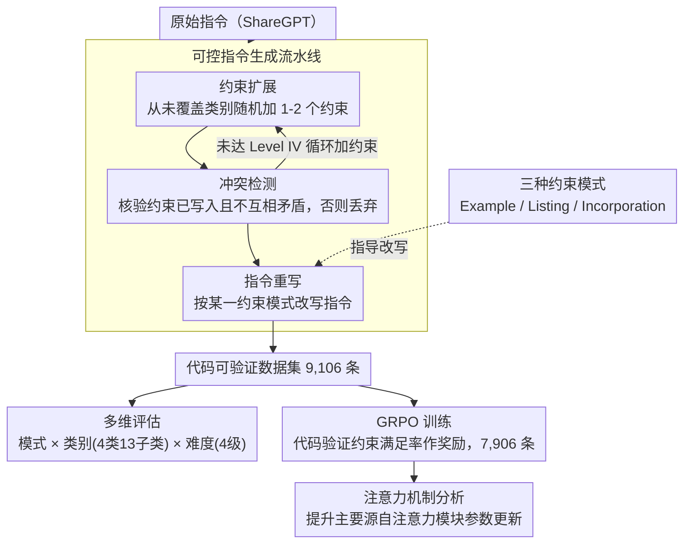

# MulDimIF: A Multi-Dimensional Constraint Framework for Evaluating and Improving Instruction Following in Large Language Models

**会议**: ACL 2026  
**arXiv**: [2505.07591](https://arxiv.org/abs/2505.07591)  
**代码**: [GitHub](https://github.com/Junjie-Ye/MulDimIF)  
**领域**: LLM评估与改进  
**关键词**: 指令遵循, 多维约束, 评估基准, GRPO训练, 注意力机制分析

## 一句话总结
提出 MulDimIF 多维约束框架，从约束模式（3种）、约束类别（4类13子类）和约束难度（4级）三个维度系统评估 LLM 的指令遵循能力，并通过 GRPO 训练显著提升模型性能，发现改进主要源自注意力模块的参数更新。

## 研究背景与动机

**领域现状**：指令遵循是 LLM 的基础能力，在 Agent 和工具辅助工作流中尤其关键——输出必须严格遵守 JSON 等格式要求，微小偏差就可能导致下游系统崩溃。

**现有痛点**：(1) 现有评估基准（IFEval 等）主要关注约束类别的多样性，评估维度单一，无法全面刻画指令遵循能力；(2) 训练方法通过数据工程提升基准分数，但很少分析性能提升的内在机制；(3) 缺乏对约束呈现方式（示例/列表/融合）和难度梯度的系统性研究。

**核心矛盾**：评估和训练都缺乏多维视角——现有方法无法区分模型是"不理解约束类型"还是"不擅长处理复杂约束组合"或"难以从特定呈现方式中提取约束"。

**本文目标**：构建覆盖约束模式、类别、难度的多维框架，既用于细粒度评估又用于指导训练改进，并分析改进的内在机制。

**切入角度**：从真实用户提示写作指南中提炼三种约束模式（示例、列表、融合），结合约束类别和难度梯度构建多维评估体系。

**核心 idea**：通过约束扩展→冲突检测→指令重写的可控流水线生成代码可验证的评估数据，同时发现 GRPO 训练改进主要通过注意力模块实现。

## 方法详解

### 整体框架
MulDimIF 包含评估框架和改进流水线两部分：评估框架定义三种约束模式（Example/Listing/Incorporation）、四类约束（内容/格式/语言/长度，13子类）和四级难度（1-4个约束类型组合）；改进流水线先用可控指令生成流水线（约束扩展→冲突检测→指令重写）把 ShareGPT 的原始指令批量改造成代码可验证数据，再分别用于多维评估和 GRPO 训练，最后从参数层面分析提升来源。

### 关键设计

**1. 三种约束模式：把"约束怎么写进指令里"也当成一个评估维度**

以往基准（如 IFEval）只盯着约束类别的多样性，却忽略了同一个约束可以有完全不同的呈现方式，而真实用户恰恰会用不同方式表达要求。本文从真实用户提示写作指南里提炼出三种模式：Example 模式给出符合约束的问答示例，相当于 in-context learning；Listing 模式以结构化列表逐条列出约束，对零样本友好；Incorporation 模式把约束融进指令文本，读起来流畅但解析难度最高。这一拆分之所以有价值，是因为它能区分模型到底是"不理解约束类型"还是"难以从某种呈现方式里把约束提取出来"——实验里模型在 Example 上表现最好、Incorporation 最差，正说明呈现方式本身就是一个独立且显著的难度来源。

**2. 可控指令生成流水线：用三步把普通指令自动改造成代码可验证的约束变体**

手动构造约束丰富的指令既贵又难保证多样性，更难控制约束类别和难度的分布。流水线把这件事拆成三步自动完成：约束扩展先从尚未覆盖的约束类别里随机挑选，给指令添加 1-2 个具体约束，并循环累加直到难度达到 Level IV；冲突检测再核验新约束是否正确写入、彼此是否矛盾，任一不通过就丢弃该指令，保证数据干净；指令重写最后随机选定上面三种约束模式之一，把指令改写成对应风格。整套流程跑在 ShareGPT 采样的指令上，产出 9,106 条代码可验证数据。关键在于"代码可验证"——约束满足与否由代码判定而非 LLM-as-judge，既消除了主观性，又让这批数据可以直接拿来当 GRPO 的奖励信号。

**3. 注意力机制分析：不止给出"有效"，还回答 GRPO "为什么有效"**

多数训练方法只报告基准分数涨了，却很少解释性能提升究竟来自模型的哪个部分。本文通过参数级别的对比分析加案例研究发现：GRPO 训练带来的指令遵循提升，主要源自注意力模块的参数更新，这些更新让模型的注意力焦点更好地对齐到指定约束上。这个结论的意义在于它把"黑箱涨点"变成了可解释的机制——既佐证了改进的真实来源，也为未来更精准的训练（比如只微调注意力层）提供了直接依据。

### 损失函数 / 训练策略
使用 GRPO（Group Relative Policy Optimization）算法在 7,906 条训练数据上训练。约束满足率通过代码验证作为奖励信号。

## 实验关键数据

### 主实验（整体得分）

| 模型 | Example | Listing | Incorporation | Overall |
|------|---------|---------|---------------|---------|
| Claude 3.5 Sonnet | 72.50 | 69.00 | 61.00 | **67.50** |
| Qwen3-32B (Reason) | 70.50 | 69.50 | 59.50 | 66.50 |
| Gemini 1.5 Pro | 73.50 | 61.75 | 65.25 | 66.83 |
| GPT-4o | 70.50 | 62.50 | 59.00 | 64.00 |
| LLaMA 3.1 70B | 68.00 | 54.25 | 48.25 | 56.83 |

### 难度梯度实验

| 难度级别 | 平均准确率 | 说明 |
|----------|-----------|------|
| Level I (1类约束) | 80.82% | 单一约束较容易 |
| Level II (2类约束) | ~62% | 多类型组合显著下降 |
| Level III (3类约束) | ~50% | 继续下降 |
| Level IV (4类约束) | 36.76% | 最困难，最好模型也仅 55% |

### 关键发现
- 从 Level I 到 Level IV，平均准确率从 80.82% 暴跌至 36.76%，揭示了多约束组合对 LLM 的巨大挑战
- Example 模式一致优于 Listing 和 Incorporation，说明 in-context learning 对约束遵循仍然是最有效的
- 推理模型（如 Qwen3 Reasoning）在高难度级别上明显优于直接模式，推理能力有助于处理复杂约束
- GRPO 训练后模型在所有维度上均有提升，且不损害通用性能

## 亮点与洞察
- 多维评估框架的设计非常系统：模式×类别×难度的正交组合提供了前所未有的细粒度诊断能力
- 注意力模块是指令遵循改进的关键——这一发现为未来的针对性训练（如只微调注意力层）提供了理论依据
- 代码可验证的评估数据消除了 LLM-as-judge 的主观性，评估结果更可靠

## 局限与展望
- 约束类型目前限于内容/格式/语言/长度四类，逻辑约束和语义约束尚未涉及
- 代码验证器可能无法覆盖所有约束的验证（如"保持正式语气"等软约束）
- 训练数据量相对有限（7,906 条），更大规模训练的效果有待验证

## 相关工作与启发
- **vs IFEval**: IFEval 仅评估约束类别多样性，MulDimIF 增加了模式和难度两个维度，评估更全面
- **vs FollowBench**: FollowBench 关注逻辑推理和风格一致性，MulDimIF 更聚焦于约束的结构化呈现方式
- **vs IOPO**: IOPO 通过偏好信号优化指令遵循，但缺乏机制分析；MulDimIF 的注意力模块分析提供了可解释的改进路径

## 评分
- 新颖性: ⭐⭐⭐⭐ 多维约束框架设计系统全面
- 实验充分度: ⭐⭐⭐⭐⭐ 18个LLM、多维度评估、机制分析
- 写作质量: ⭐⭐⭐⭐ 结构清晰，图表丰富
- 价值: ⭐⭐⭐⭐ 框架和数据对社区有直接参考价值

<!-- RELATED:START -->

## 相关论文

- [\[ACL 2025\] Revisiting Compositional Generalization Capability of Large Language Models Considering Instruction Following Ability](../../ACL2025/llm_nlp/compositional_generalization_instruction.md)
- [\[ACL 2025\] MDCure: A Scalable Pipeline for Multi-Document Instruction-Following](../../ACL2025/llm_nlp/mdcure_a_scalable_pipeline_for_multi-document_instruction-following.md)
- [\[ACL 2025\] Catching Shortcuts: A Framework for Evaluating Shortcuts in Large Language Models](../../ACL2025/llm_nlp/catching_shortcuts_a_framework_for_evaluating_shortcuts_in_large_language_models.md)
- [\[ACL 2026\] Why Did Apple Fall: Evaluating Curiosity in Large Language Models](why_did_apple_fall_evaluating_curiosity_in_large_language_models.md)
- [\[AAAI 2026\] Control Illusion: The Failure of Instruction Hierarchies in Large Language Models](../../AAAI2026/llm_nlp/control_illusion_the_failure_of_instruction_hierarchies_in_large_language_models.md)

<!-- RELATED:END -->
