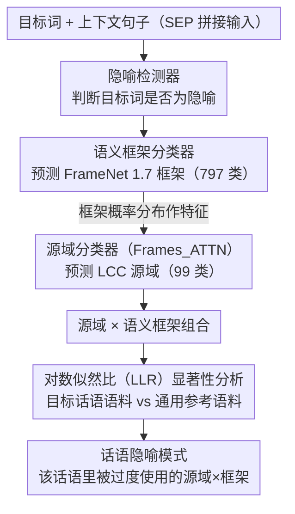

# Not All Animals Are Equal: Metaphorical Framing through Source Domains and Semantic Frames

**会议**: ACL 2026 Findings  
**arXiv**: [2604.20454](https://arxiv.org/abs/2604.20454)  
**代码**: [https://github.com/julia-nixie/ConceptFrameMet](https://github.com/julia-nixie/ConceptFrameMet)  
**领域**: LLM/NLP  
**关键词**: 隐喻检测, 概念隐喻理论, 语义框架, 话语分析, 媒体框架

## 一句话总结

本文提出首个结合 FrameNet 语义框架和概念隐喻理论（CMT）源域的计算框架 ConceptFrameMet，通过 RoBERTa 多任务模型检测隐喻并预测其语义框架和源域，配合对数似然比统计方法发现话语中显著的隐喻模式，揭示了自由派和保守派在移民话语中使用相同源域但选择不同语义框架来传达截然不同的联想。

## 研究背景与动机

**领域现状**：概念隐喻理论（CMT）是分析隐喻的主流框架——通过源域（如 WATER、ANIMAL、WAR）来理解抽象的目标概念。NLP 中的隐喻研究主要集中在隐喻检测和源域映射上。

**现有痛点**：源域本身无法完全解释隐喻传递的具体联想。例如，"illegal aliens flood into our country"和"waves of immigrants have always enriched us"都来自 WATER 源域，但传达了截然相反的态度——前者强调洪水般的失控，后者是自然景观的一部分。已有工作无法解释为何同一源域的隐喻被对立意识形态阵营同时使用。

**核心矛盾**：源域指向一组联想的集合，但具体激活哪些联想取决于使用的词汇所对应的语义框架。"flood"的语义框架是 Filling（强调运动和溢出的负面结果），而"wave"/"tide"的框架是 Quantified_mass 或 Natural_features（更中性的联想）。这种源域×语义框架的交互一直被 NLP 忽视。

**本文目标**：(1) 构建可自动检测隐喻、预测源域和语义框架的计算模型；(2) 设计统计方法发现话语中显著的隐喻模式；(3) 分析不同意识形态在使用隐喻框架上的差异。

**切入角度**：将建构主义语言学理论（Sullivan 2013, 2025）引入 NLP——语义框架是从源域中"挑选"特定联想的机制，源域×框架的交互唯一地定义了隐喻的联想。

**核心 idea**：用源域指定联想的集群，用语义框架在集群中精确定位具体联想——两者的交互（而非单独一个维度）才是分析隐喻框架效果的关键。

## 方法详解

### 整体框架

ConceptFrameMet 想解决的是一个被 NLP 长期忽视的问题：同一个隐喻源域（如 WATER）为何能被对立阵营同时使用、却传达截然相反的态度。它的答案是把"源域"和"语义框架"两个维度合起来看——源域圈定一组联想，语义框架再从中精确挑出被真正激活的那一个。整个系统因此分两层转：先用一组基于 RoBERTa 的多任务分类器，对句中目标词联合判断它是不是隐喻、属于 FrameNet 1.7 的哪个语义框架（797 类）、对应 LCC 数据集的哪个源域（99 类）；再用对数似然比（LLR）统计模块，把这些预测在某个特定话语（如移民、气候新闻）里的分布和通用参考语料比较，找出"在这个话语里被异常高频使用"的源域×框架组合，也就是话语隐喻。

### 关键设计

**1. 语义框架分类器：先把"目标词激活了哪个框架"这件事做准，作为后续一切分析的地基**

源域只能圈出一个联想的集群，真正决定听众联想到什么的是具体用词背后的语义框架——"flood"指向 Filling 框架（运动、溢出、失控的负面联想），"wave/tide"指向 Quantified_mass 或 Natural_features（中性得多）。所以第一步必须把框架预测做扎实。本文微调 RoBERTa-base，用 SEP 把目标词和上下文句子分隔输入，而不是 MASK 掉目标词——保留目标词本身的词形信息后，测试集准确率从 0.806 升到 0.861、macro-F1 从 0.053 跳到 0.648，接近需要大量数据增强的 SOTA。对照之下，零样本的 Gemini 2.5、Claude Sonnet 4.0 在这种 797 类细粒度任务上明显逊色，说明这类任务仍要靠专门微调的小模型。

**2. 带语义框架增强的源域分类器：把框架预测当成特征喂给源域预测，验证"框架能帮着区分相近源域"这一核心假设**

很多源域在表面语义上彼此接近，单看上下文容易混淆。本文在 RoBERTa SEP 的基础上，把语义框架分类器输出的概率分布作为冻结特征向量引入，并进一步提出 Frames_ATTN 变体：同时维护一份可训练和一份冻结的框架向量，用源域嵌入作 query 对可训练矩阵做注意力，让模型自己学出"哪些框架对哪个源域最有判别力"，冻结向量则作残差兜底。这个交互设计直接验证了论文的理论假设——框架信息确实能拉开相近源域的距离，在欠代表类别上 macro-F1 提升达 20 个百分点。

**3. 对数似然比显著性分析：把"这个话语里哪些隐喻被异常高频使用"从单纯词频里分离出来**

光统计某个源域出现多少次没用，因为很多隐喻在任何语言里都很常见，频率高不代表它是这个话语的特征。本文采用 Rayson & Garside (2000) 的 LLR 方法，把目标语料（如气候新闻里的隐喻）和参考语料（通用隐喻数据集）的源域/框架频率分布逐项比较，LLR 值越高代表该源域或框架在这个话语里越被"过度使用"，也就越能反映它作为话语隐喻的显著性。正是靠它，作者才能定位出气候话语里突出的 BODY/WAR/MACHINE、以及移民话语里两派源域分布相似但框架选择分裂的现象。

### 损失函数 / 训练策略

三个分类器都基于 RoBERTa-base 独立微调：隐喻检测器在 VUA 上微调；语义框架分类器在 FrameNet 1.7 上微调（训练/验证/测试 19391/2272/6714）；源域分类器在 LCC 大规模数据集上微调（11704/2509/2509），并在预测时把冻结的语义框架概率分布作为额外特征接入。

## 实验关键数据

### 主实验

**语义框架预测性能（FrameNet 1.7 测试集）**

| 方法 | Accuracy | micro-F1 | macro-F1 |
|------|----------|----------|----------|
| RoBERTa MASK | 0.806 | 0.806 | 0.053 |
| RoBERTa SEP | 0.861 | 0.866 | 0.648 |
| Gemini 2.5 | 0.508 | 0.508 | 0.430 |
| Claude Sonnet 4.0 | 0.736 | 0.736 | 0.600 |

**源域预测性能（LCC 测试集）**

| 方法 | Accuracy | F1 |
|------|----------|-----|
| RoBERTa SEP | 0.833 | 0.740 |
| Frames_CONCAT | 0.837 | 0.754 |
| **Frames_ATTN** | **0.838** | **0.756** |
| Gemini 2.5 | 0.528 | 0.345 |

### 消融实验

| 配置 | 说明 | 效果 |
|------|------|------|
| 无框架信息 | 仅用 RoBERTa | F1 0.740 |
| CONCAT 融合 | 简单拼接框架向量 | F1 0.754 (+1.4) |
| ATTN 融合 | 注意力机制融合框架 | F1 0.756 (+1.6) |
| 低频类提升 | <10 样本的类别 | macro-F1 提升 20 个百分点 |

### 关键发现

- 气候变化话语中最显著的源域是 BODY（气候是"生病的身体"）、WAR（"fight against"）、MACHINE（"levers of change"）
- 移民话语中保守派和自由派使用的源域分布相似，但语义框架选择显著不同
- 保守派偏好强调不可控性的框架（如 Motion_directional 用于 WATER 域），自由派偏好中性或"受害者化"的框架（如 Quantified_mass）
- ANIMAL 源域中，保守派倾向 Biological_urge（动物本能/侵略性），自由派用 Self_motion（自主移动，更中性）
- 零样本 LLM 在细粒度分类（797 类框架、99 类源域）上远逊于微调的小模型，说明这类任务仍需专门训练

## 亮点与洞察

- 理论贡献显著——首次将建构主义语言学的"源域×语义框架"交互理论引入 NLP，为理解隐喻为何被对立阵营同时使用提供了新的分析维度
- 发现保守派和自由派在相同源域下选择不同语义框架，这个实证发现对政治传播学有直接价值
- Frames_ATTN 中用目标任务嵌入做 query 来选择辅助特征的设计，可迁移到其他需要多粒度特征融合的 NLP 任务

## 局限与展望

- 语义框架分类器的 macro-F1 仍较低（0.648），主要因为 797 类中存在大量语义相近的小类
- 分析仅限于英语语料，隐喻框架的跨语言差异值得探索
- 对数似然比方法是统计性的，无法捕捉语境中的动态隐喻演化
- 未来可扩展到社交媒体、政治演说等更多话语类型

## 相关工作与启发

- **vs Mendelsohn & Budak (2025)**: 他们发现对立意识形态使用相同源域但无法解释原因，本文通过语义框架维度提供了解释
- **vs Gordon et al. (2015)**: 他们编码语义角色但未将框架与源域交互分析，本文首次实现两者的系统结合
- **vs Stowe et al. (2021)**: 他们用框架辅助隐喻生成，本文用框架辅助隐喻分析和源域预测

## 评分

- 新颖性: ⭐⭐⭐⭐⭐ 首次将建构主义隐喻理论中的源域×框架交互引入 NLP，理论创新显著
- 实验充分度: ⭐⭐⭐⭐ 两个话语领域分析，多基线对比，但定量评估主要依赖分类指标
- 写作质量: ⭐⭐⭐⭐⭐ 跨学科论证严谨，例子生动，理论与实证结合紧密
- 价值: ⭐⭐⭐⭐ 为隐喻分析和框架效果研究开辟了新方向，具有跨学科影响力

<!-- RELATED:START -->

## 相关论文

- [\[ACL 2025\] Entity Framing and Role Portrayal in the News](../../ACL2025/llm_nlp/entity_framing_and_role_portrayal_in_the_news.md)
- [\[ICML 2026\] Differential Syntactic and Semantic Encoding in LLMs](../../ICML2026/llm_nlp/differential_syntactic_and_semantic_encoding_in_llms.md)
- [\[ICLR 2026\] Evaluating Text Creativity across Diverse Domains: A Dataset and Large Language Model Evaluator](../../ICLR2026/llm_nlp/evaluating_text_creativity_across_diverse_domains_a_dataset_and_large_language_m.md)
- [\[AAAI 2026\] VSPO: Validating Semantic Pitfalls in Ontology via LLM-Based CQ Generation](../../AAAI2026/llm_nlp/vspo_validating_semantic_pitfalls_in_ontology_via_llm-based_cq_generation.md)
- [\[ICML 2026\] SAC-Opt: Semantic Anchors for Iterative Correction in Optimization Modeling](../../ICML2026/llm_nlp/sac-opt_semantic_anchors_for_iterative_correction_in_optimization_modeling.md)

<!-- RELATED:END -->
