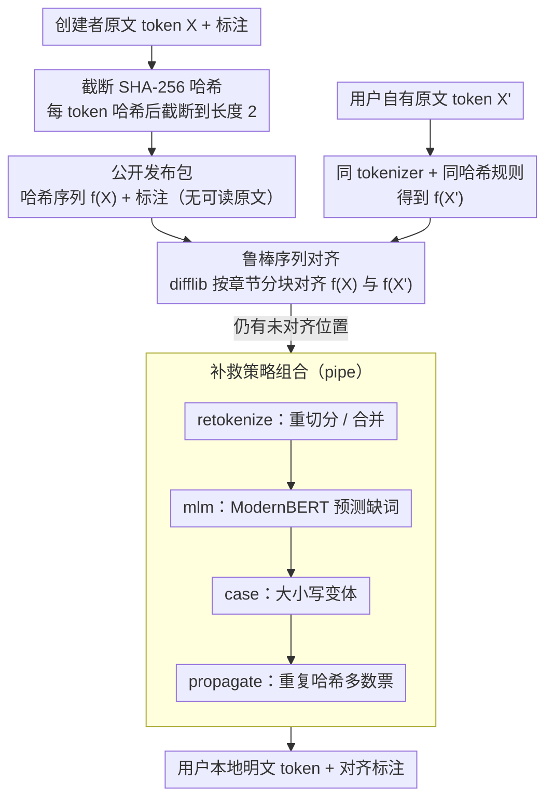

# Overcoming Copyright Barriers in Corpus Distribution Through Non-Reversible Hashing

**会议**: ACL2026  
**arXiv**: [2604.23412](https://arxiv.org/abs/2604.23412)  
**代码**: https://github.com/CompNet/novelshare  
**领域**: NLP语料共享 / 文学文本处理 / 版权合规数据发布  
**关键词**: 非可逆哈希, 版权文本, 语料分发, 序列对齐, 标注共享

## 一句话总结
本文提出 novelshare：把受版权保护文本的 token 变成截断后的非可逆哈希，并只公开哈希序列与研究者自有标注，使拥有合法原文的用户可以在轻微版本差异下重新对齐标注，在近版本小说上达到 98.7% 到 99.79% 的 token 正确对齐率。

## 研究背景与动机
**领域现状**：NLP 研究高度依赖带标注语料，尤其是 NER、POS、指代消解、角色网络抽取、引文归属等任务。对文学文本和长篇叙事文本来说，完整作品比片段更有研究价值，因为人物、事件、叙事视角和长距离依赖往往跨章节展开。

**现有痛点**：问题在于很多有现实代表性的文本仍受版权保护。学术团队如果只使用公版文本，就会系统性偏向 19 世纪或更早的作品；如果完全不公开受版权语料，后续研究无法复现或比较；如果只公开节选，又难以覆盖完整长文本任务。向作者逐一申请授权虽然最稳妥，但成本高、扩展性差。

**核心矛盾**：研究者想公开的是自己生产的标注，而不是原始文学作品；但传统语料发布格式通常把原文 token 和标注绑在一起。更麻烦的是，即便用户自己拥有同一部作品，也未必拥有和语料创建者完全一致的电子版本：版本修订、OCR、标点规范、章节切分和 tokenizer 都会造成 token 序列差异。

**本文目标**：作者希望设计一种语料共享机制，使创建者可以公开 token 级标注，同时不公开可读原文；用户必须自行持有原文，才能本地重建和标注对应的 token 序列；系统还要能容忍合理的小差异，而不是要求两端文本逐字完全一致。

**切入角度**：论文从 Bost et al. (2020) 的哈希对齐思路出发，把它推广成面向任意 token 级顺序标注的通用方案。关键观察是：如果公开的只是截断哈希，外部攻击者无法直接读出文本；而真正拥有相近原文的用户，可以对自己的 token 做同样哈希，再通过序列对齐把公开标注映射回来。

**核心 idea**：用“截断非可逆哈希 + 鲁棒序列对齐 + 小差异修复策略”替代“公开原文”，在版权合规和语料可复现之间建立一个可操作的中间层。

## 方法详解
这篇论文的方法不是训练一个 NLP 模型，而是设计一套语料发布协议和对齐算法。它要解决的核心问题可以写成：创建者有受版权保护的 token 序列 $X=(x_1, \dots, x_n)$ 以及每个 token 上的标注；用户有自己合法获得的相近文本 $X'=(x'_1, \dots, x'_m)$；系统需要在不泄露 $X$ 的情况下，把创建者的标注尽可能准确地映射到 $X'$。

### 整体框架
整体流程分成创建者侧和用户侧两部分。

创建者侧先把原文切成 token，并保留与 token 等长的一组或多组标注序列。以 NER 为例，原文 token 对应 BIO 标签；对 POS tagging、chunking、slot filling 或 token 级指代标注，也可以使用同样的表示。随后，创建者对每个 token 应用 SHA-256，并截断哈希结果，只公开截断哈希序列 $f(X)$ 和标注，不公开任何可读 token。

用户侧必须拥有同一作品或足够接近的版本。用户用同样的 tokenizer 和哈希规则处理自己的 token 序列，得到 $f(X')$。系统再把 $f(X)$ 与 $f(X')$ 做序列对齐：如果某个创建者哈希和某个用户哈希匹配，就把创建者该位置上的标注转移到用户 token 上。

由于两端文本可能存在增删改，单纯 exact match 只会完成一部分对齐。因此论文在初始对齐之后，对未对齐位置继续应用若干补救策略，包括基于重复哈希的传播、tokenization 修复、大小写修复和 MLM 预测。最后得到的是用户本地的“明文 token + 对齐标注”，而公开发布包始终只有“哈希 token + 标注”。

### 关键设计

**1. 截断 SHA-256 哈希作为可发布文本替身：用不可读的短哈希顶替原文 token**

创建者想公开的是标注而非受版权保护的文本，可一旦直接发布 token 就等于发布原文。novelshare 的做法是对每个 token 先做 SHA-256，再把哈希截断到很短的长度，只公开这串截断哈希 $f(X)$ 和对应标注。完整 SHA-256 几乎不碰撞，但也意味着攻击者可以用语言词表预计算一张反查表、把哈希直接还原成 token；一旦截短，大量不同 token 会落到同一个短哈希上，攻击者即使握有完整词表，也只能得到一组候选词而无法确认到底是哪一个。

这里的关键反直觉点是「碰撞」不再是 bug 而是安全机制本身：哈希越长越容易精确对齐、但越容易被预计算攻破，哈希越短越安全、但碰撞带来的对齐歧义越多。论文最终把哈希长度定为 2，正是在这条安全—可用曲线上选了一个既能制造足够多候选碰撞、又能保住对齐质量的折中点。

**2. 基于哈希序列的鲁棒对齐：让标注能映射到用户自己那一版文本上**

用户手里的电子版本未必和创建者逐字相同——版本修订、OCR、标点规范、章节切分、tokenizer 都会让 token 序列产生增删改，所以单纯按位置或 exact match 只能对上一部分。novelshare 用 Python 标准库 difflib 的增强 gestalt pattern matching，对创建者哈希序列 $f(X)$ 和用户自己哈希出来的 $f(X')$ 做序列对齐：两个位置只有截断哈希相等才可能被匹配，匹配上就认为对应同一个 token，并把标注转移过去。编辑距离式的全局对齐能借助上下文顺序，让短哈希的偶然碰撞在多数情况下被相邻 token 消解掉。

为了不让长篇小说的二次复杂度拖垮运行时间，作者还利用文学文本天然的章节结构：两端章节数一致时按章节分块对齐，只有章节结构对不上时才退回整本书直接对齐。

**3. 面向未对齐位置的补救策略组合：用多种修复手段堵上版本差异留下的缺口**

初始哈希对齐之后总会剩下一批对不上的位置，它们来自不同的差异来源，因此需要不同的修复机制。propagate 把已经对齐成功的相同哈希位置当作投票来源，用多数票推断尚未对齐的位置，吃的是长文本里重复词的冗余；retokenize 枚举用户 token 的重新切分或相邻 token 的合并，看重新哈希后能否和创建者哈希对上，专治 tokenizer 不一致；case 尝试不同大小写变体；mlm 则在用户侧上下文里插入 `[MASK]`，用 ModernBERT-base 预测候选词，但只在预测词的哈希等于创建者哈希时才接受——它补的是缺词，而不是凭空重建原文。

pipe 元策略把这些手段按 retokenize、mlm、case、propagate 的顺序串起来。顺序不是随意的：把精度更高的修复放在前面，先把最可信的缺口补上，可以减少后续传播阶段把错误一路扩散出去的风险。

### 损失函数 / 训练策略
本文没有训练主模型，也没有端到端损失函数。唯一涉及预训练模型的是 mlm 补救策略：作者使用 ModernBERT-base，窗口大小为 32，在局部上下文中预测缺失 token。它不是为了生成原文，而是只在预测 token 的哈希与创建者侧哈希一致时接受结果。

评估设置上，作者把最早版本小说作为创建者版本，把较近和较远的其他版本作为用户版本。主要实验中的哈希长度设为 2；对齐算法默认使用 difflib；pipe 顺序为 retokenize、mlm、case、propagate。这个顺序反映了一个保守原则：只有当用户已经持有足够接近的文本时，系统才应该成功，而不是试图凭模型从零重建受版权保护文本。

## 实验关键数据

### 主实验
论文的主实验使用三部公版小说来模拟受版权文本共享场景：Mary Shelley 的 Frankenstein、Herman Melville 的 Moby Dick 和 Jane Austen 的 Pride and Prejudice。每部作品选三个版本，最早版本作为语料创建者版本，另外两个作为用户版本，其中一个更接近原版，一个更远。评价指标是 token alignment error，即标注映射后有多少 token 对齐错误。

| 实验对象 | 用户版本关系 | 最好策略/设置 | 主要结果 | 说明 |
|--------|-------------|--------------|---------|------|
| 三部小说的 close editions | 用户拥有接近创建者的版本 | pipe，哈希长度 2 | token 正确对齐率 98.7% 到 99.79%，错误率约 0.21% 到 1.3% | 证明方法不要求完全同一电子文本，只要版本足够接近即可 |
| 三部小说的 distant editions | 用户拥有修订、审校或现代化程度更高的版本 | pipe，哈希长度 2 | 错误明显升高，附录法律分析提到不同版本下最多约 8% incorrect tokens | 说明方法不会对差异过大的文本“硬恢复”标注 |
| 相同文本 | 用户文本与创建者文本一致 | 任意合理对齐策略 | 可以完整对齐标注 | 作为上界验证，说明哈希本身不会阻碍合法用户使用 |
| NER 应用示例 | 把哈希对齐用于实体标注迁移 | novelshare 对齐流程 | 可对齐 96.48% 的实体 | 说明 token 对齐错误会传导到具体 NLP 标注任务，但总体仍可用 |

这组结果的关键不是追求 100% 对齐，而是证明安全性和可用性之间有一个实际可工作的区间。近版本文本上错误率低，意味着用户可以获得可用标注；远版本文本上错误率升高，意味着系统不会让随便找一段不相干文本的人恢复语料。

### 消融实验
论文没有传统神经网络消融，而是从哈希长度、补救策略和合成错误三条线分析系统组件。下面这张表按“设计选择会带来什么影响”重组了论文的实验发现。

| 配置 / 分析维度 | 关键指标或趋势 | 说明 |
|------|---------|------|
| 哈希长度 1 | 平均每 token 约 1907.06 个碰撞 | 安全性强，但碰撞太多，对齐错误会上升 |
| 哈希长度 2 | 平均每 token 约 118.25 个碰撞 | 论文主实验采用的折中点，兼顾碰撞混淆与对齐可靠性 |
| 哈希长度 3 | 平均每 token 约 6.45 个碰撞 | 更利于对齐，但给攻击者留下的候选空间更小 |
| 更长哈希，如 4 或 64 | 碰撞接近 0 | 对齐更容易，但作者认为安全性不足 |
| case / retokenize 单独使用 | 改善有限，retokenize 主要对切分/合并错误有效 | 单一策略只覆盖特定差异来源 |
| mlm / propagate 单独使用 | 通常优于 case 和 retokenize | 能利用上下文或重复 token 冗余，覆盖面更广 |
| pipe 元策略 | 在真实版本差异和合成错误中整体最好 | 组合策略能互补，且优先应用高精度修复 |
| moderate OCR 错误，WER=0.2、CER=0.05 | pipe 错误率 6.66% | OCR 较轻时仍有可用性，重 OCR 错误则明显困难 |

### 关键发现
- **哈希长度是安全性和准确率的核心旋钮**：长度越短，碰撞越多，攻击者越难从哈希反推 token，但对齐算法越容易混淆。长度 2 是作者在小说实验中选出的实用折中，而不是理论最优值。
- **文本版本接近程度比策略选择更根本**：close editions 的错误率不超过 1.3%，而修订幅度更大的版本会明显退化。这符合方法的版权逻辑：只有已经拥有足够接近原文的用户才应该成功使用标注。
- **pipe 组合优于单个修复模块**：retokenize 善于处理 tokenization 错误，mlm 善于处理局部缺失，propagate 善于利用重复词；组合后可以覆盖更广泛的现实差异。
- **运行时间存在明显取舍**：case、retokenize、propagate 多数情况下在 10 秒内完成；mlm 和 pipe 因为调用语言模型，最坏情况下可能接近小时级。实际发布语料时需要在质量和成本之间选择。
- **合成错误验证了边界**：添加新 token 对错误率影响较小，因为额外 token 可以被丢弃；删除、替换、OCR 和 tokenization 错误更难。尤其是重度 OCR 会让方法失效，这提醒用户仍需准备高质量文本版本。

## 亮点与洞察
- **把“不能公开原文”的问题改写成“公开不可读索引”的问题**：论文没有试图绕开版权，而是明确要求用户本地持有原文。这个设定让它比直接发布摘录或匿名化文本更接近可复现研究的真实需求。
- **截断哈希中的碰撞被主动利用**：很多系统把碰撞看成需要避免的错误，这里反而把碰撞作为防预计算攻击的保护层。巧妙之处在于，序列上下文仍然能帮助合法用户完成对齐。
- **方法很工程化，但边界意识清晰**：作者没有声称可以处理任意版本差异，而是强调差异过大时应该失败。这个“失败是特性”对版权合规很关键，因为过强的恢复能力会削弱非可逆性论证。
- **适配范围不局限于 NER**：只要任务标注可以投影到 token 序列上，原则上都能用同一发布格式，包括 POS、chunking、slot filling、人物实体标注、角色网络构建前处理等。
- **对 LLM 时代的数据透明很有启发**：大模型训练数据常被版权问题困住，本文虽然不是训练数据公开方案，但提供了一种“公开派生标注而不公开表达内容”的思路，适合学术语料的可复现发布。

## 局限与展望
- **强依赖用户拥有足够接近的文本版本**：如果用户只有高度修订版、删节版或 OCR 质量很差的版本，错误会快速升高。这种限制在法律上合理，但在实际使用上需要创建者提供精确版本、出版社、章节结构和预处理说明。
- **tokenization 选择会影响全部后续结果**：论文主要使用传统 tokenization。作者也指出，子词 tokenization 可能更适合 OCR 和拼写错误，因为错误可以局部化到 subword，而不是让整个 word token 失配。
- **MLM 策略有成本和法律边界**：ModernBERT 可以利用上下文修补缺词，但调用成本高，而且如果过度依赖模型生成，就会接近“重建原文”的风险区。当前做法通过哈希验证和相近文本前提缓解了这一点。
- **任务层面的错误影响尚未系统研究**：token 错误率不等于下游任务损失。NER 示例给出 96.48% entity 对齐，但不同任务对错位 token 的敏感性差异很大，例如指代链和跨度级事件标注可能更脆弱。
- **法律分析仍是风险最小化而非绝对保证**：论文从欧盟、美国、英国等法律框架论证哈希和标注不构成可识别表达，但不同司法辖区、不同作品类型和不同发布方式仍可能有差异。

## 相关工作与启发
- **vs 只使用公版语料**: LitBank、fr-LitBank、QuoteLi3、PDNC 等语料通过选择公版作品规避版权风险，但会造成时代、风格和题材偏差。本文允许研究者处理较新的受版权文本，只公开哈希和标注，从而降低语料选择偏差。
- **vs 不公开语料或只公开节选**: 不公开会损害复现性，只公开前几章等节选又无法支持全书级任务。本文的方案能面向完整作品共享标注，但要求用户自己持有原文。
- **vs 获得作者授权后发布全文**: 授权发布最清晰，但逐个作者申请成本高，很难规模化。本文不替代授权，而是为“授权不可行但用户可合法取得作品”的情况提供工程路径。
- **vs Bost et al. (2020) 的 Serial Speakers**: Bost 等人已经用哈希对齐分享电视剧对白标注；本文的贡献是参数化研究哈希长度、推广到任意 token 级顺序标注，并加入 retokenize、case、mlm、propagate 等修复策略。
- **vs 隐私保护基因序列映射**: 基因组研究中也会用哈希或隐私计算保护序列映射，但目标通常是安全计算或云端比对。本文更关注“公开标注如何绑定到用户本地文本”，问题约束和评估指标都不同。

## 评分
- 新颖性: ⭐⭐⭐⭐☆ 不是从零提出哈希对齐，但把它系统化为版权语料共享协议，并补足参数、策略和法律边界，问题定义很有价值。
- 实验充分度: ⭐⭐⭐⭐☆ 真实版本、合成错误、哈希长度和策略组合都覆盖到了；不足是主要数值以图为主，更多任务级评估会更扎实。
- 写作质量: ⭐⭐⭐⭐☆ 论文结构清楚，动机和法律附录写得很完整；部分实验结果如果配更多表格数字会更便于复现和横向比较。
- 价值: ⭐⭐⭐⭐⭐ 对文学 NLP、版权文本标注共享和学术语料复现都很实用，novelshare 代码发布进一步提高了落地价值。

<!-- RELATED:START -->

## 相关论文

- [\[ACL 2026\] Text-to-Distribution Prediction with Quantile Tokens and Neighbor Context](text-to-distribution_prediction_with_quantile_tokens_and_neighbor_context.md)
- [\[ACL 2025\] LLMs Know Their Vulnerabilities: Uncover Safety Gaps through Natural Distribution Shifts](../../ACL2025/llm_nlp/llms_know_their_vulnerabilities_uncover_safety_gaps_through_natural_distribution.md)
- [\[ACL 2026\] Unlocking the Potential of Diffusion Language Models through Template Infilling](unlocking_the_potential_of_diffusion_language_models_through_template_infilling.md)
- [\[ACL 2025\] An Empirical Study of Iterative Refinements for Non-Autoregressive Translation](../../ACL2025/llm_nlp/an_empirical_study_of_iterative_refinements_for_non-autoregressive_translation.md)
- [\[ACL 2025\] Conversational Quality Assessment: A Large-Scale Corpus and Comprehensive Study](../../ACL2025/llm_nlp/conversational_quality_assessment_a_large-scale_corpus_and_comprehensive_study.md)

<!-- RELATED:END -->
