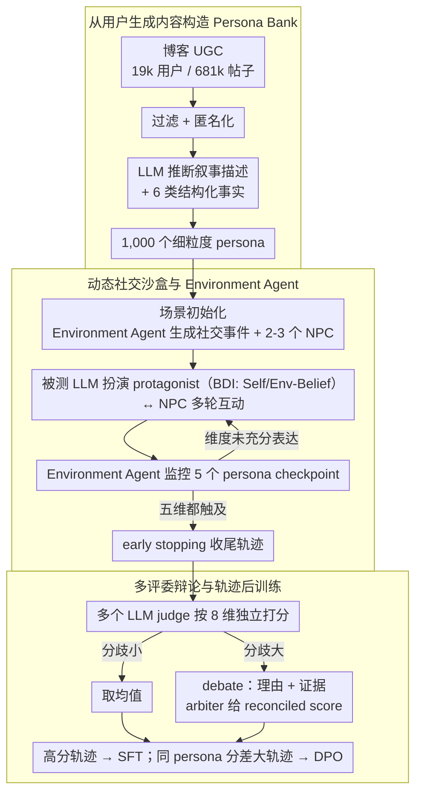

# PersonaArena: Dynamic Simulation for Evaluating and Enhancing Persona-Level Role-Playing in Large Language Models

**会议**: ACL2026 Findings  
**arXiv**: [2605.17044](https://arxiv.org/abs/2605.17044)  
**代码**: https://aka.ms/personaarena  
**领域**: LLM 角色扮演评估 / Persona-level Simulation  
**关键词**: 角色扮演、Persona 评估、多智能体仿真、LLM-as-Judge、DPO

## 一句话总结
PersonaArena 用真实用户生成内容构造 1,000 个细粒度 persona，并通过动态社交仿真与多评委辩论来评估和增强 LLM 的 persona-level 角色扮演能力。

## 研究背景与动机
**领域现状**：LLM 越来越多地被用作社交伴侣、虚拟角色和社会仿真 agent。角色扮演能力不仅要求模型知道角色设定，还要在多轮互动中保持行为一致、情绪真实，并能随着场景变化做出符合 persona 的反应。

**现有痛点**：大量角色扮演研究集中在小说、影视、名人等 character-level 设定。这些角色往往存在于大众文化中，模型可能只是背诵常识或模仿夸张台词。Persona-level 研究则更关注普通人的职业、经历、价值观和社交行为，但现有评估常停留在静态问答或表面指标，难以观察真实社交场景中的长期一致性。

**核心矛盾**：persona 表达本质上发生在动态互动中，而主流评估常把它压缩成单轮问答或身份识别。模型能回答“我是谁”不代表它能在复杂社交事件里持续像这个人一样行动。

**本文目标**：作者希望构建一个动态仿真框架，在可控但真实感较强的多智能体社交环境中，引出模型的 persona 行为轨迹，并用更稳健的多评委机制评价 fidelity、coherence、adaptability 等维度。

**切入角度**：论文观察到博客等用户生成内容天然包含个人经历、价值观和社交表达，于是从 Blog Authorship 数据中抽取 persona bank，再让被测 LLM 作为 protagonist 与 NPC 和环境互动。

**核心 idea**：用动态社交仿真替代静态 persona 问答，并把高质量仿真轨迹反过来作为 SFT/DPO 数据增强模型角色扮演能力。

## 方法详解
PersonaArena 同时是评测框架和数据生成框架。它先把普通人的长期文本内容转成 persona card，再把 persona 放进动态场景中，让被测模型扮演主角。系统记录整个交互轨迹，最后由多个 LLM judge 独立评分，必要时通过 debate-based arbitration 合并分歧。

### 整体框架
每个场景由 $A=(P,S,E)$ 组成，其中 $P$ 是 persona 集合，$S$ 是交互场景，$E$ 是评估引擎。流程分为三阶段：场景初始化、沙盒社交仿真、多评委评估。

场景初始化时，Environment Agent 根据目标 persona 生成现实社交事件、时间地点、主角和 2 到 3 个 NPC。仿真阶段中，被测 LLM 控制 protagonist，NPC 和 Environment Agent 由固定强模型控制，以保证不同被测模型面对相同互动条件。评估阶段中，多个 LLM judge 对完整轨迹按 8 个维度打分，并在分歧较大时由 arbiter 汇总论据和证据给出最终分。

### 关键设计

**1. 从用户生成内容构造 Persona Bank：用真人长期文本换掉手写人设**

手写或虚构名人的人设往往只有姓名、职业这类标签，模型容易靠常识背诵或夸张模仿蒙混过去，看不出它在日常社交里是否真像那个人。PersonaArena 转而从超过 19k 用户、681k 篇博客帖子里取材：先过滤并匿名化私人信息，再用 LLM 从这些长期文本里推断出 narrative description 和结构化事实，覆盖 demographic、occupation、personality traits、values、interests、experiences 六类维度，最终沉淀成 1,000 个独特 persona 的语料。这样得到的 persona 不是一串标签，而是由真实经历、价值观、兴趣和情绪模式共同撑起来的一个人，更适合用来检验「日常社交真实性」而非「名人台词复述」。

**2. 动态社交沙盒与 Environment Agent：让 persona 在多轮互动里被自然引出，而不是被静态问答逼问**

persona 的表达本质发生在动态互动中，可主流评估常把它压成单轮问答或身份识别，模型答得出「我是谁」并不代表它能在一连串社交事件里持续像这个人一样行动。PersonaArena 的解法是把 persona 放进沙盒：被测 LLM 扮演的 protagonist 采用 BDI 风格的目标条件推理，维护 Self-Belief 和 Env-Belief，NPC 则保持固定 self-belief、只根据主角行为更新对环境的理解。串起整场的是 Environment Agent，它负责 interaction analysis、adaptive turn control、character state update 和 environment update，并实时监控 Background、Personality、Values、Interests、Experiences 五个 checkpoint。

这套 checkpoint 设计的妙处在于评估不再盲跑固定轮数：环境控制器看哪些 persona 维度还没被充分表达就把场景往那个方向推，表达够了就收，从而在覆盖度和效率之间取得平衡，避免轨迹要么太短没暴露出问题、要么冗长烧钱。

**3. 多评委辩论与轨迹后训练：既压住单评委的标尺偏差，又把评估轨迹回收成训练信号**

单个 LLM judge 各有各的松紧——案例分析里 DeepSeek-R1 偏宽、Qwen3-32B 和 GPT-4o 偏保守，只靠一个 judge 打分很容易系统性偏高或偏低。PersonaArena 让多个 judge 各自对 8 个维度打分后取均值；一旦分歧较大，就要求每个 judge 交出评分、理由和证据片段，再由一个 referee/arbiter 汇总论据、生成统一 rationale 和 reconciled score，把争议显式摆出来而不是简单投票。更进一步，这些被打过分的轨迹本身就是高质量数据：高分完整轨迹可以拆成 SFT 样本，同一 persona 下不同模型生成的轨迹可以配成 DPO preference pairs，于是「评估」和「数据生成」在同一个框架里闭环。

### 一个完整示例：一条社交轨迹怎么跑完

以一个目标 persona（比如一名中年护士）为例：场景初始化时 Environment Agent 据其背景生成一桩现实社交事件、时间地点，以及 2–3 个 NPC；仿真开始后，被测 LLM 扮演这位护士（protagonist），在自己的 Self-Belief/Env-Belief 驱动下与由固定强模型控制的 NPC 来回互动，Environment Agent 一边分析每轮交互、一边盯着 Background、Personality、Values、Interests、Experiences 五个 checkpoint 是否都被触及——若 Values 维度迟迟没暴露，它会把事件往涉及价值取舍的方向调整，直到五个维度都表达充分才触发 early stopping 收尾。整段交互轨迹随后交给多个 LLM judge 按 8 维独立打分，分歧小就取均值，分歧大就进入 debate 由 arbiter 给出 reconciled score。这条轨迹如果评分很高，就会被拆进 SFT 训练集；如果它和另一模型在同一护士 persona 下的轨迹分差很大，这一对就被收进 DPO preference pairs。

### 损失函数 / 训练策略
PersonaArena 的主框架是评估，不直接训练一个新模型。增强实验中，作者选 Qwen3-8B 做后训练：SFT 阶段从评分最高的 50 条完整轨迹拆出 1,228 个行为级训练实例；DPO 阶段从同 persona 下不同模型生成的轨迹中选择分差最大的 50 对，拆成 665 个 preference pairs。SFT 让模型模仿高质量行为，DPO 进一步学习高低质量轨迹之间的隐式偏好差异。

## 实验关键数据

### 主实验
| 模型 | Average Score | 观察 |
|------|---------------|------|
| GPT-5.1 | 3.963±0.04 | 总体最高，AD/BC/IR 等维度领先 |
| GPT-4.1 | 3.948±0.14 | 接近 GPT-5.1，多个维度强 |
| Deepseek-V3.2 | 3.902±0.05 | 开源模型中最强 |
| Qwen3-32B | 3.811±0.06 | Qwen3 系列最佳，显示随规模增长趋势 |
| Mistral-small3.2 | 3.753±0.11 | 中等强度开放模型表现稳定 |
| Qwen3-8B | 3.363±0.04 | 后续被选为 SFT/DPO 增强对象 |

### 消融实验
| 分析项 | 结果 | 说明 |
|--------|------|------|
| 多评委与人工相关 | Multi-judge Overall 0.683；Qwen3-32B 0.669；Mistral-small3.2 0.484；DeepSeek-R1 0.330 | 多评委整体最接近人类评分 |
| SFT 增强 Qwen3-8B | 平均提升约 21.96%；IR +32.07%，BA +30.17%，BC +27.86% | 高质量轨迹模仿显著增强互动丰富度和行为一致性 |
| DPO 增强 Qwen3-8B | 相对 base 平均提升约 27.83%；相对 SFT 再提升 5.21%，IR +15.71%，AD +14.67% | preference optimization 更能捕捉隐式行为偏好 |
| 外部 PersonaGym | Qwen3-8B 3.66；SFT 3.88；DPO 4.09；GPT-4.1 4.28 | 增强收益可迁移到外部 persona benchmark |
| 外部 RoleBench | Qwen3-8B 0.0%；SFT 28.6%；DPO 37.1%；GPT-4.1 34.3% | DPO 版本在 GPT-4-based win rate 上略高于 GPT-4.1 |

### 关键发现
- PersonaArena 的模型排名大体符合直觉：GPT-5.1 和 GPT-4.1 领先，Deepseek-V3.2 是最强开放模型，Qwen3 系列从 1.7B 到 32B 大体随规模提升。这说明 benchmark 至少能反映模型能力梯度。
- 多评委机制比单评委更稳。DeepSeek-R1 judge 在案例分析中偏宽，Qwen3-32B 和 GPT-4o 更保守，多评委聚合可以减少单一模型标尺偏差。
- PersonaArena 生成的数据不仅能评估，还能训练。SFT 和 DPO 都明显改善 Qwen3-8B，且 DPO 在外部 RoleBench 上达到 37.1% win rate，超过 GPT-4.1 的 34.3%。
- early stopping 有明显效率收益。附录显示启用阈值后运行时间减少 33.7% 到 56.6%，分数只降低约 0.05 到 0.12，模型相对排序不变。

## 亮点与洞察
- 这篇论文把 role-playing 评估从“角色知识测验”推向了“社交行为轨迹评估”。对于 persona-level agent，这种动态轨迹比静态问答更接近真实需求。
- Environment Agent 的 checkpoint 设计很实用。它不是盲目跑固定轮数，而是检查 persona 的五个语义维度是否已经被充分表达，从而控制评估成本。
- 多评委 debate 不只是投票，而要求 judge 给证据和 rationale。这个机制提升了可解释性，也更适合把分数作为后训练信号。
- 用评测环境产生 SFT/DPO 数据形成了闭环：先构造能暴露缺陷的场景，再把高质量轨迹用于修复缺陷。这对其他 agent benchmark 也有启发。

## 局限与展望
- 作者承认 LLM-based multi-judge 仍不能达到理想人类判断。多个自动 judge 聚合后仍可能共享训练偏见，细微的 persona fidelity 问题可能被漏判或误判。
- 论文主要处理角色忠实度和一致性，没有系统讨论某些危险、反社会或有害角色的伦理边界。实际部署中，模型是否应该扮演某些 persona 需要单独治理。
- Persona bank 来自公开用户生成内容，虽然做了匿名化，但仍可能继承平台人口结构、写作风格和主题分布偏差。
- 当前每次 benchmark run 只随机采样 10 个 persona，虽然有助于成本控制，但对罕见 persona 类型和长尾社交情境的覆盖还可以更强。

## 相关工作与启发
- **vs Character-level benchmarks**: RoleBench、CharacterEval、CharacterBox 等关注文学、影视或名人角色；PersonaArena 关注普通人的 persona-level 行为，更适合评估日常社交仿真。
- **vs Persona-Chat / Synthetic-Persona-Chat**: 这些数据集常以静态或半静态对话为主；PersonaArena 强调环境变化、NPC 反应和多轮因果轨迹。
- **vs LLM-as-Judge 单评委**: 单评委容易带有模型家族偏差和评分尺度偏差；PersonaArena 通过多评委和 arbiter 把争议显式化。
- **启发**: 对 agent 评估来说，benchmark 最有价值的部分可能不是单个分数，而是能生成可训练失败案例的环境。PersonaArena 展示了“评估即数据生成”的路线。

## 评分
- 新颖性: ⭐⭐⭐⭐ 动态 persona-level 社交仿真和多评委 debate 的组合很有新意，虽借鉴了已有虚拟世界和 LLM judge 思路。
- 实验充分度: ⭐⭐⭐⭐ 包含多模型评测、人工相关性、后训练、外部 benchmark 和稳健性附录；persona 采样规模仍可扩大。
- 写作质量: ⭐⭐⭐⭐ 框架描述清晰，附录丰富；个别实现细节和成本信息分散在附录中。
- 价值: ⭐⭐⭐⭐⭐ 对角色扮演 agent、社会仿真和 agent 后训练数据构造都很有实用价值。

<!-- RELATED:START -->

## 相关论文

- [\[ICLR 2026\] Enhancing Persona Following at Decoding Time via Dynamic Importance-Guided Token Estimation for Role-Playing Agents](../../ICLR2026/llm_nlp/enhancing_persona_following_at_decoding_time_via_dynamic_importance-guided_token.md)
- [\[ACL 2025\] Beyond Profile: From Surface-Level Facts to Deep Persona Simulation in LLMs](../../ACL2025/llm_nlp/beyond_profile_from_surface-level_facts_to_deep_persona_simulation_in_llms.md)
- [\[ACL 2026\] From Static Inference to Dynamic Interaction: A Survey of Streaming Large Language Models](from_static_inference_to_dynamic_interaction_a_survey_of_streaming_large_languag.md)
- [\[ACL 2025\] Beyond Dialogue: A Profile-Dialogue Alignment Framework Towards General Role-Playing Language Model](../../ACL2025/llm_nlp/beyond_dialogue_a_profile-dialogue_alignment_framework_towards_general_role-play.md)
- [\[ACL 2026\] Why Did Apple Fall: Evaluating Curiosity in Large Language Models](why_did_apple_fall_evaluating_curiosity_in_large_language_models.md)

<!-- RELATED:END -->
