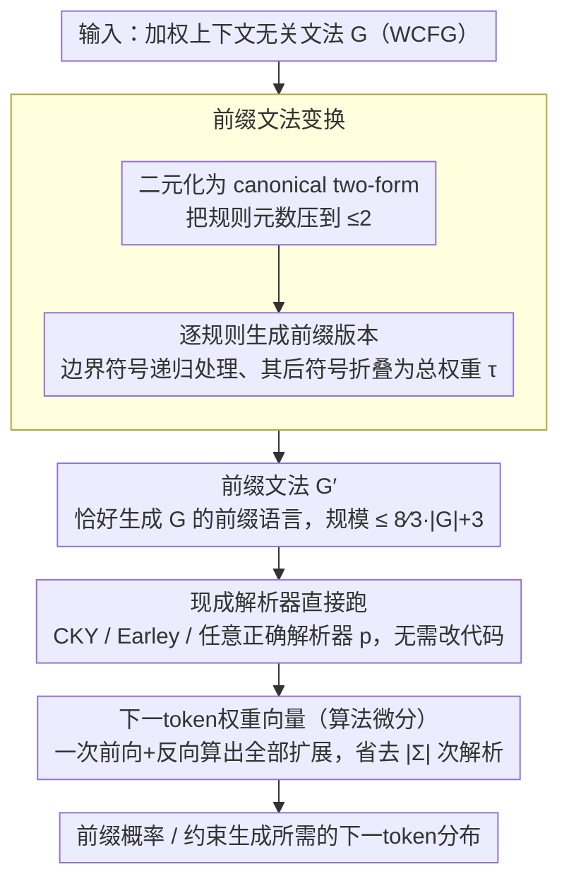

# Prefix Parsing is Just Parsing

**会议**: ACL 2026  
**arXiv**: [2604.21191](https://arxiv.org/abs/2604.21191)  
**代码**: 无  
**领域**: LLM/NLP  
**关键词**: 前缀解析, 文法变换, 上下文无关语言模型, 前缀概率, 约束生成

## 一句话总结

本文提出**前缀文法变换**（prefix grammar transformation），一种将前缀解析归约为普通解析的高效方法——给定一个文法，构造另一个恰好生成其所有前缀字符串的新文法，从而可以直接复用任何现有的普通解析算法，无需设计专用的前缀解析算法。

## 研究背景与动机

**领域现状**: 前缀解析（prefix parsing）是形式语言理论和NLP中的一个基本问题：判断一个输入前缀是否可以扩展为给定文法生成的完整字符串。在加权设定中，前缀解析还计算前缀概率，这对上下文无关语言建模、心理语言学分析和LLM的语法约束生成至关重要。

**现有痛点**: 现有的前缀解析方法通常需要设计专用算法（如修改CYK、Earley等解析器的内部逻辑），这些算法的实现复杂且难以直接利用现有的高度优化的普通解析器实现。

**核心矛盾**: 前缀解析在理论上与普通解析密切相关，但实践中却需要完全不同的实现，造成了理论优雅性与工程复杂性之间的割裂。

**本文目标**: 提供一个简单、通用、高效的框架，将前缀解析完全归约为普通解析。

**切入角度**: 通过文法变换——给定文法 $G$，构造新文法 $G'$，使得 $L(G')$ 恰好等于 $L(G)$ 的所有前缀字符串集合。

**核心idea**: 前缀解析本质上"就是"普通解析——只要对文法做正确的变换，任何普通解析算法都可以无修改地用于前缀解析。

## 方法详解

### 整体框架

整个方法围绕一个核心归约展开：把"前缀解析"这个看似需要专用算法的问题，转化为"对一个新文法做普通解析"。给定原文法 $G$，先把它二元化（binarize，转成每条规则右侧长度 ≤2 的 canonical two-form），再施加**前缀文法变换**得到前缀文法 $G'$，使 $G'$ 恰好生成 $G$ 的所有前缀字符串；此后任何现成解析器（CKY、Earley 等）无需改一行代码、直接在 $G'$ 上跑就完成了前缀解析。在此基础上，再用**算法微分**（algorithmic differentiation）一次性算出所有单token扩展的前缀权重（即下一token权重向量），支撑高效的下一token预测与约束生成。

### 关键设计

**1. 前缀文法变换（prefix grammar transformation）：把前缀解析归约为普通解析**

现有前缀解析器都绑死在某个具体算法上——Jelinek-Lafferty 改 CKY、Stolcke 改 Earley——改动复杂、又无法直接复用现成的高度优化解析器。本文的做法是不碰解析器、只改文法：对原文法每条规则 $X \xrightarrow{w} \alpha_1\cdots\alpha_K$，依据"前缀必然在某一次规则应用的产物内部结束"这一观察，对每个边界位置 $k$ 生成一条前缀规则——边界前的符号 $\alpha_1\cdots\alpha_{k-1}$ 照常解析，边界符号 $\alpha_k$ 换成带撇的新非终结符 $\alpha_k'$ 递归处理，边界后的符号 $\alpha_{k+1}\cdots\alpha_K$ 直接折叠成它们的总权重 $\tau(\cdot)$（PCFG 下 $\tau=1$）。得到的前缀文法 $G'$ 可被证明恰好生成 $G$ 的加权前缀语言（Prop. 1），于是任何正确的普通解析算法套在 $G'$ 上就是一个正确的前缀解析器（Thm. 1）。它之所以实用，关键在于先做二元化把规则元数压到 2，从而把 $G'$ 的规模锁在原文法的小常数倍内（$|G'| \le \tfrac{8}{3}|G|+3$，Prop. 2）——既不指数膨胀，串长方向的解析复杂度也原样保留（Thm. 2；实测前缀解析约比普通解析慢 2.9×，正好对应 ≈2.86× 的文法增大）。

**2. 下一token权重向量的算法微分计算**

约束生成等增量场景真正需要的，不是单个前缀的权重，而是"当前前缀后接每一个可能 token"的前缀权重向量 $\pi_a(s)=\overrightarrow{\llbracket G\rrbracket}(sa)$。最朴素的做法是对字母表 $\Sigma$ 里每个 token 各跑一次前缀解析，代价是 $|\Sigma|$ 倍。本文转而用**算法微分**：把前缀权重的计算看作一张计算图、对它做一次反向传播（与经典的 outside 算法密切相关），就能同时得到所有单token扩展的权重。这样下一token权重向量的渐进复杂度与"只前缀解析一次"持平，实测仅慢约 1.2×（远低于 meta-theorem 给出的 4× 上界，Thm. 3），把 $|\Sigma|$ 倍的开销彻底抹掉。

## 实验关键数据

### 主实验

| 评估方面 | 结果 |
|---|---|
| 正确性验证 | 变换后文法与原文法的前缀语言完全一致 |
| 文法大小 | 变换后仅为原文法的小常数倍 |
| 兼容性 | 可直接使用任何标准解析算法 |

### 消融实验

| 组件 | 效果 |
|---|---|
| 文法变换 vs 专用前缀解析算法 | 同等正确性，更简单的实现 |
| 算法微分 vs 逐token枚举 | 显著效率提升 |

### 关键发现

1. **理论上优雅**: 前缀解析可以完全归约为普通解析，不损失任何信息
2. **实践上高效**: 文法大小仅增长常数倍，不引入不可接受的开销
3. **工程上简化**: 消除了设计和维护专用前缀解析器的需要
4. **应用前景广**: 对LLM的语法约束生成（constrained decoding）直接有用

## 亮点与洞察

1. **概念简洁性**: "前缀解析就是普通解析"这一核心洞察极其简洁，将看似不同的两个问题统一起来
2. **理论与实践的完美结合**: 不仅在理论上提供了优雅的归约，还通过大小保证确保了实际可用性
3. **对约束生成的直接价值**: LLM约束解码需要实时判断哪些token可以合法扩展当前前缀，本文方法可以直接加速这一过程
4. **算法微分的巧妙应用**: 将微分方法引入形式语言/解析领域，实现了下一token权重的高效批量计算

## 局限与展望

1. **仅限上下文无关文法**: 对更强大的文法形式（如上下文相关文法）的适用性未讨论
2. **实际基准测试有限**: 论文主要是理论贡献，大规模实际应用场景的性能评估不够充分
3. **与现有约束解码系统的集成**: 未展示与实际LLM约束生成系统（如Outlines、Guidance等）的端到端集成效果
4. **常数因子的实际影响**: 虽然文法仅增长常数倍，但在超大文法上这个常数的实际影响值得关注
5. **HTML不可用导致全文细节受限**: 本笔记基于摘要和方法概述，具体定理证明和实验细节有待后续补充

## 相关工作与启发

1. **Earley Parser**: 经典的前缀解析算法，通过内部修改支持前缀处理，本文的方法可以消除这种修改需求
2. **CYK Algorithm**: 标准的CFG解析算法，可以直接在变换后的文法上运行以实现前缀解析
3. **Constrained Decoding (Outlines等)**: LLM约束生成系统需要高效前缀解析，本文为其提供了理论基础
4. **Algorithmic Differentiation**: 本文将其引入前缀解析场景，用于高效计算下一token权重

## 评分

- **新颖性**: ⭐⭐⭐⭐⭐ — 核心洞察极其优雅，将两个看似不同的问题统一为一个
- **实验充分度**: ⭐⭐⭐ — 以理论贡献为主，实验验证相对有限（基于可获取内容判断）
- **写作质量**: ⭐⭐⭐⭐ — 标题即点题，核心思想表达清晰
- **价值**: ⭐⭐⭐⭐ — 对形式语言理论和LLM约束生成都有重要价值，简化了工程实现

<!-- RELATED:START -->

## 相关论文

- [\[ACL 2025\] Dolphin: Document Image Parsing via Heterogeneous Anchor Prompting](../../ACL2025/llm_nlp/dolphin_document_image_parsing_via_heterogeneous_anchor_prompting.md)
- [\[ACL 2025\] STEM-PoM: Evaluating Language Models Math-Symbol Reasoning in Document Parsing](../../ACL2025/llm_nlp/stem-pom_evaluating_language_models_math-symbol_reasoning_in_document_parsing.md)
- [\[ACL 2026\] 等等，还有出路：一个对话脱轨预测的决策机制](wait_theres_a_way_out_a_decision_mechanism_for_forecasting_conversational_derail.md)
- [\[ACL 2025\] Is It JUST Semantics? A Case Study of Discourse Particle Understanding in LLMs](../../ACL2025/llm_nlp/is_it_just_semantics_a_case_study_of_discourse_particle_understanding_in_llms.md)
- [\[ACL 2026\] Can AI Be a Good Peer Reviewer? A Survey of Peer Review Process, Evaluation, and the Future](can_ai_be_a_good_peer_reviewer_a_survey_of_peer_review_process_evaluation_and_th.md)

<!-- RELATED:END -->
