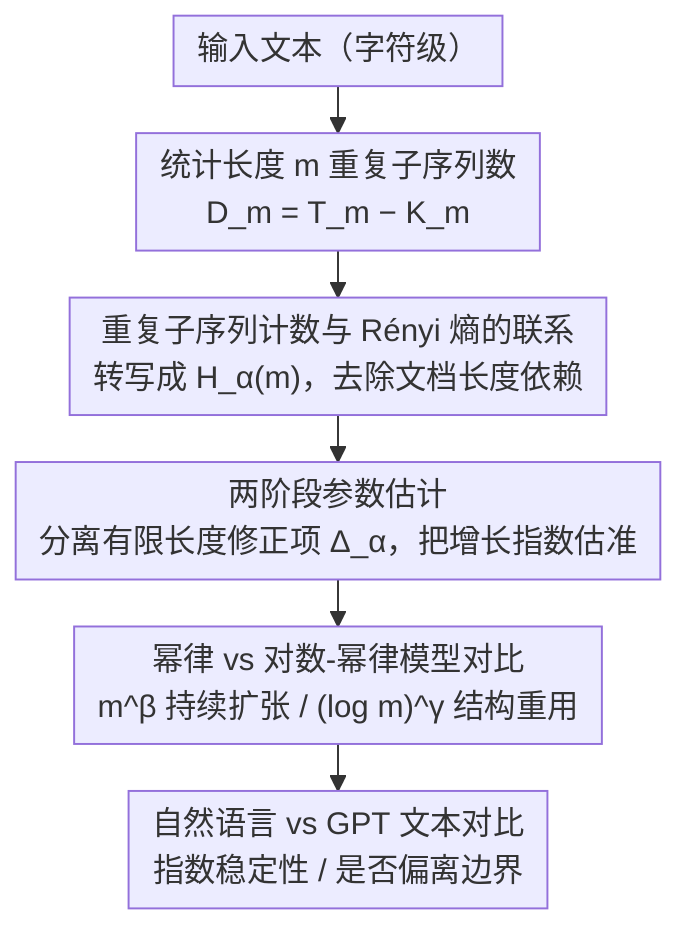

<!-- 由 src/gen_stubs.py 自动生成 -->
# Repeated Sequences Reveal Gaps between Large Language Models and Natural Language

**会议**: ACL 2026  
**arXiv**: [2605.24850](https://arxiv.org/abs/2605.24850)  
**代码**: 无  
**领域**: LLM/NLP  
**关键词**: 重复子序列, Rényi熵, LLM评估, 长程结构, 熵增长分析

## 一句话总结
本文提出基于重复子序列分布的评估框架，通过高阶 Rényi 熵刻画文本的熵增长行为，发现自然语言呈现稳定的次线性熵增长模式，而 GPT 生成文本的熵指数随模型规模单调增大，揭示了 LLM 在长程统计组织上与自然语言的系统性差异。

## 研究背景与动机
**领域现状**: LLM 在各类任务 benchmark 上表现优异，但评估主要依赖任务性能或短上下文行为，对生成文本的长程统计结构缺乏系统分析。

**现有痛点**: 现有评估方法无法判断 LLM 是否真正捕获了自然语言在大尺度上的结构组织——高 benchmark 分数不意味着生成文本具有人类文本的长程统计特性。已有研究发现 LLM 存在过度重复和多样性下降等问题。

**核心矛盾**: 自然语言中的表达不是孤立使用的，而是通过重复引用和重组形成跨长距离的参考结构；LLM 在 next-token prediction 目标下是否能重现这种结构尚不清楚。

**本文目标**: 提出一个基于重复子序列分布的定量诊断工具，以区分自然语言和 LLM 输出在长程组织上的差异。

**切入角度**: 将重复作为分布特性跨尺度分析，而非仅关注极端重复或生成退化现象。

**核心 idea**: 重复子序列的数量与高阶 Rényi 熵存在深层联系，通过拟合熵增长的幂律 vs 对数-幂律模型可以揭示文本的结构重用特性。

## 方法详解

### 整体框架
方法分为三步：(1) 统计文本中长度为 $m$ 的重复子序列数 $D_m = T_m - K_m$（总块数减去不同块数）；(2) 将 $D_m$ 与高阶 Rényi 熵 $H_\alpha(m)$ 关联，推导其渐近展开形式，并用两阶段估计分离有限长度修正项、把熵增长指数估准；(3) 对 $H_\alpha(m)$ 分别拟合幂律模型（$\propto m^\beta$）和对数-幂律模型（$\propto (\log m)^\gamma$），比较自然语言与 GPT 文本的差异。

### 关键设计

**1. 重复子序列计数与 Rényi 熵的联系：把可数的重复统计量翻译成信息论量**

直接拿长度 $m$ 的重复子序列数 $D_m$ 来比较不同文本并不公平，因为 $D_m$ 受文档总长度影响很大，长文本天然重复更多。论文的桥梁是：$D_m$ 的期望可以展开成 $\sum p_w^\alpha$（$\alpha \geq 2$）这类幂和级数，而这恰好就是 Rényi 熵 $H_\alpha(m) = \frac{1}{1-\alpha}\log_2 \sum p_w^\alpha$ 的核心成分。于是把可观测的重复计数转写成 $H_\alpha(m)$ 之后，就得到了一个与文档长度无关的结构特征，不同长度、不同来源的文本才能放在同一把尺子上比较。

**2. 两阶段参数估计：在有限长度文本上把熵增长指数估准**

真实文本长度有限，直接从不同块数 $K_m$ 或 $H_\alpha(m)$ 去拟合增长指数，会被有限长度效应带偏、结果很不稳定。作者改成两步走：先从 $D_m/T_m$ 的函数关系估计 $\lambda_m = T_m/S_m$，再去拟合 $\log_2 S_m = H_\alpha(m) + \Delta_\alpha$，其中 $\Delta_\alpha$ 是一个依赖 $\lambda_m$ 的有限长度修正项。把修正项显式分离出来后，指数估计的可靠性明显提高，这也是该方法能在几万字符量级文本上稳定工作的前提。

**3. 幂律 vs 对数-幂律模型对比：区分两种本质不同的信息累积方式**

熵随 $m$ 怎么涨，对应着文本组织信息的两种不同机制。幂律 $G(m) \propto m^\beta$ 意味着结构自由度持续扩张，文本不断引入新信息；对数-幂律 $G(m) \propto (\log m)^\gamma$ 则意味着强烈的结构重用，文本主要靠重组和再索引来共享已有资源。论文对 $H_\alpha(m)$ 同时拟合这两个模型并比较拟合优度，用意是判断自然语言到底落在哪一侧——它很可能正处在两种机制的边界上，而 GPT 文本是否偏离这条边界，正是后面实验要回答的问题。

### 损失函数 / 训练策略
本文为纯分析方法，无训练过程。所有分析在字符级别进行以避免分词器偏差，使用 $R^2$ 决定系数和 Welch t-检验评估拟合质量和组间差异显著性。

## 实验关键数据

### 数据集规模
| 数据集 | 数量 | 平均长度（字符） |
|--------|------|-----------------|
| gpt-3.5turbo | 100 | 35,045 ± 2,287 |
| gpt-4o-mini | 100 | 110,889 ± 23,379 |
| gpt-5-mini | 100 | 347,045 ± 19,793 |
| gpt-5 | 100 | 601,187 ± 24,973 |
| nl（匹配各 GPT 长度） | 各100 | 对应匹配 |

### 核心统计检验结果
| 对比 | $\beta$ 差异 | $\gamma$ 差异 | p 值 |
|------|-------------|-------------|------|
| gpt-5 vs nl-5 | GPT 显著更大 | GPT 显著更大 | ≈0 |
| gpt-5-mini vs nl-5-mini | GPT 显著更大 | GPT 显著更大 | ≈0 |
| nl-5 vs nl-5-mini | 无显著差异 | 无显著差异 | β: 0.12, γ: 0.94 |

### 关键发现
- 自然语言的熵增长指数 $\beta$ 和 $\gamma$ 在不同长度数据集间保持稳定（弱普适性），而 GPT 文本的指数随模型规模单调增加
- 对数-幂律模型在长文本中普遍优于幂律模型（$R^2 > 0.97$ vs 0.90-0.96），表明自然语言以结构重用为主导
- 短文本倾向幂律拟合（持续引入新信息），长文本倾向对数-幂律拟合（结构重用增强）
- 传统极大重复子序列方法在 gpt-5 上与自然语言几乎不可区分（$\eta$ 均值接近），但本文方法仍能检测到显著差异

## 亮点与洞察
- 从信息论基本原理出发提出了全新的 LLM 评估维度，不依赖任何下游任务
- 重复子序列→Rényi 熵的推导简洁优美，有限长度修正处理严谨
- 发现自然语言的"弱普适性"——个体文本差异大但总体指数稳定，这是一个有趣的统计规律
- 对 Shakespeare 全集的分析（n=5,442,126 字符）展示了极端长文本下对数-幂律行为的显著性

## 局限与展望
- 仅分析 GPT 系列模型，对其他架构（如 Llama/Claude）的适用性有待验证
- 分析在字符级进行，未直接关联词级或句法级的语言结构
- 方法为描述性分析，不能识别导致差异的具体机制
- 需要较长的文本（数万字符以上）才能获得可靠的拟合，短文本场景受限
- 未直接估计熵率 $h_\alpha$，无法判断自然语言的熵率是否为零

## 相关工作与启发
- **Hilberg (1990)**: 提出自然语言块熵的次线性幂律增长猜想，本文进一步区分了幂律与对数-幂律两种机制
- **Dębowski (2015)**: 基于极大重复子序列的分析，本文表明分布方法比极端统计量更稳定、更有区分力
- **Holtzman et al. (2020)**: 关注 LLM 的重复退化现象，本文将重复从"问题"重新定位为"结构信号"
- 启发：评估 LLM 不应仅看任务分数，还应检验其输出是否具备自然语言的内在统计结构

## 评分
- 新颖性: ⭐⭐⭐⭐⭐ 全新的评估视角，将信息论与 LLM 评估深度结合
- 实验充分度: ⭐⭐⭐⭐ 数据集设计合理（长度匹配），统计检验严谨，但仅限 GPT 家族
- 写作质量: ⭐⭐⭐⭐⭐ 理论推导严谨，行文流畅，图表设计精良
- 价值: ⭐⭐⭐⭐ 提供了 LLM 评估的全新工具，但实际应用场景有待拓展

<!-- RELATED:START -->

## 相关论文

- [\[ACL 2026\] Identifying the Periodicity of Information in Natural Language](identifying_the_periodicity_of_information_in_natural_language.md)
- [\[ICLR 2026\] Neural Synchrony Between Socially Interacting Language Models](../../ICLR2026/llm_nlp/neural_synchrony_between_socially_interacting_language_models.md)
- [\[ACL 2025\] PiFi: Plug-in and Fine-tuning: Bridging the Gap between Small Language Models and Large Language Models](../../ACL2025/llm_nlp/plugin_finetuning_bridge.md)
- [\[ACL 2025\] LLMs Know Their Vulnerabilities: Uncover Safety Gaps through Natural Distribution Shifts](../../ACL2025/llm_nlp/llms_know_their_vulnerabilities_uncover_safety_gaps_through_natural_distribution.md)
- [\[ACL 2026\] Adam's Law: Textual Frequency Law on Large Language Models](adam39s_law_textual_frequency_law_on_large_language_models.md)

<!-- RELATED:END -->
