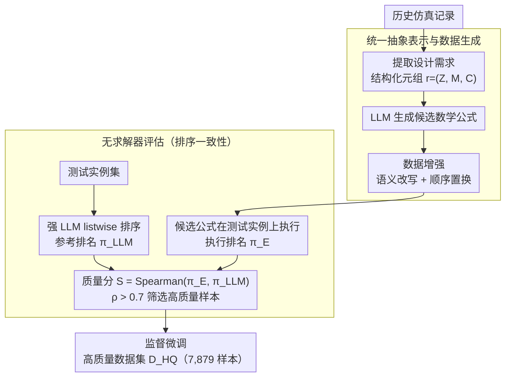

# Solver-Independent Automated Problem Formulation via LLMs for High-Cost Simulation-Driven Design

**会议**: ACL 2026 Findings  
**arXiv**: [2512.18682](https://arxiv.org/abs/2512.18682)  
**代码**: 无  
**领域**: 信号通信  
**关键词**: 自动问题建模, 高成本仿真, LLM微调, 无求解器评估, 天线设计

## 一句话总结

本文提出 APF（Automated Problem Formulation），一种与求解器无关的框架，利用 LLM 将工程师的自然语言设计需求转化为可执行的数学优化模型，通过创新的数据生成和测试实例标注管线克服高成本仿真场景下无法使用求解器反馈筛选数据的困难，在天线设计任务上显著优于现有方法。

## 研究背景与动机

**领域现状**：高成本仿真驱动设计广泛存在于天线、航空航天、微电子和机器人等领域。核心任务是优化设计参数使性能分布（如频率域辐射效率曲线）满足设计需求。由于设计需求通常以非结构化自然语言提供，将其形式化为可执行数学模型是优化的瓶颈。

**现有痛点**：(1) 基于 prompt 的方法（如 Chain-of-Experts、OptiMUS）在面对模糊或依赖领域知识的自然语言需求时，难以准确识别目标和约束；(2) 基于微调的方法（如 ORLM、LLMOPT、SIRL）虽能提升性能，但依赖求解器反馈进行数据筛选，而高成本仿真场景下求解器反馈不可获取；(3) 现有方法主要聚焦于线性规划、整数规划等运筹优化问题，与高成本仿真驱动设计场景在问题描述和评估成本上差异显著。

**核心矛盾**：微调 LLM 需要高质量训练数据，但在高成本仿真场景中，验证生成公式的正确性需要昂贵的物理仿真（如电磁全波仿真），使得大规模数据质量筛选不可行。现有微调方法依赖的求解器反馈机制在此场景下失效。

**本文目标**：开发一种不依赖求解器反馈的自动问题建模框架，能够自动生成高质量训练数据并微调 LLM，使其准确地将自然语言设计需求转化为可执行的数学优化模型。

**切入角度**：引入测试实例作为桥梁——通过 LLM 对测试实例进行排序标注，将"自然语言需求与数学公式之间的语义对齐"转化为"排序一致性问题"，从而绕过昂贵的求解器验证。

**核心 idea**：通过数据生成 + 测试实例标注 + 排序一致性评估的三阶段管线，在不调用昂贵求解器的情况下构建高质量微调数据集，使 7B/8B 开源模型达到或超越 GPT-4o 等大模型的建模精度。

## 方法详解

### 整体框架

这篇论文要解决的是高成本仿真设计里的一个尴尬：工程师的设计需求往往写成一段模糊的自然语言，要把它变成可执行的数学优化模型，传统微调方法靠求解器反馈来筛训练数据，但天线、航空这类场景做一次电磁全波仿真极贵，求解器反馈根本拿不到。APF 的整体思路是用「测试实例」当桥梁绕过求解器：先从历史仿真记录里提取真实可解的设计需求并让 LLM 生成对应数学公式，再让一个强 LLM 对一批测试实例排序得到「参考排名」，然后把生成公式在测试实例上跑出来的排名和参考排名比一致性，一致性高的样本才留下，最后在这批筛过的高质量数据上做标准 SFT。整条管线对应四个模块：数据生成、测试实例标注、数据评估与选择、监督微调。

### 关键设计

**1. 统一抽象表示与数据生成：把杂乱的工业规范标准化，再批量造数据**

工业设计需求是非结构化的自然语言，直接喂给模型既难处理也难造多样化训练数据。APF 把每个设计需求形式化成结构化元组 $r = (\mathcal{Z}, M, \mathcal{C})$：$\mathcal{Z}$ 是评估变量的子区域，$M: z \in \mathcal{Z} \to \mathbb{R}$ 是度量函数，$\mathcal{C}$ 指定设计意图（如阈值约束 $\min_{z \in \mathcal{Z}} M(z) \geq 1.5$ 或某个优化目标）。训练需求集 $\mathcal{R} = \{r_1, r_2, \ldots, r_n\}$ 直接从历史仿真记录里提取，再由 LLM 生成对应数学公式。

之所以从历史仿真而不是凭空合成，是因为这样提取出的需求天然满足物理可行性。在此基础上做两种数据增强：语义改写（同一需求生成 $v$ 个等价表述变体）让模型对多样措辞更鲁棒，顺序置换（打乱需求出现的先后）则防止模型偷懒去依赖位置这种虚假线索。

**2. 无求解器评估：用排序一致性替代昂贵的求解器验证**

直接判断「一段自然语言需求和一个数学公式是否语义对齐」在计算上做不到，而仿真验证又太贵。APF 引入一组测试实例 $\mathcal{I}$ 当桥梁：让一个强 LLM 以 listwise 策略对这些实例排序，生成参考排名 $\pi_{\text{LLM}} = \arg\max_\pi P_\theta(\pi | \mathcal{P})$，其提示由任务指令、专家示例、实例数据表、需求查询四部分拼成。生成公式的质量分数就定义为它执行出来的排名与参考排名之间的 Spearman 相关系数 $S(E) = \rho(\pi_E, \pi_{\text{LLM}})$，只有强相关（$> 0.7$）的样本才进入训练集。

关键在 listwise 而非 pairwise：让 LLM 一次性给整个列表排序只需 1 次调用，而两两比较要 105 次，效率差两个数量级；可排名质量几乎不掉（$\rho$ 为 0.8643 vs 0.8536）。这样就把无法直接量化的语义对齐问题，转成了可量化、又便宜的排序一致性比较。

**3. 对齐度量与监督微调：目标和约束分开打分，再在筛后数据上微调**

这里要区分两套打分，否则容易和设计 2 混淆：数据**筛选**（设计 2）用的是把整张 listwise 排名压成一个数的质量分 $S(E) = \rho(\pi_E, \pi_{\text{LLM}})$、卡 0.7 阈值；而**评估**一组生成公式到底好不好（论文实验里报的指标）则用更细的对齐度量 $A(E)$，把它拆成目标函数对齐和约束对齐两块加权：$A(E) = \alpha A_{\text{obj}}(E) + (1-\alpha) A_{\text{con}}(E)$。目标函数关注相对序，用 Spearman 排名相关评估 $A_{\text{obj}} = \frac{1}{n_1} \sum_{e_i \in E_{\text{obj}}} \rho(\hat{\pi}_i, \pi^*)$；约束关注绝对的可行/不可行判断，用分类准确率评估 $A_{\text{con}} = \frac{1}{n_2} \sum_{e_j \in E_{\text{con}}} (1 - \frac{1}{m} \|\hat{\mathbf{y}}_j - \mathbf{y}^*\|_1)$，取 $\alpha = 0.5$ 平衡两者——只看排序会漏掉约束判断的对错，只看约束又抓不住目标函数的序对不对。管线最后一步，就在这批筛过的高质量数据 $\mathcal{D}_{\text{HQ}}$（7,879 样本）上做标准 SFT，全程不调用任何求解器。

### 一个完整示例

拿一条天线设计需求「在 2.4–2.5 GHz 频段内辐射效率尽量高」走一遍。数据生成模块先把它写成结构化元组并让 LLM 生成一个候选数学公式（比如最大化该子区域内效率度量的均值）。评估时系统取一批已知仿真结果的测试实例（比如 5 个不同天线设计），先让强 LLM 按「谁更满足这条需求」给出参考排名，比如 $\pi_{\text{LLM}} = [3,1,5,2,4]$；再把候选公式在这 5 个实例上实际算分，得到执行排名 $\pi_E = [3,1,5,4,2]$。两者的 Spearman 相关系数约 0.9，超过 0.7 阈值，于是这条「需求—公式」样本被判为高质量而保留。若另一个候选公式把目标写反（误把效率当成要最小化），执行排名会和参考排名几乎倒过来，相关系数低于阈值就被淘汰。如此逐条筛完，最终留下的 7,879 条样本才进入 SFT。

### 损失函数 / 训练策略

在筛选后的高质量数据集 $\mathcal{D}_{\text{HQ}}$（7,879 样本）上对开源 LLM 进行标准 SFT。使用 2,300 个设计需求集，其中 300 个作为测试集（零重叠），2,000 个用于训练。选择阈值 0.7（强相关下界）。数据生成使用 GPT-4o，测试实例标注使用 GPT-5 等强力 LLM judge。

## 实验关键数据

### 主实验

**总体公式质量对比**

| 方法 | $A_{\text{obj}}$ | $A_{\text{con}}$ | $A$ (总分) |
|------|------|------|------|
| GPT-4o | 0.6055 | 0.7075 | 0.6651 |
| DeepSeek-V3 | 0.7404 | 0.7690 | 0.7518 |
| Claude-sonnet-4.5 | 0.8023 | 0.7880 | 0.7923 |
| Chain-of-Experts | 0.7426 | 0.7453 | 0.7252 |
| OptiMUS | 0.6341 | 0.6986 | 0.6687 |
| LLAMA3.1-8B (原始) | -0.0453 | 0.5029 | 0.2248 |
| **APF + LLAMA3.1-8B** | **0.8012** | **0.7969** | **0.7976** |
| **APF + Qwen2.5-7B** | 0.7990 | 0.7959 | 0.7961 |
| **APF + Mistral-7B** | 0.7974 | 0.7883 | 0.7918 |

### 消融实验

| 配置 | $A_{\text{obj}}$ | $A_{\text{con}}$ | $A$ |
|------|------|------|------|
| w/o Augmentation | 0.7656 | 0.7555 | 0.7553 |
| w/o Selection | 0.7603 | 0.7800 | 0.7653 |
| APF (完整) | **0.8009** | **0.7971** | **0.7976** |

**评估方法对比**

| 方法 | Spearman $\rho$ | LLM 调用次数 | 时间(s) | 成本($) |
|------|------|------|------|------|
| Listwise (ours) | 0.8643 | 1 | 97.66 | 0.02 |
| Pairwise | 0.8536 | 105 | 2544.8 | 0.47 |

### 关键发现

- APF 微调后 LLAMA3.1-8B 从 0.2248 提升到 0.7976（+256%），从几乎不可用变为超越 GPT-4o 和 Claude-sonnet-4.5
- 三个 7B/8B 模型在 APF 微调后表现高度一致（0.7918–0.7976），证明高质量数据的通用有效性
- LLM judge 排名与人类排名高度一致（GPT-5: $\rho = 0.8316$），验证了无求解器评估的可靠性
- Listwise 评估与 pairwise 排名质量相当但效率高 26 倍、成本低 23 倍
- 选择阈值在 0.6–0.8 范围内性能高度稳定，框架对超参数不敏感
- 在实际天线设计中，APF 生成的优化模型驱动的设计满足所有频段需求，而其他方法在通带和高辐射零点上失败

## 亮点与洞察

- "测试实例作为桥梁"的思路巧妙地将语义对齐问题转化为可量化的排序一致性问题，绕过了昂贵的求解器验证
- Listwise vs pairwise 的效率对比令人印象深刻：相当的质量、26 倍的速度提升、23 倍的成本降低
- 证明了在领域特定任务上，高质量数据+小模型可以媲美甚至超越通用大模型的 zero-shot 能力
- 从历史仿真记录中提取需求确保了物理可行性，这一数据驱动的方法比随机合成更可靠

## 局限与展望

- 目前仅在天线设计上验证，需要在空气动力学、结构优化等更多工程领域验证跨领域泛化性
- 无求解器评估依赖构建带有详细测试实例的 prompt，受限于 LLM 的上下文窗口
- 数据生成依赖 GPT-4o 等强力模型，引入了额外成本和质量依赖
- 仅验证了 7B/8B 规模模型，更大或更小模型的效果未探索

## 相关工作与启发

- **vs Chain-of-Experts/OptiMUS (Prompt-based)**: 提示方法在模糊需求上精度不足（A: 0.6687–0.7252），APF 通过微调实现更准确的需求理解（A: 0.7976）
- **vs ORLM/SIRL (Fine-tuning-based)**: 这些方法依赖求解器反馈筛选数据，在高成本仿真场景下不可行；APF 通过 LLM 排名替代求解器实现无求解器评估
- **vs GPT-4o/DeepSeek-V3 (Zero-shot)**: 7B 微调模型超越了这些大模型的零样本表现，展示了领域微调的巨大价值

## 评分

- 新颖性: ⭐⭐⭐⭐ 测试实例桥梁和无求解器评估的思路新颖，将语义对齐转化为排序一致性
- 实验充分度: ⭐⭐⭐ 天线设计案例验证充分，但仅单一领域，消融和灵敏度分析完整
- 写作质量: ⭐⭐⭐⭐ 框架描述清晰，方法动机明确，图表专业
- 价值: ⭐⭐⭐⭐ 为高成本仿真领域的自动化建模提供了实用框架，工业应用前景广阔

<!-- RELATED:START -->

## 相关论文

- [\[ICLR 2026\] Rethinking Code Similarity for Automated Algorithm Design with LLMs](../../ICLR2026/llm_nlp/rethinking_code_similarity_for_automated_algorithm_design_with_llms.md)
- [\[ACL 2026\] Generative Floor Plan Design with LLMs via Reinforcement Learning with Verifiable Rewards](generative_floor_plan_design_with_llms_via_reinforcement_learning_with_verifiabl.md)
- [\[ACL 2025\] Achieving Certification-by-Design Through Model-Driven Development](../../ACL2025/llm_nlp/achieving_certification-by-design_through_model-driven_development.md)
- [\[ACL 2025\] Zero-Shot Belief: A Hard Problem for LLMs](../../ACL2025/llm_nlp/zero-shot_belief_a_hard_problem_for_llms.md)
- [\[ICML 2026\] Automated Formal Proofs of Combinatorial Identities via Wilf–Zeilberger Guidance and LLMs](../../ICML2026/llm_nlp/automated_formal_proofs_of_combinatorial_identities_via_wilf-zeilberger_guidance.md)

<!-- RELATED:END -->
