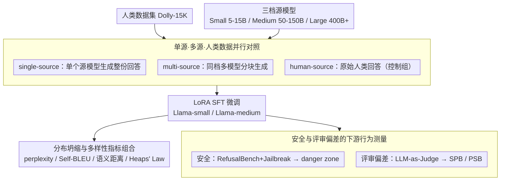

# Synthetic Eggs in Many Baskets: The Impact of Synthetic Data Diversity on LLM Fine-Tuning

**会议**: ACL 2026 Findings  
**arXiv**: [2511.01490](https://arxiv.org/abs/2511.01490)  
**代码**: https://github.com/maxschaffelder/synthetic_data_diversity  
**领域**: LLM / 合成数据 / 模型安全  
**关键词**: 合成数据多样性, 模型坍缩, LoRA 微调, 越狱鲁棒性, Self-preference bias

## 一句话总结
这篇论文系统比较了单一模型、多模型和人类数据作为监督微调来源时对 Llama 模型的影响，发现多源合成数据能缓解分布坍缩和自偏好，但合成数据也可能在保留输出质量的同时削弱安全护栏，且风险会随源模型规模和混合方式发生复杂变化。

## 研究背景与动机
**领域现状**：随着高质量人工文本越来越稀缺，合成数据已经进入预训练、指令微调和对齐流程。很多工作关心合成数据能不能提升 benchmark 分数，但对它如何改变模型输出分布、安全鲁棒性和 LLM-as-Judge 偏差的分析还不充分。

**现有痛点**：合成数据训练可能导致所谓 model collapse，也就是模型输出越来越像已有模型，词汇和句法多样性下降，对人类文本的建模能力变差。与此同时，微调即使使用看似无害的数据，也可能破坏原本的拒答和安全策略；如果合成数据生成的有害回答仍然流畅、可执行，风险比低质量输出更高。

**核心矛盾**：合成数据一方面是低成本扩展训练集的现实选择，另一方面又可能把源模型的分布窄化、偏好和安全缺陷传给目标模型。真正的问题不是“能不能用合成数据”，而是“合成数据应该来自一个模型还是多个模型，源模型规模又会如何改变后果”。

**本文目标**：作者希望拆开合成数据来源多样性的影响，考察它对三件事的作用：输出分布是否坍缩、模型对越狱攻击是否更脆弱、作为评审模型时是否更偏爱自己或合成文本。

**切入角度**：论文选择 Llama-3.1 8B 和 70B 作为目标模型，用 Dolly-15K 作为基础任务集合，分别构造 single-source、multi-source 和 human-source 微调数据。这样可以直接比较“同样是监督微调，数据来源组成不同”带来的行为差异。

**核心 idea**：把合成数据多样性作为一个可控实验变量，观察它在分布、多样性、安全和评审偏差上的连锁影响，而不是只看下游任务准确率。

## 方法详解
论文的方法是一个精心设计的对照实验。它先用不同规模和不同家族的 LLM 为 Dolly-15K 生成合成回答，再用这些数据微调 Llama 目标模型，最后用三组评测去观察模型行为：分布坍缩指标、越狱安全指标、LLM-as-Judge 偏差指标。

### 整体框架
输入是一份人类回答数据集 Databricks-Dolly-15K，以及三档源模型：Small 约 5-15B，Medium 约 50-150B，Large 约 400B+ 或闭源大模型。输出是一组经过 LoRA SFT 微调的 Llama-small / Llama-medium 模型，每个模型对应不同数据来源条件。

实验分为三条主线。第一条主线测合成数据对输出分布的影响，使用 perplexity、Self-BLEU 反向指标、语义距离和 Heaps' Law 词汇增长。第二条主线测安全，使用 RefusalBench 和 RefusalBench+Jailbreak，分别评估 harmfulness 与 response quality。第三条主线测判断偏差，让微调后的 Llama 作为 judge 对 CNN/DailyMail 摘要做 pairwise ranking，计算 self-preference bias 和 pro-synthetic bias。

### 关键设计

**1. 单源、多源和人类数据的并行对照：把「数据来源多样性」做成可控变量**

如果只比「合成 vs 人类」，根本分不清问题到底来自合成数据本身，还是来自单一源模型的风格窄化。论文于是设了三组并行条件：single-source 用一个 Llama 源模型生成整份 Dolly 数据集的回答；multi-source 把数据切成多个子集，由同一规模档里的多个非目标模型分别生成，同时保留一个由目标模型生成的子集；human-source 直接用原始 Dolly 的人类回答当控制组。所有生成统一用 temperature=0.7、top_p=0.9、max_output_tokens=1024。把 single-source 和 multi-source 拆开之后，就能直接看出「多模型混合」是否真的缓解了分布坍缩。

**2. 分布坍缩与多样性指标组合：从多个角度量输出有没有变窄，而不只看任务分数**

model collapse 不一定表现为语义完全重复，可能先体现在词汇增长变慢、模型对人类文本的困惑度变高。只用一个 perplexity 容易解释过度，所以论文叠了四个指标：用目标模型对不同来源文本算 perplexity；用 $100 \cdot (1-\text{Self-BLEU})$ 衡量词汇多样性；用 SentenceBERT 句向量的平均 pairwise cosine distance 衡量语义多样性；再用 Heaps' Law 的 $V(n)=K\cdot n^\beta$ 拟合词汇量随语料增长的速度。结果上，人类文本的平均 lexical diversity 为 89.15，高于合成文本的 79.60，词汇增长也明显更快——这说明窄化主要发生在词汇和表述层面，靠多指标组合才能把它从「语义看着没怎么变」的假象里揪出来。

**3. 安全与评审偏差的下游行为测量：检验分布变化会不会转成真实风险**

分布变窄本身是中性的，关键是它会不会变成安全隐患或评审偏见。安全实验把 RefusalBench 与 jailbreak prompt 组合成 RB+J，用 Llama-3.1-70B-Instruct 当 judge 分别给 harmfulness 和 quality 打分，并把 harmfulness 和 quality 都大于等于 4 的输出定义为「danger zone」。评审偏差实验则让微调后的模型去比较不同模型和人类的摘要，算两个偏置：自偏好 $\text{SPB}=S_{target}-\overline{S}_{other}$ 和偏向合成 $\text{PSB}=\overline{S}_{synthetic}-S_{human}$。之所以要把质量和有害性组合着看，是因为「输出有害但胡言乱语」和「输出有害且高质量、可操作」是完全不同的风险级别，单看拒答率会把后者这种更危险的情况漏掉。

### 损失函数 / 训练策略
本文使用 LoRA 监督微调，不提出新损失。Llama-3.1 8B 与 70B 目标模型在 H100 上以 16-bit 精度训练，LoRA rank 为 16，$\alpha=32$，每条样本最大 1024 token，训练 3 个 epoch，学习率 5e-5，AdamW 优化器，3% warmup，cosine decay，weight decay 为 0.01。实验重点不是训练技巧，而是保持训练设置相对固定，让数据来源成为主要变量。

## 实验关键数据

### 主实验
第一组结果显示，多源合成数据通常能缓解分布坍缩。表中 perplexity 是模型在 Dolly 测试集输出上的均值，箭头表示相对 vanilla baseline 的显著变化。

| 目标模型 | 微调数据 | 源模型规模 | Perplexity | 解读 |
|--------|---------|----------|------------|------|
| Llama-small | Vanilla | - | 1.30 | 未微调基线 |
| Llama-small | Single-source | Small | 1.26 | 输出分布更窄，趋向自身风格 |
| Llama-small | Multi-source | Small | 1.38 | 比 single 更高，保留更多分布宽度 |
| Llama-small | Human-source | - | 2.68 | 最接近人类分布，但偏离自身输出最多 |
| Llama-medium | Vanilla | - | 1.20 | 未微调基线 |
| Llama-medium | Single-source | Medium | 1.15 | 中等源模型单源微调显著降低 perplexity |
| Llama-medium | Multi-source | Large | 1.42 | 多源大模型数据让输出分布更宽 |
| Llama-medium | Human-source | - | 2.41 | 人类数据仍造成最大分布移动 |

### 消融实验
第二组结果来自安全和 judge 偏差分析。它不是传统模块消融，而是把数据来源条件换掉，看模型下游行为如何变化。

| 配置 / 指标 | 关键数字 | 说明 |
|------|---------|------|
| RB+J danger zone / Llama-small | 39.4% | 越狱组合下，大量输出同时高有害性和高质量 |
| Llama-small single-source small | danger zone 中占 36.3% | 小模型单源合成数据尤其容易贡献高风险输出 |
| Llama-medium single-source small | danger zone 中占 44.2% | 70B 目标模型也可能被小源模型单源微调削弱安全 |
| Llama-small SPB vanilla | 0.258 | 原始 judge 强烈偏爱自己的摘要 |
| Llama-small SPB human-source | -0.013 | 人类数据几乎消除 self-preference |
| Llama-small SPB multi-source | 0.159 | 多源合成数据比单源 0.193 更能降偏 |
| Llama-small PSB vanilla | 0.558 | 原始 judge 明显偏爱合成摘要 |
| Llama-small PSB human-source | -0.013 | 人类微调几乎消除 pro-synthetic bias |

### 关键发现
- 人类回答平均长度只有 78.5，而合成回答平均 243.2，说明合成数据不是简单“更多文本”，而是带有更冗长的模型风格。
- 人类数据 lexical diversity 为 89.15，合成数据为 79.60；语义多样性差距较小，人类 0.9713、合成 0.9507，说明词汇与表述层面的窄化更明显。
- 多源合成数据在分布上更像人类数据，能降低目标模型对人类测试集的困惑度；但安全方面并非“多样性越高越安全”，源模型越大时，多源混合反而可能带来冲突的安全策略。
- 微调普遍降低 self-preference 和 pro-synthetic bias，其中人类数据最有效，多源合成数据次之，单源合成数据最弱。

## 亮点与洞察
- 论文把“合成数据多样性”从一个直觉词变成了实验变量。single-source 和 multi-source 的对照很关键，让人能看到“多个篮子里的合成鸡蛋”确实会改变坍缩程度。
- 安全分析很有洞察：合成微调可能在保留流畅度和可操作性的同时破坏拒答策略，这比低质量有害输出更危险。danger zone 这个定义简单但抓住了安全评估的实际风险。
- 这篇文章提醒我们，合成数据质量不只看答案是否好，还要看它在分布、偏好和安全策略上给目标模型注入了什么。尤其在开源模型生态中，微调数据来源可能成为新的供应链风险。
- 对 LLM-as-Judge 很有启发：judge 的偏好会被微调数据来源改变。若用同一类合成数据微调评审模型，再评估同源系统，可能把风格偏好误判成质量优势。

## 局限与展望
- 目标模型只覆盖 Llama-3.1 8B 和 70B，不能保证结论直接迁移到 Qwen、Mistral、Gemma 或更大的 405B 模型。
- 微调方式只用 LoRA SFT，没有测试全参微调、DPO、RLHF/RLAIF 等后训练方式；不同优化方式可能改变合成数据的影响强度。
- Dolly-15K 是单轮英文问答，无法说明多轮对话、工具使用、长上下文 agent 场景中合成数据多样性的后果。
- 有害性和质量依赖 LLM-as-Judge，虽然可扩展，但安全任务的 judge 偏差本身就是论文关注的问题，未来需要更大规模的人类验证切片。

## 相关工作与启发
- **vs model collapse 系列工作**: Shumailov 等工作证明反复训练模型输出会导致分布退化，本文进一步问“多源合成数据能否缓解这种退化”，并把分析扩展到 70B 模型。
- **vs 合成数据提升性能工作**: Chen 等工作发现合成数据多样性可提升小模型 benchmark 表现，本文不以任务分数为中心，而是看输出分布、安全和评审偏差。
- **vs LLM-as-Judge 偏差研究**: Panickssery、Xu、Wataoka 等研究了 self-preference，本文把这种偏差与微调数据来源联系起来，说明 judge 偏差不是固定属性，而会被后训练数据重塑。
- **对数据治理的启发**: 合成数据 pipeline 需要记录源模型、源模型规模、采样参数和混合比例；只给出“synthetic”标签远远不够。

## 评分
- 新颖性: ⭐⭐⭐⭐☆ 主题不是合成数据本身，而是来源多样性对分布、安全和 judge 偏差的联动影响，切入角度很有价值。
- 实验充分度: ⭐⭐⭐⭐☆ 指标覆盖面广，表格和附录细，但目标模型家族和语言范围仍有限。
- 写作质量: ⭐⭐⭐⭐☆ 论文结构清楚，安全与偏差部分解释到位，少量结果需要读附录才能看全。
- 价值: ⭐⭐⭐⭐⭐ 对合成数据微调、开源模型发布、安全评估和 judge 模型训练都有直接警示意义。

<!-- RELATED:START -->

## 相关论文

- [\[NeurIPS 2025\] Valid Inference with Imperfect Synthetic Data](../../NeurIPS2025/llm_nlp/valid_inference_with_imperfect_synthetic_data.md)
- [\[ACL 2025\] Theorem Prover as a Judge for Synthetic Data Generation](../../ACL2025/llm_nlp/theorem_prover_as_a_judge_for_synthetic_data_generation.md)
- [\[ACL 2025\] Evaluating Language Models as Synthetic Data Generators](../../ACL2025/llm_nlp/evaluating_lms_synthetic_data_gen.md)
- [\[ACL 2026\] One Persona, Many Cues, Different Results: How Sociodemographic Cues Impact LLM Personalization](one_persona_many_cues_different_results_how_sociodemographic_cues_impact_llm_per.md)
- [\[ACL 2026\] GRASS: Gradient-based Adaptive Layer-wise Importance Sampling for Memory-Efficient LLM Fine-tuning](grass_gradient-based_adaptive_layer-wise_importance_sampling_for_memory-efficien.md)

<!-- RELATED:END -->
