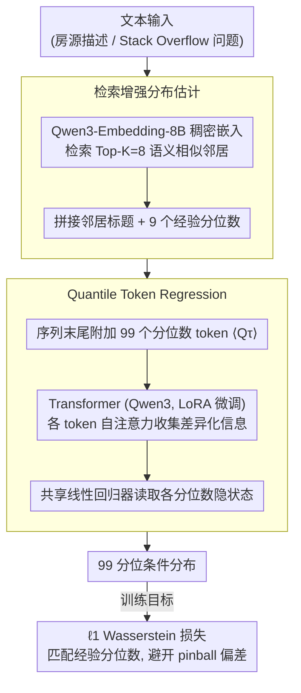

# Text-to-Distribution Prediction with Quantile Tokens and Neighbor Context

**会议**: ACL 2026  
**arXiv**: [2604.20216](https://arxiv.org/abs/2604.20216)  
**代码**: [github.com/yilunzhu/text2distribution](https://github.com/yilunzhu/text2distribution)  
**领域**: LLM评测  
**关键词**: 分位数回归、分布预测、检索增强、LLM微调、不确定性估计

## 一句话总结
本文提出Quantile Token Regression方法，通过在输入序列中插入专用分位数token并结合检索到的邻居实例及其经验分布，使LLM能够预测完整的条件分布而非单一点估计，在Airbnb和StackSample数据集上相比基线降低约4个MAPE点并将预测区间收窄2倍以上。

## 研究背景与动机

**领域现状**：LLM已展现出超越文本生成的能力，在时间序列预测和回归任务中表现良好。大部分LLM回归工作聚焦于点估计，但价格预测、需求预估和风险评估等实际场景需要预测完整的概率分布，而非仅给出中心趋势值。分位数回归提供了一种自然的分布预测框架，可以估计不同概率水平下的条件分位数。

**现有痛点**：Vedula等人(2025)的工作为LLM分布预测迈出了重要一步，通过在共享的最终隐状态上附加多个线性回归头来预测不同分位数。但该架构存在三个关键缺陷：(1) 所有分位数预测来自同一表示瓶颈，模型必须将关于分布的一切信息压缩到单一向量中；(2) 仅基于查询文本预测分布，缺乏与相似实例的显式比较——而人类推理分布时天然依赖类比；(3) 先前的检索增强方法仅为每个邻居提供单一标量标签，限制了分布监督信息。

**核心矛盾**：分布预测需要捕获不同分位数的差异化特征（如低分位数关注热度信号、高分位数关注复杂度指标），但共享表示瓶颈迫使所有分位数从同一特征中提取信息，导致间接的输入-输出映射。

**本文目标**：设计一种架构让每个分位数拥有专属的表示和直接的输入-输出路径，并通过检索邻居的完整经验分布来提供局部证据支撑。

**切入角度**：借鉴人类推理分布的方式——搜索相似物品并比较其价格范围来建立理解。同时，通过在self-attention中插入专用token，让每个分位数都能自主关注输入的不同部分。

**核心 idea**：将可学习的分位数token $\langle Q_{\tau_1}\rangle, \ldots, \langle Q_{\tau_Q}\rangle$ 插入输入序列末尾，使每个分位数通过自注意力直接与输入建立连接，同时为检索到的邻居附加完整的经验分布（而非单一标签）。

## 方法详解

### 整体框架
给定文本输入（如Airbnb房源描述或Stack Overflow问题），系统先通过密集嵌入检索Top-K个语义相似的邻居实例，将邻居的标题和9个代表性经验分位数拼接到输入中。然后在输入序列末尾附加99个可学习的分位数token，送入预训练Transformer（Qwen3系列），利用各分位数token的隐状态通过共享线性回归器预测对应的分位数值，输出完整的99分位条件分布。训练时采用 $\ell_1$ Wasserstein 损失在经验分位数目标上拟合。

### 关键设计

**1. Quantile Token Regression：给每个分位数一条专属表示路径**

传统做法（Vedula 等 2025）把所有分位数预测都挂在同一个最终隐状态上、再接多个线性头——等于逼着模型把整个分布的信息全压进一个向量这一表示瓶颈，不同分位数学不到差异化的注意力模式。本文改成在输入序列 $X = (x_1, \ldots, x_n)$ 末尾附加 $Q$ 个特殊 token $\langle Q_{\tau_k}\rangle$，构成 $\widetilde{X} = (x_1, \ldots, x_n, \langle Q_{\tau_1}\rangle, \ldots, \langle Q_{\tau_Q}\rangle)$；经过 Transformer 后取每个分位数 token 位置的隐状态 $h_{\tau_k}$，再过一个共享线性层 $\hat{q}_{\tau_k}(X) = w^\top h_{\tau_k} + b$ 得到该分位数的预测值。

每个 $\langle Q_{\tau_k}\rangle$ 在所有 Transformer 层里都通过自注意力自主收集信息，于是打通了一条直接的输入到输出通路：$\langle Q_{10}\rangle$ 可以去盯热度信号（预测会被快速回答的问题），$\langle Q_{90}\rangle$ 则去关注复杂度指标（预测慢速回答）。同时这些 token 在同一次注意力计算里联合生成，又保证了各分位数之间的一致性。

**2. 检索增强分布估计：邻居带的是完整经验分布，不是一个标量**

先前的检索增强回归只给每个邻居附一个点标签，把邻居自身的分布信息全丢了。本文用 Qwen3-Embedding-8B 对每个实例的完整文本算密集嵌入，从训练集里检索 Top-K（K=8）个最相似邻居，关键改动是给每个邻居附上它的 9 个代表性经验分位数（1、5、10、25、50、75、90、95、99 百分位），而不是单个标量。这背后的假设是「相似的输入往往有相似的结果分布」——相似房源的价格分布就接近。把邻居完整的分布形状、离散度和尾部行为都喂进去，模型在估计中心趋势之外的离散度和尾部时就有了局部证据可依，不再只靠查询文本本身硬猜。

**3. 损失函数理论分析：为「监督信号本身是经验分位数」这件事挑对损失**

标准 pinball 损失是为「从原始观测值学分位数」设计的，可这里每个邻居的「观测值」本身已经是经验分位数估计量，直接套 pinball 会出问题。论文比较了四种损失：$\ell_1$ 和 $\ell_2$ Wasserstein 损失在大样本下对目标分位数是 Fisher 一致的；Pinball-Q 把 pinball 损失套到经验分位数目标上会引入 $M_i^{-1/2}$ 量级的系统偏差；Pinball-Med 只拿经验中位数当标量监督，直接丢掉了分布形状。理论给出的排序是 $\ell_1 > \text{Pinball-Q} > \text{Pinball-Med}$，与实验结果一致。Wasserstein 损失因为直接匹配分位数函数，避开了 pinball 在这种监督下的偏差，才是更对路的选择。

### 损失函数 / 训练策略
使用 $\ell_1$ Wasserstein损失在经验分位数目标上训练，预测Q=99个均匀分布的分位数。对Qwen3模型（1.7B-14B参数）进行LoRA微调。训练和预测在对数空间进行，推理时指数化回原始尺度后计算评估指标。

## 实验关键数据

### 主实验（Airbnb数据集，Qwen3-4B）

| 方法 | avg MAPE↓ | CRPSS↑ | RCIW@95↓ |
|------|-----------|--------|----------|
| QR (K=0) | 30.31 | 0.4536 | 12.30 |
| QR (K=8) | 27.78 | 0.4700 | 15.08 |
| QT (K=8) | **26.89** | **0.4700** | **7.17** |

### StackSample数据集（Qwen3-4B）

| 方法 | avg MAPE↓ | CRPSS↑ | RCIW@99↓ |
|------|-----------|--------|----------|
| QR (K=0) | 266.65 | 0.0668 | 45480 |
| QR (K=8) | 98.56 | 0.3001 | 2110 |
| QT (K=8) | **84.30** | **0.3375** | **346.9** |

### 消融实验（损失函数，Airbnb dev，Qwen3-4B）

| 损失函数 | avg MAPE↓ | RCIW@95↓ |
|----------|-----------|----------|
| Pinball-Med | 32.80 | 151.78 |
| Pinball-Q | 32.66 | 151.27 |
| $\ell_2$ Wasserstein | 26.64 | 4.15 |
| $\ell_1$ Wasserstein | **26.55** | **3.55** |

### 关键发现
- 检索增强在数据量较小的StackSample上效果尤为显著（avg MAPE从266.65降至98.56，降低63%），验证了"相似输入具有相似分布"的假设
- 分位数token相比共享表示基线在StackSample上avg MAPE降低14%，预测区间收窄6倍
- 模型规模扩大到一定程度后收益递减：1.7B到4B降低7% MAPE，8B到14B仅降低1%
- $\ell_1$ Wasserstein损失在精度和锐度之间取得最佳平衡，pinball损失虽优化CRPSS但导致极宽的预测区间

## 亮点与洞察
- **分位数token作为专用探针**：在输入序列中插入可学习的特殊token来创建专用表示路径，这个思路可以迁移到任何需要从同一输入预测多个差异化输出的任务（如多任务学习、多粒度预测）。
- **邻居的分布级别augmentation**：不仅检索相似样本，还将其完整的经验分布作为上下文输入，这种"分布级别的检索增强"比"点标签级别的检索增强"信息量更丰富，可推广到时间序列分布预测等场景。
- **理论与实践的对齐**：损失函数的理论分析精确预测了实验排序，为实践中选择损失函数提供了原则性指导。

## 局限与展望
- 评估仅在两个数据集（Airbnb和StackSample）上进行，尚未在更多领域验证泛化性
- 分位数token方法不保证预测的单调性，需要后处理来确保如90th分位 ≥ 80th分位
- 邻居数K增加带来显著的计算和内存开销（K=16需要约2倍内存），需在性能和效率间权衡
- 未探索方差感知加权，可能进一步提升尾部分位数的估计质量

## 相关工作与启发
- **vs Vedula et al. (2025)**：共享隐状态+多线性头 vs 专用分位数token。本文优势在于差异化注意力模式和更窄的预测区间
- **vs Wang et al. (2025)检索增强回归**：单一标签+单一价格输出 vs 完整经验分布+完整分布预测，信息量显著更丰富
- **vs 传统分位数回归**：传统在原始观测上用pinball损失，本文在经验分位数上用Wasserstein损失，理论和实验均表明后者更适合

## 评分
- 新颖性: ⭐⭐⭐⭐ 分位数token的设计简洁优雅，理论分析扎实
- 实验充分度: ⭐⭐⭐⭐ 两个数据集、四种模型规模、完整消融，数据集多样性可进一步提升
- 写作质量: ⭐⭐⭐⭐⭐ 理论与实验紧密结合，写作清晰
- 价值: ⭐⭐⭐⭐ 对文本到分布预测场景有实用价值，分位数token思路可迁移

<!-- RELATED:START -->

## 相关论文

- [\[ACL 2025\] Prediction Hubs are Context-Informed Frequent Tokens in LLMs](../../ACL2025/llm_nlp/prediction_hubs_are_context-informed_frequent_tokens_in_llms.md)
- [\[ACL 2026\] CAST: Achieving Stable LLM-based Text Analysis for Data Analytics](cast_achieving_stable_llm-based_text_analysis_for_data_analytics.md)
- [\[ACL 2026\] Hot-Start from Pixels: Low-Resolution Visual Tokens for Chinese Language Modeling](hot-start_from_pixels_low-resolution_visual_tokens_for_chinese_language_modeling.md)
- [\[ACL 2026\] Leveraging Pretrained Language Models as Energy Functions for Glauber Dynamics Text Diffusion](leveraging_pretrained_language_models_as_energy_functions_for_glauber_dynamics_t.md)
- [\[ACL 2026\] How Do Answer Tokens Read Reasoning Traces? Self-Reading Patterns in Thinking LLMs](how_do_answer_tokens_read_reasoning_traces_self-reading_patterns_in_thinking_llm.md)

<!-- RELATED:END -->
