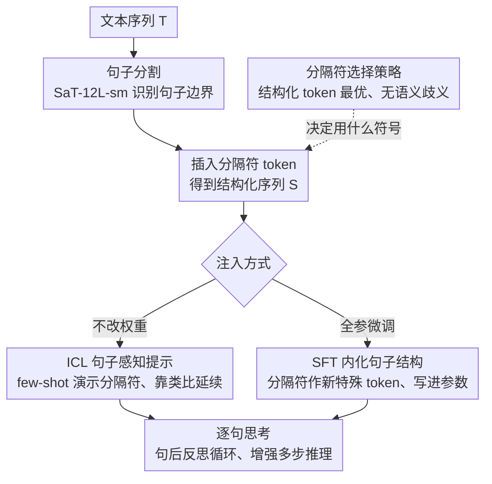

# Think in Sentences: Explicit Sentence Boundaries Enhance Language Model's Capabilities

**会议**: ACL 2026  
**arXiv**: [2604.10135](https://arxiv.org/abs/2604.10135)  
**代码**: [GitHub](https://github.com/CLCS-SUSTech/think-in-sentence)  
**领域**: LLM/NLP  
**关键词**: 句子边界, 分隔符, 上下文学习, 监督微调, 免费午餐

## 一句话总结

本文提出在 LLM 输入中的句子边界处插入分隔符标记，通过 ICL 和 SFT 两种方式实现"逐句思考"的推理范式，在 7B 到 600B 模型上取得一致提升（GSM8k +7.7%，DROP +12.5%），且几乎不增加额外计算开销。

## 研究背景与动机

**领域现状**：句子级结构曾是早期神经语言模型的核心——Skip-thought 训练重建相邻句子，BERT 的下一句预测任务编码句间连贯性。但随着 LLM 的兴起，句子边界被降格为普通 token，模型在 token-by-token 的处理管线中完全忽视了句子结构。

**现有痛点**：提升 LLM 能力的主流方法要么需要巨大训练开销（训练时缩放），要么增加推理延迟（测试时缩放如 CoT）。Goyal et al. (2024) 提出插入"暂停"token 作为免费午餐方案，但存在严重局限：(1) 暂停 token 放置缺乏语言学先验，需要逐任务手动调整数量；(2) 未在 7B+ 模型上验证；(3) 鲁棒性和泛化性不足。

**核心矛盾**：人类语言生成依赖于逐句的增量式认知过程，但 LLM 学习的是这一过程产生的连续文本，导致人类认知机制与模型输入处理之间存在固有错位。

**本文目标**：设计一种利用句子级语言学先验的策略，以鲁棒且低开销的方式增强 LLM 性能。

**切入角度**：作者观察到句子是自然语言中最自然的"认知块"（chunking），在句子边界处插入结构性分隔符可以触发"上下文整合 → 下一步规划"的循环，模拟人类的句后反思过程。

**核心 idea**：在句子边界插入任务无关的分隔符 token，让 LLM 隐式地进行逐句推理，通过 ICL（提示中展示分隔符模式）和 SFT（在分隔符插入的数据上微调）两种方式实现。

## 方法详解

### 整体框架

给定文本序列 $T = [t_1, t_2, ..., t_n]$，通过句子分割工具（SaT-12L-sm）识别句子边界，在每个句子末尾插入分隔符 $x_{seg}$，得到结构化序列 $S = [s_1, x_{seg}, s_2, x_{seg}, ..., s_n, x_{seg}]$。模型的目标不仅是预测下一个 token，还包括学习在何时生成分隔符，从而执行隐式的句子分割。在这条"分割—插入"主干之上，分隔符可走两条互补路径注入：ICL（上下文学习，in-context learning，仅在提示里演示分隔符、不碰权重）与 SFT（监督微调，supervised fine-tuning，把句子先验固化进参数）；至于用什么符号当分隔符，则由分隔符选择策略统一决定。

### 关键设计

**1. ICL 句子感知提示：不动权重，靠类比让模型自己"学会"逐句生成**

最轻量的注入方式是直接在 few-shot 示例里演示分隔符的用法——每个示例的每个句子末尾都用 `<seg>` 显式终止。模型在自回归解码时会把这种逐句结构化的排版当成一种待延续的模式，通过类比学习（analogy）自动在自己的推理和输出中也按句插入 `<seg>`，于是"上下文整合 → 下一步规划"的句后反思循环被隐式触发。这一路完全不碰模型权重，用标准自回归推理就能跑，代价几乎为零；缺点是它把信号塞在提示里，受上下文长度挤压，零样本或上下文受限时就用不上。

**2. SFT 内化句子结构：把句子先验直接写进参数，摆脱对提示的依赖**

为了让模型在零样本下也能逐句思考，作者把句子结构从"提示里临时演示"升级成"参数里固化"。具体做法是在 TULU3 数据集上系统地给每个句子边界插入分隔符，再用标准因果语言建模损失做全参数微调。分隔符 $x_{seg}$ 被当作新的特殊 token 加进 tokenizer，它对应的 embedding 和 LM head 权重在训练中一并学习，训练完模型就能原生地、不靠任何提示地生成带分隔符的文本。相比 ICL 这一路不再吃上下文预算，更贴近真实部署场景。

**3. 分隔符选择策略：理想分隔符必须是纯结构标记，不能带语义**

分隔符插在哪不难，难的是用什么符号。作者横向测了结构化 token（`<seg>`、`<and>`、`####`）、语义词（"seg"、"and"）、标点（"\n"、"."）以及任意符号等多类候选，结果结构化 token 一致最优，是唯一在所有任务上都超过基线的类型。原因在于理想的分隔符应当只承载"句子到此为止"这个结构信号、与正文语义无关：语义词会让模型纠结这个 token 到底是边界标记还是句子内容，引入歧义；而结构化 token 天生不属于自然语言词表，提供的是无歧义的句子边界信号。

### 损失函数 / 训练策略

SFT 使用标准因果语言建模损失：$\mathcal{L}_{SFT}(\theta) = \sum_{s' \in S} \sum_{i=1}^{|s'|} \log P(t_i | t_{<i}; \theta)$，其中 $s' = [s, x_{seg}]$，最后一个 token $t_{|s'|} = x_{seg}$。全参数微调在 8×L40 GPU 上进行。

## 实验关键数据

### 主实验（ICL）

| 模型 | GSM8k Δ | DROP Δ | MMLU Δ | MATH Δ |
|------|---------|--------|--------|--------|
| Qwen2-7B-Inst | +7.73% | +12.50% | +5.53% | +0.97% |
| Llama3-8B-Inst | +2.50% | +6.77% | +4.39% | -0.34% |
| Qwen2.5-72B-Inst | +1.82% | +1.64% | -0.24% | +2.74% |
| DeepSeek-V3 | +0.30% | +4.00% | +0.78% | +1.20% |

### SFT 实验（Llama3-8B-Base）

| 方法 | MMLU | GSM8k | DROP | MMLU-Pro | HumanEval |
|------|------|-------|------|----------|-----------|
| Std-FT | 59.02 | 72.48 | 48.50 | 34.25 | 56.71 |
| Pause-FT | 56.11 | 75.44 | 55.97 | 35.71 | - |
| **Seg-FT** | **60.13** | 74.91 | 54.26 | **40.71** | **62.80** |

### 关键发现
- 小模型受益最大（7B 级别提升明显），大模型提升较小但仍一致
- DROP（需要跨句推理的阅读理解）提升最显著，说明句子分隔帮助模型更好地处理逐句编码的事实及其关系
- Seg-FT 在所有 7 个基准上都超过 Std-FT，而 Pause-FT 在知识密集型任务（MMLU、GPQA）上退化
- 句子感知能力能泛化到代码生成（HumanEval +6.09%），模型学会在代码中也插入分隔符
- 通过 Prob-based vs CoT-based 评估发现：分隔符不改善知识检索，而是增强多步推理过程

## 亮点与洞察
- **句子是"自然的认知块"**这一洞察非常深刻：固定 n-token 分块的性能呈倒 U 型，最优区间 n∈[32,64] 恰好对应典型句子长度，说明句子级别是信息处理的最佳粒度。这可类比人类的认知分块（cognitive chunking）
- **"免费午餐"方法论的关键改进**：相比 Pause token 的盲目插入，利用语言学先验（句子边界）使方法更鲁棒、更通用，不需要逐任务调参
- **SFT 向代码的意外泛化**很有启发：自然语言的句子分割模式迁移到了代码的行结构，暗示两者共享某种结构性先验

## 局限与展望
- ICL 依赖足够的上下文长度来放置 few-shot 示例，在零样本或上下文受限场景中受限
- SFT 仅在 Llama3-8B-Base 上验证，缺乏更大模型的 SFT 实验
- 句子分割依赖外部工具（SaT-12L-sm），可能引入分割错误
- 作者未探索在训练数据中自适应地选择分隔符放置位置（如只在关键句子边界插入）
- 对于数学推理等高度结构化的任务，提升相对有限（MATH 在某些模型上甚至略降）

## 相关工作与启发
- **vs Pause Token (Goyal et al. 2024)**: Pause Token 盲目插入暂停标记且需逐任务调优，本文利用句子边界这一语言学先验，更鲁棒且泛化性更好。SFT 实验直接证明 Seg-FT 整体优于 Pause-FT
- **vs CoT 推理**: CoT 通过显式生成推理步骤提升能力但增加 token 消耗，本文通过隐式的句子分隔提升推理能力且几乎零额外开销。消融实验表明两者协同作用

## 评分
- 新颖性: ⭐⭐⭐⭐ 句子边界分隔符的想法简单但有效，从认知科学角度建立了清晰的直觉
- 实验充分度: ⭐⭐⭐⭐ 覆盖多模型多任务，有丰富的消融分析（分隔符选择、粒度、机制分析）
- 写作质量: ⭐⭐⭐⭐ 动机和实验逻辑清晰，分析深入
- 价值: ⭐⭐⭐⭐ 提供了实用的免费午餐方法，但提升在大模型上较有限

<!-- RELATED:START -->

## 相关论文

- [\[ACL 2025\] ExpliCa: Evaluating Explicit Causal Reasoning in Large Language Models](../../ACL2025/llm_nlp/explica_evaluating_explicit_causal_reasoning_in_large_language_models.md)
- [\[ACL 2025\] Explicit and Implicit Data Augmentation for Social Event Detection](../../ACL2025/llm_nlp/explicit_and_implicit_data_augmentation_for_social_event_detection.md)
- [\[ACL 2025\] PlanGenLLMs: A Modern Survey of LLM Planning Capabilities](../../ACL2025/llm_nlp/plangenllms_planning_survey.md)
- [\[ACL 2026\] Clozing the Gap: Exploring Why Language Model Surprisal Outperforms Cloze Surprisal](clozing_the_gap_exploring_why_language_model_surprisal_outperforms_cloze_surpris.md)
- [\[ACL 2025\] Explain-then-Process: Using Grammar Prompting to Enhance Grammatical Acceptability Judgments](../../ACL2025/llm_nlp/explain-then-process_using_grammar_prompting_to_enhance_grammatical_acceptabilit.md)

<!-- RELATED:END -->
