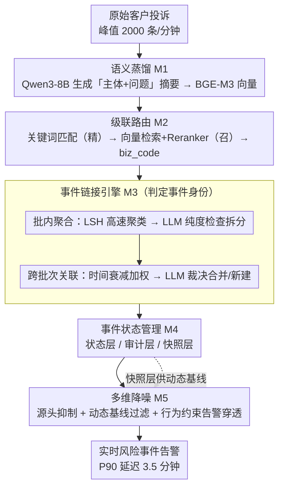

# TingIS: Real-time Risk Event Discovery from Noisy Customer Incidents at Enterprise Scale

**会议**: ACL 2026  
**arXiv**: [2604.21889](https://arxiv.org/abs/2604.21889)  
**代码**: 无  
**领域**: LLM评测  
**关键词**: 风险事件发现, 客户投诉挖掘, 事件链接, 流式处理, 信噪比优化

## 一句话总结

TingIS是一个部署在金融科技平台的端到端风险事件发现系统，通过五模块架构（语义蒸馏、级联路由、事件链接引擎、状态管理、多维降噪）从海量嘈杂客户投诉中实时提取可操作的风险事件，实现了P90告警延迟3.5分钟和95%的高优先级事件发现率。

## 研究背景与动机

**领域现状**: 大规模在线平台依赖复杂微服务和云原生架构，即使微小故障也可能迅速传播为大规模事件。内部可观测系统（metrics/logs/traces）是第一道防线，但并非万无一失。

**现有痛点**: 客户投诉数据虽是发现监控盲区的重要信号，但具有极端嘈杂、高吞吐量和语义复杂性等挑战。从2000条/分钟的流量中仅凭3条投诉发现系统性故障，面临严峻的信噪比（SNR）问题。低SNR系统会触发大量误报，导致运维团队告警疲劳。

**核心矛盾**: 需要在极高噪声、极短延迟和极低漏报之间取得平衡——同时满足实时性（分钟级）、高发现率（>95%）和低误报率。

**本文目标**: 构建一个能从日均30万条客户投诉中实时发现风险事件的企业级系统。

**切入角度**: 将问题分解为五个正交模块，每个模块解决一个核心子问题，通过"轻量规则预过滤+LLM深度判断"的混合智能策略平衡精度与成本。

**核心idea**: 通过多阶段事件链接引擎（LSH高速聚类→LLM纯度检查→跨批次历史关联→时间衰减加权）实现语义收敛和身份持久化，辅以级联路由和多维降噪保障系统整体SNR。

## 方法详解

### 整体框架

TingIS 横跨三层（数据观测层、语义引擎层、长期记忆层），由五个正交模块（M1–M5）串成一条流式处理流水线：原始投诉先经 M1 语义蒸馏压成高密度语义单元，再由 M2 级联路由归属到正确业务域（biz_code），随后进入系统核心 M3 事件链接引擎判定"事件身份"，结果交给 M4 分层状态管理持久化，最后由 M5 多维降噪决定是否真正告警。整体设计遵循三大核心洞察：语义收敛与身份持久化、混合智能协同（规则预过滤→检索→LLM 渐进调用）、多约束信噪比（SNR）平衡。

### 关键设计

**1. 语义蒸馏（Semantic Distillation, M1）：把口语化噪声压成高密度语义单元**

原始投诉口语化、夹杂情绪、个人隐私信息（PII）和无关细节，直接喂给下游会让信噪比崩掉。M1 不走传统关键词抽取，而是用 Qwen3-8B 在严格 prompt 约束下把每条投诉改写成「主体+问题」格式的摘要（如"信用卡在线支付+折扣错误"），显式丢弃情绪表达、寒暄和 PII，再用 BGE-M3 编码成向量。这样在可控算力下得到干净、高密度的语义表示，为后续所有模块打底。

**2. 级联路由（Cascaded Routing, M2）：先精后召把投诉归到正确业务域**

不同业务域（biz_code）语义差异大，路由错了后面全错；但海量流量又不允许每条都跑重模型。M2 用两阶段策略平衡精度与延迟：先做关键词匹配（实体优先），命中即返回对应 biz_code，高精度、低成本地消化掉大部分明确投诉；未命中的再走并行向量检索 + BGE-Reranker-V2-M3 重排，按阈值接收高召回的模糊投诉，低置信度的丢给兜底域由全局团队人工分派。为压住流式延迟，计算昂贵的 reranker 只在 Top-10 检索候选池内做全自注意力重排。

**3. 多阶段事件链接引擎（Multi-stage Event Linking Engine, M3）：判定"事件身份"的系统核心**

系统最难的一步是判断不同时间、不同表述的多条投诉是否指向同一底层风险事件。M3 用渐进式两步求解。批内高效聚合：按 biz_code 分区后用 LSH（局部敏感哈希）做高速预聚类，再让 LLM（Kimi-K2）对每个簇做代表性纯度检查，不纯就拆分并为每个子簇生成标题——LSH 保效率、LLM 保精度，输出的簇标题既全面又互斥。跨批次历史关联：把簇标题嵌入后去历史风险事件库检索，用时间衰减加权融合语义相似度与时间接近度

$$s^* = s \cdot e^{-k\Delta t}$$

其中 $s$ 是当前标题与历史事件嵌入的语义相似度，$\Delta t$ 是历史事件距上次活跃的天数。只有最高综合得分超阈值才调 LLM 最终裁决合并还是新建，并附自然语言理由，否则直接新建事件。时间衰减专门防止"历史惯性"——旧事件错误吸收无关新投诉。

**4. 分层事件状态管理（Event State Management, M4）：解耦易变性、可追溯性与统计分析**

实时告警、证据审计、历史统计三种需求对数据的要求互相打架，硬塞一张表会顾此失彼。M4 用三层数据模型解耦：状态层只存实时告警和时间衰减计算所需的最小可变状态（当前量、最后变更/活跃时间戳）；审计层是不可变日志，完整记录「原文→摘要→簇→事件 ID」的证据链和每次告警的触发上下文（静态阈值还是动态基线）与原因，保证 100% 可审计、支持误合并/误报的事后复盘；快照层周期性记录事件量的存量与流量，为 M5 的动态基线提供稳定、低成本的历史样本，避免重扫海量日志。

**5. 多维降噪（Multi-dimensional Denoising, M5）：多约束压制误报、兼顾防疲劳与应急**

只靠量阈值会在营销咨询等非故障场景里引发"告警风暴"。M5 叠三层降噪：源头抑制在聚类阶段把新簇比对误报样本库（false-positive KB），与历史误报高度相似的在生成事件前就掐掉；动态基线统计过滤要求投诉量不仅超静态业务阈值，还要显著偏离 M4 快照层算出的动态基线（+2σ），滤掉周期性业务波动；行为约束设告警静默期，事件标记「处理中」后自动静默两小时防疲劳，但同时实时监控事件量斜率，一旦出现爆发式非线性激增就穿透静默窗口立即告警，确保关键升级不被压住。

## 实验关键数据

### 主实验（线上部署一个月）

| 指标 | 数值 |
|---|---|
| 日均处理投诉数 | 30万+ |
| 峰值吞吐量 | 2000条/分钟 |
| P90告警延迟 | 3.5分钟 |
| 高优先级事件发现率 | 95% |

### 消融实验

| 评估维度 | 对比方法 | TingIS表现 |
|---|---|---|
| 路由准确率 | 基线方法 | 显著优于基线 |
| 聚类质量 | 基线方法 | 显著优于基线 |
| 信噪比 (SNR) | 基线方法 | 显著优于基线 |

### 关键发现

1. **3条投诉即可触发告警**: 系统能从仅3条相关投诉中发现潜在风险事件，这对早期预警至关重要
2. **混合智能策略有效降低LLM成本**: 规则预过滤大幅减少输入量，LSH和相似度阈值门控昂贵的LLM调用，历史状态的持久化带来渐进效率增益
3. **告警穿透机制兼顾防疲劳与应急**: 正常情况下2小时静默期防止告警疲劳，但检测到爆发式增长时自动穿透静默窗口
4. **模块化设计支持低成本维护**: 五个正交模块可独立升级（如替换更强LLM或更快embedding模型）

## 亮点与洞察

1. **完整的工业级系统设计**: 不仅是算法创新，而是涵盖数据观测→语义处理→事件管理→降噪→告警的完整工程方案
2. **三层数据模型设计精巧**: 状态层（实时决策）、审计层（不可变证据链）、快照层（历史基线），解耦了不同维度的数据需求
3. **时间衰减语义关联机制**: $s^* = s \cdot e^{-k\Delta t}$ 简洁地融合了语义相似度和时间接近度，避免旧事件错误吸收新投诉
4. **混合智能范式值得借鉴**: "规则→检索→LLM"的渐进式智能调用策略，在保持精度的同时控制了计算成本

## 局限与展望

1. **具体实验数据未充分展示**: 论文HTML版本在实验部分截断，离线基准的详细数据未完整呈现
2. **领域特异性强**: 系统针对金融科技平台客户投诉设计，迁移到其他领域需要调整路由知识库和降噪策略
3. **对LLM的依赖**: 核心的纯度检查和合并裁决依赖LLM（Kimi-K2），可能面临延迟波动和成本问题
4. **冷启动问题**: 新业务域缺乏历史事件和关键词知识库时，系统效果可能下降
5. **未讨论多语言场景**: 虽然投诉可能涉及多语言，但论文未讨论多语言支持

## 相关工作与启发

1. **BGE-M3 (2024)**: 本文采用的embedding和reranker模型，提供了高质量的多语言语义表示
2. **Qwen3-8B (2025)**: 用于语义蒸馏的LLM，平衡了质量和推理成本
3. **Kimi-K2 (2025)**: 用于事件链接引擎中的纯度检查和合并裁决，提供高质量推理
4. **LSH (Locality-Sensitive Hashing)**: 经典的近似最近邻算法，在本文中用于高速预聚类

## 评分

- **新颖性**: ⭐⭐⭐ — 系统设计整合了多种已有技术，创新性更体现在工程集成和模块协同上
- **实验充分度**: ⭐⭐⭐ — 有线上部署数据证明系统可行性，但离线对比实验细节不够完整
- **写作质量**: ⭐⭐⭐⭐ — 系统架构描述清晰，模块间关系阐述明确，用实际案例增强可读性
- **价值**: ⭐⭐⭐⭐ — 对构建企业级LLM应用系统有很强的参考价值，展示了LLM在实时流处理场景的工程实践

<!-- RELATED:START -->

## 相关论文

- [\[ACL 2025\] A Large-Scale Real-World Evaluation of an LLM-Based Virtual Teaching Assistant](../../ACL2025/llm_nlp/a_large-scale_real-world_evaluation_of_llm-based_virtual_teaching_assistant.md)
- [\[ICLR 2026\] How Catastrophic is Your LLM? Certifying Risk in Conversation](../../ICLR2026/llm_nlp/how_catastrophic_is_your_llm_certifying_risk_in_conversation.md)
- [\[ICML 2026\] Rare Event Analysis of Large Language Models](../../ICML2026/llm_nlp/rare_event_analysis_of_large_language_models.md)
- [\[ICLR 2026\] Trapped by simplicity: When Transformers fail to learn from noisy features](../../ICLR2026/llm_nlp/trapped_by_simplicity_when_transformers_fail_to_learn_from_noisy_features.md)
- [\[ACL 2025\] Explicit and Implicit Data Augmentation for Social Event Detection](../../ACL2025/llm_nlp/explicit_and_implicit_data_augmentation_for_social_event_detection.md)

<!-- RELATED:END -->
