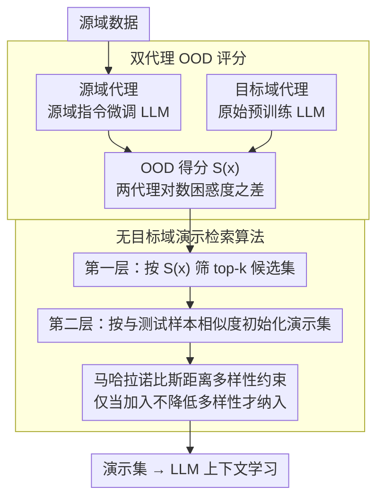

# 面向稳健上下文学习的 OOD 代理演示检索方案

**会议**: ACL 2026  
**arXiv**: [2606.00014](https://arxiv.org/abs/2606.00014)  
**代码**: https://github.com/bort64/ood_code  
**领域**: LLM / NLP  
**关键词**: 上下文学习, OOD 鲁棒性, 演示检索, 分布偏移, 代理估计

## 一句话总结

通过构造源域和目标域的双代理并计算其困惑度差值作为 OOD 得分，结合马哈拉诺比斯距离约束演示多样性，在无法获取目标域样本的条件下，从源域中精准筛选与目标域分布对齐的演示样本，增强 LLM 的上下文学习鲁棒性。

## 研究背景与动机

**领域现状**：大语言模型通过上下文学习（ICL）范式已展现出强大的任务适应能力，该方法无需微调即可通过输入少量演示样本指导模型推理。学术界已广泛探索了多种演示选择策略，包括基于 BM25、文本编码器相似度、模型影响力等的检索方法。

**现有痛点**：ICL 的核心瓶颈在于分布偏移导致的性能崩溃。当演示样本与目标任务的分布发生严重错配时（特别是在真实应用中目标域数据不可得的情况下），已有的演示选择方法往往基于源域数据本身的特征进行排序，完全忽视了这些样本是否真正对齐未知的目标分布。直接的相似度匹配无法有效判断哪些源域样本在 OOD 场景下对目标任务最有帮助。

**核心矛盾**：演示检索的根本困境是双重的：（1）目标域分布完全不可见，无法直接度量源样本与目标的贴切度；（2）仅依赖相似度排序会陷入"虚假相关"陷阱——高相似的样本未必适应分布偏移，甚至可能强化模型对源域分布的过度适配。

**本文目标**：（1）在完全不可访问目标域的条件下，构造一个可靠的目标分布近似器；（2）通过该近似器量化每个源样本的"目标亲和度"；（3）在演示选择时兼顾相似度和多样性，确保检索到的演示既贴近目标特征，又具有足够的表示范围。

**切入角度**：受 OOD 检测文献启发，作者观察到：预训练 LLM 隐含编码了广泛的语言和事实知识，可作为目标域分布的弱代理。通过对源域数据进行指令微调得到"源域代理"，保持原始模型作为"目标域代理"，两者在相同输入上的预测概率比（使用困惑度的对数差）可以反映样本对目标分布的适应程度。

**核心 idea**：用困惑度比值这一简洁却理论可证的指标来"无中生有"地近似无法直接观测的目标分布，进而指导演示选择过程，避免完全依赖相似度而陷入源域偏差。

## 方法详解

### 整体框架

DOPA 的执行流程分三个阶段：

1. **代理构造阶段**：基于易获取的源域数据，通过指令微调 LLM 得到源域代理模型；同时保留原始未微调的 LLM 作为目标域代理。
2. **OOD 评分阶段**：对源域每个样本计算两个代理的困惑度并取对数差作为 OOD 得分，以此筛选出前 k 个最可能对齐目标分布的候选样本集合。
3. **演示检索阶段**：从候选集中基于相似度初始化演示池，然后通过马哈拉诺比斯距离约束逐步扩充演示集合，确保最终演示既有相似性又有多样性。

### 关键设计

**1. 双代理 OOD 评分：目标域不可见，就用两个模型的"视角差"反推样本对目标的亲和度**

ICL 的痛点是目标域分布完全不可见，无法直接度量某个源样本到底贴不贴近目标。作者的破局点是不去硬估目标分布，而是构造一对"对照组"：源域代理是把原始 LLM 在源域标注数据上做指令微调得到的，它会过度适配源域特征；目标域代理则保留未微调的预训练 LLM，仍持一个更"通用"的视角。同一个样本 $x$ 在源代理下困惑度高、在目标代理下困惑度低，就说明它是"源域里的异常值"——恰恰是这种不太典型于源域的样本，更可能在未知目标域里表现好。据此把 OOD 得分定义为两个代理对数困惑度之差

$$S(x) = \log PPL_{target}^{proxy}(x) - \log PPL_{source}^{proxy}(x)$$

得分越低表示样本越适配目标。之所以用预训练 LLM 而不是用一个统一/均匀分布来当目标代理，是因为前者既能借上其内蕴的广泛语言与事实知识、又避免了"目标就是均匀分布"这种过强假设；理论上 Theorem 1 给出有界代理误差，把这一近似的偏离度限制在 $(\epsilon_t/m_t + \epsilon_s/m_s)$ 之内。

**2. 马哈拉诺比斯距离多样性约束：堵住困惑度评分偏爱短文本、扎堆相似样本的漏洞**

光靠困惑度比值选样本有个隐患：困惑度本质衡量 token 级流畅度，天然偏爱短文本和高频语言模式，于是检索结果容易挤在一堆相似的短样本上、表示空间塌缩。为此作者在已选演示集合上加了一个全局多样性度量：初始化时按与测试样本的相似度取前 $C$ 个候选，随后计算候选集中所有样本对的平均马哈拉诺比斯距离

$$Div = \frac{2}{|\mathcal{D}_{demo}|(|\mathcal{D}_{demo}|-1)}\sum_{i<j}\sqrt{\mathbf{D}_{ij}^T \Sigma^{-1} \mathbf{D}_{ij}}$$

其中 $\Sigma$ 是样本表示的经验协方差矩阵。之后每考察一个候选，只有当它加入后不降低整体多样性时才保留下来。用马氏距离而非欧氏距离，是因为它按协方差对各维度做了白化，能在保证相似度的前提下真正把演示的表示空间撑开。

**3. 无目标域演示检索算法：两层筛选分别管"分布偏移"和"表示覆盖"**

最后把前两件武器串成一条完整流水线。第一层单遍遍历源域数据，用 OOD 得分筛出规模为 $k$ 的候选集 $\hat{\mathcal{D}}_S$，解决"哪些样本来自目标邻域"的问题；第二层在候选集内先按与测试样本的相似度排序、初始化演示集为相似度最高的 $N\times|Y|$ 个样本，再从剩余候选里逐一考察，只要加入不会减少多样性就纳入，直到凑够目标规模，解决"演示之间是否互补、是否覆盖足够表示范围"的问题。两层各司其职：OOD 评分管分布偏移，多样性约束管表示覆盖，合起来既贴近目标特征又不冗余。

## 实验关键数据

### 主实验

在 5 个 LLM 规模和 3 个任务族上测试 DOPA 的有效性：

| LLM 模型 | 测试集平均精度(%) | 相比 Random | 相比 DrICL |
|---------|------------------|-----------|----------|
| GPT2-XL | 48.76 | +10.3% | +2.1% |
| LLaMA3.2-3B | 59.29 | +5.7% | +5.2% |
| Gemma2-2B | 60.12 | +2.4% | +4.3% |
| Qwen3-1.7B | 64.93 | +1.1% | +1.4% |
| LLaMA3.1-8B | 61.08 | +1.7% | +1.0% |

在三类任务上的表现：

| 任务族 | 描述 | DOPA 平均精度(%) | 相比最强基线 |
|--------|------|---------------|----|
| 情感分类(SA/TD/SST) | 句子级别的极性判断，包含域内和域外测试集 | 48.76 | +0.55 |
| 自然语言推理(NLI) | 蕴含关系预测，包含隐式、对抗、生成式扰动 | 38.04 | +1.05 |
| 文本蕴含推理(Adv/Toxigen) | 分布偏移更剧烈的复杂 NLI 任务 | 51.82 | +0.65 |

### 消融实验

| 配置 | 去掉组件后的精度下降幅度(%) |
|------|--------------------------|
| Full DOPA | 基准 |
| w/o OOD 评分（用随机评分） | -2.3% to -4.1% |
| w/o 马哈拉诺比斯多样性（用欧氏距离） | -1.2% to -2.8% |
| w/o 多样性约束（仅用相似度） | -1.5% to -3.2% |
| 只用源代理（无目标代理对比） | -3.4% to -5.7% |

### 关键发现

- **OOD 评分的关键性**：去掉 OOD 评分模块后，性能下降最显著（-2.3%~-4.1%），说明困惑度比值的代理机制是 DOPA 的核心。特别是在小模型上，OOD 评分贡献了约 65% 的性能提升。
- **多样性的递增效应**：马哈拉诺比斯距离约束相比简单欧氏距离多样性，进一步带来 1.2%~2.8% 的提升。
- **分布偏移程度影响**：在轻度 OOD 任务（如源内 SST）上，DOPA 相比基线仅提升 0.1%；在重度 OOD 任务（如 Toxigen 恶意文本）上提升可达 3.2%，证实算法特别针对剧烈分布偏移的场景。
- **目标代理必要性**：使用均匀分布替代目标代理会使 OOD 评分失效（-3.4%~-5.7%）。

## 亮点与洞察

- **巧妙的"无中生有"思想**：论文最精彩的地方在于，既然目标域不可见，何不用"相对论"——通过源域和目标域代理在同一输入上的差异来间接推断样本的目标亲和度？这个逆向思维避免了对目标分布的直接假设。
- **理论与实践的结合**：Theorem 1 的有界代理误差分析不仅是形式上的优雅，更实际指导了代理设计的每一步。
- **多层次的约束融合**：OOD 评分处理分布，多样性约束处理表示，两层不同粒度的筛选流水线既解决了核心问题又保持了算法的可解释性。

## 局限与展望

- **代理假设的界限**：论文假设源域指令微调能充分代表源分布，但在源域本身就是多分布混合时，源代理可能不稳定。
- **计算开销未充分讨论**：OOD 评分需要过一遍源域数据通过两个模型（生成困惑度），成本约为演示检索的 2-3 倍。在数百万源样本的规模下，这可能成为瓶颈。
- **多语言和多模态的泛化**：实验仅涵盖英文 NLP 任务。对于非英文或多模态设置，双代理框架的有效性尚待验证。
- **具体改进思路**：（1）设计在线或增量的 OOD 评分更新机制；（2）尝试知识蒸馏减轻代理模型尺寸；（3）将方法扩展到跨语言或跨模态设置。

## 相关工作与启发

- **vs 传统相似度检索(BM25/SBERT)**：传统方法直接在源域中找与测试样本最相似的样本作为演示。DOPA 的关键差异在于加入了 OOD 敏感性——相似不等于适配。
- **vs 影响力函数(Influence Functions)**：该方法计算演示对模型梯度的影响，需要模型内部访问。DOPA 无需梯度信息，只用困惑度，更适合黑盒或 API 调用场景。
- **vs 数据增强(Rewrite/Augmentation)**：增强方法试图修改源样本使其更接近目标域。DOPA 采用了"选择"而非"修改"的思路。
- **启发**：当真实数据分布不可得时，利用"对照组"（如微调 vs 未微调）的相对行为来推断分布特性，是一个通用的思路。

## 评分

- **新颖性**: ⭐⭐⭐⭐⭐ 无目标域约束下的演示检索属于新问题设定，双代理 OOD 评分的设计简洁且理论有根据。
- **实验充分度**: ⭐⭐⭐⭐ 覆盖了 5 个 LLM 规模、3 个任务族、多个基线，并提供了消融实验。不足之处是缺少超参数敏感性分析。
- **写作质量**: ⭐⭐⭐⭐⭐ 逻辑清晰，从问题定义到方法再到实验形成完整故事。
- **价值**: ⭐⭐⭐⭐⭐ 解决了实际应用中的真实痛点（目标域不可见），方法简洁可复现，代码已开源，可直接用于生产级 ICL 系统。

<!-- RELATED:START -->

## 相关论文

- [\[ACL 2026\] Think in Sentences: Explicit Sentence Boundaries Enhance Language Model's Capabilities](think_in_sentences_explicit_sentence_boundaries_enhance_language_model39s_capabi.md)
- [\[ACL 2026\] Automatic Combination of Sample Selection Strategies for Few-Shot Learning](automatic_combination_of_sample_selection_strategies_for_few-shot_learning.md)
- [\[ACL 2026\] Understanding Structured Financial Data with LLMs: A Case Study on Fraud Detection](understanding_structured_financial_data_with_llms_a_case_study_on_fraud_detectio.md)
- [\[ACL 2026\] DeCoVec: Building Decoding Space based Task Vector for Large Language Models via In-Context Learning](decovec_building_decoding_space_based_task_vector_for_large_language_models_via_.md)
- [\[ACL 2026\] 等等，还有出路：一个对话脱轨预测的决策机制](wait_theres_a_way_out_a_decision_mechanism_for_forecasting_conversational_derail.md)

<!-- RELATED:END -->
