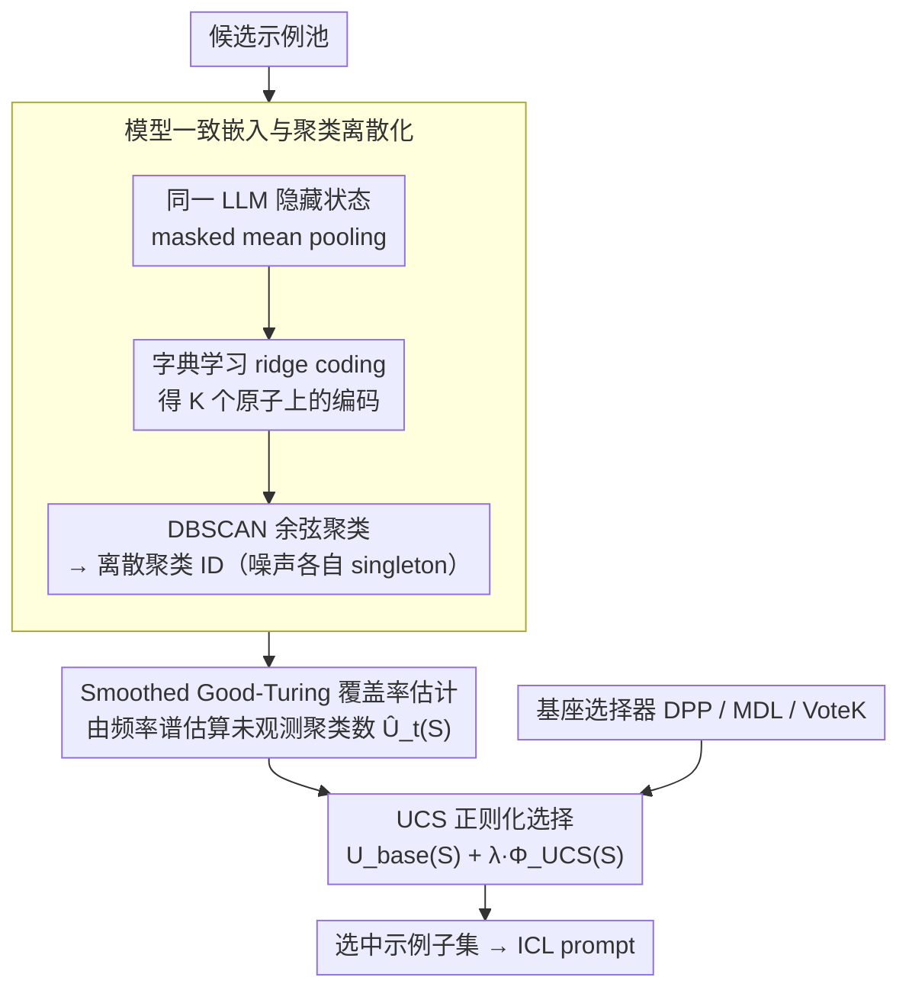

# UCS: Estimating Unseen Coverage for Improved In-Context Learning

**会议**: ACL 2026 Findings  
**arXiv**: [2604.12015](https://arxiv.org/abs/2604.12015)  
**代码**: [https://github.com/Raina-Xin/UCS](https://github.com/Raina-Xin/UCS)  
**领域**: 上下文学习  
**关键词**: In-Context Learning, 示例选择, 覆盖率估计, Good-Turing估计, 聚类

## 一句话总结

本文提出 UCS（Unseen Coverage Selection），一种基于 Smoothed Good-Turing 估计器的无训练子集级覆盖率先验，通过估计候选示例集中未观测到的潜在聚类数量来正则化现有 ICL 示例选择方法，在意图分类和推理任务上提升 2-6% 准确率。

## 研究背景与动机

**领域现状**：In-Context Learning（ICL）的性能高度依赖于选择哪些示例放入 prompt。现有方法基于相似度（如与查询的语义接近度）、多样性（如 DPP）或信息论标准（如 MDL）来选择示例。

**现有痛点**：现有方法都在实例级别操作——评估单个示例的相关性或成对多样性，但缺乏子集级别的覆盖率视角。一个好的示例集应该覆盖任务底层的多种潜在模式（latent clusters），但没有方法能量化当前选择集还有多少潜在模式未被覆盖。

**核心矛盾**：ICL 示例池中的潜在模式分布呈严重长尾——少数模式占据大量样本，大量模式仅有少量样本。基于相似度或多样性的方法倾向于从频繁模式中选取，导致稀有模式被系统性忽略。

**本文目标**：提出一个子集级覆盖率先验，能作为轻量级插件增强现有 ICL 选择方法，鼓励选择覆盖更多潜在模式的示例集。

**切入角度**：借鉴生态学中"未观测物种数"估计的经典方法——Smoothed Good-Turing 估计器，将 ICL 示例选择中的"未覆盖潜在聚类"类比为"未观测物种"。

**核心 idea**：用模型一致的嵌入空间中的聚类来定义潜在模式，用 Good-Turing 估计器从频率谱中估算还有多少聚类未被覆盖，将此估计值作为正则项加入现有选择目标。

## 方法详解

### 整体框架

UCS 分三步：(1) 用 LLM 自身的嵌入表示所有候选示例（模型一致表示）；(2) 通过字典学习+DBSCAN 将连续嵌入离散化为聚类 ID（离散化）；(3) 用 Smoothed Good-Turing 估计器从选定子集的频率谱估算总聚类数量（覆盖率估计），与现有选择目标加权组合。

### 关键设计

**1. 模型一致嵌入与聚类离散化：把连续嵌入压成离散"潜在模式"标签，才能数清覆盖了几种模式**

要谈"覆盖了多少潜在模式"，先得把模式定义出来。UCS 用推理时同一个 LLM 提取候选示例的隐藏状态（只取输入部分、排除标签），经 masked mean pooling 得到固定长度向量——用同一个模型保证嵌入空间与下游推理一致。接着不直接对原始向量聚类，而是先做字典学习（ridge coding），得到每个示例在 $K$ 个原子上的编码，再在归一化编码空间里用 DBSCAN（余弦距离）聚类，噪声点各自单列为 singleton 聚类。之所以不用 argmax 取单一原子，是因为那样会让高频原子吃掉大部分样本、抹掉多原子的组合结构；字典学习加聚类则能捕获反复出现的模式组合，同时把长尾的细粒度单元保留下来——而长尾正是后面覆盖率估计要盯的对象。

**2. Smoothed Good-Turing 覆盖率估计：借生态学"未观测物种数"的统计，算出还有多少聚类没被选到**

有了离散聚类标签，核心问题变成：当前选中的子集 $S$ 还漏掉了多少种潜在模式？这正是生态学里"再采样会发现多少新物种"的经典问题。UCS 对子集的聚类标签构建频率谱 $f_s(S)$（恰好出现 $s$ 次的聚类有多少个），用 Smoothed Good-Turing 估计器预测再采 $m$ 个样本会观测到多少新聚类：

$$\hat{U}_t^{SGT}(S) = -\sum_{s=1}^{M} (-t)^s w_s(t,\alpha) f_s(S)$$

于是覆盖率函数 $\Phi_{UCS}(S) = K_{seen}(S) + \hat{U}_t(S)$ 把"已观测聚类数"和"预测的未观测聚类数"一并计入。这一步的统计学直觉在于：频率谱里 singleton（出现 1 次）和 doubleton（出现 2 次）的数量，恰恰编码了关于未观测类别的丰富信息——稀有类越多，说明潜在还没露面的模式也越多。

**3. UCS 正则化选择：不替换现有选择器，只当一个即插即用的先验加进去**

UCS 是子集级函数、不能拆成单个示例的得分，所以作者不让它单独当选择器，而是作为正则项叠加到现有方法上：

$$S^* = \arg\max_{|S|=B} \big(U_{base}(S; x_{test}) + \lambda \Phi_{UCS}(S)\big)$$

其中 $U_{base}$ 是 DPP / MDL / VoteK 各自的原始效用，$\lambda$ 控制覆盖率正则化强度，$\lambda=0$ 时直接退化回原方法。落到不同底座上接法略有差别：对 VoteK 用逆频率加权，对 DPP 用边际覆盖率增益，对 MDL 在候选集级别直接加分。这样做最大限度保留了原方法各自的长处，只在它们系统性忽略稀有模式时补上一层覆盖率视角。

### 损失函数 / 训练策略

UCS 完全免训练。离线预处理（嵌入+聚类）每个数据集 38-57 秒，在线推理额外开销约 0-3 秒。所有超参数都有明确的默认值（字典原子数 K、SGT 截断阶 M=20、扩展因子 t 等）。

## 实验关键数据

### 主实验

| 方法 | Banking77 (Qwen) | CLINC150 (Qwen) | HWU64 (Qwen) |
|--------|------|------|------|
| VoteK | 0.518 | 0.703 | 0.609 |
| UCS+VoteK | 0.543 (+2.5%) | 0.744 (+4.1%) | 0.671 (+6.2%) |
| DPP | 0.831 | 0.755 | 0.791 |
| UCS+DPP | 0.831 | 0.775 (+2.0%) | 0.794 |
| MDL | 0.764 | 0.748 | 0.785 |
| UCS+MDL | 0.771 | 0.752 | 0.801 (+1.6%) |

### 消融实验

| 配置 | 关键指标 | 说明 |
|------|---------|------|
| UCS+VoteK | 唯一聚类数 10.0, 聚类大小 1.0 | 完全消除冗余 |
| VoteK 原始 | 唯一聚类数 9.67, 聚类大小 8.50 | 有大量冗余 |
| 跨模型联合字典 | 下降 | 强制对齐不同嵌入空间会丢失信息 |

### 关键发现

- **查询无关方法获益最大**：VoteK + UCS 在 HWU64 上提升 6.2%（Qwen）和 4.1%（Llama），因为 VoteK 原本最容易选出冗余示例。
- **推理任务也有效**：在 BBEH 推理任务上，UCS+DPP 在 Shuffled Objects 上提升 12.5 pp，UCS+MDL 在 Causal Understanding 上提升 8.4 pp。
- **聚类分布呈严重长尾**：所有数据集-模型组合中，聚类大小分布都极度偏斜——大量 singleton 和少数主导聚类，验证了覆盖率先验的必要性。
- **模型一致嵌入优于跨模型联合**：联合字典学习会损害高能力模型的细粒度区分能力。
- **计算开销极小**：离线预处理 38-57s，在线额外 0-3s。

## 亮点与洞察

- **统计学与 NLP 的优雅联接**：将生态学中的"未观测物种数"估计（Good-Turing）应用到 ICL 示例选择中的"未覆盖潜在聚类"估计，类比自然且方法论严谨。
- **即插即用的设计**：UCS 作为正则项可以无缝叠加到任何现有选择方法上，不修改底层检索流程，$\lambda=0$ 退化为原始方法，非常实用。
- **可解释的聚类分析**：UCS 生成的聚类具有语义可解释性（如 Banking77 中的身份验证、ATM 取现等微主题），可提供任务结构的洞察。

## 局限与展望

- 对已经很强的查询依赖方法（DPP 在某些数据集上已接近饱和），UCS 的增益有限。
- 聚类质量依赖 DBSCAN 的超参数选择（eps 需要自适应启发式）。
- SGT 估计器在小样本选择预算（B=10）下的统计可靠性有限。
- 仅在 B=10 的固定预算下评估，不同预算下的表现未知。

## 相关工作与启发

- **vs DPP**: DPP 通过行列式最大化鼓励多样性，但不显式量化覆盖率。UCS 提供了互补的子集级覆盖信号，与 DPP 组合效果更好。
- **vs VoteK**: VoteK 基于投票选择全局示例集，无多样性保障。UCS 通过逆频率加权大幅消除冗余。
- **vs MDL**: MDL 用最小描述长度选择信息量大的示例，UCS 从覆盖率角度提供正交的优化信号。

## 评分

- 新颖性: ⭐⭐⭐⭐ Good-Turing 在 ICL 中的应用新颖，子集级覆盖率视角有价值
- 实验充分度: ⭐⭐⭐⭐ 三模型三分类三推理任务，但固定预算限制了分析深度
- 写作质量: ⭐⭐⭐⭐⭐ 方法论清晰严谨，理论与实验衔接紧密
- 价值: ⭐⭐⭐⭐ 实用的即插即用工具，可直接应用于 ICL 部署

<!-- RELATED:START -->

## 相关论文

- [\[ACL 2026\] DeCoVec: Building Decoding Space based Task Vector for Large Language Models via In-Context Learning](decovec_building_decoding_space_based_task_vector_for_large_language_models_via_.md)
- [\[AAAI 2026\] LILAD: Learning In-context Lyapunov-stable Adaptive Dynamics Models](../../AAAI2026/llm_nlp/lilad_learning_in-context_lyapunov-stable_adaptive_dynamics_models.md)
- [\[ACL 2025\] Beyond Output Matching: Bidirectional Alignment for Enhanced In-Context Learning](../../ACL2025/llm_nlp/beyond_output_matching_bidirectional_alignment_for_enhanced_in-context_learning.md)
- [\[ACL 2025\] Exploring Explanations Improves the Robustness of In-Context Learning](../../ACL2025/llm_nlp/exploring_explanations_improves_the_robustness_of_in-context_learning.md)
- [\[ICLR 2026\] In-Context Algebra](../../ICLR2026/llm_nlp/in-context_algebra.md)

<!-- RELATED:END -->
