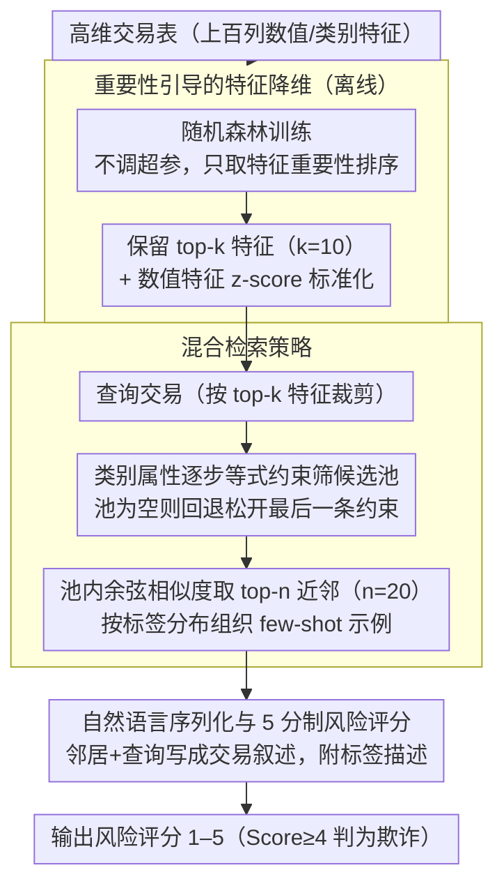

# Understanding Structured Financial Data with LLMs: A Case Study on Fraud Detection

**会议**: ACL 2026  
**arXiv**: [2512.13040](https://arxiv.org/abs/2512.13040)  
**代码**: 无  
**领域**: 信息检索 / 金融NLP  
**关键词**: 欺诈检测, 表格数据, 检索增强生成, 特征选择, 上下文学习

## 一句话总结

本文提出 FinFRE-RAG，一种两阶段框架，通过重要性引导的特征降维将高维表格交易数据序列化为自然语言，并结合标签感知的检索增强上下文学习，使开源 LLM 在金融欺诈检测上的 F1/MCC 大幅提升，缩小了与专用表格分类器的性能差距。

## 研究背景与动机

**领域现状**：金融欺诈检测主要依赖 XGBoost、LightGBM 等表格模型，需要大量特征工程且可解释性有限。LLM 能生成人类可读的解释并辅助特征分析，但直接应用于表格欺诈检测时表现很差。

**现有痛点**：(1) 表格输入不匹配——交易数据是数值/类别特征的高维表格，LLM 预训练在自然语言上，对结构化特征的语义和数值精度处理不佳；(2) 欺诈模糊性和稀缺性——欺诈定义因机构、产品、地区不同而变化，且比例极低（<1%），LLM 难以识别细微区分模式。

**核心矛盾**：LLM 具备推理和生成可解释性分析的潜力，但不知道"什么是欺诈"——需要教会 LLM 哪些特征模式与欺诈行为相关。

**本文目标**：设计一种无需微调的框架，通过特征降维和检索增强使 LLM 能理解和检测表格金融欺诈。

**切入角度**：将欺诈检测重构为基于实例的推理问题——通过检索语义相似的历史交易作为 few-shot 示例，让 LLM 通过类比推理来判断。

**核心 idea**：离线特征降维（用随机森林排序保留 top-k 特征）+ 在线检索增强上下文学习（类别过滤→数值相似性搜索→自然语言序列化）。

## 方法详解

### 整体框架

FinFRE-RAG 想解决的是：直接把一行高维交易记录丢给 LLM 判断是否欺诈几乎等于乱猜，因为模型既看不懂数值特征的语义，也不知道这个机构的"欺诈"长什么样。它的思路是把检测问题改写成"找几条最像的历史交易、照着它们的标签类比推理"，并拆成离线与在线两个阶段。离线阶段在外部数据集上训练一棵随机森林，拿到特征重要性排序、保留信息量最大的 top-k 个特征，并对所有数值特征预先做好 z-score 标准化；在线阶段对每笔查询交易，先用类别属性把候选池筛窄，再在池内按数值相似度取最近邻，把它们和查询一起写成自然语言 prompt 交给 LLM，输出一个 5 分制风险评分。

### 关键设计

**1. 重要性引导的特征降维：用最便宜的方式挑出"该看哪些列"**

交易表动辄上百列，全塞进 prompt 既超上下文窗口又被噪声淹没，而 LLM 对无关数值特征尤其敏感。作者在外部数据集上训练一棵随机森林、连超参数都不调，目的不是得到一个好分类器，而是用最小代价换一份"粗糙但够用"的特征重要性排序，据此保留 top-k（默认 $k=10$）个特征，并对所有数值特征预计算 z-score 标准化以备后续检索。砍到 10 列之后 prompt 大幅变短，LLM 也能把注意力集中在真正有判别力的属性上，后面会看到再多加特征反而因引入噪声而掉点。

**2. 混合检索策略：类别过滤定结构、数值相似度做细粒度匹配**

要让类比推理成立，检索到的"邻居"必须既在结构上同类、又在数值上接近，单一相似度做不到这点。FinFRE-RAG 先按重要性顺序对类别属性逐步施加等式约束（如限定相同交易类型），并带一个回退机制，一旦约束太严导致候选为空就松开最后一条，避免检索不到样本；在筛出的候选池内，再用标准化特征向量之间的余弦相似度取 top-n（默认 $n=20$）近邻，并按标签分布组织成 few-shot 示例。类别过滤保证了语义一致性，数值相似度补上细粒度匹配，正好把 LLM 擅长的"照着相似案例类比"这一长处用满。

**3. 自然语言序列化与 5 分制风险评分：把表格翻成 LLM 听得懂的话，并允许它表达犹豫**

检索到的邻居若只是一串键值对，LLM 很难读出其中的语义关联。这里把每条特征嵌进自然语言模板而非简单罗列，每个检索示例都附上对应的标签描述，让上下文读起来像一段段交易叙述。最终也不让模型直接做欺诈/正常的硬二分类，而是输出 1–5 的风险评分（$\text{Score}\ge 4$ 才判为欺诈）。这种细粒度信号给了模型表达不确定性的余地，实验里它始终比逼模型一次性下硬判断的二分类输出更稳。

### 损失函数 / 训练策略

FinFRE-RAG 不训练 LLM 本体，唯一被"训练"的只是特征降维阶段那棵简单随机森林。推理用 Qwen3-14B/80B、Gemma 3-12B/27B、GPT-OSS-20B/120B 六个开源模型，并以 LoRA 微调作为对照基线。

## 实验关键数据

### 主实验

**FinFRE-RAG vs 直接 prompting（F1 提升，Gemma 3-12B）**

| 数据集 | 直接 prompting F1 | + FinFRE-RAG F1 | 提升 |
|--------|-------------------|-----------------|------|
| ccf | 0.00 | 0.79 | +0.79 |
| ccFraud | 0.13 | 0.59 | +0.46 |
| IEEE-CIS | 0.01 | 0.59 | +0.58 |
| PaySim | 0.00 | 0.71 | +0.71 |

### 消融实验

**特征数量和检索数量的影响**

| 配置 | 说明 |
|------|------|
| k=10 特征 | 最优平衡点，更多特征增加噪声 |
| n=20 近邻 | 足够提供类比推理上下文 |
| 5 分制评分 | 优于二分类输出 |

### 关键发现

- 直接 prompting 下 LLM 几乎随机猜测（F1≈0），FinFRE-RAG 后 F1 提升至 0.5-0.8
- Gemma 3-12B + FinFRE-RAG 在多个数据集上与 XGBoost/LightGBM 竞争力相当
- LLM 微调（LoRA）在大多数设置下不如 FinFRE-RAG，说明 ICL 比参数更新更适合此任务
- 5 分制风险评分始终优于二分类，因为模型可以表达不确定性
- 尽管性能接近专用分类器，LLM 的独特价值在于生成可解释的欺诈分析理由

## 亮点与洞察

- 将金融欺诈检测重构为"基于实例的推理"而非"分类"——充分利用了 LLM 的类比推理能力
- 不需要训练 LLM 参数，完全依赖 ICL，适合金融领域对数据隐私的严格要求
- 特征降维 + 检索增强的两阶段设计通用性强，可推广到其他表格数据任务

## 局限与展望

- LLM 仍然落后于专用表格分类器（如 XGBoost），尤其在大规模高维场景下
- 特征降维依赖随机森林的特征重要性排序，可能不适合所有数据分布
- 仅在 4 个公开数据集上评估，未在真实的生产级欺诈检测系统中验证
- 5 分制评分的阈值（Score≥4）是固定的，未做最优阈值搜索

## 相关工作与启发

- **vs XGBoost/LightGBM**: 专用分类器在纯预测性能上仍有优势，但不提供可解释理由
- **vs 金融 LLM (FinGPT等)**: 领域特定 LLM 基于较旧的架构，指令遵循能力不足
- **vs 直接 LLM prompting**: 不做特征选择和检索时 LLM 几乎完全失败，证明了框架的必要性

## 评分

- 新颖性: ⭐⭐⭐ 框架思路较直接，将 RAG 应用于表格数据的组合较新
- 实验充分度: ⭐⭐⭐⭐ 4 数据集 × 6 模型 + 微调对比 + 多维度分析
- 写作质量: ⭐⭐⭐⭐ 问题分析清晰，RQ 驱动的实验设计
- 价值: ⭐⭐⭐⭐ 为金融领域 LLM 应用提供了实用的 baseline 方法

<!-- RELATED:START -->

## 相关论文

- [\[ACL 2025\] Can LLMs Interpret and Leverage Structured Linguistic Representations? A Case Study with AMRs](../../ACL2025/llm_nlp/can_llms_interpret_and_leverage_structured_linguistic_representations_a_case_stu.md)
- [\[ACL 2025\] Is It JUST Semantics? A Case Study of Discourse Particle Understanding in LLMs](../../ACL2025/llm_nlp/is_it_just_semantics_a_case_study_of_discourse_particle_understanding_in_llms.md)
- [\[ACL 2026\] A Study of LLMs' Preferences for Libraries and Programming Languages](a_study_of_llms39_preferences_for_libraries_and_programming_languages.md)
- [\[ACL 2025\] How LLMs Comprehend Temporal Meaning in Narratives: A Case Study in Cognitive Evaluation of LLMs](../../ACL2025/llm_nlp/how_llms_comprehend_temporal_meaning_in_narratives_a_case_study_in_cognitive_eva.md)
- [\[ACL 2025\] Explicit and Implicit Data Augmentation for Social Event Detection](../../ACL2025/llm_nlp/explicit_and_implicit_data_augmentation_for_social_event_detection.md)

<!-- RELATED:END -->
