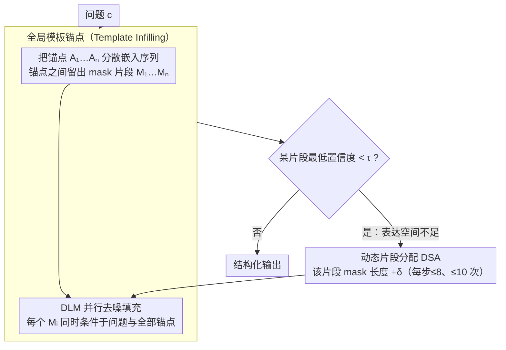

# Unlocking the Potential of Diffusion Language Models through Template Infilling

**会议**: ACL2026  
**arXiv**: [2510.13870](https://arxiv.org/abs/2510.13870)  
**代码**: 无  
**领域**: code_intelligence  
**关键词**: 扩散语言模型, 模板填充, 结构化生成, 动态片段分配, 代码生成  

## 一句话总结
本文提出 Template Infilling，把扩散语言模型的生成条件从单一前缀改成分布在整段输出中的结构锚点，并用动态片段分配给复杂推理留出空间，从而在数学推理、代码生成和全局规划任务上显著稳定并提升并行生成质量。

## 研究背景与动机
**领域现状**：扩散语言模型不按从左到右的顺序逐 token 生成，而是把句子看成一个可反复去噪的整体，可以在任意位置同时恢复 token。这个性质理论上很适合全局规划、代码补全和长链推理，因为模型可以同时看到前后约束，不必像自回归模型那样只能依赖前缀。

**现有痛点**：现实中的 DLM 推理并没有真正释放这种自由度。许多方法为了稳定采样，仍然把输出切成块，或者借用自回归模型的 prefix prompting，让模型沿着近似从左到右的路径生成。这样做虽然缓解了数值不稳定和上下文崩坏，却把 DLM 最有价值的任意位置条件化能力重新锁回了半自回归框架。

**核心矛盾**：DLM 的高自由度既是优势也是风险。没有结构时，所有位置都可以同时变化，搜索路径数量随长度爆炸，容易出现重复、逻辑漂移和局部片段互相冲突；但如果只靠 block-wise 或前缀约束压低自由度，又会丢掉 DLM 能利用未来约束和全局骨架的能力。

**本文目标**：作者希望找到一种不训练新模型、也不把 DLM 强行改回自回归生成的控制方式。具体来说，它要让模型在生成前知道回答的全局结构，让每个空缺片段都同时受前后锚点约束，并在遇到复杂问题时自动扩展推理空间。

**切入角度**：论文的观察很直接：自回归 prompt 只能放在前面，DLM 的条件却可以散布在整段序列中。因此，与其给模型一个“请逐步思考”的前缀，不如把“步骤”“检查”“答案”等结构锚点直接嵌入目标序列，让模型在这些锚点之间做并行填空。

**核心 idea**：用全局模板锚点替代单一前缀提示，把扩散语言模型的自由生成变成“受结构边界条件约束的多段填充”。

## 方法详解
这篇论文的核心不是训练一个新 DLM，而是改变 DLM 在推理时如何接收条件。传统 prefix prompting 把指令放在输出左侧，然后希望模型一路遵守；TI 则把指令拆成多个固定锚点，放到回答的不同位置，中间留出 mask span 给模型填充。这样一来，每个待生成片段都不仅看到问题和前文，也看到后续结构，例如“先分析”“再计算”“最后给出答案”。

作者特别强调，这里的模板不是普通 FIM 任务里的局部前后缀。FIM 通常只是让模型补一个中间空洞，而 TI 是把多个结构性锚点分布在完整响应空间里，给整条推理路径建立骨架。对于数学题，模板可以强制模型先展开推导再输出最终数值；对于代码任务，模板可以把逻辑处理、实现和返回值拆开；对于安全场景，模板还可以插入“草拟、批判、修正”的反思阶段。

### 整体框架
TI 的输入是原始问题 $c$、一组结构锚点 $A_1, A_2, ..., A_n$，以及锚点之间的 mask 片段 $M_1, M_2, ..., M_n$。最终序列可写成 $S=[c,A_1,M_1,A_2,M_2,...,A_n,M_n]$。其中 $A_i$ 是不可变的模板文本，$M_i$ 是由 DLM 在扩散采样中补全的内容。

生成时，模型不再只依据 $x_{<t}$ 预测下一个 token，而是让每个片段 $M_i$ 条件化在问题和所有模板锚点上，即近似使用 $p(M_i|c,A_1,...,A_n)$。这使得“未来锚点”也能参与约束当前片段。例如模型在写中间推理时已经知道后面必须进入最终答案区域，因此更不容易在局部展开中迷失。

完整流程可以概括为三步。第一步，根据任务构造一个静态结构模板，论文为了验证普适性，避免了复杂 prompt engineering。第二步，把模板和 mask 放入 DLM 的并行采样过程，模型在所有空段中同时去噪。第三步，若某个片段的置信度持续偏低，则用动态片段分配（Dynamic Span Allocation，DSA）扩展该片段的 mask 长度，让模型获得更多表达空间。

### 关键设计
**1. 全局模板锚点：把开头的一句软提示，摊成贯穿整段输出的结构边界条件**

prefix prompting 的根本局限是约束只能放在序列最左边，而 DLM 本可以在任意位置被条件化，这份自由度被白白浪费了。TI 让模板由多个固定锚点组成，每个锚点承担一个推理角色——计划、步骤、检查、答案——分散嵌进目标序列里；DLM 在填充任意 mask 片段时都能同时注意到所有锚点，于是生成目标从"接着前缀往下写"变成"在既定骨架内补全整段响应"。这等于把原本路径数随长度爆炸的高自由度采样，约束成一次有边界的搜索：模型写中间推理时就已经知道后面必须落到最终答案区，因此更不容易在局部展开里迷失，同时并行生成能力一点没丢。作者还观察到，像 Dream-Base 这种从自回归模型适配来的 DLM 无条件生成时填充顺序很乱、局部片段互相打架；一旦加入模板，模型会先把结构锚点附近的信息稳住，再同步补齐空缺内容（安全实验里的 “Draft-Critique-Refine” 模板复现了同一现象）。可见模板注入的并不只是更多 prompt 文字，而是采样空间里的一种结构先验——它逼模型先满足高层约束、再填局部细节，因此在快速采样和长输出这两种最容易崩的设定下都更稳。

**2. 动态片段分配 DSA：让静态模板在遇到难题时自己申请更多"纸面空间"**

固定长度的模板有个硬伤——简单题刚好，复杂题却会被压进过短的 mask 里，推理还没写完就被截断。DSA 在每个扩散步骤监控片段内 token 的预测置信度，一旦某片段里最不确定的 token 概率低于阈值 $\tau$，就把该片段长度从 $|M_i|$ 扩展为 $|M_i|+\delta$；论文实验中每步最多扩 8 个 token、最多扩 10 次。它用"低置信度"作为"空间不够"的信号，在不改动模板结构的前提下，按问题难度自动分配推理长度，后面消融会看到正是这一步把 GSM8K 从 36.00 又抬到 44.58。

### 损失函数 / 训练策略
本文方法是训练-free 的推理框架，不引入新的训练损失。实验使用 LLaDA-8B 和 Dream-7B 的 base / instruct 版本，重点考察纯并行生成质量：模型需要在 128 token 预算内同时计划和生成。TI 使用每个任务一套静态模板，DSA 负责按置信度动态扩展片段。评估时对比 Vanilla 无条件生成和 Prefix Prompting，以区分结构锚点带来的增益和普通提示带来的影响。

## 实验关键数据

### 主实验
主实验覆盖数学推理、代码生成和多约束规划。最值得注意的是，Prefix Prompting 在不少设置中反而降低性能，而 TI 在 LLaDA-Instruct 与 Dream-Base 上提升非常明显，说明 DLM 的控制方式不能简单照搬自回归模型。

| 模型 | 方法 | GSM8K | MATH500 | HumanEval | Trip CSR | 平均 |
|------|------|------|---------|-----------|----------|------|
| LLaDA-8B Instruct | Vanilla | 49.58 | 17.00 | 15.85 | 12.13 | 23.64 |
| LLaDA-8B Instruct | TI | 71.49 | 21.80 | 32.93 | 12.06 | 34.57 |
| Dream-7B Base | Vanilla | 8.87 | 3.60 | 18.29 | 1.13 | 7.97 |
| Dream-7B Base | TI | 44.58 | 14.40 | 29.88 | 15.94 | 26.20 |
| Dream-7B Instruct | Vanilla | 35.86 | 11.40 | 20.12 | 0.63 | 17.00 |
| Dream-7B Instruct | TI | 39.80 | 12.80 | 33.54 | 16.31 | 25.61 |

从平均表现看，TI 相比基线平均提升 9.40 个百分点。HumanEval 上的提升尤其说明它不只适合数学 CoT，也能帮助代码生成中的结构化实现；Trip Planning 上 Dream 模型的大幅提升则表明多约束规划受益于全局锚点。

### 消融实验
论文在 GSM8K 上做了逐步消融，使用 Dream-Base 作为代表，可以看到仅有边界锚点已经明显好过前缀提示，而加入详细说明和 DSA 后继续提升。

| 配置 | 策略 | GSM8K Acc. | 相对 Vanilla |
|------|------|------------|--------------|
| Vanilla | 无结构 | 8.87 | 0.00 |
| Prefix Prompting | 自回归式前缀 | 8.79 | -0.08 |
| TI Minimal | 静态边界锚点 | 24.94 | +16.07 |
| TI Detailed | 静态详细模板 | 36.00 | +27.13 |
| TI + DSA | 动态片段分配 | 44.58 | +35.71 |

作者还测试了锚点位置扰动。Base 位置准确率为 0.4458，Early 为 0.4033，Late 为 0.4359，Compressed 为 0.4367。虽然默认位置最好，但性能没有崩掉，说明增益不是过拟合某个手工位置，而来自全局条件化本身。

### 关键发现
- Prefix Prompting 对 DLM 并不可靠。它在 Dream-Base 上把 HumanEval 从 18.29 拉到 3.66，在多个设置中退化，说明前缀式控制会和 DLM 的并行采样机制冲突。
- DSA 是最大增益来源之一。Minimal TI 已经证明结构骨架有效，DSA 则把复杂题所需的可变推理长度补上，使 GSM8K 从 36.00 进一步提升到 44.58。
- TI 对快速采样和长生成更稳。论文的长度与采样步数分析显示，在固定采样步数下，生成长度增加时 TI 能明显缓解 baseline 的质量下降；在固定长度下，减少采样步数时 TI 也保持更高准确率。
- Instruct tuning 可能把 DLM 拉回自回归偏置。Dream-Instruct 在采样轨迹上更接近对角线式生成，作者认为这可能来自指令微调中对前缀 token 的强监督，反而压制了 DLM 的全局规划潜力。

## 亮点与洞察
- 这篇论文最有价值的洞察是：DLM 的控制单位不应该只是 prompt 文本，而应该是输出空间中的结构。把约束放在未来位置，正好利用了 DLM 能同时看前后文的能力。
- TI 把“让模型慢慢想”从一句软指令变成了物理结构。模型必须在模板锚点之间填充内容，这比希望它自觉遵守 CoT 更稳定。
- DSA 是一个很实用的细节。它承认模板既要给结构，又不能把推理长度写死，用低置信度作为扩容信号，简单但契合扩散采样过程。
- 对代码生成也有启发。代码本身天然有函数签名、控制流、返回值和测试约束，如果把这些结构做成分布式锚点，DLM 的 infilling 能力可能比传统左到右生成更适合补复杂函数体。
- 安全场景的 “Draft-Critique-Refine” 示例说明模板可以作为过程约束。它不是在答案前面贴安全提示，而是给输出预留反思段，让模型在生成轨迹中被迫经过检查。

## 局限与展望
- 模板仍然需要人工设计。论文为了证明普适性刻意使用静态模板，但真正部署时，不同任务的最佳锚点、锚点数量和位置仍然需要搜索或自动生成。
- 当前模型并非为 TI 训练。作者也指出，现有 instruct DLM 仍按传统 prompt-inference 范式训练，未必能充分利用分布式模板；未来可以把 TI 纳入指令微调或偏好优化目标。
- 实验主要围绕生成式推理任务。MMLU 这类判别式 benchmark 不适合本文目标，但也意味着论文尚未说明 TI 对一般知识问答、长文写作或交互式工具调用的收益。
- DSA 的阈值和扩展策略仍偏启发式。低置信度并不总是表示空间不足，也可能表示模型知识缺失或模板不合适；更细粒度的扩容和回收机制会更稳。
- 结构锚点可能带来格式依赖。如果模型学会迎合模板而不是解决问题，复杂模板反而可能诱导形式正确但内容空洞的推理。

## 相关工作与启发
- **vs Block Diffusion**: Block-wise 方法通过切块降低自由度，优点是稳定和便于工程优化；TI 不把序列切回局部顺序，而是用全局锚点约束并行填充，更强调释放 DLM 的任意位置条件化能力。
- **vs Prefix Prompting / CoT**: CoT 和 Plan-and-Solve 依赖前缀软指导，模型可以忽略或中途偏离；TI 把步骤结构放到目标序列内部，使后续约束也能直接参与当前片段生成。
- **vs Constrained Decoding**: 传统 constrained decoding 用外部规则屏蔽非法 token，更像硬性搜索剪枝；TI 是在输入条件层面给模型结构，让模型在生成过程中自然对齐模板。
- **vs FIM / Code Infilling**: FIM 通常补一个局部空洞，目标是连接前后文；TI 把多个锚点作为全局骨架，关注的是整段推理或代码的规划一致性。
- **启发**: 后续可以尝试自动模板生成器，让模型先为问题生成结构锚点，再由 DLM 填充；也可以把单元测试、类型签名、异常处理路径作为代码生成模板锚点。

## 评分
- 新颖性: ⭐⭐⭐⭐☆ 把 DLM 的任意位置条件化转化为全局模板控制，想法清晰且贴合模型机制。
- 实验充分度: ⭐⭐⭐⭐☆ 覆盖两类 DLM、四类任务和多项分析，但真实大规模代码任务和自动模板搜索还不充分。
- 写作质量: ⭐⭐⭐⭐☆ 论文主线很顺，动机和机制解释到位，部分公式和表格排版略拥挤。
- 价值: ⭐⭐⭐⭐⭐ 这是一个训练-free、低成本、可迁移的 DLM 控制范式，对未来非自回归语言模型很有参考价值。

<!-- RELATED:START -->

## 相关论文

- [\[ICLR 2026\] DreamOn: Diffusion Language Models For Code Infilling Beyond Fixed-size Canvas](../../ICLR2026/llm_nlp/dreamon_diffusion_language_models_for_code_infilling_beyond_fixed-size_canvas.md)
- [\[CVPR 2026\] Perception Programs: Unlocking Visual Tool Reasoning in Language Models](../../CVPR2026/llm_nlp/perception_programs_visual_tool_reasoning.md)
- [\[ICML 2026\] Reasoning on the Manifold: Bidirectional Consistency for Self-Verification in Diffusion Language Models](../../ICML2026/llm_nlp/reasoning_on_the_manifold_bidirectional_consistency_for_self-verification_in_dif.md)
- [\[ICML 2026\] dLLM-Cache: Accelerating Diffusion Large Language Models with Adaptive Caching](../../ICML2026/llm_nlp/dllm-cache_accelerating_diffusion_large_language_models_with_adaptive_caching.md)
- [\[ACL 2026\] FastDiSS: Few-step Match Many-step Diffusion Language Model on Sequence-to-Sequence Generation](fastdiss_few-step_match_many-step_diffusion_language_model_on_sequence-to-sequen.md)

<!-- RELATED:END -->
