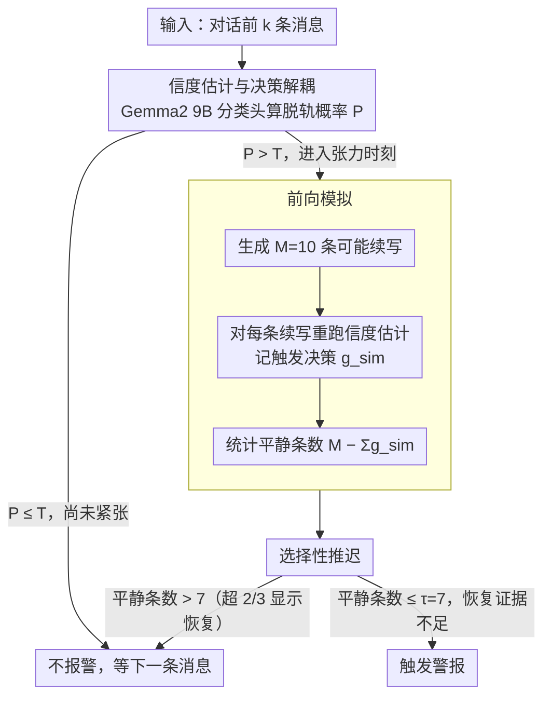

# 等等，还有出路：一个对话脱轨预测的决策机制

**会议**: ACL 2026  
**arXiv**: [2605.29243](https://arxiv.org/abs/2605.29243)  
**代码**: https://github.com/CornellNLP/ConvoKit  
**领域**: LLM / NLP  
**关键词**: 对话脱轨预测，决策机制，前向模拟，虚警率

## 一句话总结

论文将对话脱轨预测中的"信度估计"与"触发决策"解耦，通过前向模拟识别可恢复的紧张时刻，实现显著降低虚警率（从 36.2% 降至 26.7%）而不牺牲准确性。

## 研究背景与动机

**领域现状**：对话脱轨预测任务旨在实时预测在线讨论何时会升级为人身攻击。现有系统（GCN、Transformer、LLM）都采用固定阈值策略：一旦估计的脱轨概率超过阈值 T 就触发警报。虽然这些模型在准确性上表现不错，但用户反馈普遍抱怨虚警率过高（62% 的用户报告虚警问题严重）。

**现有痛点**：问题在于现有模型混淆了两个本应独立的任务：(1) 估计在当前消息后脱轨的概率，(2) 决定是否现在就发出警报。模型只看过去，忽视了对话可能自我纠正的可能性。例如，某个高张力时刻虽然看起来危险，但下一条消息可能会通过解释、道歉或话题转移来缓解局势。

**核心矛盾**：传统分类问题只需给出单一标签，而在线脱轨预测面临"未知地平线"难题——不知道攻击何时到来（或是否到来），必须在每条消息后判断是立即行动还是等待更多信息。固定阈值无法编码"等待并观察"的决策逻辑。

**本文目标**：设计一个明确的决策机制，使系统能够：(a) 区分持久张力与暂时张力；(b) 在感知到对话可能恢复的时刻推迟警报；(c) 在不降低整体准确率的前提下大幅减少虚警。

**切入角度**：通过人类实验发现，人类通过选择性推迟决策而非简单提高阈值来达到低虚警率。人类在 67% 的虚警时刻后观察到张力下降——这提示我们可以用前向预测来模拟这一人类直觉。

**核心 idea**：用大语言模型生成 M 条可能的下文，检查这些模拟中有多少不再触发警报（平静回复数），如果平静回复足够多则推迟决策；否则立即触发。这将决策与纯概率估计解耦，引入对未来可恢复性的推理。

## 方法详解

### 整体框架

系统要解决的核心问题是：传统脱轨预测把"估计脱轨概率"和"是否现在就报警"两件事压成了一步——只要概率过阈值就报警，导致虚警泛滥。本文把这两步拆开。第一步沿用现有 SOTA 模型（Gemma2 9B）做信度估计，对前 $k$ 条消息算出脱轨概率 $\mathcal{P}(\mathrm{derailment}\mid u_1,\ldots,u_k)$；第二步才是新增的决策层：一旦概率越过阈值进入"张力时刻"，不立即报警，而是先让模型模拟接下来可能发生什么，再据此判断是现在出手还是再等一条消息。整条流水线是"估概率 → 检测张力 → 前向模拟 → 决定触发/推迟"。

### 关键设计

**1. 信度估计与决策解耦：不动模型，只在决策层做文章**

固定阈值方案把概率估计和报警决策搅在一起，模型一旦给出高概率就别无选择。本文的第一个动作是把信度估计（belief estimation）原封不动地保留下来——直接复用现有 SOTA 信度模型，即在 Gemma2 9B 上接分类头、用 LoRA 微调得到的脱轨概率估计器，本文不重新训练它。所有改动都发生在它之上的决策层。这样做的好处是兼容性：任何未来更准的信度模型都能直接接进来，决策机制不必跟着重写，系统复杂度和训练成本都被压在最低。

**2. 前向模拟：让模型预演对话，看清"现在的紧张之后通常会怎样"**

固定阈值的根本盲点是只看过去、看不到未来——一个高张力时刻可能下一句就被解释、道歉或转移话题化解，但模型无从知晓。前向模拟正是为此而设：当概率越过阈值 $\mathcal{P} > T$、进入张力时刻时，让模型生成 $M=10$ 条可能的下一条消息 $u_{k+1}^{\mathrm{sim}_i}$，对每条模拟续写重新跑一遍信度估计，记下它在阈值下的触发决策 $g_{k+1}^{\mathrm{sim}_i}$。统计其中仍保持平静（不触发）的条数 $M-\sum_i g_{k+1}^{\mathrm{sim}_i}$：平静的越多，说明这股紧张大概率会自行消退，眼下不必报警。本质上，模拟就是把"这种局面之后一般如何收场"这个问题抛给模型自己的生成能力，等于让它"看见"了恢复的可能。

**3. 选择性推迟：只在真有恢复迹象时退让一步，而非一味放宽阈值**

人类实验里，受试者达到低虚警靠的不是简单调高阈值变保守，而是在 67% 的虚警时刻观察到张力下降后选择性地推迟。本文把这条直觉写成决策规则：记 $g_{k+1}^{\mathrm{sim}_i}$ 为第 $i$ 条模拟在阈值下的触发决策（1 触发、0 平静），则平静条数为 $M-\sum_i g_{k+1}^{\mathrm{sim}_i}$。当且仅当 $\mathcal{P} > T$ 且平静条数 $\le \tau$ 时才真正触发，否则推迟。取 $\tau=7$ 意味着：只有当平静模拟不超过 7 条时才报警；反过来，要推迟就得有超过 $2/3$ 的模拟（10 条里至少 8 条）显示恢复——推迟的门槛设得相当高，确保只在恢复证据充分时才退让。这是"再等一步棋"的策略，不是永久压住警报，而是看完下一条真实消息后重新判断。触发需同时满足"张力够高（$\mathcal{P}>T$）+ 恢复证据不足（平静模拟 $\le\tau$）"，因此既不会无差别推迟而漏掉真正的攻击，也不会在每个高张力时刻都硬报警，模拟提供的恢复证据成了筛掉假警报的依据。

### 训练与参数

模型使用 CGA-CMV 数据集（20,576 条对话）。训练时固定基础信度模型，仅在验证集上网格搜索 $\tau$ 使 F1 最大；推理时取 $M=10,\ \tau=7$。

## 实验关键数据

### 主实验

| 方法 | 准确度↑ | 虚警率↓ | 精准度↑ | 召回率↑ | F1↑ |
|------|--------|--------|--------|--------|-----|
| SOTA 基线 | 70.9 | 34.3 | 69.1 | 76.1 | 72.3 |
| + 选择性推迟 | 70.9 | **26.7** | 72.1 | 68.4 | 70.2 |
| + 随机推迟 | 69.4 | 30.2 | 70.0 | 69.0 | 69.2 |
| + 模拟（平均） | 70.2 | 36.2 | 68.1 | 76.6 | 72.0 |
| + 模拟（多数投票） | 70.0 | 36.9 | 67.7 | 76.7 | 71.8 |
| 预言阈值 | 70.0 | 26.7 | 71.5 | 66.8 | 69.0 |

关键发现：**选择性推迟将虚警率从 34.3% 降至 26.7%（减少 22%），同时维持准确度在 70.9%**。这个改进远超其他基线，说明问题根本上需要新的决策机制而非参数调优。

### 消融实验

| 组件 | 虚警率 | 说明 |
|------|--------|------|
| 完整系统（选择性推迟） | 26.7 | 搭载前向模拟的推迟决策 |
| 去掉模拟（固定阈值） | 34.3 | 退化为 SOTA |
| 去掉选择性（总是随机推迟） | 30.2 | 丧失判别力 |
| 更激进推迟（τ=5） | 20.1 | 虚警率最低但召回降至 62.3% |

### 关键发现

1. **推迟确实捕捉恢复信号**：在 79% 的推迟决策后，观察到张力立即下降。相比之下，SOTA 的虚警后张力下降的比例仅 55%。说明模拟机制成功识别了易恢复的时刻。
2. **人类基线启示**：9 名受试者在第二轮实验中达到 70% 准确度但虚警率仅 15.6%——远好于 SOTA 的 36.2%。更重要的是，人类触发的平均张力是 0.61，而 SOTA 是 0.72，说明人类**不是简单变保守，而是选择性地在特定时刻退让**。
3. **语言学特征对比**：用 Bayesian 区分词分析对比推迟前后的回复语言，发现：
   - **推迟后回复**：大量用"I would argue"、"even if"等**假设软化**表述。
   - **触发后回复**：充满"you don't even"、"people like you"等**人身指控**和**直接对抗**。

## 亮点与洞察

- **将决策与信度科学解耦**：过去多年的对话预测文献将两者混为一谈，这是首次明确分离。这个框架设计上就使得系统可以编码"何时不行动"的复杂逻辑，而非仅凭概率阈值蛮干。
- **人类基线的科学价值**：论文采用"游戏化"实验范式让受试者进行在线实时决策（不是离线标注），首次为 CGA 任务建立人类基准。
- **前向模拟作为决策信号**：用 LLM 生成来"窥视"可能的未来对话，是一个简洁优雅的想法。它避免了复杂的强化学习求解，直接利用模型的生成能力来完成推理。
- **参数 $\tau$ 提供直观控制杆**：系统使用者（moderators）可直接调整"需要多少模拟恢复证据才推迟"，从而在精准度与召回之间权衡，无需重新训练。

## 局限与展望

**作者承认的局限**：

1. 模拟仅前看一步，无法捕捉更长期的升级/缓和轨迹。
2. 依赖 LLM 模拟的保真度和偏差。LLM 生成的"下文"可能不代表真实用户会说什么。
3. 人类基线规模小（仅 84 对话，9 受试者）。
4. 方法目前仅评估于英文 Reddit/Wikipedia 对话，跨语言、跨域适应未知。

**自己发现的局限**：

1. **虚警率-召回权衡的本质限制**：论文通过选择性推迟降低虚警，但代价是召回从 76.1% 降至 68.4%。
2. **模拟成本**：M=10 的前向模拟意味着每个张力时刻都要调用 LLM 10 次，计算成本不菲。
3. **"恢复"的定义依赖训练数据**：什么叫"平静"是由模型学到的统计规律决定的，可能编码了数据集中特定社群的规范。

**具体改进思路**：

- 探索多步前向规划（用蒙特卡洛树搜索或动态规划）来预见更长期轨迹。
- 将决策策略表述为强化学习问题，学习最优的推迟/触发策略而非手工设计。
- 扩大人类实验规模，收集跨文化、跨语言的对话基准。

## 相关工作与启发

**vs 传统对话脱轨预测（Chang & Danescu 2019; Yuan & Singh 2023）**：他们完全依赖学到的信度模型，无显式决策层。本文分离决策，首次为脱轨预测引入"行为推理"维度。

**vs LLM 模拟在对话中的应用（Zhang et al. 2025）**：Zhang 用模拟进行静态预测，本文用模拟辅助动态决策。前者问"这对话最终会坏吗"，后者问"现在该出手吗"。

**vs 危机咨询中的 pivot 检测（Nguyen et al. 2025）**：都用 next-utterance 模拟发现对话关键节点，但目标不同——那篇是检测心理转折点，本篇是判断警报时机。

**vs RL 在在线决策中的应用**：本文采用启发式决策机制而非学习策略。优点是可解释、参数直观；缺点是无法学习最优策略。

## 评分

- 新颖性: ⭐⭐⭐⭐⭐ 首次明确将对话预测的信度估计与决策解耦；首次建立 CGA 任务的人类基准；用 LLM 模拟指导决策的 idea 简洁精妙。
- 实验充分度: ⭐⭐⭐⭐ 主实验结果清晰，消融充分，人类基线增加说服力。但人类基线规模小，跨域泛化缺乏验证。
- 写作质量: ⭐⭐⭐⭐⭐ 逻辑清晰，motivation 强有力，消融与分析深入（语言学特征对比）。
- 价值: ⭐⭐⭐⭐⭐ 直接改进现实系统的虚警问题（降低 22%），参数设计友好于真实部署。

<!-- RELATED:START -->

## 相关论文

- [\[ACL 2026\] Automatic Combination of Sample Selection Strategies for Few-Shot Learning](automatic_combination_of_sample_selection_strategies_for_few-shot_learning.md)
- [\[ACL 2026\] MulDimIF: A Multi-Dimensional Constraint Framework for Evaluating and Improving Instruction Following in Large Language Models](muldimif_a_multi-dimensional_constraint_framework_for_evaluating_and_improving_i.md)
- [\[ACL 2026\] Identifying the Periodicity of Information in Natural Language](identifying_the_periodicity_of_information_in_natural_language.md)
- [\[ACL 2026\] Generative Interfaces for Language Models](generative_interfaces_for_language_models.md)
- [\[ACL 2026\] Adam's Law: Textual Frequency Law on Large Language Models](adam39s_law_textual_frequency_law_on_large_language_models.md)

<!-- RELATED:END -->
