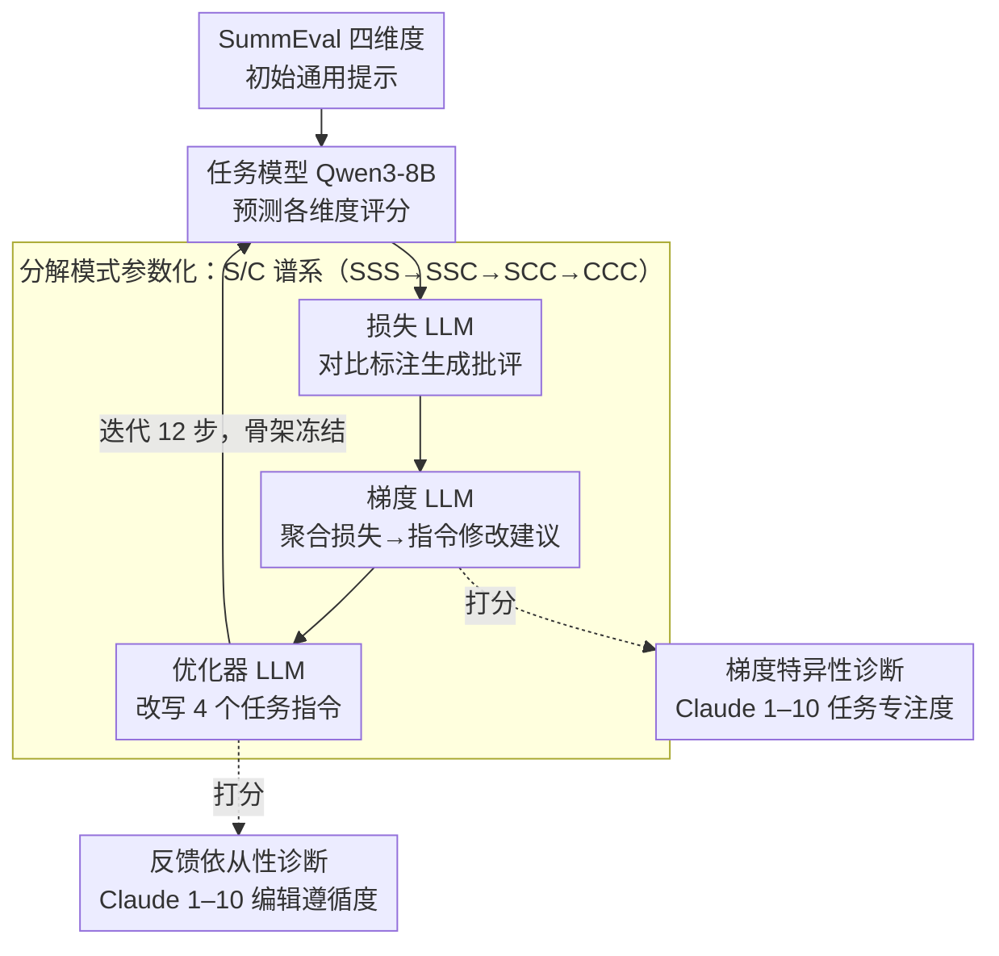

# 当梯度相撞：多目标提示优化对 LLM 评判员的失效模式

**会议**: ACL 2026  
**arXiv**: [2605.26046](https://arxiv.org/abs/2605.26046)  
**代码**: 无  
**领域**: LLM / 提示优化  
**关键词**: 多目标优化, 文本梯度, LLM 评判, 提示工程, 梯度稀释

## 一句话总结

本文系统研究了用文本梯度方法同时优化多个评估准则的提示时的失效模式，发现梯度稀释和指令干扰两个关键瓶颈导致多目标优化几乎无法改进初始提示。

## 研究背景与动机

**领域现状**: 随着 LLM 成为主流评估工具，SummEval、MT-Bench 等基准要求 LLM 同时在多个维度上评估文本质量。TextGrad、OPRO 等文本梯度方法能自动优化提示，但它们都只针对单目标场景。

**现有痛点**: 当需要一个提示同时满足多个评估准则时，现有单目标方法无法直接扩展。数值多任务学习中的冲突解决工具（PCGrad、MGDA 等）依赖向量空间结构，但文本梯度是自然语言字符串，不具备内积、投影等向量操作的基础。

**核心矛盾**: 文本梯度方法与数值梯度在本质上不兼容——"让连贯性标准更具体"这样的指令无法像数值向量一样被投影或约束优化处理。

**本文目标**: (1) 系统测试文本梯度优化在多目标设置下的所有分解模式；(2) 诊断为何多目标优化失败；(3) 识别优化时和推理时的不同失效机制。

**切入角度**: 通过参数化损失、梯度、优化器三个阶段是否独立处理任务（分解码 SSS/SSC/SCC/CCC），覆盖从完全独立到完全耦合的设计空间，结合梯度特异性和反馈依从性两个诊断指标定位失败根源。

**核心 idea**: 多目标文本梯度优化的失败来自两个独立的瓶颈——优化时的梯度信号被多任务稀释（特异性从 9.0 降至 3.7，下降 59%），以及推理时单个优化好的指令组合后相互干扰。

## 方法详解

### 整体框架

本文要回答的问题是：为什么文本梯度方法在「一个提示同时优化多个评估准则」时几乎改不动初始提示？为此作者在 TextGrad 框架上、用 SummEval 数据集（流畅性、相关性、连贯性、一致性四个维度）搭了一条可控的诊断流水线。一次优化迭代里，任务模型（Qwen3-8B）先用当前提示预测各维度评分；损失 LLM（Qwen3-235B）把预测和真实标注对比，生成自然语言批评；梯度 LLM（同 235B）再把每条样本的损失聚合成结构化的"指令该怎么改"建议；优化器 LLM（同 235B）据此改写各任务的指令文本。整个过程只更新 4 个任务的指令，提示骨架（角色、输出格式、少样例）始终冻结。真正的设计巧思不在这条标准管道，而在于如何把"多目标到底卡在哪"测出来。

### 关键设计

**1. 分解模式参数化：用一条从"全独立"到"全联合"的谱系把瓶颈逼出来**

多目标失败可能发生在损失、梯度、优化器任一阶段，单看总体性能无从定位。本文的办法是给这三个阶段各自标注"任务独立处理（Separate）还是联合处理（Combined）"，用 S/C 两个符号组合出一条耦合程度递增的谱系：Single-Task（完全独立）、SSS（三阶段全独立）、SSC（到梯度前都独立、优化器收全部梯度）、SCC（仅损失独立）、CCC（三阶段全联合）。沿这条谱系逐级加重任务耦合，就能看着性能在哪一档开始塌——后文正是借此把"梯度稀释"精确钉死在梯度 LLM 那一步：独立处理时特异性还是 9.0，一旦让梯度 LLM 同时面对 4 个任务，立刻掉到 3.7。

**2. 梯度特异性诊断：给"无法向量化"的文本梯度找一把语义尺子**

数值梯度有大小可比较，文本梯度是一句自然语言，"让连贯性标准更具体"既没有模长也没有方向，无从判断它到底带了多少有效信息。本文用一个可解释的语义指标替代向量范数：让 Claude Sonnet 4.6 在 1–10 量表上给每条梯度的"任务专注度"打分（10 分 = 完全针对某一个任务，1 分 = 泛到能套任何任务），并跨所有分解模式、3 个随机种子、12 个优化步统一评估。特异性高，说明优化器拿到的是有的放矢的改进方向；特异性骤降，就意味着梯度信号被多任务摊薄成了正确的废话——这正是"梯度稀释"这一失效机制的量化抓手。

**3. 反馈依从性诊断：先排除"优化器不听话"，再敢断言锅在梯度**

特异性低导致性能差，前提是优化器确实照着梯度改了；万一是优化器阳奉阴违，那结论就站不住。为堵上这个口子，本文同样用 Claude Sonnet 4.6 在 1–10 量表上评估优化器的指令编辑究竟有多遵循梯度建议。实验中所有模式的依从性都很高（7.8–8.8），说明优化器并没有偷懒——既然它忠实执行了却仍然改不好，瓶颈就只能落在梯度质量本身。两把尺子配合，构成"若依从性低则怪优化器、若依从性高但性能差则怪梯度"的二分判据，把责任清晰地划给了梯度稀释。

### 验证策略

测试两种验证设置：`val=mae` 仅当验证集 MAE 不增加时才接受新提示（单调过滤，防过拟合），`val=none` 无条件接受所有候选以观察完整优化轨迹。每种「分解模式 × 验证策略」组合独立跑 3 次、各 12 个优化步。

## 实验关键数据

### 主实验：多分解模式对比

| 模式 | 验证方法 | 初始 ρ | 最优 ρ | 最优步 | 改进 Δ | 超体积指标 |
|------|--------|------|------|------|------|---------|
| Single-Task | MAE | 0.274 | 0.305 | 2 | +0.031 | — |
| SSS | MAE | 0.284 | 0.284 | 0 | +0.000 | 2.749 |
| SSC | MAE | 0.289 | 0.289 | 0 | +0.000 | 2.832 |
| SCC | MAE | 0.282 | 0.282 | 0 | +0.000 | 2.801 |
| CCC | MAE | 0.285 | 0.296 | 9 | +0.012 | 2.900 |
| Single-Task | 无验证 | 0.269 | 0.284 | 5 | +0.015 | — |
| SSS | 无验证 | 0.283 | 0.283 | 0 | +0.000 | 2.867 |
| SSC | 无验证 | 0.283 | 0.291 | 2 | +0.007 | 2.845 |
| SCC | 无验证 | 0.282 | 0.282 | 0 | +0.000 | 2.779 |
| CCC | 无验证 | 0.287 | 0.287 | 0 | +0.000 | 2.983 |

关键发现：**10 个配置中的 6 个，初始通用提示从未被超越**。只有 Single-Task 在 MAE 验证下达到显著改进（+0.031 Spearman）。性能沿 Single >> SSS >> SSC >> SCC >> CCC 的谱系逐步恶化。

### 梯度稀释的诊断

| 分解模式 | 流畅性 | 相关性 | 连贯性 | 一致性 | 平均特异性 |
|---------|-------|-------|-------|-------|----------|
| Single | 8.9 | 8.9 | 9.1 | 9.0 | 9.0 |
| SSS | 9.0 | 9.0 | 9.1 | 9.0 | 9.0 |
| SSC | 9.0 | 9.1 | 9.1 | 9.0 | 9.0 |
| SCC | 3.0 | 4.3 | 4.8 | 2.6 | 3.7 |
| CCC | 3.2 | 4.3 | 5.1 | 2.4 | 3.7 |

陡峭悬崖：任务独立的模式（Single/SSS/SSC）维持 9.0 的高特异性，而所有任务联合的模式（SCC/CCC）骤降至 3.7，**下降 59%，两组间无重叠**。梯度 LLM 在处理 4 个任务时严重丧失任务焦点。

### Oracle 实验：推理时指令干扰

| 方法 | 流畅性 | 相关性 | 连贯性 | 一致性 | 平均 |
|------|-------|-------|-------|-------|-----|
| 初始通用 | .366 | .208 | .308 | .256 | .285 |
| Oracle 组合 (OB1) | .322 | .186 | .225 | .195 | .232 |
| Oracle 组合 (Spearman) | .303 | .257 | .215 | .105 | .220 |

Oracle 实验选择 4 个单任务优化中各维度的最优指令，组合后在完整测试集评估。结果震惊：**即使指令已独立最优化，组合后仍下降 -0.053 Spearman，低于初始通用提示**。这直接证明了推理时干扰作为独立的失效模式存在。

### 关键发现

- **梯度稀释的陡峭性**：当梯度 LLM 从单任务切换到多任务时，特异性无递减过程，而是直接从 9.0 跳到 3.7，说明这是梯度 LLM 能力的结构性崩溃。
- **任务不可知性**：两个模式的诊断都通过 model swap 验证鲁棒性，说明问题不在特定 LLM 架构而在方法论本身。
- **超体积的悖论**：CCC 虽然平均 Spearman 停滞，但超体积指标反而增长 6.9%，说明优化器发现了新的 Pareto 前沿并使种群多样化，但代价是单目标性能严重下降。
- **指令长度不对称**：流畅性指令在优化后膨胀到 ~800 字，而相关性仅 ~4 字，这种长度差异导致推理时冗长指令获得不成比例的 attention 权重。

## 亮点与洞察

- **两层故障诊断框架的精妙性**：通过分离优化时（梯度特异性）和推理时（指令干扰）两个失效点，作者证明了仅改进梯度质量或仅优化单个指令都不足以解决问题。
- **梯度特异性的量化方案**：用 LLM 评估器而非数值特征来度量文本梯度的任务焦点度，巧妙地绕过了文本梯度无法向量化的困境。
- **Oracle 实验的颠覆性意义**：通过构造"理论上最优"的组合却仍失败，有力论证了这不是优化算法问题而是问题本身的结构性限制。
- **与多任务学习理论的类比**：延拓 Chu et al. 在教育评分中发现的"规则稀释"到跨任务梯度聚合场景。

## 局限与展望

**作者承认的局限**：

- 仅在 SummEval（4 个维度）评估，泛化性需更多基准验证。
- 其他提示优化范式（OPRO、GEPA、进化算法）可能表现差异。
- 样本量 N=3 限制统计功效。

**自发现的局限**：

- 梯度特异性和反馈依从性由 LLM 评估器打分，引入评估器偏差。
- 实验限于文本评估和有序量表，离散分类任务是否表现一致未知。

**具体改进思路**：

1. 动态检测到梯度特异性低于阈值时，自动回退至单任务梯度 LLM。
2. 在优化时对指令长度进行约束。
3. 不固定评估准则，而是生成语义多样且互补的准则集合。
4. 研究能否通过 token 级别的梯度相交还是冲突投影，为文本梯度引入数值多任务学习的解决方案。

## 相关工作与启发

- **vs TextGrad/OPRO/GEPA**：这些方法都优化单目标；本文首次系统研究多准则设置。
- **vs MOPO/ParetoPrompt**：这些多目标方法在种群级别操作，本文研究的是单条梯度轨迹内的 per-task 反馈交互。
- **vs Chu et al. 规则稀释**：Chu 的发现针对单个评分器内的异质错误模式聚合；本文扩展到跨任务梯度聚合。
- **vs RRD/MPO**：本文指出即使每个部分优化也难解决组合干扰，提示问题更深层。

## 评分

- 新颖性: ⭐⭐⭐⭐⭐ 首次系统研究多目标文本梯度优化的失效模式，发现梯度稀释与指令干扰两个独立瓶颈。
- 实验充分度: ⭐⭐⭐⭐ 五种分解模式全覆盖、两套诊断指标、Oracle 实验验证、model swap 鲁棒性检查完整。
- 写作质量: ⭐⭐⭐⭐⭐ 逻辑清晰从现象到根因层层递进，实验设计精巧，表格数据充分。
- 价值: ⭐⭐⭐⭐⭐ 对构建多准则 LLM 评判系统的实践者有直接警示；诊断框架与分解模式范式可泛化到其他多阶段 LLM 系统。

<!-- RELATED:START -->

## 相关论文

- [\[ACL 2026\] Masked by Consensus: Disentangling Privileged Knowledge in LLM Correctness](masked_by_consensus_disentangling_privileged_knowledge_in_llm_correctness.md)
- [\[ACL 2026\] EVE: A Domain-Specific LLM Framework for Earth Intelligence](eve_a_domain-specific_llm_framework_for_earth_intelligence.md)
- [\[ICML 2026\] Universal Reasoner: 冻结 LLM 的可组合即插即用推理器](../../ICML2026/llm_nlp/universal_reasoner_a_single_composable_plug-and-play_reasoner_for_frozen_llms.md)
- [\[ICML 2026\] YAQA: 端到端 KL 最小化的 LLM 自适应权重量化](../../ICML2026/llm_nlp/model-preserving_adaptive_rounding.md)
- [\[ACL 2026\] One Persona, Many Cues, Different Results: How Sociodemographic Cues Impact LLM Personalization](one_persona_many_cues_different_results_how_sociodemographic_cues_impact_llm_per.md)

<!-- RELATED:END -->
