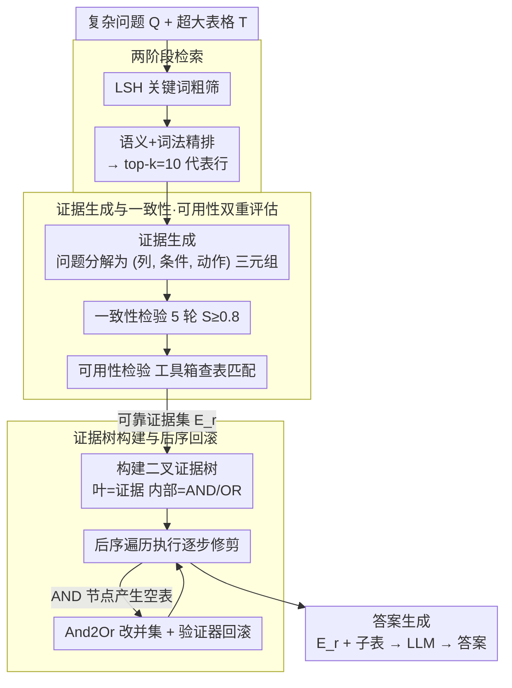

# 当 TableQA 遇到噪声：复杂问题与大表的双重去噪框架

**会议**: ACL 2026  
**arXiv**: [2509.17680](https://arxiv.org/abs/2509.17680)  
**代码**: 未提供  
**领域**: LLM / NLP / 表格问答  
**关键词**: 表格问答, 数据去噪, LLM 推理, 证据过滤, 表格修剪

## 一句话总结
通过分解问题中的语义单元并构建证据树进行透明化表格修剪，EnoTab 框架在处理复杂问题和超大表格时实现显著性能提升，通过双重去噪机制有效缓解噪声数据对推理的负面影响。

## 研究背景与动机

**领域现状**：随着 LLM 推理能力的进步，表格问答（TableQA）已成为 NLP 的核心任务。然而在实际应用中（如金融、医疗），问题复杂度和表格规模不断增加，这导致数据噪声大幅增长。

**现有痛点**：存在两类核心问题：

- 复杂问题中包含虚假相关性（如"在维也纳"但表中无此数据），LLM 易被误导
- 超大表格中仅 1-2% 的行与答案相关，其余数据作为噪声干扰推理

**核心矛盾**：现有方法在"准确去噪"和"保留必要信息"之间权衡不佳。基于程序生成的表格修剪方法往往采用黑盒决策，一旦删除错误就需完全重做；问题分解方法则易犯对虚假相关性的判断错误。

**本文目标**：提出既能有效识别问题中的不相关部分，又能透明化表格修剪过程的框架。

**切入角度**：作者观察到有效的 TableQA 需要两项能力：(1) 关联度过滤——识别并忽略问题中的虚假相关性；(2) 表格修剪——移除无关数据同时保留答案所需的所有信息。这两项能力各自独立但互补。

**核心 idea**：通过"证据"这一最小语义单元的显式抽取与评估，分别实施问题去噪和表格去噪。在表格修剪环节引入证据树（Evidence Tree）这一可观测的执行路径，使每一步都可验证和回滚。

## 方法详解

### 整体框架

EnoTab 分三个阶段工作：

1. **证据生成与评估**：先用两阶段检索（LSH 粗筛 + 语义/词法精排）从超大表中选出 $k=10$ 个代表行作上下文，再让 LLM 将复杂问题分解为最小语义单元（证据），每个证据 $e=(area, condition, action)$ 代表问题中的一个属性约束。例如"Tel Aviv 的城市"对应 $(District\ \text{列}, Tel\ Aviv, \text{字符匹配})$。通过多轮一致性检验和可用性检验，筛出可靠证据集。
2. **证据树构建与执行**：基于可靠证据集构建二叉树，叶子节点是证据（执行单一过滤），内部节点是逻辑关系（AND/OR）。通过后序遍历执行树，逐步得到修剪后的子表。若在 AND 节点产生空表，则触发回滚机制。
3. **答案生成**：将清理后的证据和子表送入 LLM 生成最终答案。

### 关键设计

**1. 两阶段检索：先粗筛再精排，给证据生成喂一份高质量的小样本**

超大表里有用的行常只占 1–2%，直接拿全表去做证据生成既烧算力又容易被噪声带偏。本文用两段式检索先选出 $k=10$ 个代表行作上下文：第一阶段用 LSH（局部敏感哈希）做关键词粗过滤，快但糙；第二阶段对粗筛结果算每行与问题的相关度

$$Score(r,Q) = 0.7 \cdot S_{sem}(r,Q) + 0.3 \cdot S_{lex}(r,Q),$$

其中 $S_{sem}$ 由预训练 embedding 模型给出、$S_{lex}$ 用编辑距离衡量，按 7:3 加权融合后取头部行。用这十来行代表性样本代替全表喂给后续的证据生成，既保住了证据质量，又把成本压了下来。

**2. 证据一致性与可用性双重评估：用两把客观尺子取代 LLM 的一锤定音**

问题分解方法最容易栽在虚假相关性上——问句里冒出一个"在维也纳"，表里压根没有这一项，LLM 却可能信以为真。本文不直接让 LLM 给证据打分定生死，而是先把问题分解成证据三元组，再套上两道客观检验。一致性检验靠重复来验稳定：对同一问题做 5 轮独立分解，若某条证据在多轮里稳定出现、一致性分数 $S \ge 0.8$，才认为它真的重要，这模仿的是人类反复推敲后仍站得住的判断。可用性检验靠工具来验落地：用工具箱 $\mathcal{P}$ 检查这条证据能否在表中找到匹配数据，避免凭空捏造的约束混进来。只有同时通过两道检验的证据才汇成可靠证据集 $E_r$——一致性挡住飘忽不定的伪相关，可用性挡住表里查无实据的幻觉，两者互补地把问题侧的噪声先洗掉一轮。

**3. 证据树的后序回滚机制：把黑盒修剪改成每步可观测、可回退的执行**

拿到可靠证据集后，还要据此把表里无关的行删掉。基于 SQL/程序的表格修剪是黑盒的，一旦某步删错就只能整条重来。本文把可靠证据组织成一棵二叉树——叶子是证据（执行单一过滤），内部节点是 AND/OR 逻辑关系——再做后序遍历逐步收缩出子表。关键在于异常时能就地补救：若某个 AND 节点取交集后产生空表，触发 And2Or 操作把这个 AND 改成 OR，换成更宽松的并集超集；若改完仍为空、或验证器 $M_i$ 判定信息不完整，就回滚到前一节点的结果重试，最多 2 次。And2Or 背后的洞察是 TableQA 里召回比精度更值钱——遗漏的证据再也找不回来，多留的行却能被后续过滤掉，所以宁可放宽也不轻易删空。比起黑盒 SQL，这棵树的每一步过滤都摆在明面上，可验证也可撤销。

### 损失函数 / 训练策略

本方法完全无需训练，仅利用现成的 LLM（GPT-4o/4o-mini/LLaMA）与工具（embedding 模型、符号匹配工具）。

## 实验关键数据

### 主实验

在两个大规模表格数据集（STQA-L 自然超大表格、STQA-N 注入噪声的表格）上与多类基线对比：

| 方法 | STQA-N (GPT-4o) | STQA-N (GPT-4o-mini) | STQA-L (GPT-4o) | STQA-L (GPT-4o-mini) | 平均提升 |
|------|---------|---------|---------|---------|---------|
| TabLaP | 73.6 | 70.8 | 69.1 | 65.9 | - |
| **EnoTab（本文）** | **80.3** | **78.2** | **75.3** | **72.5** | **+8.7%** |
| 相对提升 | +8.3% | +9.5% | +8.2% | +9.1% | - |

### 消融实验

| 配置 | STQA-N 掉点 | STQA-L 掉点 | 说明 |
|------|---------|---------|---------|
| 完整模型 | - | - | - |
| 去掉一致性评估 | -6.3% | -5.6% | 无一致性过滤，虚假证据保留 |
| 去掉可用性评估 | -8.2% | -6.8% | 无可用性检查，表中不存在的证据被应用 |
| 去掉 And2Or 回滚 | -4.2% | -3.8% | 空表无法恢复，数据丢失 |
| 去掉表格验证器 | -4.2% | -2.5% | 无完整性验证，可能遗漏答案数据 |

结论：一致性和可用性评估贡献最大（各掉 5-8%），说明问题去噪的两阶段设计是框架的核心。

### 标准基准结果

在 WikiTQ 和 TabFact 上的表现：

| 方法 | WikiTQ | TabFact | 平均 |
|------|--------|---------|------|
| Chain-of-Table | 67.1 | 84.2 | 75.7 |
| TabLaP | 72.8 | 86.9 | 79.9 |
| **EnoTab（本文）** | **74.6** | **89.2** | **81.9** |
| 相对提升 | +1.8% | +2.3% | +2.0% |

表格压缩率分析：EnoTab 在保证正确性前提下实现显著压缩，STQA-L 从平均 8,967 个 token 降至 2,176 个（75.7% 压缩率），STQA-N 从 26,742 个降至 2,893 个（89.2% 压缩率）。

### 关键发现

- **复杂问题适配性**：在 WikiTQ 数据集中，按 GPT-4o 的多轮回答准确率分级（Easy/Medium/Hard/ExtraHard），EnoTab 在 ExtraHard 场景保持明显优势。
- **跨模型鲁棒性**：对比闭源模型（GPT-4o/4o-mini）和开源模型（LLaMA-2-70B/Qwen-1.5-70B），End-to-End QA 从闭源到开源掉点 15%，而 EnoTab 仅掉 3-5%。
- **噪声对抗性**：向 WikiTQ 注入干扰内容后，End-to-End QA 掉点 20%+，而 EnoTab 保持稳定。

## 亮点与洞察

- **证据作为最小单元的创新**：不同于传统分解方法对整个问题进行分解，本文将问题分解为 $(column, condition, action)$ 三元组，每个单元独立评估。这一细粒度抽象显著降低了判断复杂性。
- **可观测表格修剪路径**：证据树将原本的黑盒修剪过程转化为显式的二叉树执行，每个节点都可验证、每一步都可回滚。配合 And2Or 回滚机制，在"精度"与"召回"间找到了实用平衡。
- **无需训练的即插即用方案**：完全基于现成 LLM 和工具组合，无需 fine-tuning 或新参数，大幅降低了部署成本。

## 局限与展望

- **复合值处理局限**：对"1-1"（胜负记录）、"251-32=189"（复合计算）等特殊格式的处理不足。
- **单表假设**：当前主要评估单表 QA。多表关联问题的表现仍不明确。
- **验证器局限**：表格完整性验证器 $M_i$ 在某些结构化数据上性能下降，回滚次数有限。
- **改进方向**：(1) 增强 AND 节点的判别能力，减少对 And2Or 的依赖；(2) 扩展至多表场景的联合推理；(3) 对复合值类型的结构化处理。

## 相关工作与启发

**vs 问题分解类方法**（Dater/Chain-of-Table）：这类方法同样对问题分解，但分解粒度较粗（整体分解为子问题），导致虚假相关性难以甄别。EnoTab 通过更细粒度的证据单元（三元组）和客观的一致性评估规避了这一问题。

**vs 表格修剪类方法**（H-Star/TabSQLify）：这类方法通过 SQL/Python 程序修剪，黑盒特性导致错误难以检测和修正。EnoTab 的证据树显式化了修剪逻辑，使每步都可观测、可验证。

**启发**：细粒度分解+客观评估+可观测执行这一三角组合，对处理结构化数据和复杂推理的其他任务（如代码生成、知识图谱查询）也有借鉴意义。

## 评分

- 新颖性: ⭐⭐⭐⭐⭐ 证据作为最小单元的设计思路新颖，解决了问题分解与表格修剪的"透明度"痛点。
- 实验充分度: ⭐⭐⭐⭐⭐ 跨 4 个数据集、3 类基线、完整消融、跨模型适配分析全面。
- 写作质量: ⭐⭐⭐⭐ 逻辑清晰、细节到位，但个别章节略显冗长。
- 价值: ⭐⭐⭐⭐⭐ 解决实际应用中的真实痛点（复杂问题+超大表格+噪声），无需训练、易部署。

<!-- RELATED:START -->

## 相关论文

- [\[ACL 2026\] 等等，还有出路：一个对话脱轨预测的决策机制](wait_theres_a_way_out_a_decision_mechanism_for_forecasting_conversational_derail.md)
- [\[ACL 2026\] Masked by Consensus: Disentangling Privileged Knowledge in LLM Correctness](masked_by_consensus_disentangling_privileged_knowledge_in_llm_correctness.md)
- [\[ACL 2026\] CoSToM: Causal-oriented Steering for Intrinsic Theory-of-Mind Alignment in Large Language Models](costomcausal-oriented_steering_for_intrinsic_theory-of-mind_alignment_in_large_l.md)
- [\[ACL 2026\] Mind the Gap: How Elicitation Protocols Shape the Stated-Revealed Preference Gap in Language Models](mind_the_gap_how_elicitation_protocols_shape_the_stated-revealed_preference_gap_.md)
- [\[ACL 2026\] Hot-Start from Pixels: Low-Resolution Visual Tokens for Chinese Language Modeling](hot-start_from_pixels_low-resolution_visual_tokens_for_chinese_language_modeling.md)

<!-- RELATED:END -->
