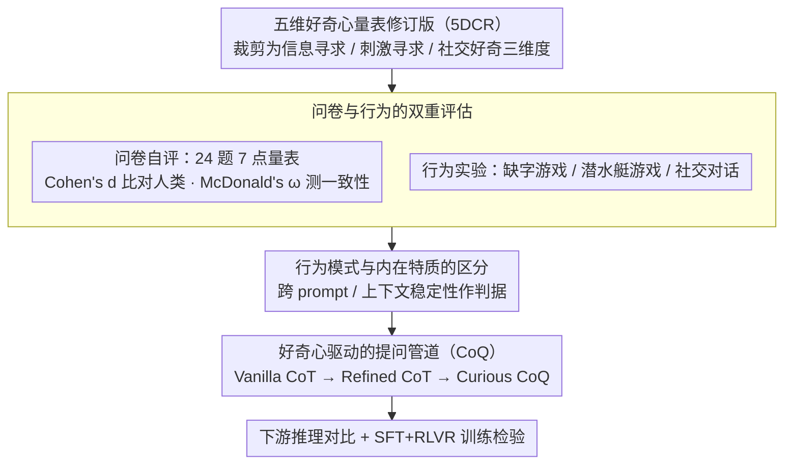

# Why Did Apple Fall: Evaluating Curiosity in Large Language Models

**会议**: ACL 2026 Findings  
**arXiv**: [2510.20635](https://arxiv.org/abs/2510.20635)  
**代码**: [https://github.com/Yukijudaii1352/CuriosityEval](https://github.com/Yukijudaii1352/CuriosityEval)  
**领域**: LLM 评估 / 认知科学  
**关键词**: 好奇心, LLM行为评估, 心理学量表, 行为实验, 推理增强

## 一句话总结

本文提出首个系统评估 LLM 好奇心行为的心理学启发框架，结合问卷自评和行为实验发现 LLM 展现出好奇心般的行为模式但并非内在特质，并设计好奇心驱动的提问管道证明模拟好奇行为可提升下游推理性能。

## 研究背景与动机

**领域现状**：好奇心驱动的强化学习（如 i-MENTOR、CDE）通过内在奖励信号引导 LLM 探索，已在数学和编程任务上展现潜力。然而，这些方法是否真正反映了 LLM 的好奇心行为、心理学意义上的好奇心概念能否迁移到 LLM，尚不清楚。

**现有痛点**：(1) 未充分评估 LLM 是否能展现类似好奇心的行为特征；(2) 现有方法依赖熵或困惑度等统计信号，难以区分改进来自增强的监督信号还是真正的好奇行为；(3) 缺乏系统化的评估框架。

**核心矛盾**：好奇心驱动的 RL 方法假设 LLM 的好奇心可以被激发和增强，但我们甚至不知道 LLM 是否"拥有"好奇心。

**本文目标**：(1) 用心理学量表和行为实验系统评估 LLM 的好奇心行为；(2) 区分好奇心是内在特质还是行为模式；(3) 探索好奇行为能否提升下游性能。

**切入角度**：改编五维好奇心量表修订版（5DCR），将人类好奇心的三个维度（信息寻求、刺激寻求、社交好奇）分别设计问卷评估和行为任务，实现从"自我报告"到"行为验证"的闭环评估。

**核心 idea**：LLM 展现出好奇心般的行为模式，但这更像是拟合人类数据和安全约束的产物而非内在驱动力；不过，即使是纯行为层面的好奇模拟也能提升推理性能。

## 方法详解

### 整体框架

整篇论文想回答一个被好奇心驱动 RL 默认假设、却从没被验证的问题：LLM 到底有没有好奇心？为此作者搭了一条从"自我报告"走到"行为验证"再走到"功能检验"的闭环评估链。先把心理学的五维好奇心量表修订版（5DCR）裁剪成信息寻求、刺激寻求、社交好奇三个维度作为分类骨架；再让模型用 7 点量表自评 24 题，拿到一份"模型自己说自己有多好奇"的画像；接着为每个维度配一个行为实验，看模型在真实决策里是否表现得和它自评的一致；把问卷与行为两端的结果对照，用跨上下文稳定性判断好奇到底是内在特质还是行为模式；最后把好奇行为做成一种提问策略（CoQ），检验它对下游推理有没有实际增益。

### 关键设计

**1. 问卷与行为的双重评估：自评易被幻觉人格污染，必须用行为交叉验证**

如果只让模型填问卷，拿到的可能是它从人类语料里学来的"人设台词"，而非真实倾向。所以作者在问卷之外再加一层行为证据。问卷端用 5DCR 的 24 题，并用 Cohen's $d$ 衡量模型回答与人类样本的标准化差异、用 McDonald's $\omega$ 衡量同一维度题目的内部一致性，从而判断模型的自评在统计上是否可信。行为端则为三个维度各设计一个决策任务作为代理指标：信息寻求用"缺字游戏"——模型填完空后能否主动选择查看正确答案；刺激寻求用"潜水艇游戏"——在确定窗口和不确定窗口之间选哪个；社交好奇用对话实验——和虚拟陌生人交谈时主动提问的频率。两层结果对照，才能区分"嘴上说好奇"和"行为上真好奇"。

**2. 行为模式与内在特质的区分：用跨上下文稳定性当判据**

这一区分直接关系到好奇心驱动 RL 的理论根基——如果好奇心只是上下文相关的行为表演，那么"激发并增强 LLM 好奇心"的前提就值得怀疑。作者的判据很直接：内在特质应当跨 prompt、跨上下文保持一致，而行为模式则会对上下文高度敏感。于是他们考察同一模型的好奇表现在不同提示、不同情境下是否稳定，用波动程度反推它究竟是稳定的人格底色，还是临时拟合出来的应答风格。

**3. 好奇心驱动的提问管道（CoQ）：把好奇从被测特质变成可调用的推理策略**

即便 LLM 没有内在好奇心，"像好奇者那样不断追问"这件事本身也可能提升推理质量——这是论文从评估转向应用的关键一跃。作者对比三档提示：Vanilla CoT 是标准思维链，Refined CoT 在其中加入反思与回溯，Curious CoQ 则进一步鼓励模型自问自答，主动抛出"如果……会怎样""为什么""怎么做"这类好奇式追问。三档不仅在推理时直接对比，还分别作为思维过程喂进 SFT+RLVR 训练管道，看哪种思维痕迹训出来的模型更强。这样设计的好处是：好奇心的"功能价值"被剥离出"是不是内在特质"这个哲学问题，单独用下游性能来回答。

### 损失函数 / 训练策略

SFT 阶段用标准语言建模损失；RLVR 阶段用 GRPO，奖励只保留格式奖励与正确性奖励两个二元信号。

## 实验关键数据

### 主实验

**问卷自评（7 点量表，越高越好奇）**

| 模型 | 信息寻求 | 刺激寻求 | 社交好奇 |
|------|---------|---------|---------|
| GPT-4o | 6.58 | 4.71 | 6.25 |
| DeepSeek-V3.1 | 7.00 | 4.38 | 6.01 |
| Gemini-2.5 | 6.08 | 1.58 | 4.88 |
| 人类平均 | 5.03 | 4.93 | 4.86 |

### 消融实验

| 配置 | 推理任务性能 | 说明 |
|------|------------|------|
| Vanilla CoT | 基线 | 标准思维链 |
| Refined CoT | 提升 | 反思和回溯有帮助 |
| **Curious CoQ** | **最优** | 好奇提问进一步提升 |

### 关键发现

- LLM 展现出**不对称的好奇模式**：信息寻求维度很强但刺激寻求维度很弱，这与安全训练（RLHF）压制冒险行为一致
- 好奇行为**高度上下文敏感、跨 prompt 不稳定**——更像是拟合人类数据的产物而非内在特质
- 问卷自评和行为实验**大致一致**，说明心理学工具可以用于系统评估 LLM 行为
- **Curious CoQ 在下游任务上优于 Vanilla CoT 和 Refined CoT**——模拟好奇提问确实能产生更高质量的中间思维
- SFT+RLVR 管道中，CoQ 训练数据也优于 CoT 训练数据

## 亮点与洞察

- "LLM 有好奇行为但无好奇特质"的区分非常精准——为好奇心驱动 RL 的理论基础提供了重要澄清
- 三个行为实验的设计巧妙地从心理学范式改编：缺字游戏、潜水艇游戏、社交对话，每个都有明确的行为代理指标
- CoQ 的实用价值：即使好奇心不是内在特质，模拟好奇策略也能提升性能——这是一个实践层面的重要发现

## 局限与展望

- 行为实验的任务设计较简单，可能无法完全捕捉好奇心的复杂性
- CoQ 的效果可能部分来自更多的"思维量"而非好奇性本身——需要更精细的控制实验
- 仅在推理任务上评估 CoQ，创造性任务（好奇心可能更重要的场景）未覆盖
- 好奇心量表的文化偏向性（基于西方心理学模型）可能影响跨文化适用性

## 相关工作与启发

- **vs i-MENTOR/CDE**: 这些方法用内在奖励增强好奇心，本文用行为实验评估并用 prompt 工程利用好奇行为
- **vs 人格评估工作**: 先前工作评估 LLM 的人格特质（如大五人格），本文首次评估好奇心

## 评分

- 新颖性: ⭐⭐⭐⭐⭐ 首个系统评估 LLM 好奇心的工作，跨学科创新突出
- 实验充分度: ⭐⭐⭐⭐ 问卷+行为+应用三层评估，但行为实验可更复杂
- 写作质量: ⭐⭐⭐⭐⭐ 叙事引人入胜，从爱因斯坦名言到牛顿苹果，学术与可读性兼顾
- 价值: ⭐⭐⭐⭐⭐ 对好奇心驱动 RL 的理论基础和 LLM 行为理解有重要贡献

<!-- RELATED:START -->

## 相关论文

- [\[ACL 2025\] ELI-Why: Evaluating the Pedagogical Utility of Language Model Explanations](../../ACL2025/llm_nlp/eli-why_evaluating_the_pedagogical_utility_of_language_model_explanations.md)
- [\[ACL 2026\] MulDimIF: A Multi-Dimensional Constraint Framework for Evaluating and Improving Instruction Following in Large Language Models](muldimif_a_multi-dimensional_constraint_framework_for_evaluating_and_improving_i.md)
- [\[ACL 2026\] PersonaArena: Dynamic Simulation for Evaluating and Enhancing Persona-Level Role-Playing in Large Language Models](personaarena_dynamic_simulation_for_evaluating_and_enhancing_persona-level_role-.md)
- [\[ACL 2025\] SocialEval: Evaluating Social Intelligence of Large Language Models](../../ACL2025/llm_nlp/socialeval_evaluating_social_intelligence_of_large_language_models.md)
- [\[ACL 2026\] Clozing the Gap: Exploring Why Language Model Surprisal Outperforms Cloze Surprisal](clozing_the_gap_exploring_why_language_model_surprisal_outperforms_cloze_surpris.md)

<!-- RELATED:END -->
