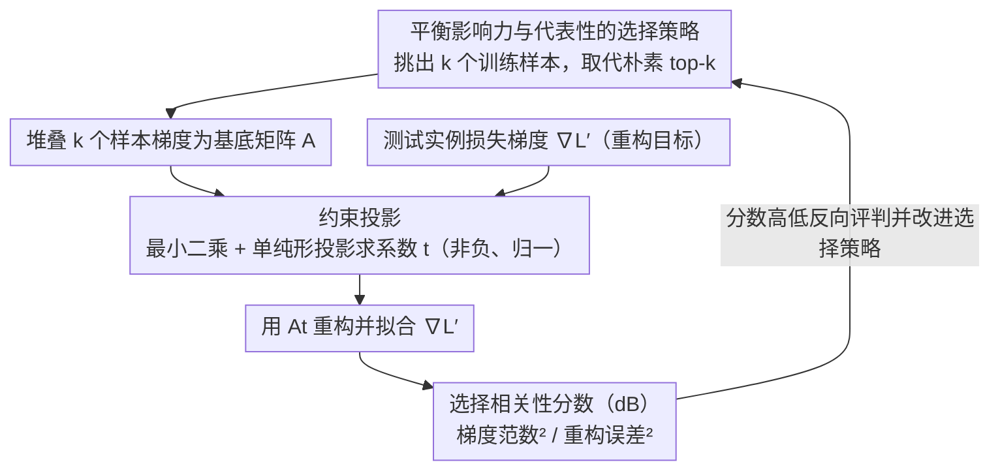

# Compact Example-Based Explanations for Language Models

**会议**: ACL 2026 Findings  
**arXiv**: [2601.03786](https://arxiv.org/abs/2601.03786)  
**代码**: 无  
**领域**: LLM预训练  
**关键词**: 训练数据影响力, 示例解释, 选择相关性, 梯度重构, 冗余消除

## 一句话总结

本文提出选择相关性分数（Selection Relevance Score），一种无需重训练的指标来评估训练样本子集作为示例解释的质量，并证明常见的"选最高影响力"策略常不如随机选择，进而提出平衡影响力与代表性的新策略。

## 研究背景与动机

**领域现状**：训练数据影响力估计方法（如影响函数）可量化每个训练文档对模型输出的贡献，是示例解释的有前景的信息源。但人类无法处理数千个文档，实际中只能选择少量训练样本作为解释。

**现有痛点**：(1) 选择最高影响力的 k 个样本作为解释是当前默认策略，但高影响力样本往往是全局异常值（如标注错误的数据），不一定与当前测试实例最相关；(2) 最高影响力样本之间高度冗余，严格选择可能收益递减；(3) 现有评估要么在嵌入空间操作（而排序在梯度空间），要么依赖类标签（不适用于生成任务），要么需要重训练（对 LLM 不可行）。

**核心矛盾**：影响力估计方法为每个训练样本生成独立的影响力分数，但作为解释时需要考虑样本之间的互补性和冗余性——一组好的解释样本应该共同覆盖模型决策的关键方面。

**本文目标**：(1) 提出评估选择质量的无重训练指标；(2) 揭示常见选择策略的不足；(3) 设计更好的选择策略。

**切入角度**：将示例解释视为梯度重构任务——好的解释样本应该能用其梯度的线性组合重构测试实例的梯度。

**核心 idea**：选择相关性 = 选中样本的梯度重构测试实例梯度的能力，高质量解释集应最大化重构精度。

## 方法详解

### 整体框架

论文要解决的是"挑哪几个训练样本拿给人看，才算把模型某个预测解释清楚"这件事。它把这个选择质量的评估形式化成一个梯度重构问题：拿到测试实例的损失梯度 $\nabla\mathcal{L}'$，再拿到被选中的 $k$ 个训练样本的梯度，拼成矩阵 $A$，然后问一句——能不能用这 $k$ 条样本梯度的线性组合 $\hat{\nabla\mathcal{L}}' = At$ 把测试梯度重新拼出来？拼得越准，说明这组样本越能共同解释模型的决策。整条链路就是：把测试梯度当目标、把候选解释集当基底，用重构精度反过来给选择策略打分，进而暴露"选最高影响力"这个默认做法的问题，并给出更好的选法。

### 关键设计

**1. 选择相关性分数（Selection Relevance Score）：用一组样本能否重构测试梯度，整体评判解释质量**

影响力估计给每个训练样本打的是独立分数，可一组好解释要的是样本之间互补、共同覆盖决策的关键面，单独打分看不出这种协同。作者因此把整组样本放在一起评，定义

$$\xi^{SR} = \frac{\mathbb{E}[\|G(\omega)\|^2]}{\mathbb{E}[\|G(\omega) - At_\omega\|^2]}$$

即期望梯度平方范数与期望重构误差平方范数之比，以 dB 表示。分数 $>0$ dB 表示选中的样本确实提供了有用信息，$<0$ dB 则说明它们还不如直接用零向量做基线。这样一来，重构能力直接量化了这组样本对模型决策的解释力度，而且天然考虑了样本组合而非孤立评分。

**2. 约束投影（Constrained Projection）：给线性组合系数加上语义约束，让"解释"真的像解释**

无约束的最小二乘解会给出负系数，意味着某些被当成"解释"的样本其实是在和预测相抵触——这显然违背解释的本意。所以作者对系数 $t$ 施加两个约束：非负性，防止不相关样本靠相互抵消骗到权重；归一化 $\sum t = 1$，让每个系数能被读成该样本的相对重要性。具体做法是先求无约束最小二乘解，再把它投影到单位单纯形上。经过这层投影，重构出来的不只是数值上的最优拟合，而是一组语义上站得住的相对重要性权重。

**3. 平衡影响力与代表性的选择策略：取代朴素的"选最高影响力 top-k"**

最高影响力的样本往往是全局异常值（比如标注错误的脏数据），彼此之间又高度冗余，严格按 top-k 选反而收益递减——这正是论文要纠正的默认做法。新策略在挑选时不只看影响力分数，还同时考虑样本之间的多样性与代表性，避免少数异常值主导、也避免选进一堆重复信息。实验也印证了这个直觉：在小预算下朴素 top-k 常常还不如随机选，而把影响力和代表性一起纳入考量后，选出的解释集质量稳定占优。

### 损失函数 / 训练策略

本文不训练模型。选择相关性分数靠解析方法算出（最小二乘 + 单纯形投影），无需梯度更新；验证则通过微调对比来确认该分数的有效性。

## 实验关键数据

### 主实验

**不同选择策略的选择相关性分数（dB，越高越好）**

| 选择策略 | k=1 | k=5 | k=10 | k=25 |
|----------|-----|-----|------|------|
| 随机选择 | 基线 | 基线 | 基线 | 基线 |
| Top-k（最高影响力） | < 随机 | < 随机 | ≈ 随机 | > 随机 |
| 平衡策略（本文） | > 随机 | > 随机 | > 随机 | > 随机 |

### 消融实验

| 影响力估计方法 | 与 Top-k 结合效果 | 与平衡策略结合效果 |
|---------------|------------------|------------------|
| 影响函数 | 差（全局异常值多） | 显著提升 |
| TracIn | 中等 | 提升 |
| TRAK | 较好 | 进一步提升 |

### 关键发现

- Top-k 选择策略在小预算（k≤10）下常不如随机选择——全局异常值和冗余是主因
- 选择相关性分数与微调验证指标高度相关，证明其作为代理评估指标的有效性
- 不同影响力估计方法对选择质量有显著影响：TRAK 比影响函数更适合选择任务
- 平衡策略在所有预算大小和估计方法组合下均优于 Top-k 和随机选择

## 亮点与洞察

- 揭示了一个被忽视的重要问题：示例解释的质量不仅取决于影响力估计的准确性，更取决于选择策略
- "Top-k 不如随机"的发现挑战了领域内的默认假设
- 选择相关性分数提供了首个无重训练、任务无关的选择质量评估工具

## 局限与展望

- 梯度重构作为解释质量的代理可能不完全捕捉用户的实际需求
- 约束投影（非负+归一化）可能排除了某些有效的重构方案
- 在大规模 LLM 上的梯度计算仍然昂贵
- 仅在分类任务上验证，生成任务上的效果待确认

## 相关工作与启发

- **vs Bhatt et al. (2021)**: 他们通过多样性+影响力的加法目标减少冗余，但可能偏好异常值；本文提出代表性作为替代
- **vs Bae et al. (2022)**: 提出预测约束影响力的概念，本文的分数与之高度兼容
- **vs 影响函数**: 影响函数的全局异常值问题在选择任务中尤为突出，本文定量证实了这一点

## 评分

- 新颖性: ⭐⭐⭐⭐ 梯度重构视角和选择相关性分数是新颖的评估工具
- 实验充分度: ⭐⭐⭐⭐ 多种影响力方法×选择策略×预算大小的系统评估
- 写作质量: ⭐⭐⭐⭐⭐ 形式化严谨，动机清晰，分析深入
- 价值: ⭐⭐⭐⭐ 为示例解释领域提供了重要的评估工具和实践建议

<!-- RELATED:START -->

## 相关论文

- [\[ICML 2025\] Machine Learning from Explanations](../../ICML2025/llm_pretraining/machine_learning_from_explanations.md)
- [\[ACL 2026\] SCRIPT: A Subcharacter Compositional Representation Injection Module for Korean Pre-Trained Language Models](script_a_subcharacter_compositional_representation_injection_module_for_korean_p.md)
- [\[NeurIPS 2025\] Learning in Compact Spaces with Approximately Normalized Transformer](../../NeurIPS2025/llm_pretraining/learning_in_compact_spaces_with_approximately_normalized_transformer.md)
- [\[ACL 2026\] Fine-tuning vs. In-context Learning in Large Language Models: A Formal Language Learning Perspective](fine-tuning_vs_in-context_learning_in_large_language_models_a_formal_language_le.md)
- [\[ICLR 2026\] Steering Language Models with Weight Arithmetic](../../ICLR2026/llm_pretraining/steering_language_models_with_weight_arithmetic.md)

<!-- RELATED:END -->
