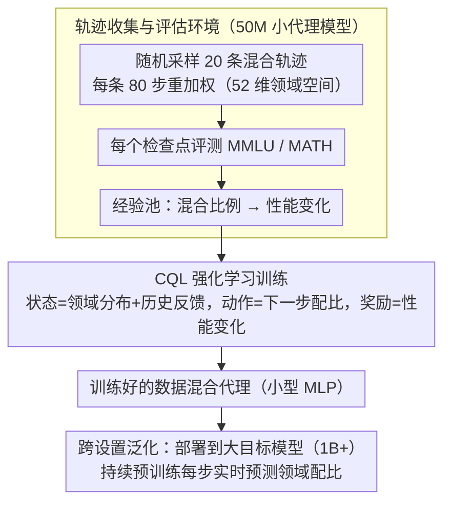

# Data Mixing Agent: Learning to Re-weight Domains for Continual Pre-training

**会议**: ACL 2026  
**arXiv**: [2507.15640](https://arxiv.org/abs/2507.15640)  
**代码**: 无  
**领域**: 强化学习  
**关键词**: 数据混合, 领域重加权, 持续预训练, 强化学习, 灾难性遗忘

## 一句话总结

本文提出 Data Mixing Agent，首个基于模型的端到端领域重加权框架，通过在大量数据混合轨迹上使用 CQL 强化学习训练小型代理来学习可泛化的数据混合启发式，在数学推理持续预训练中平衡源领域和目标领域性能，且可泛化到未见过的源领域、目标模型和领域空间。

## 研究背景与动机

**领域现状**：大语言模型虽然通过大规模预训练获得了通用能力，但在知识密集型领域（如数学、代码）仍需通过持续预训练来增强。然而直接在目标领域数据上训练会导致灾难性遗忘。

**现有痛点**：(1) 常见解决方案是混合源领域和目标领域数据进行训练，但混合比例的确定通常依赖人工设计的启发式或经验结论；(2) 数据混合的启发式空间非常丰富（不同领域、不同比例、不同调度），人工探索效率极低；(3) 现有方法（如 DoReMi、DSIR）基于特定假设，泛化性有限。

**核心矛盾**：最优的数据混合策略是高维、动态且依赖任务的，但人工启发式只能覆盖极小的策略空间。大量潜在有效的启发式未被发现和利用。

**本文目标**：训练一个小型代理模型，从大量数据混合轨迹中学习可泛化的领域重加权启发式，在持续预训练中自动调整数据混合比例。

**切入角度**：先在小型代理模型上随机采样大量数据混合轨迹，收集环境反馈（基准性能），然后用离线强化学习训练代理学习从轨迹状态到最优混合比例的映射。

**核心 idea**：数据混合启发式可以被参数化为一个小型代理，通过 RL 从轨迹数据中学习，且学到的启发式具有跨模型、跨领域的泛化能力。

## 方法详解

### 整体框架

论文要解决的是持续预训练里那个老大难：在目标领域（如数学）上接着练会引发灾难性遗忘，于是要混入源领域数据，但"混多少、怎么随训练动态调"长期靠人工启发式拍脑袋。作者的思路是把这套混合启发式本身参数化成一个小代理，让它从数据里学。整体分三步走：先在一个 50M 参数的小代理模型上随机采样大量数据混合轨迹，边训边在 MMLU、MATH 上评测，攒下"某种混合比例 → 带来什么性能变化"的经验；再用离线强化学习 CQL 在这堆轨迹上训练数据混合代理，让它学会从当前状态映射到下一步的最优领域分布；最后把这个学好的代理直接挂到真正的大目标模型持续预训练里，每个重加权步骤由它实时预测下一步该怎么配比。

### 关键设计

**1. 轨迹收集与评估环境：用便宜的小模型大量试错，攒出能把混合策略和性能挂钩的监督信号**

代理要学"什么样的领域分布能平衡性能"，但在大模型上反复试不同配比成本高到不可行。作者于是把探索放在 50M 的小代理模型上：随机采样 20 条数据混合轨迹，每条走 80 个重加权步骤，在每个检查点评测 MMLU 与 MATH，领域空间是 52 维（DCLM 通用数据 + Dolmino 数学数据）。小模型训练便宜，可以放心大量铺开探索策略空间，而每一步的基准反馈正好充当把"混合策略"和"最终性能"关联起来的监督信号，为后面的离线 RL 备好经验池。

**2. CQL 强化学习训练：把动态配比建成序列决策，用保守 Q 学习避免对没见过的配比过度乐观**

收集到的是固定的离线轨迹，没法再和环境交互，普通在线 RL 容易对数据集外动作给出虚高估值。作者把问题建成马尔可夫决策：状态是当前领域分布加上历史环境反馈，动作是下一步的领域分布，奖励是基准性能的变化。训练用 Conservative Q-Learning，它在标准 Q 学习目标上加一项保守正则，专门压低对数据集外动作的 Q 值估计，从而避免代理凭空相信某些从没试过的激进配比。这样既能完全复用预收集的轨迹高效学习，又不会被离线数据的覆盖盲区带偏。

**3. 跨设置泛化：把学到的东西当成"通用配比直觉"而非"针对某模型的过拟合参数"**

如果代理学到的真是"哪种领域分布有助于平衡性能"这类通用知识，那它就不该只在训练那套设置里有效。作者据此让代理只在 50M 模型 + 数学领域上训练，然后原样部署到完全不同的场景：更大的目标模型（1B+）、不同的源领域（通用 → 科学 / 代码等）、乃至不同的领域空间划分。能跨这些设置迁移，反过来也佐证了它学到的是规模与领域无关的混合启发式，而不是记住了特定配置下的最优解。

### 损失函数 / 训练策略

CQL 损失 = 标准 Q-learning 损失 + 保守正则化项（惩罚对数据集外动作的高 Q 值估计）。代理是一个小型 MLP，输入当前状态，输出连续的领域分布。

## 实验关键数据

### 主实验

**数学推理持续预训练（平衡 MMLU 和 MATH 性能）**

| 方法 | MMLU 保持率 | MATH 提升 | 综合 |
|------|-----------|----------|------|
| 均匀混合 | 中等 | 中等 | 基线 |
| DoReMi | 较好 | 较好 | 改进 |
| 手动启发式 | 可变 | 可变 | 依赖经验 |
| **Data Mixing Agent** | **最优** | **最优** | **最优** |

### 消融实验

| 泛化测试 | 效果 | 说明 |
|----------|------|------|
| 未见源领域 | 有效 | 启发式跨领域迁移 |
| 不同大小目标模型 | 有效 | 50M→1B+ 迁移成功 |
| 未见领域空间 | 有效 | 不同领域分类仍有效 |
| 代码生成领域 | 有效 | 跨目标领域适应 |

### 关键发现

- Data Mixing Agent 在平衡源和目标领域性能上优于所有基线方法
- 代理学到的启发式与人类直觉高度一致——如科学领域数据有助于 MMLU
- 代理可以用更少的源领域数据达到更好的模型性能——说明学到了更高效的数据利用策略
- 从 50M 模型学到的策略可直接迁移到 1B+ 模型，说明数据混合启发式具有规模不变性

## 亮点与洞察

- 首次证明数据混合启发式可以被参数化并通过 RL 学习
- 跨设置泛化能力令人印象深刻——在极小模型上学到的策略适用于大模型
- 代理学到的策略可解释且与人类直觉对齐，增加了可信度

## 局限与展望

- 轨迹收集阶段仍有可观的计算成本（20 条 × 80 步 × 评估）
- CQL 的保守性可能限制代理探索更激进的混合策略
- 评估环境使用简化的基准（MMLU/MATH），可能无法完全捕捉实际性能
- 领域空间的划分依赖外部分类器，分类质量影响代理学习

## 相关工作与启发

- **vs DoReMi**: DoReMi 基于领域权重的梯度优化，Data Mixing Agent 端到端学习启发式
- **vs 手动调参**: 手动方法只能覆盖极小的策略空间，代理可以自动探索和利用大量启发式
- **vs 在线方法**: 在线方法需要反复训练大模型，代理一次学习后可多次部署

## 评分

- 新颖性: ⭐⭐⭐⭐⭐ 首个基于模型的端到端数据混合方法，RL 学习启发式
- 实验充分度: ⭐⭐⭐⭐ 多种泛化测试、消融分析，但基准有限
- 写作质量: ⭐⭐⭐⭐ 动机清晰，方法系统
- 价值: ⭐⭐⭐⭐ 为大规模预训练的数据工程提供了自动化工具

<!-- RELATED:START -->

## 相关论文

- [\[ACL 2025\] Improving Continual Pre-training Through Seamless Data Packing](../../ACL2025/llm_pretraining/improving_continual_pre-training_through_seamless_data_packing.md)
- [\[ACL 2026\] FOREVER: Forgetting Curve-Inspired Memory Replay for Language Model Continual Learning](forever_forgetting_curve-inspired_memory_replay_for_language_model_continual_lea.md)
- [\[ICLR 2026\] Predicting Training Re-evaluation Curves Enables Effective Data Curriculums](../../ICLR2026/llm_pretraining/predicting_training_re-evaluation_curves_enables_effective_data_curriculums_for_.md)
- [\[ACL 2025\] Towards Effective and Efficient Continual Pre-training of Large Language Models](../../ACL2025/llm_pretraining/towards_effective_and_efficient_continual_pre-training_of_large_language_models.md)
- [\[ACL 2025\] Velocitune: A Velocity-based Dynamic Domain Reweighting Method for Continual Pre-training](../../ACL2025/llm_pretraining/velocitune_a_velocity-based_dynamic_domain_reweighting_method_for_continual_pre-.md)

<!-- RELATED:END -->
