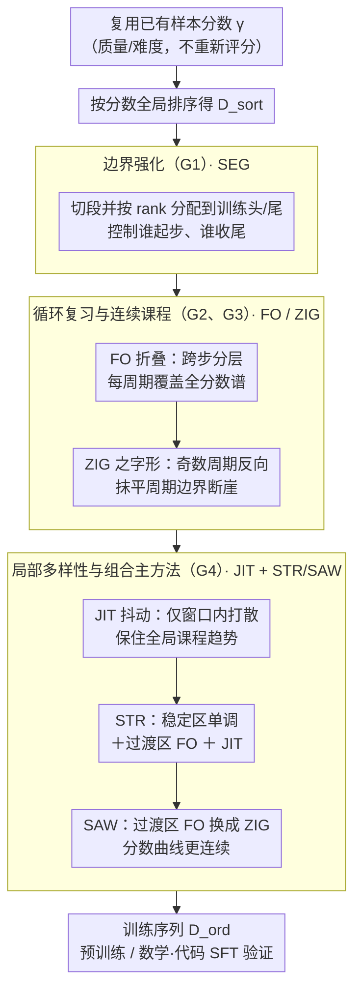

# Demystifying Data Organization for Enhanced LLM Training

**会议**: ACL2026  
**arXiv**: [2605.30334](https://arxiv.org/abs/2605.30334)  
**代码**: 无  
**领域**: LLM预训练 / 数据组织  
**关键词**: 数据排序, 课程学习, 预训练效率, STR, SAW

## 一句话总结
这篇论文系统研究 LLM 训练中“样本出现顺序”的影响，复用已有样本级质量/难度分数，提出边界强化、循环复习、连续课程和局部多样性四条数据组织原则，并用 STR 与 SAW 在预训练和 SFT 中稳定提升性能。

## 研究背景与动机
**领域现状**：LLM 数据工作通常集中在数据采集、去重、过滤、混合、合成和选择。很多 pipeline 已经会为每个样本计算质量、难度、教育价值或可学习性分数，用来决定“哪些样本进入训练集”。

**现有痛点**：这些分数往往只被用于一次性筛选，而训练顺序本身被简单处理成随机 shuffle 或朴素 curriculum。对于当前 LLM 常见的一轮或少数几轮训练范式，样本顺序会直接影响优化轨迹：早期样本决定模型如何进入训练状态，末期样本决定最终能力停在哪个区域，中间分布突变会带来遗忘或优化震荡。

**核心矛盾**：数据选择回答的是“训练什么”，数据组织回答的是“以什么顺序训练”。前者已经有大量研究，后者却常被忽略；而在固定 token budget 下，错误排序可能让同一批数据产生明显不同的学习效果。

**本文目标**：作者希望把样本级分数从“筛选工具”扩展为“排序信号”，总结可泛化的数据组织原则，并提出几乎不增加额外计算成本的排序策略，覆盖通用预训练、数学 SFT 和代码 SFT。

**切入角度**：论文不重新设计数据评分器，而是复用数据效率方法已经算好的分数。这样可以把问题聚焦在顺序函数 $f_o$ 上：给定数据和分数，如何构造一个训练序列，使模型既能稳定起步，又能在最后看到高价值样本，还能避免灾难性遗忘和局部同质化。

**核心 idea**：不改变数据规模，只改变样本排列；让训练序列同时满足末端高价值、周期复习、属性连续和局部多样性。

## 方法详解
论文先把数据工作拆成评分、选择和组织三个阶段。评分函数 $g$ 为每个样本产生分数向量 $\gamma$；选择函数 $f_s$ 按比例或 top-$K$ 选出训练子集；数据组织函数 $f_o$ 不改变样本数量，而是根据 $\gamma$ 构造排列 $\pi$，得到 $\mathcal{D}_{ord}=[x_{\pi(1)},x_{\pi(2)},\dots,x_{\pi(K)}]$。普通 Curriculum Learning 只是把样本按分数升序排序，本文则进一步研究更细的顺序结构。

### 整体框架
整体 pipeline 可以理解为：先复用已有数据选择分数，然后围绕训练序列设计多个排序算子，最后在 FineWeb-Edu、QuRatedPajama、DeepMath-103K 和 OpenCodeInstruct 上验证。作者把经验总结成四条 guidance，并分别用 SEG、FO、ZIG、JIT 验证单个原则，再组合成 STR 和 SAW 两个主方法。

STR 与 SAW 是最终推荐策略。STR 结合 G1、G2 和 G4：保持全局分数趋势，在局部过渡区域做 folding review，并加入局部多样性。SAW 在 STR 基础上加入 G3，用 Zig-zag 替换 transition region 中的 folding，使分数曲线更连续。

### 关键设计

**1. 边界强化（G1）与 SEG：把训练序列的开头和结尾当成可以单独设计的两个区域**

训练末期看到的样本直接决定模型最终停在哪个能力区域，如果尾段只剩低质量或低难样本，模型会在最关键的收尾阶段停滞。SEG 正是冲着这个痛点来的：它把排序后的数据离散成若干 segment，再按分数 rank 把每个 segment 分配到不同的训练阶段，从而能精确控制"谁排在头、谁排在尾"。实验给出的最优配置在两种范式下并不一样——预训练里"低分起步、高分收尾"最好，SFT 里则是开头和结尾都用高分数据更优。值得注意的是，单独把高分样本堆在开头收益很小，因为在固定 token budget 下这只会把低分样本推迟到训练尾部，反而损害最终能力，这也反过来印证了"结尾比开头更关键"。

**2. 循环复习与连续课程（G2、G3）：用周期性回看早期样本对抗遗忘，再用连续过渡稳住优化器**

朴素 curriculum 从简单一路走到困难，看似合理，却会在后半程进入高分区后对低分样本的 PPL 反弹——基础知识被悄悄遗忘了。FO（folding）按 stride 把排序数据切成多个 folding layer，让每个周期都覆盖完整分数谱，模型因此会周期性地重新看到早期基础样本，PPL 曲线在第二周期重新看到简单数据时会再次下降。但周期切换本身又带来新问题：FO 在 cycle 边界会出现梯度范数尖峰。ZIG 在 FO 之上把奇数周期反向，使分数轨迹变成类似三角波的连续曲线，抹平了周期边界处的属性断崖，从而稳住训练动态。这两条原则分别对应"要复习"（G2）和"复习时别突变"（G3）。

**3. 局部多样性（G4）与 JIT，以及组合主方法 STR/SAW：在保住全局课程趋势的同时把局部窗口打散**

严格排序的副作用是相邻样本分数高度相近，一个 mini-batch 内部高度同质，梯度多样性被压低。JIT 把排序数据划分为窗口或 bucket，只在局部窗口内 shuffle——桶之间的相对顺序（也就是全局课程趋势）保持不变，但局部异质性被恢复；扰动分析显示这能让模型收敛到更平坦的 minima、对权重噪声更不敏感。最终推荐的两个主方法正是这些原则的组合：STR 结合 G1、G2、G4，在稳定区保持单调分数趋势、在 transition region 注入 FO 做 folding review、并叠加 JIT 的局部多样性；SAW 在 STR 基础上再加 G3，用 ZIG 替换 transition region 里的 FO，让区域之间的分数曲线更连续。

### 损失函数 / 训练策略
这篇论文不是提出新的模型损失，而是提出训练数据顺序策略。训练目标仍沿用对应模型的预训练语言建模目标或 SFT 任务目标；核心变量变成数据序列。实验里，通用预训练采用 Mistral 架构，SFT 使用 Qwen3 官方预训练权重，数据包括 FineWeb-Edu、QuRatedPajama、DeepMath-103K 和 OpenCodeInstruct。对每种策略，作者比较随机排序、CL、DELT、单原则策略和跨原则策略，并在 50B-token 设置上做 scaling-up。

## 实验关键数据

### 主实验
| 策略 | FineWeb-Edu Avg. | DeepMath Avg. | OpenCode Avg. | 说明 |
|--------|------|------|----------|------|
| Random | 37.09 | 1.30 | 55.37 | 随机顺序基线 |
| CL | 37.61 | 1.78 | 58.30 | 朴素升序 curriculum，有收益但不稳定 |
| DELT | 37.35 | 2.42 | 59.70 | 复习式 baseline，SFT 上较强 |
| STR | 38.65 | 2.48 | 60.83 | 结合边界、复习和局部多样性，代码 SFT 最好 |
| SAW | 38.78 | 2.53 | 60.48 | 再加入连续性，预训练和数学 SFT 最好 |

### 消融实验
| 配置 | FineWeb-Edu | QuRatedPajama | DeepMath | OpenCodeInstruct | 说明 |
|------|---------|------|---------|------|------|
| CL | 37.61 | 36.12 | 1.78 | 58.30 | 朴素排序 |
| CL (JIT) | 38.20 | 36.46 | 1.78 | 59.50 | 局部扰动改善预训练和代码 SFT |
| FO | 38.12 | 36.62 | 2.42 | 60.90 | 周期复习显著强于 CL |
| FO (JIT) | 38.25 | 36.85 | 2.74 | 60.96 | JIT 进一步提升数学 SFT |
| ZIG | 38.29 | 36.74 | 2.69 | 60.11 | 连续过渡缓解 FO 的突变 |
| ZIG (JIT) | 38.32 | 36.88 | 2.76 | 61.34 | 单原则组合里最稳，OpenCode 最高 |

### 关键发现
- 数据顺序在一轮/少轮训练中是一阶因素。只改变顺序，不改变数据集合，就能把 FineWeb-Edu 平均分从 Random 的 37.09 提到 SAW 的 38.78。
- 结尾比开头更关键。SEG 实验显示，预训练中以高分数据收尾持续带来增益；只在开头使用高分数据收益很小，因为低质量数据会被推迟到训练尾部。
- 周期复习能缓解遗忘。FO-3 的 PPL 曲线在第二周期重新看到简单数据时再次下降，而 CL 在后半程对低分样本的 PPL 反弹。
- 连续性影响优化稳定性。FO 在 cycle 边界有梯度范数尖峰，ZIG 通过奇数周期反向降低分数属性突变。
- scaling-up 结果支持可扩展性。在 50B-token 预训练中，FineWeb-Edu 上 Random 从 160M 到 1.7B 的均值为 40.52、44.16、46.83、47.72；STR 为 43.13、47.65、48.45、49.85；SAW 为 43.10、46.83、48.06、50.11，排序收益没有随规模消失。

## 亮点与洞察
- 这篇论文最重要的提醒是：数据分数不应只服务于筛选。既然算分已经很贵，把同一个分数继续用于组织训练顺序，边际成本很低。
- STR/SAW 的思想比具体算法更可迁移。任何已有数据选择 pipeline，只要能输出样本级分数，都可以尝试末端高分、周期复习、局部扰动这些操作。
- “局部多样性”是一个容易被课程学习忽略的点。过于整齐的 curriculum 看起来合理，但会让局部 batch 梯度同质化；JIT 在不破坏全局趋势的情况下补回随机性的好处。
- 论文把 pre-training 和 SFT 放在同一套数据组织框架下比较，这比只在小型 curriculum benchmark 上验证更有参考价值。

## 局限与展望
- 方法依赖已有样本级分数。如果分数质量低、和目标任务不相关，STR/SAW 可能会把错误信号组织得更“精致”，但不一定带来真实收益。
- 实验主要覆盖语言数据。作者也承认未来需要在其他模态中做无偏评估，例如多模态预训练、语音数据或代码-文本混合语料。
- 大模型结果包含 scaling law 外推。表 7 给出 GPT-3、Llama、Llama 2、Llama 3.1 级别的 test loss extrapolation，但这不是完整训练这些模型后的实测结果。
- 排序策略可能和 optimizer、batching、数据混合比例、去重策略强耦合。未来工作可以研究在线自适应排序，而不是一次性离线生成序列。

## 相关工作与启发
- **vs Curriculum Learning**: CL 通常按难度从易到难排序，本文指出这种单调顺序会导致后期遗忘基础样本，并且末端低质量数据会损害最终能力。
- **vs DELT**: DELT 已经有 folding learning 的复习思想，本文把它系统化为 G2，并进一步加入连续性和局部多样性，形成 STR/SAW。
- **vs 数据选择方法**: 数据选择改变样本集合，本文的数据组织不改变集合，只改变排列。它可以叠加在 SemDeDup、FineWeb-Edu 这类数据 pipeline 后面。
- **vs 数据混合策略**: 数据混合关注不同来源或领域的比例，本文关注同一选定集合内部的时间顺序；两者结合可能是后续训练 recipe 的重要方向。

## 评分
- 新颖性: ⭐⭐⭐⭐☆ 问题切入很实用，排序原则系统化清楚；单个技巧并非全新，但组合成 LLM 训练 recipe 很有价值。
- 实验充分度: ⭐⭐⭐⭐⭐ 覆盖通用预训练、数学 SFT、代码 SFT、不同语料和 scaling-up，消融也比较细。
- 写作质量: ⭐⭐⭐⭐☆ 结构完整，但表格非常密集，部分公式和算法符号对非数据训练方向读者不够友好。
- 价值: ⭐⭐⭐⭐⭐ 对实际 LLM 训练 pipeline 很有直接启发，尤其适合低额外成本改进已有数据工程。

<!-- RELATED:START -->

## 相关论文

- [\[ICLR 2026\] Common Corpus: The Largest Collection of Ethical Data for LLM Pre-Training](../../ICLR2026/llm_pretraining/common_corpus_ethical_data_for_llm_pretraining.md)
- [\[AAAI 2026\] ELSPR: Evaluator LLM Training Data Self-Purification on Non-Transitive Preferences](../../AAAI2026/llm_pretraining/elspr_evaluator_llm_training_data_self-purification_on_non-transitive_preference.md)
- [\[ICLR 2026\] Scaling with Collapse: Efficient and Predictable Training of LLM Families](../../ICLR2026/llm_pretraining/scaling_with_collapse_efficient_and_predictable_training_of_llm_families.md)
- [\[ICML 2026\] Data Difficulty and the Generalization--Extrapolation Tradeoff in LLM Fine-Tuning](../../ICML2026/llm_pretraining/data_difficulty_and_the_generalization--extrapolation_tradeoff_in_llm_fine-tunin.md)
- [\[ICLR 2026\] Token-level Data Selection for Safe LLM Fine-tuning](../../ICLR2026/llm_pretraining/token-level_data_selection_for_safe_llm_fine-tuning.md)

<!-- RELATED:END -->
