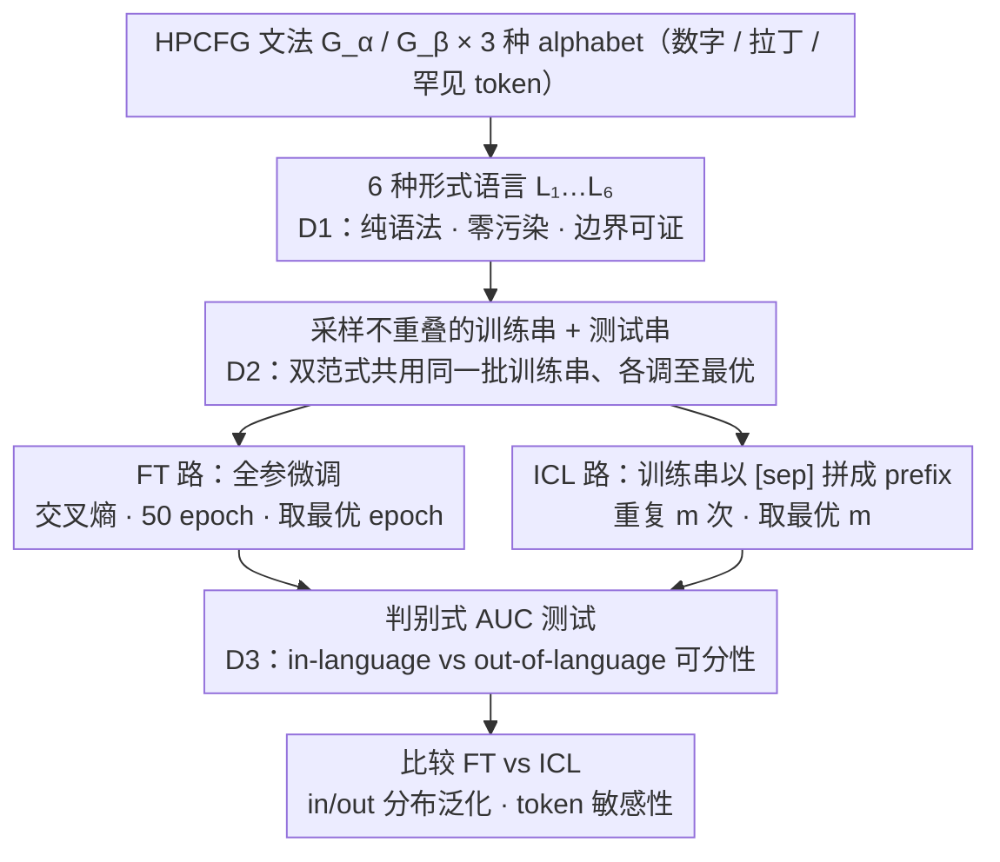

# Fine-tuning vs. In-context Learning in Large Language Models: A Formal Language Learning Perspective

**会议**: ACL 2026  
**arXiv**: [2604.23267](https://arxiv.org/abs/2604.23267)  
**代码**: https://github.com/bishwamittra/formallm  
**领域**: LLM 评测 / ICL vs SFT / 归纳偏置  
**关键词**: 形式语言, 微调, 上下文学习, 判别式评测, 概率上下文无关文法

## 一句话总结
作者用概率层级化上下文无关文法 (HPCFG) 构造一组"无污染、有边界、可精确采样"的形式语言作为受控测试床，并提出"判别式 AUC 测试"作为统一指标，在 18 个 LLM、6 个家族、6 种语言上系统比较 FT 与 ICL：FT 在 in-distribution 上稳定胜出，但在 out-of-distribution 上两者打平，ICL 的归纳偏置与 FT 相近但对 token 敏感得多。

## 研究背景与动机

**领域现状**：FT (fine-tuning) 和 ICL (in-context learning) 是 LLM 两种最基础的"学习范式"——前者改参数、像闭卷考试，后者只看 prompt、像开卷考试。两者哪个更"学得会一门语言"，以及它们的归纳偏置是否一致，是社区一直悬而未决的问题。

**现有痛点**：以往工作 (Mosbach 2023、Brown 2020 等) 结论极其矛盾——有人说 FT > ICL，有人说反过来。作者归因为三个实验设计缺陷：
任务边界不清 (自然语言里没法精确定义"in-distribution"和"out-of-distribution")；资源分配不公 (一边用 1 epoch FT，一边给最优 ICL)；评测指标不可比 (生成 loss 受模型先验和 prompt 形式影响，不能跨范式直接比)。

**核心矛盾**：自然语言数据天然存在"数据污染"和"任务边界模糊"——LLM 可能在预训练时就见过测试数据，且 in-distribution 与 out-of-distribution 的划分本身依赖直觉。这使得"公平比较 FT 与 ICL"在自然语言上几乎不可能。

**本文目标**：(i) 设计一个无污染、可精确控制采样、有清晰语言边界的学习任务；(ii) 提出一个跨范式可比的语言熟练度指标；(iii) 在 18 个 LLM 上系统回答四个 RQ——谁更熟练、归纳偏置是否一致、in/out-of-distribution 表现如何、对 token 是否敏感。

**切入角度**：作者借用形式语言理论——HPCFG 同时具备"递归结构 (模拟自然语言)"+ "纯语法、零语义" + "可精确采样" + "无污染"四个性质，是天然的受控实验室。

**核心 idea**：用 HPCFG 生成的纯语法形式语言代替自然语言基准，并用"判别 in-language vs out-of-language 字符串"的 AUC 代替生成 loss，消除模型先验和 prompt 差异带来的不可比性。

## 方法详解

### 整体框架
整篇方法本质上是先把"公平比较 FT 与 ICL"这件模糊的事拆成三条 desiderata (D1 任务规约干净、D2 资源平等、D3 指标可比)，再用三块设计逐条落实，最终汇成一条"造语言 → 双范式各自学 → 同一把尺子量"的受控实验流水线：
(1) **形式语言生成 (对应 D1)**：用两组 HPCFG ($G_\alpha, G_\beta$) × 三种 alphabet (数字 / 拉丁 / under-trained tokens) 组合出 6 种语言 $\{L_i\}_{i=1}^6$，从每种语言采样不重叠的训练串 ($n_{\text{train}}\in\{1,2,4,\dots,1024\}$) 和测试串 ($n_{\text{test}}=1024$)。
(2) **两种学习范式 (对应 D2)**：FT 在 50 个 epoch 内最小化交叉熵 $\mathtt{loss}_M(D) = -\frac{1}{n}\sum_{s\in D}\frac{1}{|s|}\sum_{i=1}^{|s|} \log P_M(s_i \mid s_{[1,i-1]})$；ICL 把训练串用 `[sep]` 拼成 prefix，例子重复次数 $m\in\{1,2,4,8,16\}$。两者用同一批训练串、各自调到最优 epoch / 重复数后再比，保证资源平等。
(3) **判别式 AUC 测试 (对应 D3)**：把 in-language 串 $L$ 和 out-of-language 串 $\mathsf{T}(L)$ (通过 edit 或随机化构造) 喂给 LLM，记录生成 loss，再用一个线性分类器算 $\mathtt{auc}_M(L, \mathsf{T}(L))$——分数越高语言熟练度越高，且跨 LLM、跨范式可比。

### 关键设计

**1. 三大 desiderata（D1/D2/D3）框架：把"公平比较 FT 与 ICL"这个模糊命题拆成三条可验证的标准**

以往工作结论之所以彼此矛盾，根子在于"公平比较"从来没被严格定义过。作者把它拆成三条 desiderata：D1 要求任务规约干净（纯语法、零 prompt 语义），D2 要求资源平等（双方用同样的训练串、各自调到最优超参），D3 要求指标可比。这三条不是凭空列的——每一条都精确对应自然语言基准的一个具体缺陷：任务边界模糊对应 D1、一边 1 epoch FT 一边给最优 ICL 的资源不公对应 D2、生成 loss 受模型先验和 prompt 形式污染对应 D3。有了这套框架，作者一眼就能定位前人矛盾的来源：例如 Mosbach 2023 满足了 D1+D2 却违反 D3，结论自然不可信。换句话说，这套 desiderata 第一次让"比 FT 和 ICL"变成一件可证伪、可复现的事，而不是各做各的。

**2. HPCFG 形式语言作为受控测试床：用可精确采样、零污染、边界可证明的语法语言替代自然语言**

自然语言里 in-distribution 与 out-of-distribution 全靠直觉划分，而且 LLM 很可能预训练时就见过测试数据，这让 D1 在自然语言上根本无法满足。HPCFG（带概率的层级上下文无关文法）正好补上这一缺口：从开始符号 $S$ 递归展开产生式直到 alphabet $\mathbf{T}$，一个串的生成概率等于所用产生式概率之积（如示例 $P(s)=0.5^{23}$），因此"是否属于这门语言"有形式判据——$P_L(s)>0$ 即为 in-language。OOD 语言则通过修改语法规则得到，距离 $\mathtt{dist}(L_1, L_1^{(\ell)})$ 随被改规则数 $\ell$ 单调增，于是"离训练分布多远"也变得可计算。更妙的是，alphabet $\mathbf{T}\subset\mathbf{V}$ 是 LLM 词表的子集，可以换成数字、拉丁字母或罕见 token——这样就能把"语法"和"token 频率"两个变量彻底隔离开来单独考察。

**3. 判别式 AUC 测试：用"能否拒绝非法串"取代"生成 loss"，得到跨模型、跨范式可比的熟练度指标**

生成 loss 不可比有两个原因：绝对 loss 受预训练先验影响，且 FT 与 ICL 喂进去的 prompt 形式根本不同。判别式测试绕开了这两点——它不问"模型生成什么"，而问"模型给 in-language 串的 loss 是否系统性地低于 out-of-language 串"，把这件事转成一个二分类问题，用线性分类器算出 $\mathtt{auc}_M(L, \mathsf{T}(L)) \in [0,1]$。由于同一个 LLM 在同种 prompt 格式下打分，模型先验和 prompt 偏差被同时消掉，分数因此可以横跨 18 个模型、跨 FT/ICL 两种范式直接比较。其中 out-of-language 串通过两种方式构造："edit by $k$" 做 $k$ 次插/删/替（edit 距离越小越严苛），或"按字母表完全随机"。作者打的比方很贴切：两个非母语者生成质量可能相同，但他们犯的错才暴露真实的语言先验——只看生成不够，还得看模型能不能拒绝。

### 损失函数 / 训练策略
FT 用标准交叉熵全参微调 50 epoch；ICL 把训练串用分隔符拼接为 prefix，重复 $m\in\{1,2,4,8,16\}$ 次。两者按各自最优 $m^*$ 比较。模型覆盖 6 个家族 (Mistral / Llama-2/3 / Qwen / Gemma / Pythia / Opt) 共 18 个，从 0.5B 到 13B 参数。每组实验用 3 个不同 seed 重复。

## 实验关键数据

### 主实验

在语言 $L_1$ 上，限定 32 个 ICL 例子 (所有模型都能装下) 时的家族级平均 AUC，以及 FT 平均 AUC：

| 模型家族 | FT 平均 AUC | ICL 平均 AUC | 差距 (FT−ICL) |
|---------|------------|--------------|---------------|
| Llama-2 | 0.93 | 0.77 | +0.16 |
| Qwen | 0.92 | 0.78 | +0.14 |
| Mistral | 0.91 | 0.78 | +0.13 |
| Opt | 0.91 | 0.64 | +0.27 |
| Gemma | 0.90 | 0.69 | +0.21 |
| Pythia | 0.90 | 0.61 | +0.29 |
| Llama-3 | 0.88 | 0.59 | +0.29 |

FT 在 512 个训练串后所有模型 AUC > 0.99；ICL 在同样数据量下家族差异巨大。

### 消融实验

| 配置 | 关键指标 | 说明 |
|------|---------|------|
| FT @ in-distribution $L_1$ | AUC > 0.99 | 训练/测试同语言，几乎完美判别 |
| FT @ out-of-distribution $L_1^{(5)}$ | 接近随机 | 改 5 条规则后泛化崩溃 |
| ICL @ in-distribution $L_1$ | AUC 0.59–0.78 | 跨家族差距大，最差接近随机 |
| ICL @ out-of-distribution $L_1^{(1)}$ | 与 FT 几乎相同 | OOD 上 FT 优势消失 |
| ICL 重复样本 $m>1$ | AUC 下降 | 重复挤占 context，不如多样化采样 |
| ICL on under-trained tokens ($L_3$) | AUC 显著掉点 | 对 token 出现频率敏感 |
| FT on under-trained tokens ($L_3$) | AUC 几乎不变 | 参数更新可补偿罕见 token |

### 关键发现
- **FT 收敛一致，ICL 家族差异大**：所有 18 个 LLM 在 FT 上最终都能收敛到 AUC>0.99；而 ICL 的 AUC 范围跨度从 0.59 (Llama-3.1-8B) 到 0.78+ (Qwen-2.5-7B/Mistral-7B)，且模型规模和 ICL 表现不严格单调 (Mistral-7B > Mistral-12B, Llama-2-7B > Llama-3.1-8B)。
- **OOD 上 FT 优势消失**：FT 在同分布语言上几乎打满分，但只能泛化到最近的 OOD 语言 $L_1^{(1)}$，更远的就崩；ICL 表现相近，说明"FT 更强"只是 in-distribution 现象。
- **归纳偏置低数据相似、高数据分化**：FT 与 ICL 在相同测试串上的生成 loss Pearson 相关随训练样本增多而下降——两者"学到的语言"在浅层重合、深层分歧。
- **ICL 对 token 敏感**：改 alphabet (数字↔拉丁↔under-trained) 不改语法，FT 几乎不动，ICL 大幅波动；解释了为何同家族 ICL 表现不稳定 (预训练对不同 token 曝光度不同)。

## 亮点与洞察
- **把"公平比较"形式化为三条 desiderata**：D1/D2/D3 提供了一个可证伪的协议，直接指出 Mosbach 2023 等先前工作矛盾的根因 (违反 D3)。这种"问题归约 → 协议设计"的工作风格本身就值得学习。
- **判别式 AUC 是真正可比的指标**：相比生成 loss，AUC 消除了"模型先验差异"和"prompt 形式差异"两个混淆变量，让"哪家强"第一次有了客观答案；这种用 "ranking-based metric 代替 absolute metric" 的思路可以迁移到任何"跨架构跨范式比较"问题。
- **HPCFG 作为 LLM 评测的"模式生物"**：作者重新发现了形式语言在 NLP 评测中的价值——精确边界 + 零污染 + 距离可计算，弥补了自然语言基准的根本缺陷；类似 ImageNet 之于 CV 的早期作用。
- **OOD 上 FT 失去优势这一发现具有实际意义**：很多人默认"训得越深越泛化"，但本文表明只有在测试与训练同分布时这才成立；OOD 场景下保留预训练知识的 ICL 反而更可取。

## 局限与展望
- 只覆盖了上下文无关 (CFG) 类形式语言，正则语言和上下文敏感语言未验证。
- 受限于 FT 计算成本，只测到 13B；更大模型 (>13B) 的 ICL 是否会反超 FT 仍是开放问题，但作者论证 FT 也会随规模提升，所以"in-distribution 上 FT > ICL"应不受动摇。
- 只用 full fine-tuning，未测 LoRA 等 PEFT；也未测 instruction-tuned 模型 (作者认为形式语言任务不需要指令)。
- ICL 家族差异的机制 (为何 Llama-3.1-8B 比 Llama-2-7B 还差) 只给出了 token 敏感性这一部分解释，更深层原因留待未来。
- 归纳偏置只用生成 loss 相关性度量，未做"逐串判别式"分析。

## 相关工作与启发
- **vs Mosbach et al. (2023)**: 最接近的工作。两者都比较 FT 与 ICL，但 Mosbach 用 MNLI 自然语言数据 (违反 D1)，且只用生成式指标 (违反 D3)，结论是 OOD 上 FT > ICL；本文在形式语言上得到相反结论 (OOD 上两者打平)，验证了 D1+D3 缺一不可。
- **vs Allen-Zhu & Li (2023, Physics of LMs)**: 同样用 HPCFG 研究 LLM，但只做了 FT 一侧；本文借用其文法构造但首次把它用于范式比较。
- **vs Kallini et al. (2024) / Jumelet & Zuidema (2023)**: 同样用形式语言，但只用生成式 cross-entropy，本文证明判别式 AUC 更稳健可比。
- **启发**：(a) 任何"跨范式 / 跨架构比较"任务都应优先采用排序型指标 (AUC、accuracy) 而非绝对值指标 (loss、ppl)；(b) 评测协议的设计 (desiderata) 应优先于具体实验；(c) 形式语言作为 LLM 的"模式生物"还有大量未开发空间——比如评测 reasoning、in-context regression、tool use 等。

## 评分
- 新颖性: ⭐⭐⭐⭐ 不是发明新模型，而是首次把"公平比较 FT/ICL"形式化为可证伪协议，并给出可比指标；这是范式级别的贡献。
- 实验充分度: ⭐⭐⭐⭐⭐ 18 个 LLM × 6 个家族 × 6 种语言 × 多种 alphabet × 3 个 seed，规模和系统性都非常硬。
- 写作质量: ⭐⭐⭐⭐ 逻辑链非常清晰 (问题 → desiderata → 框架 → RQ → 实验)，但 HPCFG 等概念对非形式语言背景读者略陡。
- 价值: ⭐⭐⭐⭐ 给"FT vs ICL"这个老问题画了一个新的、可信的底线；判别式 AUC 这一工具具有跨任务可迁移性。

<!-- RELATED:START -->

## 相关论文

- [\[NeurIPS 2025\] Retrospective In-Context Learning for Temporal Credit Assignment with Large Language Models](../../NeurIPS2025/llm_pretraining/ricl_temporal_credit.md)
- [\[ACL 2026\] FOREVER: Forgetting Curve-Inspired Memory Replay for Language Model Continual Learning](forever_forgetting_curve-inspired_memory_replay_for_language_model_continual_lea.md)
- [\[ICLR 2026\] Pre-training LLM without Learning Rate Decay Enhances Supervised Fine-Tuning](../../ICLR2026/llm_pretraining/pre-training_llm_without_learning_rate_decay_enhances_supervised_fine-tuning.md)
- [\[ACL 2025\] Data Whisperer: Efficient Data Selection for Task-Specific LLM Fine-Tuning via Few-Shot In-Context Learning](../../ACL2025/llm_pretraining/data_whisperer_data_selection.md)
- [\[ACL 2026\] Compact Example-Based Explanations for Language Models](compact_example-based_explanations_for_language_models.md)

<!-- RELATED:END -->
