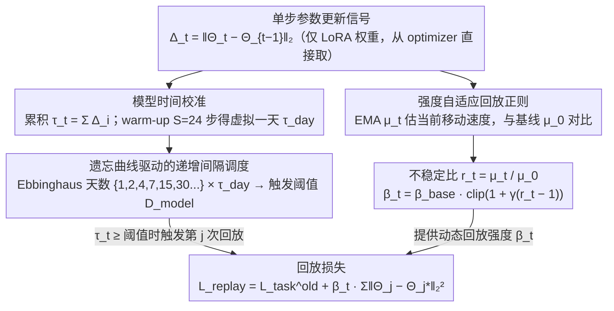

# FOREVER: Forgetting Curve-Inspired Memory Replay for Language Model Continual Learning

**会议**: ACL 2026  
**arXiv**: [2601.03938](https://arxiv.org/abs/2601.03938)  
**代码**: https://github.com/WoodScene/FOREVER  
**领域**: 持续学习 / LLM / 记忆回放  
**关键词**: 遗忘曲线, 模型时间, 参数更新动态, 间隔重复, 灾难性遗忘

## 一句话总结
作者把 Ebbinghaus 遗忘曲线的"间隔回放"思路从"训练步数"重新对齐到"模型时间" (parameter update norm $\Delta_t = \|\Theta_t - \Theta_{t-1}\|_2$ 累积)——既用累积模型时间 $\tau_t$ 决定**何时回放**，又用最近更新强度 $\mu_t$ 与基线 $\mu_0$ 的不稳定比 $r_t$ 自适应控制**如何回放** (regularization 强度)；在 3 个 CL 基准、4 种 backbone (0.6B–13B) 上一致超越 SOTA，OP +1.2%、BWT +0.9% vs 最强 baseline VBM。

## 研究背景与动机

**领域现状**：LLM 持续学习 (CL) 的核心目标是顺序学新任务不灾难性遗忘旧任务。Replay-based 方法 (存少量旧样本周期性回放) 因为简单有效成为主流；其设计有两个核心问题：**何时回放** + **回放多强**。

**现有痛点**：(a) 现有 replay schedule 大都是 hand-crafted 启发式——uniform interval、fixed weight、step-based Ebbinghaus 间隔；(b) 即使最近的 Ebbinghaus-inspired 工作 (Zhong 2024、VBM 2025) 也是基于"训练步数 = 时间"这个假设，但相同步数在不同 lr、batch size 下导致的模型变化可能差几个数量级——同样的"7 天"可能对应完全不同的模型状态；(c) 回放强度通常是固定的 $\beta$，没法响应模型当前是"快速变化"还是"稳定收敛"。

**核心矛盾**：人类遗忘曲线是关于"经过了多少天"的函数，而真正应该计量的不是 calendar time 而是"模型在参数空间走了多远"——把人类时间对齐到模型时间这件事，从未被严格做过。同时回放强度本该和模型当前不稳定度耦合，但现有方法把"何时"和"多强"两件事分开处理。

**本文目标**：(i) 给 LLM 定义一个 model-centric 的"时间"，与优化超参数解耦；(ii) 用这个时间映射 Ebbinghaus 间隔决定 when to replay；(iii) 同一更新动态信号还要驱动 how to replay (regularization 强度)；(iv) 在多 backbone (0.6B–13B) 和多基准上验证。

**切入角度**：作者从 "human days vs model days" 的概念错位出发，注意到 parameter update norm $\Delta_t$ 直接量化"模型走了多远"，且既可以累积成"模型时间"、又可以求 EMA 估"模型当前移动速度"——一个信号同时回答两个问题。

**核心 idea**：用累积参数更新 $\tau_t = \sum_i \Delta_i$ 替代 step count 作为 model time；用最近更新强度 $\mu_t$ 与基线 $\mu_0$ 的比值 $r_t$ 自适应调整 regularization 强度——把"when 和 how"统一到同一个 update dynamics 信号下。

## 方法详解

### 整体框架
FOREVER 把 replay 拆成两个紧耦合的组件，二者共享同一信号 (parameter update magnitude)：
**(1) When to Replay — Forgetting Curve-inspired Replay Scheduler**：用 warm-up window $S$ 步 (本文 $S=24$) 内的累积参数更新作为"虚拟模型一天" $\tau_{\text{day}}$，把 Ebbinghaus 人类日 $\mathcal{D}_{\text{human}}=\{1,2,4,7,15,30,...\}$ 映射成 $\mathcal{D}_{\text{model}}=\{d\cdot\tau_{\text{day}} \mid d\in\mathcal{D}_{\text{human}}\}$；训练中持续追踪 $\tau_t$，当 $\tau_t \geq \mathcal{D}_{\text{model}}^{(j)}$ 时触发第 $j$ 次回放，每任务开始时 $\tau$ 重置。
**(2) How to Replay — Intensity-aware Replay Regularization**：用 baseline intensity $\mu_0 = \frac{1}{S}\sum_{t=1}^S \Delta_t$ 与 EMA $\mu_t = (1-\lambda)\mu_{t-1} + \lambda \Delta_t$ 构造不稳定比 $r_t = \mu_t/\mu_0$，回放正则强度 $\beta_t = \beta_{\text{base}} \cdot \text{clip}(1 + \gamma(r_t - 1), g_{\min}, g_{\max})$；最终 replay loss 为 $\mathcal{L}_{\text{replay}} = \mathcal{L}_{\text{task}}^{(\text{old})} + \beta_t \sum_j \|\Theta_j - \Theta_j^\star\|_2^2$，其中 $\Theta^\star$ 是上个任务结束时的快照。两条支线靠"何时回放"取 $\tau_t$ 的累积、"回放多强"取 $\mu_t$ 的 EMA，从同一个 $\Delta_t$ 分流而来，最后在回放损失处汇合。

### 关键设计

**1. 模型时间校准：用累积参数更新 norm 取代训练步数来计量"模型走了多远"**

相同 step 数在 lr=1e-4 和 lr=1e-5 下可能对应完全不同的模型状态——把"何时回放"绑死在 step 上，等于让一个低学习率任务和一个高学习率任务"按同一节奏复习"，必然失配，而这正是过去 step-based Ebbinghaus 方法（如 VBM）的隐患。FOREVER 改用单步参数更新 $\Delta_t = \|\Theta_t - \Theta_{t-1}\|_2$（只对 trainable 的 LoRA 权重计算，直接从 optimizer 已应用的更新里拿，无需额外 forward/backward），把它累积成模型时间 $\tau_t = \sum_{i=1}^t \Delta_i$，直接反映模型在参数空间走过的总距离，对学习率、batch size 远比 step count 鲁棒。再取 warm-up window 内 $S$ 步（本文 $S=24$）的累积更新作为"虚拟一天" $\tau_{\text{day}} = \sum_{i=1}^S \Delta_i$ 这个模型特定的时间单位，于是 Ebbinghaus 人类天数就能换算到模型时间轴上，回放在 $\tau_t \geq \mathcal{D}_{\text{model}}^{(j)}$ 时触发，每个任务开始时 $\tau$ 重置。本质上，这是按"模型确实变了多少"来安排复习，才是用 Ebbinghaus 思想的正确姿势。

**2. 遗忘曲线驱动的递增间隔调度：用"先密后疏"的回放结构对齐人类记忆的早快后慢衰减**

人类遗忘曲线是早期快速衰减、后期慢速衰减，对应到训练上恰好是模型早期参数变化大、需要频繁复习，后期稳定下来可以拉长间隔。FOREVER 直接采用 Ebbinghaus 标准间隔 $\{1,2,4,7,15,30,...\}$ 作为 $\mathcal{D}_{\text{human}}$，再经 $\tau_{\text{day}}$ 映射成模型时间下的触发阈值 $\mathcal{D}_{\text{model}}=\{d\cdot\tau_{\text{day}} \mid d\in\mathcal{D}_{\text{human}}\}$。为了证明起作用的是结构而非某个 magic 数列，作者在 ablation 里横向对比了五种 schedule——标准 Ebbinghaus、指数 $\{1,2,4,8,16,...\}$、多项式 $\{1,4,9,16,...\}$、均匀 $\{2,4,6,8,...\}$、递减 $\{15,7,4,2,1\}$，结果一致指向"任何递增间隔都好于均匀或递减"，标准 Ebbinghaus 只是略好于其他参数化形式（OP 42.5 vs 指数 42.3 vs 多项式 41.5 vs 均匀 40.9 vs 递减 37.2）。作者据此明确强调 FOREVER 不是某个数列的功劳，而是 dense-to-sparse 的结构对齐，既避免被误读为 over-fitted 启发式，也示范了如何把认知科学量化成可工程化的设计。

**3. 强度自适应回放正则：让同一个更新信号既决定何时回放、又决定回放多强**

固定的回放强度 $\beta$ 没法响应"模型现在到底是在剧烈变化还是已经稳定收敛"，这正是过去方法把"when"和"how"拆开各调一遍的代价。FOREVER 复用同一个 $\Delta_t$：除了累积成 $\tau_t$ 决定时机，还对它取 EMA 得到 $\mu_t = (1-\lambda)\mu_{t-1} + \lambda \Delta_t$ 来估当前移动速度，与 warm-up 基线 $\mu_0 = \frac{1}{S}\sum_{t=1}^S \Delta_t$ 相比得到不稳定比 $r_t = \mu_t/\mu_0$，刻画"现在比起步时更激进还是更保守"。回放正则强度随之动态调整：$\beta_t = \beta_{\text{base}} \cdot \text{clip}(1 + \gamma(r_t - 1), g_{\min}, g_{\max})$，当 $r_t>1$（更激进）就放大 $\beta_t$ 加强约束防遗忘，$r_t<1$ 就收缩 $\beta_t$ 让新任务学得动，clip 边界 $g_{\min}=0.5, g_{\max}=3.0$ 防数值爆炸、超参 $\gamma$ 控敏感度。最终回放损失把它接到一个 $L_2$ 锚定项上：

$$\mathcal{L}_{\text{replay}} = \mathcal{L}_{\text{task}}^{(\text{old})} + \beta_t \sum_j \|\Theta_j - \Theta_j^\star\|_2^2$$

其中 $\Theta^\star$ 是上个任务结束时的参数快照。"一个 $\Delta_t$ 既累积成 $\tau_t$ 管时机、又 EMA 成 $\mu_t$ 管强度"是这套设计的精髓——比起 SAPT/SSR 那种 hand-crafted 复杂调度，它少一个独立超参，也更易解释。

### 损失函数 / 训练策略
LoRA-based 框架统一所有 baseline；warm-up window $S=24$，EMA 平滑 $\lambda=0.05$，$\beta_{\text{base}}=10^{-3}$，clip $[0.5, 3.0]$；memory buffer 存每任务原始训练数据的 2%；所有实验跑 3 个 seed 平均。

## 实验关键数据

### 主实验：三个 CL 基准 (Qwen3-0.6B backbone)

| 方法 | Standard CL OP↑ | BWT↑ | Long Sequence OP↑ | BWT↑ | SuperNI OP↑ | BWT↑ |
|------|----------------|------|-------------------|------|-------------|------|
| Fine-tuning (无 CL) | 47.2 | -12.6 | 36.0 | -17.5 | 8.2 | -27.4 |
| EWC | 51.0 | -10.3 | 44.8 | -13.8 | 32.9 | -18.6 |
| O-LoRA | 59.4 | -7.9 | 54.1 | -12.4 | 23.7 | -17.5 |
| MixReplay | 65.8 | -8.0 | 65.1 | -11.4 | 34.6 | -14.1 |
| Fixed-interval Replay | 65.1 | -9.2 | 64.5 | -10.9 | 34.7 | -14.5 |
| SAPT | 68.8 | -6.9 | 67.2 | -8.8 | 38.5 | -6.2 |
| SSR | 68.4 | -7.1 | 67.5 | -9.0 | 40.1 | -5.4 |
| AIMMerging | 71.9 | -5.0 | 67.9 | -6.3 | 41.0 | -3.4 |
| VBM (step-based Ebbinghaus) | 71.5 | -5.2 | 68.1 | -6.1 | 41.3 | -3.7 |
| **FOREVER (ours)** | **72.9** | **-4.7** | **69.4** | **-5.0** | **42.1** | **-2.9** |
| MTL (上限) | 77.4 | — | 77.8 | — | 48.2 | — |

跨 backbone (Qwen3-0.6B/4B、LLaMA3.1-8B、LLaMA2-13B) 趋势一致；LLaMA3.1-8B 上 vs VBM：OP 49.0 → 50.6 (+1.6)，BWT -2.9 → -2.1 (+0.8)。

### 消融实验 (SuperNI, task order 7)

| 类别 | 变体 | OP↑ | BWT↑ |
|------|------|-----|------|
| **Full** | FOREVER | 42.5 | -2.8 |
| Scheduler (§3.2.1) | + Fixed-interval (FIR) | 40.1 | -5.2 |
| | + Reversed Replay (RR) | 37.2 | -7.8 |
| | + End-only Replay (ER) | 40.9 | -6.9 |
| Time Calibration (§3.2.2) | + Step-based (STC) | 41.3 | -3.9 |
| Regularization (§3.2.3) | − IAR | 39.9 | -4.4 |
| | + EWC-style PIR | 42.7 | -3.0 |
| | + IAR & PIR | 42.8 | -2.6 |

### 关键发现
- **Model-centric time 比 step-based 关键**：仅把 calibration 从 update-dynamics 换成 step (STC ablation)，OP 从 42.5 掉到 41.3 (-1.2)，BWT 从 -2.8 退到 -3.9。这一组对比直接证明"模型时间"不是花架子。
- **Increasing-spacing 是 Ebbinghaus 的本质**：标准 (42.5) ≈ 指数 (42.3) > 多项式 (41.5) > 均匀 (40.9) ≫ 递减 (37.2)；说明真正起作用的是 dense-to-sparse 结构，不是具体数列。Reversed Replay (RR) 在主消融中 OP 暴跌到 37.2、BWT -7.8 也佐证此点——"先疏后密"违反遗忘曲线 → 灾难。
- **End-only Replay (任务末才回放) 远不如分布式间隔**：OP 40.9 vs 42.5，证明"间隔重复"本身重要，不是"回放总量"问题。
- **IAR 单独效果好于 EWC-style PIR 且更便宜**：去掉 IAR OP 掉到 39.9；用 EWC-style 参数重要性正则 (PIR) 只有 marginal +0.2，但 PIR 需要估并存参数重要性，开销大。证明 update intensity 是一个高效、几乎零成本的等价信号。
- **IAR + PIR 几乎不再增益 (+0.1)**：暗示两者抓的是同一个底层"训练不稳定"信号——给 PIR 不再需要的理论解释。
- **可视化证实模型时间映射的非均匀性**：左面板 $\Delta_t$ 在每个任务早期大、后期小；右面板 $\tau_t$ 呈非线性增长；同一个"7 天" Ebbinghaus 阈值在不同任务的训练步数跨度高达 140–180 步——证明 step-based 调度必然失配。
- **跨规模一致泛化**：0.6B 到 13B 都稳定胜出 baseline，说明 model-centric replay 不是小模型 trick。

## 亮点与洞察
- **"用一个信号驱动两个决策"是设计上的优雅**：$\Delta_t$ 累积成 $\tau_t$ 管 when，EMA 成 $\mu_t$ 管 how——少一个独立超参，方法整体更 parsimonious 且更易解释。这种"统一驱动信号"思路在任何"决策耦合"场景 (如 RL 的 exploration-exploitation, 优化器的 lr schedule + momentum) 都值得借鉴。
- **把人类认知科学的 Ebbinghaus 曲线工程化对齐到 LLM**：明确把 "human days" 换算成 "model days" $\tau_{\text{day}}$，第一次让"Ebbinghaus 启发式"在 LLM 上变成可证伪、可对照的方法 (vs VBM 的 step-based 实现)。这种"概念错位的修正"型贡献往往比 add-a-module 更深刻。
- **额外开销几乎为零**：$\Delta_t$ 直接从 optimizer 拿，不需要额外 forward/backward；这意味着 FOREVER 可以无缝叠加到任何 replay-based CL 方法上作为 drop-in scheduler。
- **明确强调"结构 > 数列"**：作者用增间隔的多种参数化 (指数、多项式) 对比，证明真正起作用的是"先密后疏"原则——避免被读者误以为 magic numbers，提升结论可信度。
- **实验设计的对比组完整**：FIR/RR/ER 三种 schedule + STC 一种 calibration + IAR/PIR 三种 regularization，几乎穷举了所有可质疑的设计选择；这种"防御性 ablation"在好的方法论文里应该是标配。

## 局限与展望
- **Parameter update magnitude 只是间接代理**：累积更新和"任务级性能退化"或"语义遗忘"不直接对应——理论上模型在参数空间走得远不等于真的忘了；未来可结合直接的任务 diagnostics。
- **Ebbinghaus 间隔是预设的认知科学先验**：尽管多种参数化都有效，但仍是人为指定，未必对所有任务最优；可探索 learned schedule 或元学习方式自适应。
- **只测了 NLU 类基准 + LoRA 微调**：在 multimodal CL、full fine-tuning、RLHF 场景下未验证；同样的 update dynamics 信号可能对 PPO 类训练响应不同。
- **memory buffer 大小固定在 2%**：buffer 比例 vs FOREVER 收益的关系没系统扫；buffer 极小时 model-centric replay 是否仍有效未知。
- **$\beta_t$ 的 clip 边界 $[0.5, 3.0]$ 是经验值**：在长序列任务或更大模型上是否需要重新调，作者未给出指导。
- **$\Theta^\star$ 选用上任务结束快照作锚点**：可能错过任务内部的好 checkpoint；可探索 EMA-of-snapshots 等更鲁棒锚点策略。

## 相关工作与启发
- **vs VBM (Kang 2025) — 最近的 step-based Ebbinghaus 方法**: 同是 Ebbinghaus 启发，但用 step 计时；FOREVER 同等设置下 OP +1.2 / BWT +0.9，证明"model time"比"step time"更靠谱。这是最干净的 head-to-head 对比。
- **vs EWC (Kirkpatrick 2017) / 参数重要性正则**: FOREVER 的 IAR 在不估参数重要性的前提下取得相近效果 (42.7 vs 42.8)，开销低得多——证明 update intensity 是 EWC 类信号的廉价等价物。
- **vs SAPT / SSR / Recurrent-KIF**: 都属于 replay-based 方法但 schedule 是 hand-crafted；FOREVER 用 dynamic schedule + adaptive regularization 一致超越。
- **vs MixReplay / Fixed-interval Replay**: 最朴素的 baseline，证明 model-centric scheduling 比 uniform 显著好 (OP +6–7)。
- **vs Architecture-based (O-LoRA, MoELoRA)**: 后者需要 task identifier 或额外 module，scalability 受限；FOREVER 只改 replay 调度，不改架构。
- **启发**：(a) 任何依赖"时间"的训练机制 (lr schedule, EMA, 课程学习) 都该考虑用 update dynamics 重新校准而非 step count；(b) 把人类认知科学量化对齐到模型是有效的研究路径，但必须找到正确的"时间度量"；(c) "一信号驱多决策"是降低超参复杂度的好范式；(d) 在 LLM CL 中，replay schedule 比 buffer size 更被低估——值得更多关注。

## 评分
- 新颖性: ⭐⭐⭐⭐ 把 Ebbinghaus 间隔从 step-based 升级到 model-time-based 是关键洞察；"一信号驱动 when+how" 的设计统一性优雅；但单点技术 (LoRA、$L_2$ anchor、EMA) 都已有。
- 实验充分度: ⭐⭐⭐⭐⭐ 3 个基准 × 4 个 backbone (0.6B–13B) × 11 个 baseline × 3 套 ablation × 8 个 task orders × 3 个 seed，对比组覆盖几乎所有可质疑设计，可视化清晰。
- 写作质量: ⭐⭐⭐⭐ 概念引入 (human days vs model days) 故事性强，公式与文字穿插得当，limitations 诚实；少数符号略密。
- 价值: ⭐⭐⭐⭐ 几乎零开销的 drop-in scheduler，可叠加到任何 replay-based CL 方法；代码开源；对 RLHF / instruction tuning 等长周期持续训练场景有直接迁移潜力。

<!-- RELATED:START -->

## 相关论文

- [\[ACL 2026\] Data Mixing Agent: Learning to Re-weight Domains for Continual Pre-training](data_mixing_agent_learning_to_re-weight_domains_for_continual_pre-training.md)
- [\[ACL 2026\] Working Memory Constraints Scaffold Learning in Transformers under Data Scarcity](working_memory_constraints_scaffold_learning_in_transformers_under_data_scarcity.md)
- [\[ACL 2026\] Fine-tuning vs. In-context Learning in Large Language Models: A Formal Language Learning Perspective](fine-tuning_vs_in-context_learning_in_large_language_models_a_formal_language_le.md)
- [\[ACL 2026\] KoCo: Conditioning Language Model Pre-training on Knowledge Coordinates](koco_conditioning_language_model_pre-training_on_knowledge_coordinates.md)
- [\[ACL 2025\] Towards Effective and Efficient Continual Pre-training of Large Language Models](../../ACL2025/llm_pretraining/towards_effective_and_efficient_continual_pre-training_of_large_language_models.md)

<!-- RELATED:END -->
