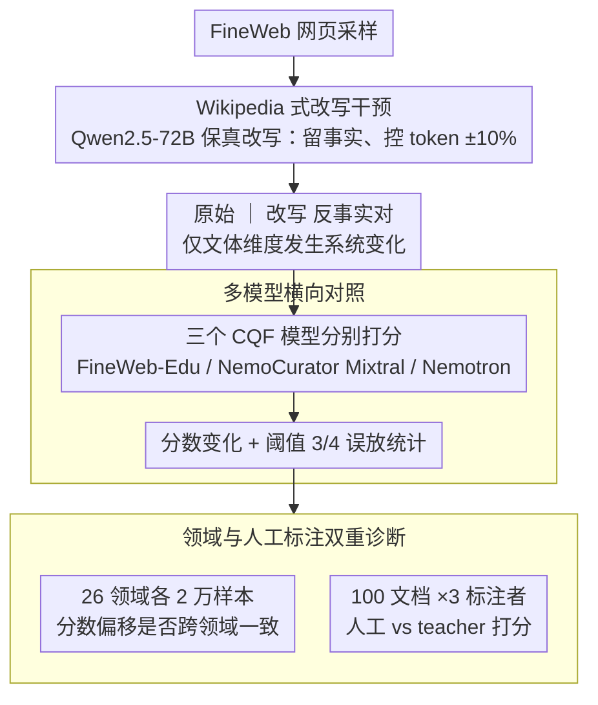

# Is a Document Educational or Just Wikipedia-Style? -- Pitfalls of Classifier-Based Quality Filtering

**会议**: ACL2026  
**arXiv**: [2605.23721](https://arxiv.org/abs/2605.23721)  
**代码**: https://github.com/mklimasz/cqf-pitfalls  
**领域**: LLM预训练 / 数据质量过滤  
**关键词**: 预训练语料, 质量过滤, 教育性分类器, 数据偏差, Wikipedia风格改写  

## 一句话总结
这篇论文发现Classifier-based Quality Filtering会把“Wikipedia式写法”误当成“更有教育价值”，简单改写就能让低质量网页越过预训练数据过滤阈值，FineWeb-Edu约7%的样本会因此翻转过滤决策。

## 研究背景与动机
**领域现状**：现代LLM预训练语料构建越来越依赖质量过滤。除了语言识别、去重、字符比例等启发式规则，FineWeb-Edu、DCLM、Nemotron-CC等数据集开始使用Classifier-based Quality Filtering（CQF），由小型分类器给网页打“教育价值”分数，再决定是否进入预训练语料。

**现有痛点**：CQF看起来像一个可规模化的质量判断器，但它本质上是在模仿LLM teacher的打分偏好。如果teacher把写作风格、排版习惯或领域分布误当成教育价值，student分类器也会继承这种偏差。

**核心矛盾**：预训练语料规模巨大，人工验证几乎不可能；越依赖自动过滤，越需要过滤器真正识别内容质量，而不是识别“像教材/百科”的表面风格。否则低质量内容只要换一种写法，就可能绕过过滤。

**本文目标**：作者想检验一个具体问题：CQF模型到底是在判断文本是否有教育价值，还是在偏好Wikipedia式的组织形式和语言风格？

**切入角度**：论文设计了一个非常直接的干预实验：保持原始事实基本不变，只把网页改写成Wikipedia风格，然后比较改写前后的CQF分数和过滤决策。

**核心 idea**：如果只改变风格就能显著提高CQF分数，那么“教育性分类器”存在风格捷径，不能被直接等同于真实数据质量判断。

## 方法详解

### 整体框架
论文没有提出新的训练算法，而是做了一个针对CQF的诊断实验。流程分为两步：先从FineWeb中随机采样网页，用Qwen2.5-72B-Instruct把网页重写成Wikipedia式文本，要求保留事实、实体、日期和大致token数量；然后把原始文本和改写文本分别输入多个CQF模型，比较分数变化、阈值翻转和领域分布偏差。

作者进一步做了两个补充分析。第一，用Nvidia domain classifier把文本分到26个领域，查看不同领域的分数偏移是否一致。第二，让3名人类标注者按照FineWeb-Edu原始educational prompt给100个文档打分，检查偏差是否来自student分类器，还是teacher LLM标注本身。

### 关键设计

**1. Wikipedia 式改写干预：构造一个只换写法、不换事实的反事实样本**

要回答“CQF 究竟在评内容还是评风格”，最干净的办法是把同一篇网页的内容固定住，只改变它的呈现方式。作者用 Qwen2.5-72B-Instruct 把 FineWeb 网页改写成类似 Wikipedia 条目的格式，prompt 明确要求不引入任何新事实，保留原文的日期、地点和实体，并把 token 数量控制在原文 ±10% 的范围内。这样改写前后唯一系统性变化的就是“百科口吻”这一文体维度。如果 CQF 分数因此大幅上升，就说明分类器至少部分依赖了风格捷径，而非真正的内容质量。

**2. 多模型横向对照：让结论不只针对某一个 FineWeb-Edu 分类器**

单一模型上的偏差可能只是偶然，所以作者同时比较了三个主流 CQF 模型——FineWeb-Edu、NemoCurator Mixtral 和 NemoCurator Nemotron。三者都建立在 Snowflake-Arctic-Embed-M 这类 BERT 量级的 embedding 模型之上，正是为大规模过滤而设计的轻量分类器。如果三个独立训练的模型在同一个改写干预下都出现一致的抬分，那么问题就更可能根植于“教育性过滤范式”本身或它们共享的 teacher 标注偏好，而不是某个模型的偶发失效。

**3. 领域与人工标注双重诊断：定位偏差是否跨领域，以及是否来自 teacher**

为了把偏差的来源刨清楚，作者做了两层诊断。领域层面，用 Nvidia domain classifier 把文本分到 26 个领域，每个领域采样 20,000 个样本，比较原始与改写文本的分数分布；只要所有领域都被改写抬分，就说明风格偏好不是个别领域的特例，而是范式级的系统偏差。监督层面，选取 100 个改写前后分差较大的文档，每篇请 3 名标注者按 FineWeb-Edu 原始 educational rubric 重新打分。如果人类打分系统性低于 LLM teacher，就指向一个更上游的病灶：CQF 继承的偏差其实来自 teacher 标注本身偏乐观，student 分类器只是把它放大了。

### 损失函数 / 训练策略
本文不训练新模型，主要是评测协议。CQF分数通常在0到5之间，常用阈值为3或4。Wikipedia改写prompt强调“只改形式，不加事实”，教育性打分prompt沿用FineWeb-Edu的5分累加式标准。人工标注也使用同一prompt，以便对比LLM teacher和人类判断。

## 实验关键数据

### 主实验
| CQF模型 | 原始文本均分 | Wikipedia式改写均分 | 分数变化 | 论文解读 |
|---------|--------------|---------------------|----------|----------|
| FineWeb-Edu | 1.19 | 1.49 | +0.30 | 三者中平均最稳健，但高阈值误放仍明显 |
| NemoCurator Mixtral | 1.17 | 1.60 | +0.43 | 风格改写带来的分数抬升最大 |
| NemoCurator Nemotron | 1.18 | 1.59 | +0.41 | 与Mixtral类似，明显偏好百科式表达 |

### 消融实验
| 分析项 | 数据 / 设置 | 关键结果 | 含义 |
|--------|-------------|----------|------|
| 阈值3误放 | 原始分数不超过2的样本，改写后按阈值3过滤 | NemoCurator Mixtral超过7%，Nemotron约5%，FineWeb-Edu约6%会被放行 | 低质量内容可通过风格改写跨过常用过滤阈值 |
| 阈值4误放 | 更严格阈值4 | FineWeb-Edu仍约1%未能过滤 | 提高阈值不能完全消除风格漏洞 |
| 领域敏感性 | 26个领域，每领域20,000样本 | 所有领域中改写文本平均分都高于原文 | 风格偏差具有跨领域一致性 |
| 人工教育性标注 | 100个文档，3名标注者 | 人类平均比Llama 3.1 70B teacher低0.77分 | 偏差很可能来自teacher标注本身，而不只是student分类器 |

### 关键发现
- Wikipedia式改写对三个CQF模型都有系统抬分效果，说明“教育性”分数混入了强烈的文体偏好。
- FineWeb-Edu平均分差最小，但在实际阈值过滤中仍会放过约6%的原本低分样本；这提醒我们平均鲁棒性不等于决策鲁棒性。
- 领域分析显示CQF会偏好某些领域。如果下游模型需要低偏好领域的数据，固定阈值可能会系统性削弱领域覆盖。
- 人工标注低于LLM teacher约0.77分，说明“teacher给得太乐观”可能是CQF偏差的上游来源。

## 亮点与洞察
- 论文的实验设计很朴素但击中要害：只改写风格、不改事实内容，如果过滤决策翻转，就能强有力地说明分类器学到了表面捷径。
- 它把数据投毒风险和数据过滤偏差联系起来。恶意内容不一定需要复杂攻击，只要包装成更“百科”的形式，就可能提高进入预训练语料的概率。
- 对预训练语料构建的启发是：质量过滤不能只看单个CQF分数，应该结合内容一致性、来源信誉、领域配额和对抗式风格扰动测试。
- 这篇工作也提醒评测者，LLM-as-teacher的标注prompt本身需要审计；student模型的偏差可能只是teacher偏差的放大版。
- 更深一层的启发是，过滤器需要对“保真改写”保持稳定，而不是把格式规范、标题层级和百科口吻自动视为高质量证据。

## 局限与展望
- 作者承认自动改写会引入噪声，精确百分比只能近似表示问题规模，不能当作真实互联网上绕过率的精确估计。
- 实验主要考察Wikipedia式改写，没有系统探索其他风格，例如教材式、问答式、学术摘要式或恶意SEO式文本。
- 论文没有把被误放数据真正用于预训练下游模型，因此还不能量化这种CQF漏洞对模型能力、安全性或偏见的最终影响。
- 人工标注规模只有100个文档，足够提示teacher偏差，但还不足以建立完整的人类质量标准。

## 相关工作与启发
- **vs FineWeb-Edu**: FineWeb-Edu把LLM标注蒸馏到轻量CQF模型，用于大规模教育性过滤；本文指出它可能把Wikipedia式写法误认为高教育价值。
- **vs Nemotron-CC / Nemotron-CLIMB**: Nemotron系列强调数据质量和领域混合，本文的领域敏感性结果说明CQF分数应和领域配比一起审计。
- **vs 传统启发式过滤**: 语言识别、去重、困惑度等规则透明但粗糙，CQF更灵活但不透明；未来可能需要两者组合，并加入对抗式鲁棒性检查。
- **对后续研究的启发**: 可以构建“风格不变性”测试集，要求质量过滤器对保真改写保持稳定，对真正内容质量变化才敏感。

## 评分
- 新颖性: ⭐⭐⭐⭐☆ 问题切入非常清楚，干预设计有说服力；方法本身偏诊断实验而非复杂算法。
- 实验充分度: ⭐⭐⭐⭐☆ 覆盖三个CQF模型、100k样本、26领域和人工标注；缺少下游预训练影响验证。
- 写作质量: ⭐⭐⭐⭐☆ 短小直接，结论明确；部分关键百分比在正文叙述中给出，表格化还可以更完整。
- 价值: ⭐⭐⭐⭐⭐ 对预训练数据过滤、数据投毒防御和LLM teacher标注审计都有现实意义。

<!-- RELATED:START -->

## 相关论文

- [\[ICCV 2025\] ConstStyle: Robust Domain Generalization with Unified Style Transformation](../../ICCV2025/llm_pretraining/conststyle_robust_domain_generalization_with_unified_style_transformation.md)
- [\[AAAI 2026\] Perspective from a Broader Context: Can Room Style Knowledge Help Visual Floorplan Localization?](../../AAAI2026/llm_pretraining/perspective_from_a_broader_context_can_room_style_knowledge_help_visual_floorpla.md)
- [\[ACL 2025\] CritiQ: Mining Data Quality Criteria from Human Preferences](../../ACL2025/llm_pretraining/critiq_mining_data_quality_criteria_from_human_preferences.md)
- [\[AAAI 2026\] Beyond Cosine Similarity: Magnitude-Aware CLIP for No-Reference Image Quality Assessment](../../AAAI2026/llm_pretraining/beyond_cosine_similarity_magnitude-aware_clip_for_no-reference_image_quality_ass.md)
- [\[NeurIPS 2025\] Predict Training Data Quality via Its Geometry in Metric Space](../../NeurIPS2025/llm_pretraining/predict_training_data_quality_via_its_geometry_in_metric_space.md)

<!-- RELATED:END -->
