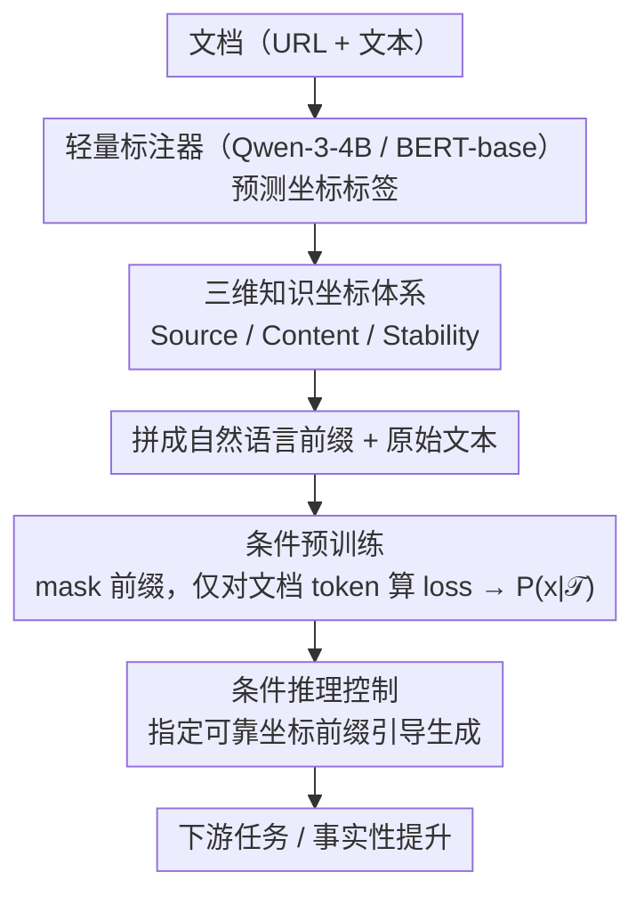

# KoCo: Conditioning Language Model Pre-training on Knowledge Coordinates

**会议**: ACL 2026  
**arXiv**: [2604.12397](https://arxiv.org/abs/2604.12397)  
**代码**: 无  
**领域**: LLM Safety / Pre-training  
**关键词**: 知识坐标, 条件预训练, 幻觉缓解, 数据上下文化, 预训练加速

## 一句话总结

提出知识坐标条件化预训练（KoCo），将每个文档映射为三维语义坐标（来源、内容、稳定性），作为文本前缀注入预训练，使模型获得显式的上下文感知能力，在 10 个下游任务上提升性能、加速收敛约 30%，并有效缓解幻觉。

## 研究背景与动机

**领域现状**：标准 LLM 预训练将语料视为扁平化的 token 序列，对所有 token 无差别地优化下一个 token 的负对数似然——无论该 token 来自经过同行评审的定理还是社交论坛的随意对话。这与人类的学习方式形成鲜明对比：人类在阅读时会自然地根据信息的来源和角色进行上下文化理解。

**现有痛点**：近期的改进尝试可分为两类。元数据感知预训练（如 MeCo）通过前缀 URL 来标识来源，但 URL 粒度过细、依赖先验映射且缺乏客观性。数据选择方法（如 ASK-LLM）通过分类器筛选高质量数据，但采用的是二元方式——保留优质数据、丢弃其余，与人类学习方式不同。人类在遇到低质量信息时不会直接"删除"，而是根据其来源和性质进行上下文化处理。

**核心矛盾**：现有方法要么提供的上下文信号过于表面（URL），要么直接丢弃"低质量"数据而非帮助模型理解其局限性。需要一种更结构化的方式让模型感知每个文档在知识空间中的位置。

**本文目标**：设计一种简单有效的预训练方法，通过为每个文档提供客观的知识坐标描述，使模型在预训练阶段就获得类似人类的上下文感知能力。

**核心 idea**：受 DIKW（数据-信息-知识-智慧）层次结构启发，将每个文档映射到三维语义空间——来源（Source）、内容（Content）、稳定性（Stability），以自然语言前缀的形式注入预训练，让模型区分"永恒的物理定理"和"短暂的社交观点"。

## 方法详解

### 整体框架

KoCo 将标准预训练目标从 $P(x)$ 转化为条件分布 $P(x|\mathcal{T})$，其中 $\mathcal{T} = (s, c, t)$ 是文档的知识坐标三元组。具体流程：(1) 使用轻量级语言模型（Qwen-3-4B）作为标注器，根据文档的 URL 和文本预测三维坐标标签；(2) 将标签拼接为自然语言前缀（如"Source: Academic; Content: Reference; Stability: Evergreen"）并前缀到原始文本；(3) 预训练时仅对文档 token 计算损失（mask 掉前缀部分）。训练目标为：

$$\mathcal{L}_{\text{KoCo}} = -\sum_{i=1}^{n} \log P_\theta(x_i | x_{<i}, \mathcal{T})$$

### 关键设计

**1. 三维知识坐标体系：用一组与主题无关的客观元描述，给文档在知识空间里定位**

标准预训练把所有 token 一视同仁，但人类读到一段文字时会先判断它来自哪里、是什么性质。KoCo 把这种判断显式化成三个正交维度：**Source**（来源，Academic/Media/Community/Personal 等 10 类）、**Content**（内容类型，Instructional/Pedagogical/Discussion/Opinion 等 11 类）、**Stability**（时间稳定性，Ephemeral/Decaying/Long-term/Evergreen 4 类）。和 URL 这种表面信号不同，三个维度刻画的是信息的本质属性，让模型能区分“永恒的物理定理”和“短暂的社交观点”。在 DCLM 语料上超过 99.5% 的文档都能成功映射到这个坐标系，消融实验也证实三个维度捕获的是互补信息，缺一不可。

**2. 条件推理控制（Conditional Inference）：把通常只在对齐阶段才有的可控信号，提前到预训练就埋好**

既然坐标是以前缀形式注入预训练的，那么推理时也能反过来用前缀去引导模型行为。作者为不同任务设计了特定前缀，例如 Social IQA 用 {Source: Media; Content: Discussion}、LogiQA 用 {Source: Academic; Content: Pedagogical}。更关键的是事实性控制：在 TruthfulQA 上指定一个可靠来源前缀（如 {Source: Publication; Content: Instructional; Stability: Long-term}）能带来高达 3.78% 的提升。这意味着用户在推理时只要指定合适的知识坐标，就能主动抑制不可靠输出——这种可控性在传统 pipeline 里要到对齐阶段才出现，KoCo 把它上移到了预训练。

**3. 标注器独立性验证：证明收益来自坐标条件化本身，而不是从大标注器偷偷蒸馏知识**

一个自然的质疑是：KoCo 的提升会不会只是从 Qwen-3-4B 标注器蒸馏来的知识？为排除这种可能，作者换上仅 110M 参数的 BERT-base 作为替代标注器——它远小于被预训练的 0.6B 模型，只在 50K 标注样本上训练后生成坐标。如果提升真来自蒸馏，那么换成更弱的标注器效果应当明显下降；实验结果却是两种标注器效果相当，从而坐实了收益来自“条件化机制”本身，排除了知识蒸馏假说。

### 训练策略

预训练时仅对文档 token 计算损失，前缀 token 被 mask 掉。在 MeCo 1.6B checkpoint 上继续预训练，使用 DCLM 语料的 100GB 子集。从零开始预训练时，KoCo 在 0.3B 和 0.6B 模型上均展示了约 30% 的收敛加速。

## 实验关键数据

### 主实验

在 MeCo 1.6B checkpoint 上继续预训练，10 个下游任务评估：

| 方法 | COPA | ARC-e | ARC-c | CSQA | IFEval | OBQA | PIQA | SIQA | LogiQA | TruQA | 平均 |
|------|------|-------|-------|------|--------|------|------|------|--------|-------|------|
| MeCo (URL前缀) | 82.0 | 75.4 | 44.4 | 64.0 | 20.0 | 50.8 | 73.0 | 52.9 | 25.5 | 36.3 | 52.42 |
| 标准继续预训练 | 82.0 | 74.6 | 42.8 | 59.5 | 22.2 | 49.6 | 72.9 | 52.7 | 24.9 | 35.2 | 51.64 |
| 数据选择 | 82.0 | 75.0 | 44.6 | 63.3 | 22.4 | 49.0 | 74.0 | 52.6 | 25.2 | 35.5 | 52.36 |
| **KoCo** | **83.0** | **77.4** | 44.1 | 61.8 | **25.5** | **51.2** | **74.8** | **53.4** | **26.9** | **36.6** | **53.48** |

### 消融实验

| 设置 | ARC-e | ARC-c | OBQA | PIQA | 平均 |
|------|-------|-------|------|------|------|
| w/o Source | 76.2 | 44.1 | 50.2 | 73.7 | 53.43 |
| w/o Content | 76.6 | 43.6 | 51.2 | 74.1 | 53.46 |
| w/o Stability | 76.7 | 43.1 | 51.0 | 73.8 | 53.32 |
| KoCo (完整) | 77.4 | 44.1 | 51.2 | 74.8 | **53.48** |

### 关键发现

- KoCo 使用与 MeCo 相同的数据（DCLM 语料），无需引入额外数据即可显著提升性能，平均提升 1.06%
- 标准继续预训练反而降低 MeCo checkpoint 性能，数据选择方法仅能持平——说明简单的数据操作不足，需要更结构化的条件信号
- 条件推理在 TruthfulQA 上提升 3.78%，远超其他任务——模型学到了来源可靠性与事实性之间的关联
- 使用不可靠来源前缀（如 Personal/x.com + Opinion + Ephemeral）会使 TruthfulQA 分数降至 34.75%，而可靠来源前缀提升至 40.39%
- PCA 可视化显示 KoCo 训练的模型在表示空间中清晰分离了事实性和观点性陈述

## 亮点与洞察

- **认知启发的设计**：三维知识坐标模拟了人类"了解信息来源和性质"的认知过程，理念简洁但效果显著
- **幻觉缓解的新路径**：通过在预训练阶段就让模型学会区分可靠与不可靠来源，提供了一种从根本上减少幻觉的方法，而非事后修复
- **预训练与对齐的桥接**：KoCo 将控制信号从对齐阶段提前到预训练阶段，暗示某些对齐目标可以上移，简化下游微调流程
- **不丢弃低质量数据**：与数据选择方法不同，KoCo 保留所有数据但标注其性质，让模型在理解上下文的前提下从所有数据中学习

## 局限与展望

- 实验规模限于 0.3B-1.6B 模型，更大规模模型上的效果有待验证
- 标注器的准确性（与商业模型一致性约 75-83%）存在噪声，可能限制了坐标的精确性
- 三维坐标体系是手工设计的，更多维度或自动发现的坐标是否更优尚不清楚
- 预训练加速约 30% 的结论仅在从零训练的小模型上验证，大规模设置下有待确认
- 条件推理需要用户手动选择合适的坐标前缀，自动化选择机制有待研究

## 相关工作与启发

- **vs MeCo (URL 前缀)**：MeCo 使用 URL 作为来源标识，粒度过细且依赖先验；KoCo 使用结构化的三维坐标，提供更客观、更有信息量的条件信号
- **vs 数据选择方法**：数据选择采用二元的"保留/丢弃"策略；KoCo 保留所有数据但标注其属性，让模型学会在上下文中理解不同质量的信息
- **vs RLHF/SFT 对齐**：KoCo 将可控性引入预训练阶段，提供了"上游对齐"的新思路

## 评分

- 新颖性: ⭐⭐⭐⭐ 知识坐标的概念新颖，三维分类体系设计合理，认知启发的动机有说服力
- 实验充分度: ⭐⭐⭐⭐ 10 个下游任务评估、从零预训练、消融实验、标注器独立性验证均完整，但模型规模偏小
- 写作质量: ⭐⭐⭐⭐⭐ 动机清晰、方法简洁、分析深入，讨论部分对互补性和局限性的探讨尤为出色
- 价值: ⭐⭐⭐⭐ 方法简单可复现，对预训练数据利用和幻觉缓解有实际指导价值

<!-- RELATED:START -->

## 相关论文

- [\[ICML 2025\] Metadata Conditioning Accelerates Language Model Pre-training](../../ICML2025/llm_pretraining/metadata_conditioning_accelerates_language_model_pre-training.md)
- [\[ACL 2026\] FOREVER: Forgetting Curve-Inspired Memory Replay for Language Model Continual Learning](forever_forgetting_curve-inspired_memory_replay_for_language_model_continual_lea.md)
- [\[ACL 2026\] Data Mixing Agent: Learning to Re-weight Domains for Continual Pre-training](data_mixing_agent_learning_to_re-weight_domains_for_continual_pre-training.md)
- [\[ACL 2026\] Fine-tuning vs. In-context Learning in Large Language Models: A Formal Language Learning Perspective](fine-tuning_vs_in-context_learning_in_large_language_models_a_formal_language_le.md)
- [\[ICML 2026\] FlexRank: Nested Low-Rank Knowledge Decomposition for Adaptive Model Deployment](../../ICML2026/llm_pretraining/flexrank_nested_low-rank_knowledge_decomposition_for_adaptive_model_deployment.md)

<!-- RELATED:END -->
