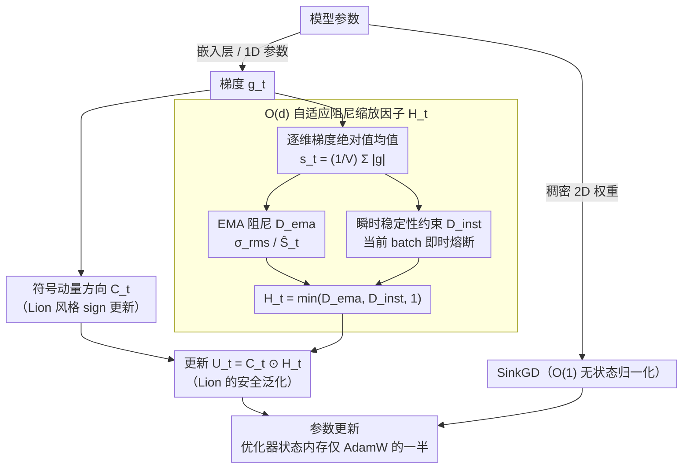

# SAGE: Sign-Adaptive Gradient for Memory-Efficient LLM Optimization

**会议**: ACL 2026  
**arXiv**: [2604.07663](https://arxiv.org/abs/2604.07663)  
**代码**: [GitHub](https://github.com/naubull2/SAGE-optimizer)  
**领域**: LLM预训练  
**关键词**: 优化器, 内存效率, 嵌入层, 符号优化, 自适应缩放

## 一句话总结

本文提出 SAGE 优化器，通过 Lion 风格的符号更新方向和一个 $O(d)$ 内存开销的自适应阻尼缩放因子，解决了轻量级优化器在嵌入层上失败的"嵌入层困境"，在 Llama 模型（最大 1.3B）上以显著更低的优化器内存达到新的 SOTA 困惑度。

## 研究背景与动机

**领域现状**：AdamW 是 LLM 预训练的标准优化器，但其两个全尺寸动量状态（$O(Vd)$）消耗的内存相当于模型大小的两倍，是训练的关键内存瓶颈。轻量级优化器如 Lion（单动量）、SinkGD（无状态归一化）已取得进展。

**现有痛点**：轻量级优化器对稠密层效果很好，但在嵌入层上失败。嵌入层的梯度具有稀疏性和高方差（因 Zipfian 分布的 token 频率），无状态方法无法有效处理。因此 SinkGD 等方法采用混合设计——对嵌入层回退到 AdamW，部分抵消了内存节省。

**核心矛盾**：嵌入层是最大的优化器状态内存消耗者（$V > 100,000$），但恰恰是轻量级优化器失败的地方。要实现真正的内存高效，必须攻克嵌入层。

**本文目标**：设计一个能成功替代 AdamW 处理嵌入层的轻量级优化器。

**切入角度**：Lion 的更新幅度是静态的 1.0（每个维度相同），缺乏对高方差维度的控制。如果能设计一个有界的自适应缩放因子来选择性地阻尼高方差维度，就能在保持内存效率的同时获得稳定性。

**核心 idea**：SAGE = Lion 的符号方向 + 新的 $O(d)$ 自适应阻尼缩放因子 $\mathbf{H}_t$。这个缩放因子基于梯度绝对值的 EMA（$L_1$ 范数），理论上有界 $\|\mathbf{H}_t\|_\infty \leq 1.0$，对高方差维度施加更强阻尼，对安静维度退化为 Lion 的 1.0。

## 方法详解

### 整体框架

采用混合优化器结构：嵌入层和 1D 参数（bias/norm）用 SAGE（$O(Vd) + O(d)$ 状态），稠密 2D 权重用 SinkGD（$O(1)$ 状态）。相比 SinkGD+AdamW 混合，将嵌入层的优化器状态内存减少约 50%。SAGE 本身的一步更新是一条分支再汇合的小流水线：梯度一路压成符号动量方向、另一路压成逐维阻尼因子，两路相乘得到最终更新。

### 关键设计

**1. $O(d)$ 自适应阻尼缩放因子 $\mathbf{H}_t$：用一个 $d$ 维向量给高方差维度"踩刹车"**

Lion 对每个维度都用幅度为 1.0 的静态更新，对嵌入层那些因 Zipfian 频率而梯度方差极高的维度毫无控制，这正是它在嵌入层翻车的根源。SAGE 的做法是把整张 $V \times d$ 的梯度信息压成一个 $d$ 维统计量：对嵌入层先算每个维度 $j$ 上梯度绝对值的均值 $(\mathbf{s}_t)_j = \frac{1}{V} \sum_{i=1}^V |g_{t,ij}|$，再对它做 EMA 得到 $\hat{\mathbf{S}}_t$，并以该层的 RMS 作为参考阈值 $\sigma_{rms}$。最终阻尼因子为

$$(\mathbf{H}_t)_j = \min\!\left(\frac{\sigma_{rms}}{(\hat{\mathbf{S}}_t)_j},\ 1\right).$$

这样"安静"维度（$\hat{S}_j < \sigma_{rms}$）的比率大于 1，被 clip 回 1，退化成原汁原味的 Lion；而"嘈杂"维度（$\hat{S}_j > \sigma_{rms}$）则被压到 $<1$，更新幅度被选择性削弱。关键在于它只花 $O(d)$ 状态而非 $O(Vd)$ 就实现了逐维自适应，内存开销可忽略；同时 $\|\mathbf{H}_t\|_\infty \leq 1$ 的有界性保证它永远不会比 Lion 更激进，从而在理论上可证收敛。

**2. 瞬时稳定性约束：给 EMA 配一道即时熔断**

EMA 是个滞后量，当某个 batch 突然甩出梯度尖峰时，基于历史均值算出的阻尼来不及反应，模型可能瞬间失稳。为此 SAGE 在 EMA 阻尼 $\mathbf{D}_t^{ema}$ 之外，再用当前 batch 的统计量算一个瞬时阻尼 $\mathbf{D}_t^{inst}$，最终取三者的最小值：$(\mathbf{H}_t)_j = \min(\mathbf{D}_t^{ema}, \mathbf{D}_t^{inst}, 1)$。这相当于在自适应缩放之上叠了一层类似自适应梯度裁剪（AGC）的即时保护——历史阻尼负责长期校准，瞬时阻尼负责在突发尖峰时立刻兜底，避免灾难性发散。

**3. Lion 的自适应泛化：把 SAGE 解释成 Lion 的"安全升级版"**

SAGE 与 Lion 的差别可以写得非常干净：Lion 的更新是 $\hat{\mathbf{U}}_t^{Lion} = \mathbf{C}_t \odot \mathbf{1}$，SAGE 的更新是 $\hat{\mathbf{U}}_t^{SAGE} = \mathbf{C}_t \odot \mathbf{H}_t$。当 $\mathbf{H}_t$ 固定为全 1 时 SAGE 就退回 Lion，所以 Lion 是 SAGE 的特例。又因为 $\|\mathbf{H}_t\|_\infty \leq 1$，SAGE 的每一步都不超过 Lion，是一种"只会更保守、不会更冒进"的安全泛化。这个性质带来一个实际红利：更安全的更新方向允许把学习率开得比 Lion 更高，反而换来更快更好的收敛——这也是 SAGE 性能提升的主要来源。

### 损失函数 / 训练策略

采用解耦权重衰减（AdamW 风格）。SAGE 维护一个 $O(Vd)$ 动量状态 + 一个 $O(d)$ 自适应状态，总内存仅为 AdamW 的一半。

## 实验关键数据

### 主实验（测试困惑度）

| 方法 | 270M PPL | 内存 | 1.3B PPL | 内存 |
|------|----------|------|----------|------|
| AdamW | 37.35 | 2.1GB | 27.81 | 9.8GB |
| Lion | 30.24 | 1.0GB | 28.37 | 4.9GB |
| SinkGD-Hybrid | 34.30 | 0.9GB | 28.71 | 1.9GB |
| **SAGE-Hybrid** | **29.95** | **0.5GB** | **24.33** | **0.9GB** |

### 消融实验

| 配置 | PPL (270M) | 说明 |
|------|-----------|------|
| SAGE-Hybrid | 29.95 | 完整方法 |
| SinkGD-Pure | 192.7 | 无状态方法在嵌入层失败 |
| SAGE-Pure | 116.0 | SAGE 单独用于所有层也不好 |
| Lion-Hybrid | 32.10 | 用 Lion 替换嵌入层的 AdamW |

### 关键发现
- SAGE-Hybrid 在所有模型尺寸上都达到最低困惑度，且内存仅为 AdamW 的 ~10%
- SinkGD-Pure 验证了嵌入层困境的存在——纯无状态优化器在嵌入层上灾难性失败
- SAGE 的有界性允许使用比 Lion 更高的学习率，是性能提升的关键
- 混合设计（SAGE for embedding + SinkGD for dense）是最优组合

## 亮点与洞察
- **"嵌入层困境"的诊断**非常精准：识别出嵌入层梯度的稀疏性和高方差是轻量级优化器失败的根因，从而有针对性地设计解决方案
- **$O(d)$ 自适应缩放的设计**极其内存高效：将 $V \times d$ 的梯度信息压缩到 $d$ 维的均值绝对值，用 $d$ 维 EMA 跟踪即可，几乎不增加内存
- **Lion 到 SAGE 的泛化视角**很优雅：SAGE 是 Lion 的严格安全泛化，既有理论保证又有直觉解释

## 局限与展望
- 实验仅到 1.3B 参数，更大模型（7B+）的效果未验证
- SAGE 仅在 Llama 架构上测试，其他架构（如 Mixture of Experts）的效果未知
- 预训练 token 数量和数据集较小（实验中用 RedPajama 子集），大规模预训练的效果待验证
- 未与 GaLore、APOLLO 等其他低秩方法做系统比较（虽然 APOLLO 结果很差）

## 相关工作与启发
- **vs AdamW**: 内存效率大幅提升（~10× 更小的优化器状态），同时困惑度更优
- **vs Lion**: SAGE 是 Lion 的自适应泛化，通过有界阻尼允许更高学习率
- **vs SinkGD**: SinkGD 在嵌入层需要回退到 AdamW，SAGE 替换了这个回退

## 评分
- 新颖性: ⭐⭐⭐⭐ 嵌入层困境的诊断和 $O(d)$ 自适应缩放的解决方案都很新颖
- 实验充分度: ⭐⭐⭐ 模型尺寸较小，缺乏更大规模验证
- 写作质量: ⭐⭐⭐⭐⭐ 动机推导清晰，理论分析严谨
- 价值: ⭐⭐⭐⭐ 为内存受限的 LLM 训练提供了实用优化器方案

<!-- RELATED:START -->

## 相关论文

- [\[ICLR 2026\] Scaling with Collapse: Efficient and Predictable Training of LLM Families](../../ICLR2026/llm_pretraining/scaling_with_collapse_efficient_and_predictable_training_of_llm_families.md)
- [\[ACL 2025\] AsyncLM: Efficient and Adaptive Async Pre-training of Language Models](../../ACL2025/llm_pretraining/asynclm_efficient_and_adaptive_async_pre-training_of_language_models.md)
- [\[ACL 2026\] Working Memory Constraints Scaffold Learning in Transformers under Data Scarcity](working_memory_constraints_scaffold_learning_in_transformers_under_data_scarcity.md)
- [\[ACL 2026\] FOREVER: Forgetting Curve-Inspired Memory Replay for Language Model Continual Learning](forever_forgetting_curve-inspired_memory_replay_for_language_model_continual_lea.md)
- [\[ICML 2026\] SPARe: Stacked Parallelism with Adaptive Reordering for Fault-Tolerant LLM Pretraining Systems with 100k+ GPUs](../../ICML2026/llm_pretraining/spare_stacked_parallelism_with_adaptive_reordering_for_fault-tolerant_llm_pretra.md)

<!-- RELATED:END -->
