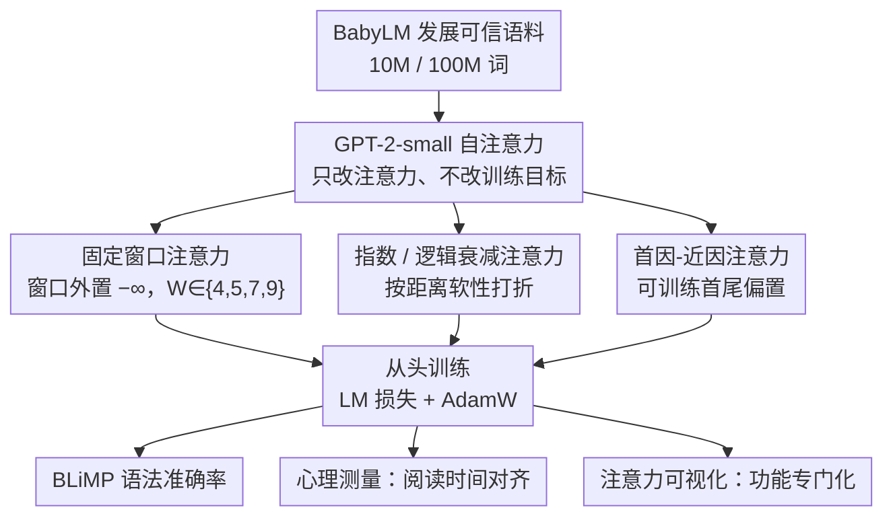

# Working Memory Constraints Scaffold Learning in Transformers under Data Scarcity

**会议**: ACL 2026 Findings  
**arXiv**: [2604.20789](https://arxiv.org/abs/2604.20789)  
**代码**: 无  
**领域**: 认知建模 / 语言模型预训练  
**关键词**: 工作记忆, 注意力约束, 归纳偏置, 数据稀缺, 认知对齐

## 一句话总结

本文将人类工作记忆约束（固定窗口、指数衰减、逻辑衰减、首因-近因效应）集成到 GPT-2 注意力机制中，在发展可信的小规模语料（10M/100M 词）上从头训练，发现这些约束在数据稀缺时显著提升语法准确率和人类阅读时间的预测力，且促进注意力头的功能专门化。

## 研究背景与动机

**领域现状**：标准 Transformer 的自注意力机制允许对上下文窗口内所有 token 近乎均匀地访问，缺乏反映人类认知限制的内在结构偏置。虽然 GPT-2 等模型与人类阅读时间和神经活动有良好相关性，但这可能是"尽管如此"而非"因为如此"。

**现有痛点**：现有将认知约束引入 Transformer 的工作要么是事后修改（如对预训练模型施加衰减偏置）、要么是推理时截断上下文、要么是软约束（如 ALiBi），这些方法都未让约束从训练一开始就塑造模型的表示学习。

**核心矛盾**：NLP 领域趋向更长上下文和更弱归纳偏置，但人类语言处理受到工作记忆容量有限的强约束——这种约束是否反而帮助了学习？

**本文目标**：(1) 在从头训练中系统比较四种认知启发的注意力约束；(2) 在数据稀缺场景下评估其对语法能力和认知对齐的影响。

**切入角度**：使用 BabyLM 挑战赛的发展可信数据集（10M/100M 词），在接近人类语言习得的数据量级上训练，使认知约束假说具有更强的可比性。

**核心 idea**：硬性认知约束（特别是固定窗口注意力）作为归纳偏置，在数据稀缺时主动"脚手架"学习，而非阻碍学习。

## 方法详解

### 整体框架

这篇论文要回答一个反直觉的问题：当训练数据稀缺时，给注意力强加人类工作记忆的限制，到底是拖后腿还是帮了忙？做法很克制——不改训练目标、不引入新模块，只在 GPT-2-small 的自注意力上动手脚，实现四种受认知科学启发的注意力变体，然后在 BabyLM 接近儿童语言习得量级的 10M / 100M 词语料上从头训练。训练完用 BLiMP 量语法能力，用心理测量基准量它和人类阅读时间的对齐度，再做注意力可视化看每个变体把注意力头学成了什么样。

### 关键设计

**1. 固定窗口注意力：用一道硬墙把工作记忆的有限容量强加给模型**

标准自注意力让每个 token 几乎均匀地访问整个上下文窗口，没有任何容量上限，这正是它和"工作记忆只有几个 chunk"的人类认知最不一样的地方。这里的做法直接而粗暴：每个 token 只对它前面的 $W$ 个 token 算注意力，窗口之外的位置在 softmax 前一律置 $-\infty$，归一化后权重严格为零。窗口大小取 $W \in \{4, 5, 7, 9\}$ 并非随手设的，分别对应 Cowan 的 4-chunk 理论和 Miller 著名的 $7 \pm 2$ 容量上限。把模型逼进这么窄的局部上下文里操作，等于隔离出"只靠局部依赖能学到多少"，而后续实验最反直觉的一点，恰恰是这种极局部的模型连 Binding、Argument Structure 这类非局部现象都学得不错。

**2. 指数 / 逻辑衰减注意力：用连续衰减软性地模拟"近的记得清、远的会遗忘"的近因效应**

固定窗口是一刀切的硬截断，而人类记忆更像渐变——越近越清晰，越远越模糊。这一组变体不再做非黑即白的屏蔽，而是按距离给注意力打折扣。指数衰减把原始注意力权重和一个随距离指数下降的因子线性混合：

$$a'_{ij} = (1-\alpha)a_{ij} + \alpha e^{-|i-j| \cdot \lambda}$$

它给出的是一条平滑、持续下降的曲线。逻辑衰减则换成 S 形曲线，先保持一段较高的可访问性、到某个距离后才急剧坠落：

$$w_{ij} = 1/(1 + e^{k(d_{ij} - m)})$$

两者的分工很明确：指数衰减刻画的是"匀速遗忘"，逻辑衰减刻画的是"先稳住、再断崖"，后者其实更接近固定窗口那种离散容量的味道，只是把硬边界换成了可微的过渡。

**3. 首因-近因注意力：用两个可训练偏置补上序列首尾的记忆优势**

前两种设计都在强调"近"，但人类记忆有个经典现象是首尾两端都记得比中间牢——回忆一串清单时，开头几项和结尾几项的命中率明显高于中段。这里不再硬编码衰减形状，而是学两个可训练参数 $w_{\text{primacy}}$ 和 $w_{\text{recency}}$，分别控制序列首部和尾部的指数衰减偏置，叠加到标准注意力权重上，让模型自己决定首尾各偏重多少。

### 损失函数 / 训练策略

标准语言建模损失（next-token prediction）。AdamW 优化器，lr=5e-5，训练 5 个 epoch。所有变体使用相同超参数。

## 实验关键数据

### 主实验

**BLiMP 平均准确率**

| 模型 | 10M 数据 | 100M 数据 |
|------|---------|----------|
| Baseline GPT-2 | ~61% | ~71% |
| Fixed Window 5 | **~68%** | ~72% |
| Exponential Decay | ~65% | ~71% |
| Logistic Decay | ~66% | ~72% |
| Primacy-Recency | ~63% | ~71% |

**心理测量对齐（ΔLog-Likelihood）**

| 模型 | 10M | 100M |
|------|-----|------|
| Baseline | ~3.2 | 略高 |
| Fixed Window 7/9 | **~6.0** | 降低 |

### 关键发现

- **数据稀缺时约束最有效**：在 10M 数据下，Fixed Window 5 比 baseline 高约 7 个百分点；在 100M 下差距缩小至 1-2 个百分点
- 约束模型在论元结构（Argument Structure）上表现出色，Fixed Window 5 甚至接近预训练 GPT-2-large 的水平
- **反直觉发现**：极度局部的模型（窗口仅 5 token）在非局部语言现象上也表现良好（如 Binding、Argument Structure）
- 心理测量对齐在 100M 时反而下降——所有模型（含 baseline）在更多数据下与人类处理的对齐度降低，支持"语言建模目标与人类理解不渐近收敛"的假说
- 注意力可视化显示：约束模型的注意力头形成了功能专门化（如主语-动词-宾语头、动词专门头、名词专门头），而 baseline 的注意力分布弥散无专门化

## 亮点与洞察

- "认知约束不是阻碍而是脚手架"这一核心论点非常有力——挑战了 NLP 领域追求更长上下文的主流趋势
- 固定窗口模型在非局部任务上也表现良好是最令人惊讶的发现——暗示局部约束迫使模型发展了更显式的句法编码
- 更多数据反而降低心理测量对齐的发现，为"大模型是否真的理解语言"的讨论提供了新证据

## 局限与展望

- 仅在 GPT-2-small 上实验，结论能否扩展到大规模模型未知
- 仅在英语上验证，自由语序或头尾型语言可能有不同结果
- 工作记忆的简化实现（固定窗口）远比真实认知系统简单
- Island Effects 等现象仍未改善，说明架构约束无法解决所有语言现象

## 相关工作与启发

- **vs ALiBi**: ALiBi 用软偏置不鼓励但不禁止长距离注意力，本文用硬约束完全阻止
- **vs De Varda & Marelli (2024)**: 他们对预训练模型施加事后衰减，本文从头训练让约束塑造学习

## 评分

- 新颖性: ⭐⭐⭐⭐ 从认知科学到计算语言学的跨学科桥接有价值，但各组件不算全新
- 实验充分度: ⭐⭐⭐⭐⭐ BLiMP + 心理测量 + 注意力可视化 + 句法探针，多角度验证
- 写作质量: ⭐⭐⭐⭐⭐ 论证充分，实验分析深入，限制讨论诚实
- 价值: ⭐⭐⭐⭐ 对认知启发的模型设计和数据高效学习有重要启示

<!-- RELATED:START -->

## 相关论文

- [\[ACL 2026\] FOREVER: Forgetting Curve-Inspired Memory Replay for Language Model Continual Learning](forever_forgetting_curve-inspired_memory_replay_for_language_model_continual_lea.md)
- [\[ACL 2026\] SAGE: Sign-Adaptive Gradient for Memory-Efficient LLM Optimization](sage_sign-adaptive_gradient_for_memory-efficient_llm_optimization.md)
- [\[NeurIPS 2025\] Memory Mosaics at Scale](../../NeurIPS2025/llm_pretraining/memory_mosaics_at_scale.md)
- [\[NeurIPS 2025\] Neural Collapse under Gradient Flow on Shallow ReLU Networks for Orthogonally Separable Data](../../NeurIPS2025/llm_pretraining/neural_collapse_under_gradient_flow_on_shallow_relu_networks_for_orthogonally_se.md)
- [\[ACL 2026\] Data Mixing Agent: Learning to Re-weight Domains for Continual Pre-training](data_mixing_agent_learning_to_re-weight_domains_for_continual_pre-training.md)

<!-- RELATED:END -->
