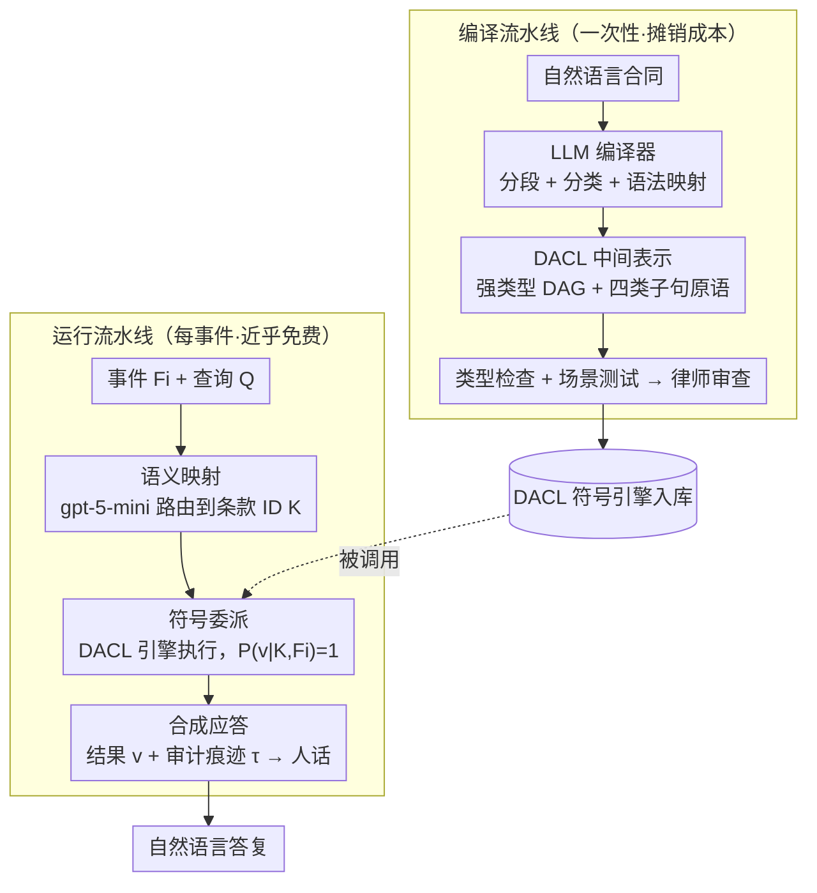

# Accurate Legal Reasoning at Scale: Neuro-Symbolic Offloading and Structural Auditability for Robust Legal Adjudication

**会议**: ACL 2026  
**arXiv**: [2605.02472](https://arxiv.org/abs/2605.02472)  
**代码**: 无（工业部署系统）  
**领域**: LLM 推理 / 神经符号  
**关键词**: 神经符号, 法律推理, DACL, amortized intelligence, 可审计性

## 一句话总结
本文提出 Amortized Intelligence 范式：把 LLM 当作"一次性编译器"将法律合同编译成名为 DACL 的确定性有向无环图中间表示，运行时由轻量 agent 调度符号引擎执行，在 400 个真实合同事件上达到 99.5% 准确率，相比 GPT-5.2/Claude/Gemini 等推理大模型在复杂合同上准确率从 22-46% 直接跳到 98%，且 token 消耗降低 9.9 倍。

## 研究背景与动机
**领域现状**：法律 AI 已从判决预测、合同审查发展到 LLM 驱动的"计算型法律条款"自动执行——这类条款常见于物流计费、能源采购、税务、保险等高频高额业务，每月可能产生成千上万次重复执行。

**现有痛点**：现有 LLM 方案在高风险合同执行场景有两个致命缺陷——**可靠性**：CoT 推理常对算术不忠实，相同输入产生不同输出，工业上无法接受；**经济性**：每次执行都跑大模型推理，成本随事件量线性增长。基准实验显示 GPT-5.2、Claude 4.5 Sonnet、Gemini 3 Pro 等顶级 LRM 在结构复杂合同（76 决策状态的物流主协议）上准确率坍塌到 22-46%，并非算术算错，而是"算对了但用错了变量"——即结构性失败。

**核心矛盾**：法律执行需要"绝对确定的输出 + 可审计的痕迹 + 可负担的成本"，而通用 LLM 提供的是"概率性输出 + 不忠实的 CoT + 与流量线性绑定的成本"。本质上是"通用推理引擎"用错了场景——法律条款一旦签订就是确定的逻辑，每次执行不需要重新理解。

**本文目标**：把法律合同自动化拆成"理解"（高难度但一次性）和"执行"（高频但简单）两个阶段，让 LLM 只负责前者，把后者交给确定性符号引擎。

**切入角度**：作者借鉴编译器架构——把 LLM 当"前端编译器"做合同到中间表示的翻译，把符号执行引擎当"后端"运行时使用。这样推理成本被"摊销"到第一次编译，之后每次执行近乎免费。

**核心 idea**：用"DACL 中间表示 + 神经符号 agent"把概率推理从运行时彻底卸载到编译时，从而同时获得可审计性、确定性和经济性。

## 方法详解

### 整体框架
整套系统的核心思路是把"理解一份合同"和"执行一次计费"彻底拆开，借编译器的架构来组织：贵而难的理解只做一次（编译时），便宜而高频的执行做无数次（运行时）。它由两条流水线构成。**编译流水线**是一次性的——LLM agent 把自然语言合同分段、分类、生成一张名为 DACL 的有向无环图，经过类型检查与场景测试，再由律师人工审查后入库。**运行流水线**是每次事件都要跑的——用户事件 $F_i$ 连同查询 $Q$ 进入一个 neuro-symbolic agent，agent 用 gpt-5-mini 做语义路由识别相关条款 ID，调用 DACL 符号引擎执行计算，拿到结果 $v$ 与审计痕迹 $\tau$，最后包装成自然语言答复。关键的边界划分是：所有 business-critical 的逻辑都关在 DACL 符号引擎内部、概率推理之外，LLM 在运行时永远碰不到一个真正的数值计算。

### 关键设计
**1. DACL 中间表示与四类子句原语：用强类型 DAG 把合同逻辑固化成"相同输入必出相同输出"的程序**

LLM 在运行时直接算合同最大的毛病是 referential transparency 没法保证——同一份输入可能算出不同结果，工业上无法接受。DACL 的对策是把合同翻译成一张强类型有向无环图，让确定性由结构本身担保。图里的变量按来源分三类：External（运行时输入，如发货重量）、Const（合同常量，带时间有效窗口）、Derived（中间计算结果）。逻辑则用四种递归原语表达，每一种都针对商业合同里一类反复出现的模式：**Procedure** 是顺序流水线，支持条件早停；**Logical Clause** 是一阶布尔逻辑，按声明顺序短路求值以强制优先级；**Range Clause** 把连续变量映射到离散桶，在 load 时就强制验证区间不重叠、严格闭区间、覆盖完整，从源头杜绝 off-by-one；**Pricing Formula** 是沙箱化的算术表达式，只白名单 `ceil/floor/round/sqrt/exp/log`、禁止任意代码执行来保证安全。

这套原语之所以好用，是因为它把通用逻辑编程做不顺的事提升成了一等公民。Prolog 这类系统面向定理证明，对"算术 + 时间 + 范围 + 条件"的混合模式表达起来很绕；DACL 直接把这些模式做成原语，于是 LLM 在编译时只需做语法层面的 syntactic mapping，不必再做语义推理。每个条款还带 `validity_start_date / validity_end_date`，合同修订时只重编受影响的条款，避免"改一行重编全部"。

**2. Amortized Intelligence：把"理解"摊销到第一次编译，让之后每次执行近乎免费**

业务场景天然存在一种不对称——合同只签一次，基于它的计费事件却每月成千上万次重复。基线方案没利用这个不对称，是个 $O(N)$ 模型：每来一个事件 $e_i$，都把合同 $C$ 加事实 $F_i$ 重新喂给 LLM 走一遍完整推理，$N$ 个事件就是 $N$ 次重型推理。本文把它改成 $O(1)$ 模型：LLM 只做一次"合同 → DACL"的翻译（耗时但稀疏），之后每个事件只跑廉价的 gpt-5-mini 做语义路由、再调符号引擎，长期摊销成本逼近"路由 LLM + 符号执行"那个极小值。这不是新发明的原理，而是软件工程里"贵的事做一次、便宜的事做多次"这一经典 trade-off 被系统化地搬进了法律 AI——代价是首次编译要付一笔较高的固定成本，回报是 400 事件评测里 token 消耗从 13.44M 直接降到 1.35M，9.9 倍的差距。

**3. Neuro-Symbolic Agent 的三阶段调度：让 LLM 只做选择和表达，绝不碰一次真正的计算**

光有符号引擎还不够，得有人把用户那句模糊的自然语言查询安全地落到引擎上。这个 agent 用 gpt-5-mini 加 OpenAI Agents SDK 实现 ReAct 式调度，但刻意只暴露一个工具 `evaluate_clauses_tool(K, F_i)`——给它越少的发挥空间，高风险场景下越可控。它的工作严格切成三阶段：先是**语义映射** $K = \mathcal{M}_{\theta_{small}}(Q, F_i)$，用受约束的语义解析把查询映射到一组条款 ID，这一步不执行任何逻辑；然后是**符号委派** $(v, \tau) = \Phi_{DACL}(K, F_i)$，把选中的条款交给确定性引擎执行，此时 $P(v|K, F_i) = 1$，输出毫无随机性；最后是**合成应答** $y = \mathcal{S}_{\theta_{small}}(Q, v, \tau)$，把数值结果和审计痕迹组织成人话。

这种切法的意义在于：所有数值、条件、范围判断都由符号引擎执行，LLM 全程只负责"选哪些条款"和"怎么把结果说出来"。这正是同时拿到可审计、可重复、低成本三件套的关键——业务关键计算永远不经过概率推理，错也只会错在"选错条款"这种可以用更严的 tool input schema 收紧的地方，而不会错在算术本身。

### 一个完整示例：一次物流计费事件怎么走完

假设 Logistics-MSA 这份 76 个决策状态的物流主协议已经编译入库（DACL 图就位、律师审过）。现在来一个事件 $F_i$：某批货发货重量、目的地、时效等级等字段，附带查询 $Q$ = "这次该计多少钱？"。

agent 先做**语义映射**：gpt-5-mini 读懂 $Q$ 和 $F_i$，把它解析成一组相关条款 ID $K$（比如命中"重量分档计价 + 偏远地区附加费 + 时效加急"这几条），但它不算任何一个数。接着是**符号委派**：把 $(K, F_i)$ 交给 $\Phi_{DACL}$，引擎里 Range Clause 把发货重量落进对应的重量桶、Pricing Formula 用白名单算术算出基础运费、Logical Clause 按声明顺序短路判断附加费是否触发，整条链路确定地跑完，返回结果 $v$（最终金额）和审计痕迹 $\tau$（走过哪些条款、每步取了哪个变量）。最后是**合成应答**：gpt-5-mini 把 $v$ 和 $\tau$ 包装成一句自然语言答复。整个过程里，那批货到底算多少钱是符号引擎算的，gpt-5-mini 只在两头做翻译——这也是为什么 DACL Agent 在 Logistics-MSA 上能从 LRM 的 46% 拉到 98%，剩下那两例错误还都出在 orchestrator 选错条款、而非引擎算错，而平均延迟反倒从约 164 秒降到 26.8 秒。

### 损失函数 / 训练策略
本文未训练新模型，采用零样本 LRM 基线（GPT-5.2 with reasoning_effort=none/medium、Claude 4.5 Sonnet 启用 Extended Thinking、Gemini 3 Pro thinking_level=high）和 gpt-5-mini 编排 agent，所有基线被约束输出严格 schema：`reasoning` 字段（审计用）+ `result` 字段（自动评分用）。

## 实验关键数据

### 主实验：四类合同 400 事件准确率（节选）

| 合同 | GPT-5.2 (none) | GPT-5.2 (med) | Claude Sonnet 4.5 | Gemini 3 Pro | DACL Agent |
|------|----------------|---------------|-------------------|--------------|------------|
| Health-PPO | 74% | 91% | 73% | 69% | **100%** |
| Energy-Sup | 100% | 99% | 100% | 91% | **100%** |
| Logistics-MSA | 22% | 46% | 45% | 30% | **98%** |
| Muni-IFB | 36% | 95% | 93% | 96% | **100%** |
| **Overall** | 58.0% | 82.8% | 77.8% | 71.5% | **99.5%** |

### 消融实验：错误类型剖析与计算成本

| 维度 | GPT-5.2 Medium 基线 | DACL Agent | 改善倍数 |
|------|---------------------|------------|---------|
| 总 token 消耗（400 事件）| 13.44M | 1.35M | 9.9× ↓ |
| Logistics-MSA 平均延迟 | ~164 秒 | 26.8 秒 | 6.1× ↓ |
| Variable Dependency 错误占比 | 71% | 几乎 0（仅 2 例 orchestrator 错误） | — |
| Arithmetic Hallucination | <1 例/模型 | 0 | — |

### 关键发现
- **"推理悬崖" (Reasoning Cliff)**：GPT-5.2 在 Energy-Sup（1 个决策状态）上 100% 准确，但在 Logistics-MSA（76 个决策状态）上崩到 46%。揭示 LLM 能搞定算术深度（如 Muni-IFB 的日期查找），但搞不定状态宽度（多分支决策树的状态保持）。
- **错误本质是结构性而非算术性**：71% 错误来自 Variable Dependency（变量依赖错误），<1% 来自 Arithmetic Hallucination（算术幻觉）。模型已经掌握法律计算的"算术原语"，但缺乏"结构保真度"——把对的算法用到错的变量上。
- **DACL 错误来源更可控**：DACL Agent 在 Logistics-MSA 的两例错误都来自 orchestrator (gpt-5-mini) 的语义路由失误（选错条款或漏传字段），符号引擎本身按构造无错；通过更严格的 tool input schema 即可消除。
- **生产部署验证**：已上线 12 个月，每月跑约 1000 个计费事件、覆盖 150+ 商业合同，持续工作。
- **"中度"推理对深度有用、对宽度无用**：开启 GPT-5.2 的 medium reasoning 把 Muni-IFB（时间逻辑）从 36% 拉到 95%，但 Logistics-MSA 只从 22% 拉到 46%——说明长 CoT 能弥补单链路深度，却无法解决跨多分支的状态追踪。
- **延迟反直觉地下降**：DACL Agent 在 Logistics-MSA 平均 26.8 秒，远低于 GPT-5.2 Medium / Claude / Gemini 的约 164 秒——把推理交给符号引擎后，整体延迟反而更优。

## 亮点与洞察
- **"编译时 vs 运行时"的范式重构**：本文最深刻的洞察是把法律 AI 从"运行时解释器"重新定义为"编译器"——这种重新划分边界的能力是工程师能从研究中拿走的最有迁移价值的思想。
- **错误剖析揭示 LRM 真正缺什么**：作者用 Judge LLM 把错误分为 VD/DH/AH 三类，量化证明 LRM 失败不在"算不对"而在"状态追踪"。这一发现可以指导未来 LRM 训练应该针对 long-horizon state tracking 而非数学能力做改进。
- **"工具只有一个"的极简设计**：neuro-symbolic agent 只暴露 `evaluate_clauses_tool` 一个工具，故意限制 LLM 的发挥空间——这与"给 agent 越多工具越强"的主流叙事相反，但在高风险确定性场景反而更安全可靠。
- **温度版本化的细节**：DACL 的 `validity_start_date/end_date` 让合同修订只触发增量编译，是一个被低估的工程亮点，避免了"改一行重编全部"的扩展性问题。

## 局限与展望
- **作者承认**：(1) DACL 原语库覆盖算术、一阶逻辑、范围映射，但暂不支持可推翻推理 (defeasible reasoning)、开放语义标准（"合理的注意义务"）和高阶逻辑；(2) Gold Standard 需要人工实现，限制评测规模；(3) 流量是合成而非真实生产分布，可能未充分覆盖长尾错误输入；(4) 仅在英语商业合同上测试，未验证非英语司法管辖区；(5) 编译错误虽稀少但会确定性重复，仍需人审。
- **额外局限**：基线 LRM 用完整合同作为上下文，未尝试 RAG 检索相关条款——后者可能缩小但不消除性能差距（VD 错误来自分支状态追踪，与上下文长度无关）。
- **改进方向**：把 DACL 编译目标扩展到 defeasible/probabilistic formalism（如 ProbLog）；研究自动检测编译错误的工具，减少人审负担；扩展到税法、社保、城市规章等公共法律场景，撬动"司法可及性"的社会价值。

## 相关工作与启发
- **vs Prolog 系 ProSLM/SOLAR**（Vakharia 2024、Sadowski 2025b）：他们用 Prolog 做法律推理，本文的 DACL 专为商业合同设计的算术 + 时间原语，更贴合工业需求；同时本文用 typed DAG 而非自由逻辑程序，结构更稳定。
- **vs LexGLUE/LegalBench 评测**（Chalkidis 2022、Guha 2023）：他们评测 LLM 的法律语言理解，本文评测高风险执行场景下的确定性输出——是一个被忽视的维度。
- **vs PAL/Program-of-Thoughts**（Gao 2023、Chen 2022）：他们用 LLM 生成 Python 代码做单次数学推理，本文把生成产物固化为可重复执行的 DAG，并加上类型系统与版本化——是 Program-aided LM 思路在工业场景的完整工程化。

## 评分
- 新颖性: ⭐⭐⭐⭐ "Amortized Intelligence" 范式重新切分了 LLM 与符号引擎的职责边界，DACL 原语库对商业合同的针对性设计有原创价值。
- 实验充分度: ⭐⭐⭐⭐ 覆盖 4 个真实合同、3 个 LRM 家族、400 事件，并附带错误类型与成本/延迟对比；缺点是缺少更多 baseline（如 RAG-LRM）。
- 写作质量: ⭐⭐⭐⭐⭐ "Reasoning Cliff" 和"Variable Dependency vs Arithmetic Hallucination"等概念命名传播力强；架构图清晰、消融剖析到位。
- 价值: ⭐⭐⭐⭐⭐ 已上线 12 个月的生产系统，每月千次事件、150 合同，是少数 ACL paper 真正落地工业的研究；对所有"用 LLM 做确定性业务"的团队有直接借鉴价值。

<!-- RELATED:START -->

## 相关论文

- [\[ACL 2026\] LegalDrill: Diagnosis-Driven Synthesis for Legal Reasoning in Small Language Models](legaldrill_diagnosis-driven_synthesis_for_legal_reasoning_in_small_language_mode.md)
- [\[ACL 2026\] LePREC: Reasoning as Classification over Structured Factors for Assessing Relevance of Legal Issues](leprec_reasoning_as_classification_over_structured_factors_for_assessing_relevan.md)
- [\[AAAI 2026\] NeSTR: A Neuro-Symbolic Abductive Framework for Temporal Reasoning in Large Language Models](../../AAAI2026/llm_reasoning/nestr_a_neuro-symbolic_abductive_framework_for_temporal_reasoning_in_large_langu.md)
- [\[ACL 2026\] Discovering a Shared Logical Subspace: Steering LLM Logical Reasoning via Alignment of Natural-Language and Symbolic Views](discovering_a_shared_logical_subspace_steering_llm_logical_reasoning_via_alignme.md)
- [\[AAAI 2026\] In-Token Rationality Optimization: Towards Accurate and Concise LLM Reasoning via Self-Feedback](../../AAAI2026/llm_reasoning/in-token_rationality_optimization_towards_accurate_and_concise_llm_reasoning_via.md)

<!-- RELATED:END -->
