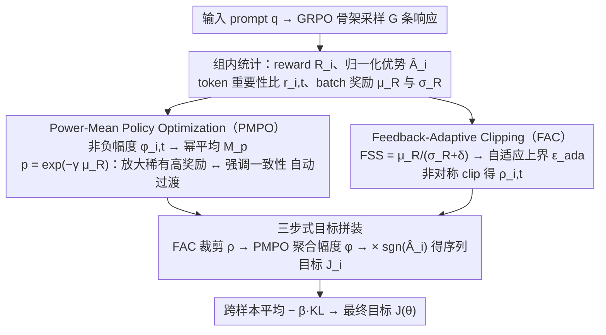

# Adapt to Thrive! Adaptive Power-Mean Policy Optimization for Improved LLM Reasoning

**会议**: ACL 2026 Findings  
**arXiv**: [2605.04066](https://arxiv.org/abs/2605.04066)  
**代码**: 暂无公开  
**领域**: LLM 推理 / 强化学习  
**关键词**: RLVR, GRPO, 幂平均目标, 自适应裁剪, 数学推理

## 一句话总结
本文提出 APMPO，用一个由当前奖励均值控制的"幂平均"统一了 GRPO（算术平均）与 GMPO（几何平均）目标，并配合基于奖励稳定度的自适应 clip 范围，使 RLVR 训练能在不同阶段动态切换"放大稀有高奖励"与"强调一致性"的策略，在 9 个数学/SQL/多模态推理基准上稳定超越 GRPO/DAPO/GMPO。

## 研究背景与动机

**领域现状**：当下提升 LLM 推理的主流路线是带可验证奖励的强化学习（RLVR），其中 GRPO 通过对一组采样轨迹做组内归一化优势估计、省掉价值模型，已成为事实标准；DAPO、GMPO 等变体在 GRPO 之上分别引入非对称 clip 和几何平均目标。

**现有痛点**：作者通过对 GRPO 与 GMPO 训练曲线（图 1）做"前期分析"发现两个具体问题。一是 GRPO 的算术平均目标对高奖励 outlier 极其敏感，早期会快速放大单个高分轨迹，导致 entropy 提前坍缩并锁死在次优策略；GMPO 的几何平均又过于保守，单个低分就把整组奖励拉低，在早期正确路径稀缺时几乎学不到东西。二是所有方法都用固定的 clip 阈值 $\epsilon$ 限制策略更新，完全忽视不同 batch 之间奖励分布的稳定性差异——稳定 batch 被过度束缚，噪声 batch 又被放任造成劣化更新。

**核心矛盾**：静态目标函数与训练动态之间的失配。同一个目标既要在 cold start 阶段"放大稀有正信号"，又要在收敛阶段"强调路径一致性"，这两个需求在 GRPO/GMPO 的任一端都无法兼顾；clip 范围同理。

**本文目标**：(1) 设计一个能根据训练进展在算术均值与几何均值之间平滑切换的目标函数；(2) 设计一个能根据每个 batch 的奖励统计稳定度动态调整信任域的 clip 机制。

**切入角度**：作者观察到算术均值与几何均值都是广义幂平均 $M_p$ 在 $p=1$ 和 $p\to 0$ 时的特例，于是用一个连续可调的指数 $p$ 把两个极端纳入同一框架；同时把"batch 奖励的均值/方差比"看作策略可信度的代理量，用它驱动 clip 范围的伸缩。

**核心 idea**：用样本性能 $\mu_R$ 实时调节幂平均指数 $p=\exp(-\gamma\mu_R)$，让目标从"放大型"自然过渡到"一致型"；同时用 Feedback Stability Score $\text{FSS}=\mu_R/(\sigma_R+\delta)$ 调节 clip 的上界，奖励信号越稳定就允许越激进的更新。

## 方法详解

### 整体框架
APMPO 没有推翻 GRPO，而是沿用它"组采样 + 组内归一化优势"的骨架：对每个 prompt $q$ 采样 $G$ 条响应 $\{o_i\}$，算出 reward $R_i$、归一化优势 $\hat{A}_i=(R_i-\mu_R)/(\sigma_R+\delta)$ 和 token 级重要性比 $r_{i,t}(\theta)$。真正的改动在两个相互正交的自适应模块——PMPO 管"目标怎么聚合"、FAC 管"clip 范围多大"，它们替换掉 GRPO 里写死的算术平均和固定 clip。最终目标的算法是：每条序列内先用 PMPO 把 token 级的"非负幅度"$\phi_{i,t}$ 聚合成一个标量，再乘上方向控制项 $\text{sgn}(\hat{A}_i)$，跨样本平均后减去与参考策略的 KL 惩罚。一句话概括动机：让目标函数本身随训练进展变形，而不是从头到尾用同一副面孔。

### 关键设计

**1. Power-Mean Policy Optimization（PMPO）：用一个随奖励均值滑动的幂平均，让目标自动从"放大稀有高奖励"过渡到"强调路径一致性"**

GRPO 的算术平均对高奖励 outlier 太敏感，早期会迅速放大单条高分轨迹、把 entropy 提前压塌、锁死在次优策略；GMPO 的几何平均又太保守，一个低分就能把整组奖励拖下来，在早期正确路径本就稀缺时几乎学不动。PMPO 的思路是把这两端放进同一个连续的旋钮里。因为幂平均要求被聚合的量非负，它先把 token 级目标拆成"非负幅度"和"方向"两半：

$$\phi_{i,t}(\theta)=|\min(r_{i,t}\hat{A}_i,\ \rho_{i,t}\hat{A}_i)|,\qquad \text{方向}=\text{sgn}(\hat{A}_i)$$

然后用幂平均聚合幅度，而那个指数 $p$ 随当前 batch 的平均奖励 $\mu_R\in[0,1]$ 指数衰减：

$$M_p(\Phi_i)=\Big(\frac{1}{|o_i|}\sum_t \phi_{i,t}^{\,p}\Big)^{1/p},\qquad p=\exp(-\gamma\mu_R)$$

它的妙处在于附录 D 证明了 GRPO 和 GMPO 分别是幂平均在 $p\to 1$ 和 $p\to 0$ 时的极限特例：$p\to 1$ 退化成算术平均，正好是探索期需要的"放大 outlier"；$p\to 0$ 退化成几何平均，正好是巩固期需要的"惩罚不一致"。于是只用一个连续指数，就把"探索-巩固"这个 trade-off 编码进了目标自身，省掉了人工切换训练阶段；而指数衰减的形式又保证 $p$ 从 1 到 0 的滑动是平滑的，不会因目标突变把训练带崩。

**2. Feedback-Adaptive Clipping（FAC）：让 clip 上界随每个 batch 的奖励稳定度伸缩，稳就放开、噪就收紧**

所有 PPO 系方法都用一个写死的 $\epsilon$ 限制策略更新，完全无视不同 batch 之间奖励分布的稳定性差异——结果是稳定 batch 被过度束缚、错失加速机会，噪声 batch 又被放任、引入劣化更新。FAC 先定义一个 Feedback Stability Score 来量化"这批奖励信号有多可信"：

$$\text{FSS}=\mu_R/(\sigma_R+\delta)$$

均值高且方差小就可信。再用 $\tanh$ 把它平滑映射到一个区间，得到自适应上界 $\epsilon_{\text{ada}}=\epsilon_{\min}+(\epsilon_{\max}-\epsilon_{\min})\cdot\tanh(\text{FSS})$，并采用非对称 clip：

$$\rho_{i,t}=\text{clip}\big(r_{i,t},\ 1-\epsilon_{\text{low}},\ 1+\epsilon_{\text{ada}}\big)$$

下界 $\epsilon_{\text{low}}$ 固定、上界 $\epsilon_{\text{ada}}$ 自适应。把"奖励均值 × 方差倒数"当可信度信号的好处，是它能同时奖励"高均值的稳定 batch"、惩罚"低均值高噪声 batch"；而下界固定保证了负优势始终被果断剪掉，不会让负向梯度被放大反过来破坏训练。消融里只去掉 $\sigma_R$、只留 $\mu_R$ 会容易过度放任，只留 $1/\sigma_R$ 又会奖励"稳定但错误"的 batch，正好印证了两者缺一不可。

**3. 三步式目标拼装：把幅度、自适应 clip 和方向语义缝成一个可训练目标**

PMPO 给的是标量幅度、FAC 给的是自适应裁剪，要让它们和 PPO 的稳定性机制协同，需要按固定顺序拼起来。Step 1，用 FAC 的自适应区间算出裁剪后的重要性比 $\rho_{i,t}(\theta)$；Step 2，算 token 级非负幅度 $\phi_{i,t}(\theta)=|\min(r_{i,t}\hat{A}_i,\ \rho_{i,t}\hat{A}_i)|$；Step 3，每条序列的目标是 $\mathcal{J}_i(\theta)=M_p(\Phi_i)\cdot\text{sgn}(\hat{A}_i)$，整批平均后减去 $\beta D_{KL}(\pi_\theta\|\pi_{\text{ref}})$。这套"幅度-方向"解耦既满足了幂平均对非负输入的硬性要求，又靠 $\text{sgn}(\hat{A}_i)$ 把"正优势最大化、负优势惩罚"的方向语义找回来，同时复用 PPO 的 min-clip 双保险继续兜底训练稳定。

### 损失函数 / 训练策略
完整目标 $\mathcal{J}(\theta)=\frac{1}{G}\sum_i \mathcal{J}_i(\theta) - \beta D_{KL}(\pi_\theta\|\pi_{\text{ref}})$。采用 AdamW，学习率 $1\times10^{-6}$，batch size 512，每个 prompt rollout 8 条，训练 400 步，温度 1.0。关键超参 $\gamma=0.8$（控制 $p$ 对 $\mu_R$ 的敏感度）、$(\epsilon_{\min},\epsilon_{\max})=(0.2,0.4)$、$\epsilon_{\text{low}}=0.2$、$\beta=0.001$。reward 采用 0/1 二值规则。

## 实验关键数据

### 主实验
覆盖 Qwen2.5-Math-1.5B-Instruct、Qwen2.5-3B-Instruct、DeepSeek-R1-Distill-Qwen-1.5B 三个模型，6 个数学推理基准（MATH500/AIME24/AIME25/AMC23/Minerva/OlympiadBench）+ SQL（Spider/BIRD）+ 多模态（Geometry3K）。

| 模型 | 方法 | MATH500 | AIME24 P@1 | AMC23 P@1 | Olympiad | Avg P@1 |
|------|------|---------|-----------|-----------|----------|---------|
| Qwen2.5-Math-1.5B | GRPO | 75.2 | 13.3 | 52.5 | 39.0 | 37.1 |
| Qwen2.5-Math-1.5B | DAPO | 77.2 | 16.7 | 57.5 | 40.4 | 39.6 |
| Qwen2.5-Math-1.5B | GMPO | 76.6 | 13.3 | 55.0 | 38.7 | 39.0 |
| Qwen2.5-Math-1.5B | **APMPO** | **78.0** | **20.0** | **62.5** | **42.4** | **41.7** (+2.1) |
| Qwen2.5-3B | GRPO | 66.0 | 6.7 | 40.0 | 31.5 | 29.4 |
| Qwen2.5-3B | **APMPO** | **68.4** | **10.0** | **45.0** | **33.2** | **32.4** (+3.0) |
| DS-R1-Distill-1.5B | GRPO | 75.4 | 13.3 | 57.5 | 43.2 | 39.9 |
| DS-R1-Distill-1.5B | DAPO | 79.8 | 20.0 | 60.0 | 43.8 | 42.8 |
| DS-R1-Distill-1.5B | **APMPO** | **81.6** | **23.3** | **65.0** | **46.6** | **46.0** (+3.2) |

### 消融实验

| 配置 | Avg P@1 (Math) | 说明 |
|------|---------------|------|
| Full APMPO | 41.7 | PMPO + FAC 完整模型 |
| GRPO baseline | 37.1 | 全部去掉 |
| GRPO + 仅 FAC | 38–39 | 仅自适应 clip 已带来收益 |
| GRPO + 仅 PMPO | ~40–41 | 自适应目标贡献更大，是主要驱动 |
| FSS 仅用 $\mu_R$ | 略降 | 失去稳定度感知，容易过度放任 |
| FSS 仅用 $1/\sigma_R$ | 略降 | 会奖励"稳定但错误"的 batch |
| $p$ 用线性衰减 $1-\gamma\mu_R$ | 略降 | 急剧切换会破坏稳定性，指数衰减更优 |

### 关键发现
- 自适应**目标**(PMPO) 的收益明显大于自适应 **clip**(FAC)，证实"静态目标函数"是 RLVR 当前最关键的瓶颈；两者组合呈协同效应。
- 训练曲线显示 APMPO 在 entropy 上明显比 GRPO 衰减慢、比 GMPO 衰减快，恰好维持在"探索-收敛"中间带，并对应最高的 reward 曲线。
- 超参 $\gamma$ 影响过渡速度：$\gamma$ 过小则长期停留在 GRPO 状态（探索受限），过大则过早切到 GMPO 状态（早收敛于次优），$\gamma=0.8$ 是甜点；clip 范围 $(\epsilon_{\min},\epsilon_{\max})$ 在 $(0.1,0.4)\sim(0.2,0.3)$ 内都很 robust，说明 FAC 的自适应机制弱化了对 clip 超参的人工调优需求。
- 计算开销几乎为零：$p$ 与 $\epsilon_{\text{ada}}$ 只需 batch 级 $\mu_R,\sigma_R$ 两个统计量，wall-clock 与 GRPO 持平。

## 亮点与洞察
- **用幂平均统一两类目标**：第一次把 GRPO 的算术平均与 GMPO 的几何平均放到同一连续参数空间下，附录中给出完整的极限退化证明 ($p\to 1$ → GRPO，$p\to 0$ → GMPO)，为后续 RLVR 算法设计提供了一个清晰的"光谱"视角。
- **"训练进展"作为切换信号是个聪明的选择**：用 $\mu_R$ 而不是 step 数来调度 $p$，使方法对训练长度、warmup、数据难度都自适应——同样的 $\gamma=0.8$ 在 1.5B / 3B 多种模型上都最优。
- **非对称 clip 的可迁移性**：FAC 的"上界自适应、下界固定"思路本质上对所有 PPO-style 算法都适用，可以直接迁移到 RLHF、code RL、agent RL 等场景做即插即用增强。
- **把 batch 级统计量做特征**：用 $\mu_R/\sigma_R$ 作为信任域强弱信号，避开了训练额外 critic 或 value model 的代价，极简地实现了"奖励质量感知"。

## 局限与展望
- 实验规模受限于 1.5B/3B 模型，没有在 7B+ 上验证；理论上 PMPO 的探索-巩固机制对大模型应该更有用（因为大模型 cold start 更难找到正确 trace），但缺实证。
- 强依赖可验证的 outcome-based reward，对于无法 0/1 判定的开放问答、长文档总结、对齐任务无法直接迁移；如何把 FSS 推广到 noisy reward 是开放问题。
- 自适应指数 $p$ 只用了 batch 级 $\mu_R$，没有利用 token 级或 trace 级的细粒度难度信号；可以尝试 per-prompt 或 per-token 的自适应粒度，进一步释放幂平均框架的潜力。
- 论文没有报告与 DAPO 在 entropy 增益层面的对比；DAPO 的"dynamic sampling + 非对称 clip"也是一种自适应策略，与 APMPO 是否正交、能否叠加是值得探究的方向。

## 相关工作与启发
- **vs GRPO** (Shao et al. 2024)：GRPO 是 APMPO 的 $p=1$ 极限，APMPO 在前期等价 GRPO，后期自动收紧到 GMPO 风格，端到端涨 3 分。
- **vs GMPO** (Zhao et al. 2025)：GMPO 是 $p\to 0$ 极限，对高奖励 outlier 不敏感，APMPO 在早期主动放大 outlier 帮模型快速发现正轨迹，避免 GMPO 的"启动慢"。
- **vs DAPO** (Yu et al. 2025)：DAPO 引入非对称 clip 和动态采样，是另一种自适应方向；APMPO 的非对称 clip 设计与 DAPO 类似但 $\epsilon_{\text{high}}$ 由数据驱动而非超参，且核心创新在目标函数而非数据采样。

## 评分
- 新颖性: ⭐⭐⭐⭐ 用幂平均统一 GRPO/GMPO 是个干净优雅的视角，FAC 的奖励统计驱动 clip 思路也少见。
- 实验充分度: ⭐⭐⭐⭐ 9 个 benchmark × 3 个模型 + 充分的消融与敏感性分析，附录还有完整理论证明。
- 写作质量: ⭐⭐⭐⭐ 动机-理论-实验链条很完整，图 1 训练动态可视化直观，公式排版略偏密集。
- 价值: ⭐⭐⭐⭐ 一行公式改动即可即插即用替换 GRPO/GMPO，对所有 RLVR 玩家都有实用价值。

<!-- RELATED:START -->

## 相关论文

- [\[ACL 2026\] Think Outside the Policy: In-Context Steered Policy Optimization](think_outside_the_policy_in-context_steered_policy_optimization.md)
- [\[ICLR 2026\] Temperature as a Meta-Policy: Adaptive Temperature in LLM Reinforcement Learning](../../ICLR2026/llm_reasoning/temperature_as_a_meta-policy_adaptive_temperature_in_llm_reinforcement_learning.md)
- [\[ICLR 2026\] Slow-Fast Policy Optimization: Reposition-Before-Update for LLM Reasoning](../../ICLR2026/llm_reasoning/slow-fast_policy_optimization_reposition-before-update_for_llm_reasoning.md)
- [\[ACL 2026\] Calibration-Aware Policy Optimization for Reasoning LLMs](calibration-aware_policy_optimization_for_reasoning_llms.md)
- [\[ICLR 2026\] Adaptive Social Learning via Mode Policy Optimization for Language Agents](../../ICLR2026/llm_reasoning/adaptive_social_learning_via_mode_policy_optimization_for_language_agents.md)

<!-- RELATED:END -->
