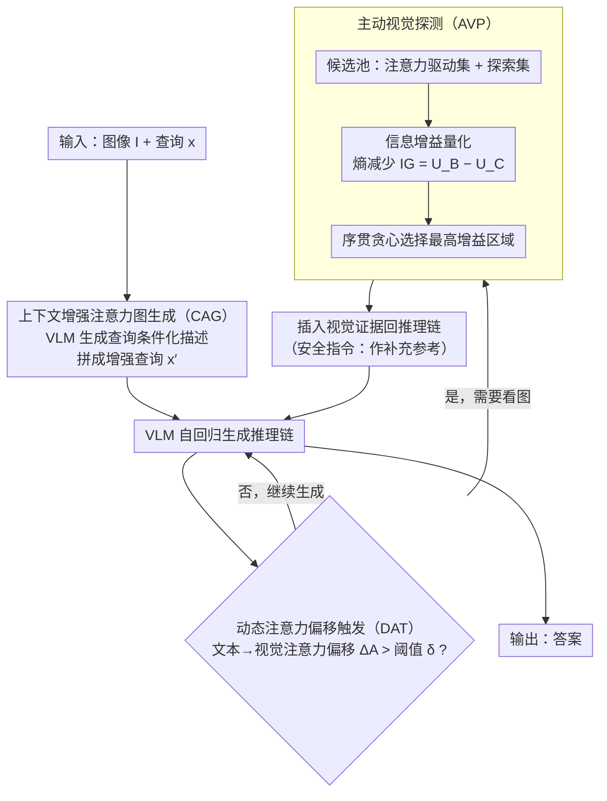

# AIM-CoT: Active Information-driven Multimodal Chain-of-Thought for Vision-Language Reasoning

**会议**: ACL 2026  
**arXiv**: [2509.25699](https://arxiv.org/abs/2509.25699)  
**代码**: [GitHub](https://anonymous.4open.science/r/AIMCoT)  
**领域**: Vision-Language Reasoning / Multimodal CoT  
**关键词**: 交错模态思维链, 信息觅食理论, 主动视觉探测, 动态触发, 视觉问答

## 一句话总结

提出 AIM-CoT 框架，通过信息觅食理论驱动的主动视觉证据选择(AVP)和基于注意力偏移的动态触发机制(DAT)，解决交错模态思维链(I-MCoT)中"看什么"和"何时看"两个核心问题。

## 研究背景与动机

**领域现状**：交错模态思维链(I-MCoT)是视觉语言推理(如 VQA)的重要范式进展。该范式从输入图像中选取细粒度的视觉证据，以视觉 token 的形式插入到推理链的上下文中，使模型能够在推理过程中参考具体的视觉细节。

**现有痛点**：现有 I-MCoT 方法（如 ICoT）在两个核心问题上存在不足：(1) **"看什么"(What to see)**：依赖注意力图进行视觉区域选择，但注意力信号不可靠——当简短的文本查询与信息丰富的图像之间存在严重的粒度失衡时，注意力高峰往往无法对齐真正关键的视觉区域（75%以上的样本 IoU 低于50%）；(2) **"何时看"(When to see)**：采用静态触发策略（如遇到换行符时插入），无法捕捉模型对视觉证据的动态需求。

**核心矛盾**：注意力图捕捉的是 token 之间的语义相关性，但 I-MCoT 真正需要的是能为后续推理提供最大信息量的视觉证据——语义相关不等于信息丰富。

**本文目标**：将 VLM 的推理过程从"被动、静态的感知"转变为"主动、动态的探索"，让模型像信息觅食者一样主动寻找最有价值的视觉线索。

**核心idea**：借鉴信息觅食理论(IFT)，用信息增益(熵减少)替代注意力分数作为视觉证据的选择标准，用注意力偏移替代固定触发条件作为证据插入的时机判断。

## 方法详解

### 整体框架

AIM-CoT 是一个无需训练(training-free)的框架，在冻结的 VLM 上按"触发-选择-插入"范式运行，由三个协同组件构成：(1) 上下文增强注意力图生成(CAG, Context-enhanced Attention-map Generation)先用一段查询条件化描述给注意力补上文本端锚点，缓解文本-视觉粒度失衡；(2) 动态注意力偏移触发(DAT, Dynamic Attention-shift Trigger)在生成推理链时监测注意力从文本到视觉的偏移，判断"何时该看图"；(3) 主动视觉探测(AVP, Active Visual Probing)被触发后基于信息增益挑出最有价值的视觉证据并插回推理链。三者分工对应"何时看"与"看什么"两个核心问题。

### 关键设计

**1. 上下文增强注意力图生成（CAG）：先用一段查询条件化的描述，给注意力提供文本端锚点**

I-MCoT 的所有后续步骤都搭在注意力图上，可原始查询常常只有一句话，面对信息密集的图像根本拉不动注意力——这正是"看什么"不准的源头。CAG 在 VQA 正式开始前先让 VLM 基于查询生成一段解释性描述 $\mathcal{D}_{\mathrm{CAG}} = \mathrm{VLM}(I, x, \mathcal{P}_{\mathrm{CAG}})$，再把它拼回查询形成增强查询 $x' = \mathrm{concat}(x, \mathcal{D}_{\mathrm{CAG}})$。多出来的这段文字给交叉注意力补上了语义锚点，让注意力分布更贴近问题真正关心的区域；提示里还嵌了负面约束，专门压住描述阶段的幻觉。它不是普通的看图说话，落脚点始终是"喂给注意力更可靠的文本上下文"。

**2. 动态注意力偏移触发（DAT）：用注意力的"偏移"而非固定符号来判断何时该看图**

静态触发（如遇到换行符就插入视觉证据）完全感知不到模型当下到底需不需要看图，这是"何时看"的痛点。DAT 转而监测自回归生成里每一步的文本→视觉注意力偏移 $\Delta A_{\mathrm{vision}}(t) = A_{\mathrm{vision}}(t) - A_{\mathrm{vision}}(t-1)$，一旦偏移越过阈值 $\delta$ 就触发后续的视觉证据选择；同时配一条"安全指令"，让模型把插进来的证据当"补充参考"而非硬依据，降低噪声干扰。这里有个辩证的关键：注意力的绝对值作为选择依据不可靠，但注意力的**偏移**恰恰是"模型此刻需要视觉信息"的可靠诊断信号——DAT 与 AVP 因此分工，一个管时机、一个管选什么。

**3. 主动视觉探测（AVP）：用信息增益而非注意力分数来挑视觉证据**

DAT 一旦判定"该看图了"，AVP 接手回答"看什么"。注意力图捕捉的是 token 间的语义相关，而 I-MCoT 真正需要的是"能减少后续推理不确定性"的证据，二者并不等价——这就是 AVP 要补的洞。它借信息觅食理论把"价值"重新定义为信息增益，分三步走：先构建候选池，把注意力驱动集 $C_{\mathrm{attn}}$（top-N 高注意力区域）和探索集 $C_{\mathrm{exp}}$（均匀采样的 M 个区域）合并，后者专门兜住注意力会漏掉的区域；再量化信息增益，对每个候选 $R_i$ 算把它加进上下文后的熵减少量 $\mathrm{IG}(\{R_i\}) = U_B - U_{C,i}$，其中基础不确定性 $U_B = H(Y|I,x,y_{<t})$、条件不确定性 $U_{C,i} = H(Y|I,x,y_{<t},R_i)$；最后做序贯贪心选择，每轮挑增益最大的区域、更新上下文后再重估剩余候选。之所以贪心，是因为这类子集选择问题贪心有近似最优保证，而逐步收缩的过程本身就模拟了觅食者一路追线索的动态轨迹。

### 损失函数 / 训练策略

AIM-CoT 是完全无需训练的(training-free)框架，直接在冻结的 VLM 上运行。所有组件通过精心设计的提示模板和内部注意力信号实现，不需要任何参数更新。推理时间开销控制在基线的 1.36× 以内。

## 实验关键数据

### 主实验

| 骨干模型 | 基准 | AIM-CoT | ICoT(前SOTA) | 提升 |
|----------|------|---------|-------------|------|
| Chameleon-7B | M3CoT(0-shot) | 31.4 | 29.8 | +5.4% |
| Chameleon-7B | LLaVA-W(0-shot) | 29.8 | 25.2 | +18.3% |
| Janus-Pro-7B | M3CoT(1-shot) | 41.5 | 39.4 | +5.3% |
| Qwen2-VL-7B | ScienceQA(1-shot) | 66.3 | 65.4 | +1.4% |
| Qwen2.5-VL-32B | M3CoT(1-shot) | 61.2 | 59.1 | +3.6% |
| Qwen2.5-VL-32B | LLaVA-W(1-shot) | 49.1 | 44.7 | +9.8% |

### 消融实验

| 配置 | 关键指标 | 说明 |
|------|---------|------|
| 注意力覆盖率(IoU) | <50% 占 75%+ | 注意力高峰与真正关键区域严重不对齐 |
| 遮蔽高注意力区域 | 性能仅略微下降 | 高注意力≠关键区域 |
| CAG 负面约束 | 有效抑制幻觉 | 验证了谨慎描述策略的必要性 |
| 安全指令 | 有效过滤噪声 | 防止视觉证据引入干扰 |
| 推理时间 | ≤1.36× 基线 | 部署友好 |

### 关键发现
- 信息增益选择的区域与注意力高峰选择的区域存在显著差异，前者能有效过滤高注意力但非信息性的区域
- 动态触发在所有基准上优于静态触发（换行符），尤其在 LLaVA-W（开放式问答）上提升最大
- 探索集(均匀采样)虽然简单，但提供了注意力驱动集忽略的关键区域
- 在更强的骨干模型(Qwen2.5-VL-32B)上仍有一致提升，说明方法的通用性

## 亮点与洞察
- **信息觅食理论的优雅引入**：用 IFT 统一解释"看什么"和"何时看"两个问题，理论基础扎实
- **对注意力的辩证认识**：注意力作为选择依据不可靠，但注意力偏移作为触发信号可靠——这一区分非常精妙
- **无需训练的设计**：完全基于推理时信号，对任何冻结 VLM 即插即用，实用性强
- **信息增益 vs 注意力的对比分析**：充分论证了语义相关性≠信息量，为视觉证据选择提供了新的思考角度
- **安全指令机制**：让模型以"参考而非依赖"的态度对待插入的视觉证据，有效降低噪声风险

## 局限与展望
- 信息增益量化需要额外的前向传播，虽然控制在 1.36× 以内，但对延迟敏感的场景仍有优化空间
- 候选区域基于固定分区方法，未探索自适应的区域划分策略
- 主要在 VQA 任务上验证，对视觉推理、图表理解等其他任务的泛化性有待确认
- CAG 生成的描述质量受 VLM 自身能力限制，弱模型可能生成低质量描述
- 阈值 $\delta$ 虽然有自适应策略，但对不同数据集可能需要调整

## 相关工作与启发
- **vs ICoT**：ICoT 使用注意力选择+静态触发，AIM-CoT 使用信息增益选择+动态触发，在所有设置下全面超越
- **vs DDCoT/CCoT**：这些方法生成文本描述辅助推理，但不直接插入视觉证据；AIM-CoT 同时利用描述增强注意力和直接的视觉证据插入
- **vs SCAFFOLD**：SCAFFOLD 使用结构化推理但视觉证据处理不够精细，AIM-CoT 的信息增益量化提供了更原则性的选择依据

## 评分
- 新颖性: ⭐⭐⭐⭐⭐ 信息觅食理论驱动的视觉证据选择是全新的视角，注意力偏移作为触发信号的洞察深刻
- 实验充分度: ⭐⭐⭐⭐ 4个骨干模型、3个基准、充分的消融和可靠性分析
- 写作质量: ⭐⭐⭐⭐⭐ 动机分析透彻，从问题暴露到理论引入到方法设计的逻辑链完整
- 价值: ⭐⭐⭐⭐ 为多模态 CoT 提供了新的理论框架和实用的无训练解决方案

<!-- RELATED:START -->

## 相关论文

- [\[ICLR 2026\] AIMCoT: Active Information-driven Multimodal Chain-of-Thought for Vision-Language Reasoning](../../ICLR2026/llm_reasoning/aimcot_active_information-driven_multimodal_chain-of-thought_for_vision-language.md)
- [\[ACL 2026\] LegalDrill: Diagnosis-Driven Synthesis for Legal Reasoning in Small Language Models](legaldrill_diagnosis-driven_synthesis_for_legal_reasoning_in_small_language_mode.md)
- [\[ACL 2026\] Revisiting the Uniform Information Density Hypothesis in LLM Reasoning](revisiting_the_uniform_information_density_hypothesis_in_llm_reasoning.md)
- [\[ACL 2026\] CoAct: Co-Active LLM Preference Learning with Human-AI Synergy](coact_co-active_llm_preference_learning_with_human-ai_synergy.md)
- [\[ACL 2026\] Chain-of-Thought as a Lens: Evaluating Structured Reasoning Alignment between Human Preferences and Large Language Models](chain-of-thought_as_a_lens_evaluating_structured_reasoning_alignment_between_hum.md)

<!-- RELATED:END -->
