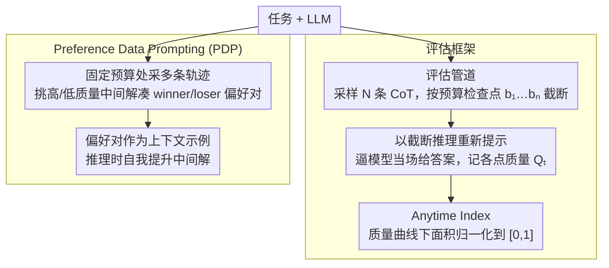

# Budget-Aware Anytime Reasoning with LLM-Synthesized Preference Data

**会议**: ACL 2026  
**arXiv**: [2601.11038](https://arxiv.org/abs/2601.11038)  
**代码**: 无  
**领域**: LLM推理  
**关键词**: 预算感知推理, Anytime Index, 偏好数据提示, 测试时缩放, 推理效率

## 一句话总结

本文提出了一种预算感知的任意时推理（anytime reasoning）框架和 Anytime Index 指标，用于量化 LLM 在有限 token 预算下的推理质量-效率权衡，并设计了基于 LLM 自合成偏好数据的推理时自改进方法（PDP），在规划、数学和科学 QA 任务上显著提升了中间和最终解的质量。

## 研究背景与动机

**领域现状**：LLM 通过 Chain-of-Thought (CoT)、Tree-of-Thoughts 等方法展示了强大的推理能力。测试时缩放（test-time scaling）成为提升推理性能的重要手段，但现有方法通常假设无限制的计算资源，仅评估最终答案质量。

**现有痛点**：(1) 许多实际场景面临严格的计算或延迟预算限制，即使是部分解也比无解有用（如不完整但可行的旅行计划）；(2) 现有方法缺乏原则性的方式来评估推理质量随 token 增长的轨迹；(3) 预算感知技术（如 BRPO）关注"何时停止思考"但不关注"如何在约束下更好地思考"。

**核心矛盾**：现实中的推理任务需要在有限预算内产出最优中间解，但当前的评估和优化框架都只关注最终答案，忽视了推理轨迹的效率。

**本文目标**：(1) 建立评估 LLM 在不同 token 预算下推理效率的框架和指标；(2) 提供一种提升预算感知推理质量的方法。

**切入角度**：借鉴经典 AI 中的任意时算法（anytime algorithm）概念，将推理视为随 token 预算递增的质量递增过程。

**核心 idea**：通过截断推理轨迹并在各检查点评估解质量来量化推理效率，并利用模型自身生成的推理比较来构建偏好数据，作为上下文示例提升中间解质量。

## 方法详解

### 整体框架

框架分为两部分：(1) **评估框架**——对每个任务采样 N 条 CoT 轨迹，在一系列 token 预算检查点 $b_1, b_2, \ldots, b_n$ 处截断，重新提示模型基于截断推理生成最终答案，由此计算 Anytime Index；(2) **Preference Data Prompting (PDP)**——模型在固定预算处生成多条推理轨迹，识别导致更高质量中间解的轨迹对作为偏好对，在推理时作为上下文示例使用。前者只测、不改模型，后者只在推理时改提示，两条支路都不碰参数训练。

### 关键设计

**1. 评估管道设计：用"截断推理 + 重新提示"模拟真实场景里推理被提前打断**

要算 Anytime Index，就得先有办法在任意预算点上拿到一个"当下最好的答案"，否则质量轨迹无从测起。管道为此对每个任务采 N 条完整 CoT 轨迹（NaturalPlan 上限 4096 token，AIME/GPQA 上限 16384 token），在一串预设检查点处把推理截断，再用这段截断推理当前缀重新提示模型逼它当场给答案，质量则按任务选指标（规划用约束满足率，数学/QA 用准确率）。这等于把"推理被中途叫停、必须立刻交卷"的真实处境标准化成可复现的评测流程。

**2. Anytime Index 指标：把"质量随预算增长的整条轨迹"压成一个 [0,1] 的数**

只看最终答案的评估会把两个"终点分数相同"的模型判成一样好，可现实里一个可能在很小预算时就给出了能用的解、另一个磨到最后才追上——这种效率差异被旧指标完全掩盖了。Anytime Index 先定义截至预算 $b_t$ 的最优质量 $Q_t^* = \max_{i \leq t} Q_i$（取历史最好，保证质量曲线单调不降），再用梯形法则求质量曲线下面积并归一化：

$$\text{AI} = \frac{\sum_{t=1}^{T-1} \frac{Q_t^* + Q_{t+1}^*}{2} \cdot (b_{t+1} - b_t)}{(b_T - b_1) \cdot Q_{\max}}$$

值落在 [0,1]，越高代表模型越早逼近高质量解。这样一来，"快思考"与"慢思考"模型即便终点持平，也会因为爬升速度不同而被区分开。

**3. Preference Data Prompting（PDP）：让模型拿自己产生的好坏轨迹对当上下文示例，推理时自我提升**

预算感知技术（如 BRPO）大多在管"何时停下来想"，却没人管"在约束内怎么想得更好"——中间解的质量始终被晾在一边。PDP 的思路是让模型从自身的推理对比中学：先对同一任务在固定 token 预算处采多条轨迹，再挑出导致更高/更低质量中间解的轨迹凑成偏好对（winner vs loser），最后把这些偏好对作为上下文示例在推理时喂回模型。其中 PDP(+) 只放正例，PDP 则正负例都放、用对比信息告诉模型哪种推理走法更省预算。因为全程靠模型自采样、自比较，不需要人工监督，也就能即插即用地套到任何 LLM 上。

### 损失函数 / 训练策略

PDP 是纯推理时方法，不涉及模型训练。偏好数据通过模型自身的多次采样和质量比较自动生成。

## 实验关键数据

### 主实验

**Grok-3 结果**

| 方法 | NaturalPlan Final | AIME Final | GPQA Final | Overall Final |
|------|-------------------|------------|------------|---------------|
| Base | 74.7 | 24.0 | 69.8 | 56.2 |
| LEAP | 87.9 | 22.8 | 69.3 | 60.0 |
| PDP | **90.2** | **24.9** | 69.7 | **61.6** |

**Grok-3-mini 结果**

| 方法 | NaturalPlan Final | AIME Final | GPQA Final | Overall Final |
|------|-------------------|------------|------------|---------------|
| Base | 81.5 | 80.6 | 99.3 | 87.1 |
| PDP | **90.7** | **100.0** | 98.9 | **96.5** |

### 消融实验

- PDP 在 Anytime Index 上也带来一致提升（如 Grok-3-mini 从 85.4 提升到 88.7）
- PDP 在推理型模型（如 Grok-3-mini）上的提升比非推理型模型更显著
- 正负偏好对（PDP）通常优于仅正例（PDP(+)），说明负例的对比信息有价值

### 关键发现

- 不同模型族在 Anytime Index 上展现出截然不同的推理效率特征
- 推理型模型（如 Grok-3-mini）在较早预算点就能产出高质量解，Anytime Index 更高
- PDP 在三个不同类型的任务上都带来一致的提升，验证了方法的通用性
- Anytime Index 揭示了模型间仅通过最终准确率无法发现的效率差异

## 亮点与洞察

- Anytime Index 是对 LLM 推理评估的重要补充，填补了"质量轨迹"评估的空白
- PDP 作为纯推理时方法，无需训练即可提升多种模型的推理效率
- 实验覆盖了 Grok、GPT、LLaMA 等多个模型族，结论具有广泛适用性
- "任意时推理"的概念从经典 AI 成功迁移到 LLM 领域

## 局限与展望

- PDP 需要在推理时额外生成多条轨迹用于构建偏好数据，增加了推理开销
- 偏好数据的质量依赖于模型自身的采样多样性
- Anytime Index 的检查点设置可能影响评估结果
- 未来可探索将 PDP 的偏好数据用于微调而非仅用于上下文学习

## 相关工作与启发

- 与 BRPO（预算感知推理优化）互补：BRPO 关注何时停止，PDP 关注如何在约束内更好推理
- 与 LEAP 等自改进方法相比，PDP 更针对预算约束场景设计
- Anytime Index 可作为未来推理效率研究的标准评估工具

## 评分

- 新颖性: ⭐⭐⭐⭐ Anytime Index 概念新颖，PDP 方法实用
- 实验充分度: ⭐⭐⭐⭐ 多模型族、多任务、多指标的全面评估
- 写作质量: ⭐⭐⭐⭐ 框架定义清晰，实验组织有序

<!-- RELATED:START -->

## 相关论文

- [\[ACL 2026\] CoAct: Co-Active LLM Preference Learning with Human-AI Synergy](coact_co-active_llm_preference_learning_with_human-ai_synergy.md)
- [\[ACL 2026\] On the Step Length Confounding in LLM Reasoning Data Selection](on_the_step_length_confounding_in_llm_reasoning_data_selection.md)
- [\[ICLR 2026\] Plan and Budget: Effective and Efficient Test-Time Scaling on Reasoning LLMs](../../ICLR2026/llm_reasoning/plan_and_budget_effective_and_efficient_test-time_scaling_on_reasoning_large_lan.md)
- [\[ACL 2026\] Reliability-Aware Adaptive Self-Consistency for Efficient Sampling in LLM Reasoning](reliability-aware_adaptive_self-consistency_for_efficient_sampling_in_llm_reason.md)
- [\[ACL 2026\] SHAPE: Stage-aware Hierarchical Advantage via Potential Estimation for LLM Reasoning](shape_stage-aware_hierarchical_advantage_via_potential_estimation_for_llm_reason.md)

<!-- RELATED:END -->
