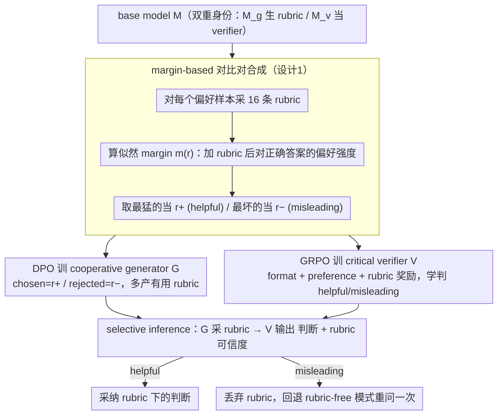

# C2: Scalable Rubric-Augmented Reward Modeling from Binary Preferences

**会议**: ACL 2026  
**arXiv**: [2604.13618](https://arxiv.org/abs/2604.13618)  
**代码**: https://github.com/asahi-research/C2 (有)  
**领域**: LLM 推理 / RLHF / 奖励建模  
**关键词**: 奖励模型, rubric, DPO, GRPO, 协作通信

## 一句话总结
针对"自生成 rubric 经常误导 reward model"的两面性问题，作者用 LM 似然 margin 把自采样的 16 条 rubric 自动标注为"helpful / misleading"对，再用 DPO 训一个合作型 rubric generator + GRPO 训一个会先评估 rubric 可信度再下判断的"critical" verifier；只用二元偏好数据，C2 在 4 个偏好基准上比 GRPO 训的 reasoning RM 提升最多 6.5 点 (RM-Bench)，下游 DPO 的 LC win rate 涨 6 点，且 8B 模型靠自生 rubric 就能追平用 4× 大模型 (Qwen3-32B) 提供 rubric 的方案。

## 研究背景与动机

**领域现状**：reward model 是 RLHF 的核心，但 scalar RM 容易被表层特征（长度、格式）骗。最近的潮流是把 preference prediction 当 reasoning 任务用 GRPO 训（J1、Think-RM 等），让 RM 先输出 `<analyze>` 再给判断。另一条线是 rubric-augmented verification——先生成一份打分细则，再让 verifier 按 rubric 评。

**现有痛点**：rubric 方法依赖人写或更大的私有模型生成 rubric，成本高、和现有 binary preference corpus 不兼容。一个直觉的替代是让 base model 自生成 rubric，但作者在 RM-Bench hard 上的实验 (Fig 2) 发现：(1) 大多数自生 rubric 让 verifier 信心变化趋近于 0，几乎没用；(2) 高质量 rubric 能让 Tulu3-8B 准确率 +8.2、Qwen3-8B +13.6，但低质量 rubric 反而让两者跌到 39.6% / 49.3%，比不给 rubric 还差。

**核心矛盾**：rubric 的质量是双刃剑——好 rubric 提升大、坏 rubric 损害更大；而 verifier 一旦被 rubric 牵着走就没了"自己拒绝坏 rubric"的能力。这是一个"合作失败"问题。

**本文目标**：(1) 用 binary preference 这种最普遍、最便宜的监督信号，把 rubric 生成器和 verifier 都训出来；(2) 让 verifier 能"批判性地"采纳 rubric——好就听、坏就忽略，回退到无 rubric 推理。

**切入角度**：作者借 Grice 的合作原则——人际沟通成功不靠"说话人永远可靠"，而靠"听者学会信谁、说话人学会怎么说才有用"。把这个动态搬到 rubric ↔ verifier 关系上。

**核心 idea**：用一个 base model 自采样 K=16 条 rubric，按它们对 verifier 的对数似然 margin 的影响把它们标成 (helpful $r^+$, misleading $r^-$) 对比对；DPO 训 generator 多产生 $r^+$，GRPO 训 verifier 既要给对偏好又要正确判 rubric 是 helpful/misleading；推理时 verifier 判 helpful 才采纳 rubric。

## 方法详解

### 整体框架
两个组件 $G_\phi$（generator）和 $V_\theta$（verifier）都从同一个 base model $M$ 初始化。Pipeline 三步：
1. **合成对比对**：用 $M$ 双重身份（$M_g$ 生 rubric、$M_v$ 当 verifier）对每个 $(c=(x,y_A,y_B),l)$ 计算无 rubric margin $m_\emptyset = \log p_{M_v}(l|c) - \log p_{M_v}(\bar{l}|c)$，再采 16 条 rubric 算 $m(r_k)$，从 $\mathcal{R}^+ = \{r_k : m(r_k) > \max(0, m_\emptyset)\}$ 取 max → $r^+$；从 $\mathcal{R}^- = \{r_k : m(r_k) < \min(0, m_\emptyset)\}$ 取 min → $r^-$；两边都空就丢弃。
2. **训练**：DPO 训 $G_\phi$ 偏好 $r^+$ over $r^-$；GRPO 训 $V_\theta$ 在两种任务上学（rubric-free 给 $\hat l$；rubric-augmented 同时给 $\hat l$ 和 $q\in\{\text{helpful}, \text{misleading}\}$），奖励 = format $R_f$ + preference $R_p$ + rubric $R_r$（仅 augmented 任务）。
3. **selective inference**：给 $c$ 采 $r \sim G_\phi$，让 $V_\theta$ 输出 $(\hat l, q)$；若 $q=\text{helpful}$ 用 $\hat l$，否则回到 rubric-free 模式重问一次。

Rubric 结构是 reasoning 段 + 一系列 (criterion, yes/no question) 对。

### 关键设计

**1. margin-based 对比对合成：用 verifier 自己的似然 margin 给每条 rubric 自动贴 helpful/misleading 标签**

以往造 rubric 监督要么靠 GPT-5 打 1~5 分（昂贵）、要么靠人手写（没法规模化），还跟现成的二元偏好语料不兼容。C2 索性把"这条 rubric 到底有没有用"内化成 verifier 自身的统计量：定义 $m(r) = \log p_{M_v}(l|c,r) - \log p_{M_v}(\bar l|c,r)$，衡量加上 rubric 后 verifier 对正确答案的偏好强度。helpful 的硬门槛是"必须把判断推向正确"——$m_\emptyset>0$ 时 rubric 要让 margin 更高，$m_\emptyset<0$ 时要把 margin 翻成正；misleading 则反向。对每个样本采 16 条 rubric，从合格的 $\mathcal{R}^+$ 里取效果最猛的当 $r^+$、从 $\mathcal{R}^-$ 里取最坏的当 $r^-$，两边都空就整条丢掉（最终约 95~98% 数据保留）。这样得到的标签免人工、抗噪声，还能无缝复用任何二元偏好数据集。

**2. DPO 训 cooperative generator：让生成器多产对 verifier 真有用的 rubric，而不是表面合理实则无用甚至有害的**

如果只拿合格 rubric 做 SFT，模型学到的是"模仿一份像样的 rubric"，却学不会"躲开坏的那种"——而 rubric 恰恰是双刃剑，坏的比好的伤害更大。所以这里用上一步合成的 $\{(c, r^+, r^-)\}$ 做 DPO，chosen 是 $r^+$、rejected 是 $r^-$，prompt 模板不变，靠对比信号同时奖励好、惩罚坏。训完后 GPT-5 给 rubric 质量打分从 2.11 → 2.66（Tulu3-8B）、3.15 → 3.52（Qwen3-8B），已经逼近 Tulu3-70B（2.85）、Qwen3-32B（3.62）这些大模型的水平。消融也印证了这一点：去掉 negative rubric、退回只 SFT 好 rubric 是最伤的变体，最多掉 3.6 个点。

**3. critical verifier + selective inference（GRPO）：给 verifier "拒绝权"，判断 rubric 不可信就丢掉重问**

现有 rubric 方法默认 verifier 必须照着 rubric 走，一旦碰上坏 rubric 就被牵着跌进坑里。C2 给 verifier 加了一道自我评估：GRPO 训练时混入两类任务——rubric-free 任务只给 format + preference 奖励，rubric-augmented 任务额外加 rubric 奖励 $R_r$（判对 $q=q^*$ 才 +1），逼模型既保住无 rubric 的基础判断力、又学会分辨 helpful/misleading。最终 verifier 按 `<analyze> → <rubric>helpful|misleading</rubric> → <answer>A|B</answer>` 输出；推理时若判 misleading，就把 rubric 丢掉、退回 rubric-free 模式重问一次。学会拒绝之后对 rubric 分布的鲁棒性立竿见影：当好 rubric 占比从 9:1 滑到 1:9，Reasoning RM 准确率从 73% 暴跌到 52%，C2 只从 76% 软着陆到 70%。

### 损失函数 / 训练策略
- 数据：UltraFeedback 5k 样本合成对比对（Tulu3-8B 保留 4,903、Qwen3-8B 保留 4,648），合并 rubric-free + rubric-augmented 共 14k+ 训练样本。
- GRPO：lr 5e-7、batch 64、rollout=8、temperature=1.0 (Tulu3) / 0.6 (Qwen3)、max prompt 8192 / response 2048、C2 跑 1 epoch（Reasoning RM 3 epoch，因为数据少 3 倍，compute 对齐）。
- DPO 生成器：lr 5e-7、β=0.1、3 epoch、max seq 4096。
- 奖励权重网格搜索后 C2 用 $(w_p, w_r, w_f) = (0.6, 0.3, 0.1)$。
- 全部在 8× A100 80GB 上跑。

## 实验关键数据

### 主实验
Preference prediction accuracy (%)，平均自 3 个 seed：

| Base | 方法 | RewardBench | RM-Bench | RewardBench2 | JudgeBench | Avg |
|------|------|------|------|------|------|------|
| Tulu3-8B | Base Model | 67.2 | 56.1 | 35.2 | 22.7 | 45.3 |
| Tulu3-8B | Reasoning RM (GRPO) | 73.7 | 64.9 | 45.6 | 35.8 | 55.0 |
| Tulu3-8B | + Self-Rubric | 70.8 | 64.2 | 40.8 | 35.2 | 52.8 |
| Tulu3-8B | + External-Rubric (32B) | 84.9 | 77.7 | 59.6 | 59.2 | 70.4 |
| Tulu3-8B | **C2 (Ours)** | **77.2** | **65.6** | **50.7** | **39.8** | **58.3** |
| Qwen3-8B | Reasoning RM | 89.8 | 81.3 | 67.6 | 60.1 | 74.7 |
| Qwen3-8B | + Self-Rubric | 90.8 | 81.3 | 69.4 | 60.8 | 75.6 |
| Qwen3-8B | + External-Rubric (32B) | 91.3 | 84.6 | 73.9 | 63.9 | 78.4 |
| Qwen3-8B | **C2 (Ours)** | **91.8** | **87.8** | 71.0 | 63.5 | **78.5** |

下游 DPO + AlpacaEval 2.0 / Arena-Hard：

| Base | 方法 | AE2 WR | AE2 LC | AH WR |
|------|------|------|------|------|
| Tulu3-8B | DPO w/ Reasoning RM | 13.1 | 19.0 | 21.3 |
| Tulu3-8B | DPO w/ **C2** | **18.3** | **25.0** | **26.8** |
| Qwen3-8B | DPO w/ Reasoning RM | 41.2 | 38.2 | 71.8 |
| Qwen3-8B | DPO w/ **C2** | **44.0** | **40.9** | **74.6** |

### 消融实验
RB / RM-Bench / RewardBench2 平均：

| 变体 | Tulu3-8B Avg | Qwen3-8B Avg |
|------|------|------|
| C2 (Full) | **64.5** | **83.5** |
| w/o Cooperative Generator | 63.3 | 82.0 |
| w/o Critical Verifier | 62.7 | 81.2 |
| w/o Negative Rubrics | 60.9 | 80.7 |

不同 rubric 质量比例下的鲁棒性 (Tulu3-8B / Qwen3-8B)：

| High:Low | Reasoning RM | C2 |
|------|------|------|
| 9:1 | 53% / 73% | 51% / 76% |
| 1:9 | 39% / 52% | 46% / 70% |

### 关键发现
- **Self-Rubric 在 Reasoning RM 上反而掉点**（Tulu3-8B 55.0 → 52.8），印证了 motivation 实验里"自生 rubric 平均无效甚至有害"的结论。
- **8B 模型用自生 rubric 追平 32B**：Qwen3-8B + C2 (78.5) ≈ Qwen3-8B + Qwen3-32B 外部 rubric (78.4)，意味着不需要更大模型来当 rubric oracle。
- **去 negative rubric 掉得最多**（Tulu3-8B -3.6、Qwen3-8B -2.8）——证明"学会拒绝"比"学会生成好的"更重要。
- **C2 的 ranking 漂移最小**：Fig 5 显示当输入 rubric 大多是坏的时，Reasoning RM 直接崩，C2 还能稳；这种鲁棒性是实战部署最值钱的属性。
- **compute-matched 仍胜出**：让 Reasoning RM 用 2.5× token (N×2.5 次投票) 仍打不过 C2（C2 token 是 Reasoning RM 的 2.3-2.4×），说明 C2 的增益是结构带来的而非额外 compute。

## 亮点与洞察
- 用"verifier 自身的 likelihood margin"做 rubric 标注是非常巧妙的自监督——避开人写、避开大模型蒸馏，把 rubric 评估内化到 RM 训练循环里，可以无缝复用任何 binary preference 数据集。
- "selective inference + retry" 是工程上很 cheap 的设计但效果显著——本质上把 verifier 变成了一个 ensemble of two policy modes (rubric-aware vs rubric-free)，按 rubric 质量动态选。
- 把 RM 类比成"听者"，把 rubric generator 类比成"说者"，借合作原理设计训练循环，启发性远超本任务——同样思路可以推广到 tool-use（"调用工具 vs 不调用"）、retrieval-augmented generation（"信检索 vs 不信"）这类需要选择性接纳外部信号的任务。
- Ablation 顺序"negative > critical verifier > cooperative generator" 给出了清晰的优先级——后续工作如果资源有限，应该优先实现"verifier 学会拒绝"这一部分。

## 局限与展望
- 弱基模可能不会用 critical verifier：Fig 5 在 Tulu3-8B 的 9:1 条件下 C2 反而比 Reasoning RM 略低，说明小模型在 rubric 大多有用时会不必要地拒绝。
- 推理代价高：rubric 生成 + 可能的 retry 让 C2 比 Reasoning RM 慢 2.3~2.4×（latency 4~5 秒/样本）；在大流量场景需要更高效的 rubric 缓存或选择性生成。
- 训练数据规模仅 5k UltraFeedback，跨域泛化（如代码、数学）还未充分验证；目前 RewardBench / JudgeBench 数学子集涨幅最小。
- 改进思路：(1) 用 hierarchical rubric（先粗粒度判要不要 rubric、再细粒度生成）减少 generator cost；(2) 把 retry 信号也喂回 RL，让 verifier 学会"提前拒绝"；(3) 跨 base model 的 rubric 迁移（Tulu3 生成的 rubric 能给 Qwen3 verifier 用吗？）。

## 相关工作与启发
- **vs Reasoning RM (J1, Think-RM)**: 都用 GRPO 训 verifier 做 reasoning，本文加上"显式 rubric + 选择性采纳"，多了一个 critical 层；同 base model 同 binary preference 数据下 +3.3~3.5 个平均点。
- **vs Rubric as Reward (Gunjal 2025) / Checklists (Viswanathan 2025)**: 这些工作把 rubric 当 reward 信号，但默认 rubric 正确；本文显式处理 rubric 的质量不确定性。
- **vs CARMO / Prometheus (rubric from larger LLM)**: 之前都依赖更大私有模型出 rubric，本文证明同尺度 8B 通过自生 + 对比训练就能追平用 4× 大模型外部 rubric 的方案。
- **启发**：「margin-based 数据合成 + selective inference」是个通用模板——任何"外部信号可能误导基础推理"的设置都可以套用。

## 评分
- 新颖性: ⭐⭐⭐⭐ 把 cooperative communication 翻译到 rubric-verifier 协作 + margin-based 自标注 + selective inference 是新颖且 elegant 的组合。
- 实验充分度: ⭐⭐⭐⭐⭐ 4 个 RM 基准 + 下游 DPO + Best-of-N + Rejection Sampling + compute-matched + rubric noise stress test + 3 个 ablation + GPT-5 rubric quality scoring + 错误分类标注，非常完整。
- 写作质量: ⭐⭐⭐⭐ Section 3 "Do Self-Generated Rubrics Help" 的 motivation 实验先讲清楚问题再上方法，叙事节奏好；公式 + Figure 2 的双面性图很有说服力。
- 价值: ⭐⭐⭐⭐ 完全用 binary preference 训出可平替"外部大模型 rubric"的 RM，开源代码 + 标准 HF 模型，对 RLHF 实践直接有用。

<!-- RELATED:START -->

## 相关论文

- [\[ACL 2026\] Efficient Process Reward Modeling via Contrastive Mutual Information](efficient_process_reward_modeling_via_contrastive_mutual_information.md)
- [\[ICML 2026\] Reward Modeling from Natural Language Human Feedback](../../ICML2026/llm_reasoning/reward_modeling_from_natural_language_human_feedback.md)
- [\[ACL 2026\] Process Reward Models Meet Planning: Generating Precise and Scalable Datasets for Step-Level Rewards](process_reward_models_meet_planning_generating_precise_and_scalable_datasets_for.md)
- [\[ICLR 2026\] mR3: Multilingual Rubric-Agnostic Reward Reasoning Models](../../ICLR2026/llm_reasoning/mr3_multilingual_rubric-agnostic_reward_reasoning_models.md)
- [\[ICLR 2026\] Fixing the Broken Compass: Diagnosing and Improving Inference-Time Reward Modeling](../../ICLR2026/llm_reasoning/fixing_the_broken_compass_diagnosing_and_improving_inference-time_reward_modelin.md)

<!-- RELATED:END -->
