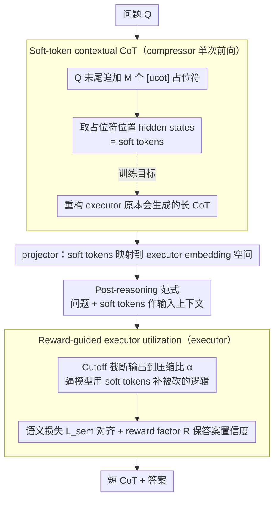

# Can Reasoning Path still be Effective as Input? Bridging Post-Reasoning to Chain-of-Thought Compression

**会议**: ACL2026  
**arXiv**: [2510.08647](https://arxiv.org/abs/2510.08647)  
**代码**: 未在缓存中发现公开代码链接  
**领域**: LLM推理 / CoT压缩 / 推理加速  
**关键词**: post-reasoning、CoT压缩、soft tokens、推理延迟、UCoT

## 一句话总结
本文提出 post-reasoning 与 UCoT：先由轻量 compressor 用单次前向生成表示推理路径的 soft tokens，再让 executor 把这些 soft tokens 当作输入上下文进行短输出推理，从而在保持推理准确率的同时显著减少 CoT token 与延迟。

## 研究背景与动机
**领域现状**：长 Chain-of-Thought 已成为提升 LLM 数学、科学问答和代码推理能力的重要手段，DeepSeek-R1、o 系列等模型也说明 test-time computation scaling 能带来更强推理。

**现有痛点**：长 CoT 的核心成本来自自回归输出。模型必须逐 token 生成中间推理，导致复杂问题的延迟和 token 成本很高。现有 CoT 压缩方法多从输出端下手，比如 prompt 让模型少写、截断推理、训练短 CoT，但这些方法往往损失关键推理信息。

**核心矛盾**：CoT 既是输出，也是模型为最终答案构造的“自生成上下文”。如果把推理路径提前作为输入提供给模型，理论上可以缩短输出；但显式文本 CoT 的生成本身仍然昂贵，而且质量差的外部 CoT 会伤害准确率。

**本文目标**：验证“推理路径作为输入是否仍有效”，并设计一种不需要自回归生成长上下文 CoT 的高效框架，使推理信息在输入端补足、输出端变短。

**切入角度**：作者先定义 post-reasoning：executor 接收问题和外部 contextual CoT，然后继续推理并输出答案。pilot study 显示输出 token 可减少 80% 以上，但效果依赖 contextual CoT 的长度和质量。于是他们进一步把显式 CoT 压缩成 soft tokens。

**核心 idea**：不要硬性限制模型少思考，而是把高质量推理先验压进输入侧 soft tokens，让 executor 在短输出预算下仍能访问缺失的推理信息。

## 方法详解
UCoT 包含 compressor、projector 和 executor 三个部分。compressor 学会把 executor 原本会生成的长 CoT 压成一串占位符位置的 hidden states；projector 把这些 hidden states 映射到 executor embedding space；executor 在受限输出预算下利用 soft tokens 给出更短但准确的推理和答案。

### 整体框架
训练阶段先用 executor 为每个问题生成高质量 CoT，得到 `(Q, C, A)` 数据；然后训练轻量 compressor 从问题和 `[ucot]` 占位符中产生 soft tokens，并要求它能重构原始 CoT；最后训练 executor 在 soft tokens 和截断输出预算下恢复原推理语义并保持答案置信度。推理阶段只需 compressor 单次前向生成 soft tokens，再由 executor 基于这些 soft tokens 输出较短答案。

### 关键设计

**1. Post-reasoning 范式：把 CoT 从输出端搬到输入端，缩短 executor 需要自回归生成的长度**

长 CoT 的成本几乎全压在自回归输出上——模型必须逐 token 把中间推理写出来。作者反过来问：如果推理路径已经作为上下文摆在输入里，模型还需不需要从零生成完整 CoT？vanilla reasoning 是 $\{C,A\}=\mathrm{LLM}(Q)$，post-reasoning 改成 $\{\hat C,\hat A\}=\mathrm{LLM}(Q \oplus C')$，其中 $C'$ 是外部提供的 contextual CoT。pilot study 给出了有力的初步证据：在 GSM8K 和 MATH-500 上，只要把推理路径喂进输入，输出 token 能减少 80% 以上。这说明"推理路径作为输入仍然有效"，为后面把它换成更廉价的形式打开了空间。

**2. Soft-token contextual CoT：用单次前向的 soft tokens 替代昂贵的显式文本 CoT**

post-reasoning 虽然有效，但显式文本 $C'$ 本身仍要自回归生成、并不省。于是 compressor 在输入末尾追加长度为 $M$ 的 `[ucot]` 占位符，单次前向后取这些占位符位置的 hidden states $H_n$ 当作 soft tokens；训练目标让 compressor 仅凭 $H_n$ 就能重构出 executor 原本会生成的原始 CoT $C_n$。这样推理语义被压进连续空间，一次前向就能拿到，绕开了长文本输出的延迟。

**3. Reward-guided executor utilization：用输出预算 + 语义/置信度约束逼 executor 真正用上 soft tokens**

连续提示最大的风险是被模型忽略——它可能把 soft tokens 当摆设，照样去生成长 CoT。为此 projector 先把 compressor 的 soft tokens 映射到 executor 的 embedding space，训练 executor 时再用 Cutoff 把显式 CoT 截断到压缩比例 $\alpha$，硬逼模型靠 soft tokens 补足被砍掉的逻辑。同时两个约束保证质量：语义损失把 UCoT 的推理表示对齐到原始长 CoT 的表示，reward factor 惩罚压缩推理与原推理在答案置信度上的差异。输出预算负责"逼它用"，语义/置信度约束负责"用对"，两者合起来才把 soft tokens 变成真正可用的推理上下文。

### 损失函数或训练策略
compressor 阶段最小化重构式目标 $L_c=E_D[-\log P_{M_c}(C_n|H_n)]$，把长 CoT 信息压入 soft tokens。executor 阶段先将输出 CoT 截断为压缩比例 $\alpha$ 下的 $\bar C_n$，再用语义损失 $L_{sem}=E_D[Dist(H_{UCoT},H_{CoT})]$ 对齐压缩推理和原始长推理的最终 hidden state，并用 reward factor $R=E_D[(r_{UCoT}-r_{CoT})^2]$ 保持答案置信度。最终 executor 目标为 $L_e=L_{sem}\cdot R$。主实验使用 Qwen2.5-1.5B-Instruct 作为 compressor，Qwen2.5-7B-Instruct 和 Llama-3.1-8B-Instruct 作为 executor。

## 实验关键数据

### 主实验
| Backbone / 数据集 | 方法 | 压缩比 | Acc. | Tokens | Latency | 说明 |
|------------------|------|--------|------|--------|---------|------|
| Qwen2.5-7B / GSM8K | Original | - | 92.17 | 298.63 | 3.83s | 原始长 CoT |
| Qwen2.5-7B / GSM8K | UCoT | 0.5 | 86.55 | 140.36 | 1.86s | token 约减半，仍优于 CoD/Tokenskip 同压缩比 |
| Qwen2.5-7B / MATH-500 | Original | - | 61.60 | 571.64 | 6.35s | 原始长 CoT |
| Qwen2.5-7B / MATH-500 | UCoT | 0.5 | 53.70 | 280.10 | 3.17s | 比 Tokenskip 47.10 明显更高 |
| Llama3.1-8B / GSM8K | Original | - | 87.26 | 212.13 | 2.44s | 原始长 CoT |
| Llama3.1-8B / GSM8K | UCoT | 0.5 | 83.62 | 101.82 | 1.26s | 保留较高准确率并接近半延迟 |

| 长 CoT 场景 | 方法 | 压缩比 | Acc. | Tokens | 相对 Tokenskip |
|-------------|------|--------|------|--------|----------------|
| Qwen3-8B / GPQA | Tokenskip | 0.5 | 54.23 | 4388.54 | 基线 |
| Qwen3-8B / GPQA | UCoT | 0.5 | 56.86 | 4065.58 | 准确率更高且 token 更少 |
| Qwen3-8B / HumanEval | Tokenskip | 0.5 | 42.52 | 1025.00 | 基线 |
| Qwen3-8B / HumanEval | UCoT | 0.5 | 46.55 | 1021.93 | 准确率提升 4.03 |
| DeepSeek-R1-Distill-Qwen-7B / HumanEval | Tokenskip | 0.5 | 43.79 | 900.04 | 基线 |
| DeepSeek-R1-Distill-Qwen-7B / HumanEval | UCoT | 0.5 | 43.96 | 870.68 | token 减少约 50.67%，准确率小幅更高 |

### 消融实验
| 配置 | Qwen2.5 GSM8K Acc. / Tokens | Qwen2.5 MATH Acc. / Tokens | 说明 |
|------|-----------------------------|-----------------------------|------|
| UCoT full | 87.98 / 194.63 | 58.80 / 388.72 | 完整模型，压缩比 0.7 |
| w/o ST | 73.23 / 220.99 | 47.50 / 390.84 | 去掉 soft tokens 后准确率大幅下降 |
| w/o $L_{sem}$ | 87.32 / 274.74 | 59.70 / 554.49 | 准确率可保持，但压缩任务完成不好 |
| w/o R | 71.53 / 206.05 | 44.90 / 417.30 | reward factor 对保持答案能力很关键 |

### 关键发现
- 只靠 prompt 很难强制模型达到目标压缩比，直接 truncation 虽然短但性能崩得很厉害；UCoT 的优势在于输入端补充信息，而不是输出端硬压。
- soft tokens 是性能核心。去掉 soft tokens 后，Qwen2.5 GSM8K 从 87.98 降到 73.23，说明 compressor 提供的连续推理上下文确实被 executor 使用。
- $L_{sem}$ 更像“压缩约束”：没有它时准确率不一定立刻崩，但 token 数接近原始长度，说明模型没有学会用短输出完成任务。

## 亮点与洞察
- 把 CoT 看成“模型为自己生成的输入上下文”很有启发，它把 CoT 压缩问题从“少输出一点”转为“怎样在输入侧提供足够推理先验”。
- UCoT 的 compressor-executor 分工比较自然：小模型负责低延迟产生 soft context，大模型负责最终推理，这与实际部署中的小模型路由/预处理思路兼容。
- 论文提醒我们，长推理的压缩不能只删字。真正需要压缩的是推理信息，而 soft tokens 提供了一种不必完全离散化的表示通道。

## 局限与展望
- UCoT 需要训练 compressor、projector 和 executor，部署复杂度高于纯 prompt 或 training-free 方法；对闭源模型的可用性也受限。
- soft tokens 的可解释性较弱。虽然作者尝试从信息增益和 decoded soft tokens 角度分析，但它们仍不如文本 CoT 便于人工审计。
- 训练数据依赖 executor 先生成高质量 CoT，如果原始长 CoT 有偏差或幻觉，compressor 也可能学习这些问题。
- 未来可以研究跨任务、跨 executor 的通用 soft reasoning cache，或把 UCoT 与 speculative decoding、KV cache 复用、router 等系统级加速结合。

## 相关工作与启发
- **vs Prompt / CoD**: Prompt 和 CoD 试图约束输出形式，让模型写短一点；UCoT 在输入端补充连续推理上下文，因此同等压缩比下准确率更稳。
- **vs Tokenskip**: Tokenskip 通过训练短 CoT 减少输出，但可能损失推理信息；UCoT 用 soft tokens 保留被省略的逻辑，在 GSM8K 0.5 压缩比下比 Tokenskip 高 3.08 个点以上。
- **vs latent CoT / continuous reasoning**: 相关方法也压缩中间推理到连续表示，但本文强调 post-reasoning 输入范式，并通过 semantic loss 与 reward factor 让 executor 学会利用这些表示。

## 评分
- 新颖性: ⭐⭐⭐⭐⭐ post-reasoning + soft contextual CoT 的问题重构很清晰，区别于常规输出压缩。
- 实验充分度: ⭐⭐⭐⭐☆ 主实验、消融和长 CoT 泛化都比较扎实，但系统成本和跨模型泛化还可更深入。
- 写作质量: ⭐⭐⭐⭐☆ 图示和训练流程清楚，部分公式排版较密但逻辑完整。
- 价值: ⭐⭐⭐⭐⭐ 对 LLM 推理加速、CoT 压缩和连续推理表示都有直接参考价值。

<!-- RELATED:START -->

## 相关论文

- [\[ACL 2026\] Is Chain-of-Thought Really Not Explainability? Chain-of-Thought Can Be Faithful without Hint Verbalization](is_chain-of-thought_really_not_explainability_chain-of-thought_can_be_faithful_w.md)
- [\[ICLR 2026\] When Reasoning Meets Compression: Understanding the Effects of LLMs Compression on Large Reasoning Models](../../ICLR2026/llm_reasoning/when_reasoning_meets_compression_understanding_the_effects_of_pruning_and_quant.md)
- [\[NeurIPS 2025\] Mind the Gap: Bridging Thought Leap for Improved Chain-of-Thought Tuning](../../NeurIPS2025/llm_reasoning/mind_the_gap_bridging_thought_leap_for_improved_chain-of-thought_tuning.md)
- [\[ACL 2026\] Long-Context Reasoning Through Proxy-Based Chain-of-Thought Tuning](long-context_reasoning_through_proxy-based_chain-of-thought_tuning.md)
- [\[ACL 2025\] Can Large Language Models Detect Errors in Long Chain-of-Thought Reasoning?](../../ACL2025/llm_reasoning/can_large_language_models_detect_errors_in_long_chain-of-thought_reasoning.md)

<!-- RELATED:END -->
