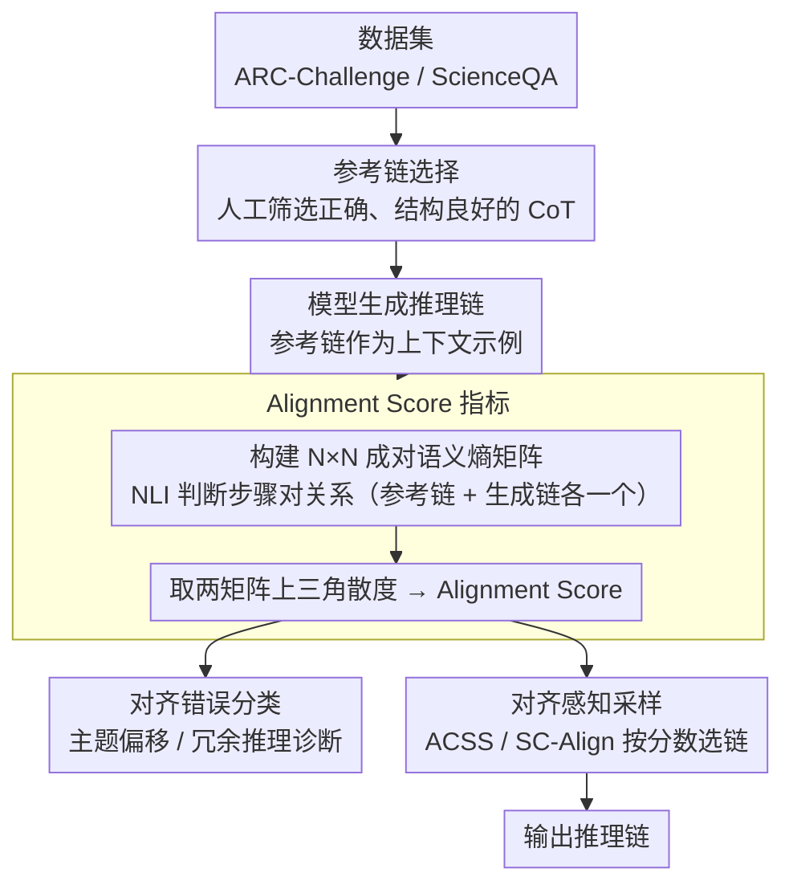

# Chain-of-Thought as a Lens: Evaluating Structured Reasoning Alignment between Human Preferences and Large Language Models

**会议**: ACL 2026  
**arXiv**: [2511.06168](https://arxiv.org/abs/2511.06168)  
**代码**: [https://github.com/boxuanwang28/CoT-Lens](https://github.com/boxuanwang28/CoT-Lens)  
**领域**: LLM推理  
**关键词**: 思维链对齐, Alignment Score, 语义熵, 推理质量, 结构化推理

## 一句话总结

本文提出 Alignment Score——一种基于语义熵矩阵的语义级指标，通过比较模型生成的思维链与人类偏好参考链的中间步骤来量化推理对齐度，发现 Alignment Score 与任务准确率、可读性和连贯性高度相关，且 2-hop 推理是对齐的峰值深度。

## 研究背景与动机

**领域现状**：Chain-of-Thought (CoT) 提示显著增强了 LLM 在复杂推理任务上的表现。然而，即使最终答案正确，推理轨迹的质量也可能差异巨大——存在语义不连贯、逻辑不一致或主题偏移的步骤。

**现有痛点**：(1) 现有评估指标（如 MMLU、ARC）只关注最终答案正确性，忽略了推理过程本身的质量；(2) 多步推理常出现语义不连贯或主题偏移，即使最终答案正确；(3) 缺乏超越答案正确性、捕捉推理过程质量的评估指标。

**核心矛盾**：答案正确性不等于推理质量，但目前缺乏量化推理过程与人类偏好推理链对齐程度的工具。

**本文目标**：(1) 提出量化推理对齐度的指标；(2) 分析推理深度如何影响对齐；(3) 验证对齐分数与任务性能和推理质量的关联。

**切入角度**：将 CoT 视为主要抓手，利用语义熵在潜在空间中度量模型推理链与参考链的结构性偏离。

**核心 idea**：通过构建推理步骤的成对语义熵矩阵并比较矩阵间的散度来量化推理对齐，从而捕捉逻辑结构而非表面文本的一致性。

## 方法详解

### 整体框架

(1) 准备数据集并选择参考链（人工筛选正确、结构良好的 CoT 解释）；(2) 将参考链作为上下文示例，提示模型生成推理链；(3) 使用 NLI 模型计算参考链和生成链各自的成对语义熵矩阵；(4) 比较两个矩阵得到 Alignment Score；得到的分数一方面用于诊断对齐错误，另一方面接入采样策略反过来挑出更优的推理链。

### 关键设计

**1. Alignment Score 指标：用语义熵矩阵的散度量化推理链与人类参考链的结构对齐度**

直接逐句比对推理文本会被表达方式的差异干扰——同一个逻辑可以有很多写法。作者改为捕捉步骤之间的逻辑关系结构：对一条 N 步推理链，用 NLI 模型判断每一对步骤之间的语义关系，构建 N×N 的成对语义熵矩阵。参考链（人工筛选的正确、结构良好的 CoT）和模型生成链各算一个矩阵，取两个矩阵上三角元素的散度作为 Alignment Score，分数越高代表生成链的推理风格和逻辑结构越贴近参考。这个指标不看用了哪些词，只看"步骤之间怎么相互支撑"，因此更能反映推理的本质质量而非表面措辞。

**2. 对齐错误分类（Thematic Shift 与 Redundant Reasoning）：给低分一个可解释的失败模式诊断**

单一分数能告诉你"对齐差"，却说不清差在哪。作者把对齐错误归成两类：主题偏移（推理步骤跑偏了核心问题主题）和冗余推理（重复已有信息、却没把逻辑链往前推）。再统计这两类错误随推理深度（hop 数）增加的频率变化，把"分数为什么会掉"落到具体可观察的行为上——这也为后面"2-hop 是甜蜜点、再深就被噪声拖累"的结论提供了机制解释。

**3. 对齐感知采样（ACSS 与 SC-Align）：把 Alignment Score 当作链选择的诊断信号**

如果 Alignment Score 真和推理质量相关，它就该能在固定预算下帮忙挑出更好的链。作者据此设计两种用法：ACSS 采样多条 CoT，直接选 Alignment Score 最高的那条作为输出；SC-Align 把 Alignment Score 接进自一致性框架，作为投票之外的选择标准。这一步既是应用也是反向验证——若按分数挑出来的链确实在准确率上更高，就反过来证明这个指标抓到了真东西，而且整个过程不需要额外的人工评估。

### 损失函数 / 训练策略

不涉及模型训练。Alignment Score 计算使用预训练的 NLI 模型提取语义熵。

## 实验关键数据

### 主实验

在 ARC-Challenge 和 ScienceQA 数据集上验证：

- Alignment Score 与任务准确率之间存在强正相关
- 对齐在 2-hop 推理处达到峰值，超过 2-hop 后因主题偏移和冗余推理而下降
- ACSS 和 SC-Align 策略利用 Alignment Score 选择的链在准确率、可读性和连贯性上均优于随机选择

### 消融实验

- 主题偏移和冗余推理是随推理深度增加的主导对齐错误
- LLM-as-Judge 评估确认 Alignment Score 与可读性和连贯性评分强相关
- 较强的模型（如 Qwen2.5-7B）整体 Alignment Score 高于较弱模型

### 关键发现

- Alignment Score 是推理质量的有效代理指标，与准确率、可读性、连贯性三重验证
- 2-hop 是推理对齐的"甜蜜点"——更浅的推理信息不足，更深的推理引入噪声
- 主题偏移比冗余推理对性能的负面影响更大
- 将对齐作为选择标准可以提升推理输出质量，无需额外训练

## 亮点与洞察

- 语义熵矩阵的思路巧妙——在潜在空间中比较推理结构而非表面文本
- 将推理过程质量从答案正确性中解耦出来，填补了评估空白
- 错误分类（主题偏移 vs 冗余推理）提供了可操作的诊断信息
- ACSS 和 SC-Align 展示了指标的实用价值

## 局限与展望

- 参考链需要人工筛选，可扩展性受限
- 语义熵的计算依赖 NLI 模型的质量
- 目前仅在科学问答数据集上验证，未扩展到数学或代码推理
- 未来可探索将 Alignment Score 纳入训练目标以优化推理过程

## 相关工作与启发

- 与 Self-Consistency（Wang et al., 2023）互补——SC 关注答案一致性，本文关注推理过程一致性
- 为 CoT 推理的过程级评估提供了新的度量工具
- 语义熵矩阵的方法可推广到其他需要评估过程质量的生成任务

## 评分

- 新颖性: ⭐⭐⭐⭐ 语义熵矩阵度量推理对齐是新颖的方法论贡献
- 实验充分度: ⭐⭐⭐⭐ 多维度验证（准确率、可读性、连贯性）充实
- 写作质量: ⭐⭐⭐⭐ 框架描述清晰，图示直观

<!-- RELATED:START -->

## 相关论文

- [\[ACL 2026\] TrigReason: Trigger-Based Collaboration between Small and Large Reasoning Models](trigreason_trigger-based_collaboration_between_small_and_large_reasoning_models.md)
- [\[ICML 2026\] A Formal Comparison Between Chain of Thought and Latent Thought](../../ICML2026/llm_reasoning/a_formal_comparison_between_chain_of_thought_and_latent_thought.md)
- [\[ACL 2026\] SeLaR: Selective Latent Reasoning in Large Language Models](selar_selective_latent_reasoning_in_large_language_models.md)
- [\[ACL 2026\] Foresight Optimization for Strategic Reasoning in Large Language Models](foresight_optimization_for_strategic_reasoning_in_large_language_models.md)
- [\[ACL 2026\] Decoupling the Effect of Chain-of-Thought Reasoning: A Human Label Variation Perspective](decoupling_the_effect_of_chain-of-thought_reasoning_a_human_label_variation_pers.md)

<!-- RELATED:END -->
