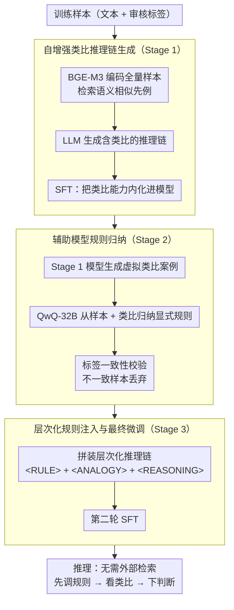

# ChAIRO: Contextual Hierarchical Analogical Induction and Reasoning Optimization for LLMs

**会议**: ACL 2026  
**arXiv**: [2604.10502](https://arxiv.org/abs/2604.10502)  
**代码**: 无  
**领域**: 信息检索  
**关键词**: 内容审核, 规则归纳, 类比推理, 层次化推理链, 端到端优化

## 一句话总结
提出 ChAIRO，一个上下文层次化类比归纳与推理优化框架，通过三阶段 pipeline（类比案例生成→规则归纳→规则注入微调）让 LLM 在内容审核中自主生成类比案例并归纳显式审核规则，比单实例规则生成提升 F1 4.5%，比静态 RAG 提升 2.3%。

## 研究背景与动机

**领域现状**：LLM 用于内容审核已成为有前景的方向，通过生成推理链来提供可解释的审核决策。然而，即使是 SOTA 模型在处理上下文模糊或审核标准不明确的场景时仍然经常出错。

**现有痛点**：(1) CoT 推理在内容审核中缺乏对先例的参考，仅依赖显式标准（如是否有侮辱/煽动），无法识别隐含的歧视逻辑（如"低分等于低能力"的隐喻性歧视）；(2) 手工定义的高层规则（如"色情内容"）太粗糙，无法覆盖细粒度差异；(3) LLM 驱动的自适应规则发现依赖通用先验，忽略了人类审核专家积累的领域专业知识。

**核心矛盾**：需要精确的、上下文相关的审核规则来处理模糊案例，但规则的构建和发现本身就很困难——手工枚举不现实，自动生成又不够精确。

**本文目标**：利用类比案例来提升规则归纳质量，通过端到端优化将案例检索、规则生成和审核决策统一起来。

**切入角度**：与 CarO（同组工作，arXiv:2604.10504）不同，ChAIRO 不用 DPO 而是引入显式规则归纳步骤——先用辅助推理模型从类比案例中归纳出文本化的审核规则，再将规则注入推理链进行二次微调。

**核心 idea**：三阶段层次化优化——(1) 类比链 SFT 让模型学会生成类比案例；(2) 辅助模型从类比案例中归纳显式规则；(3) 将规则注入推理链做第二轮 SFT，融合"案例+规则+推理"三层能力。

## 方法详解

### 整体框架

ChAIRO 要解决的是内容审核里一对老大难：模糊案例没有先例可循，而手工定义的高层规则又太粗、覆盖不到细粒度差异。它的做法是把"类比 → 规则 → 推理"这三层能力拆成三个训练阶段，依次灌进同一个模型。第一阶段先教会模型给任意新样本自己长出相关的类比案例；第二阶段让一个更强的辅助模型从这些类比里归纳出文字化的审核规则；第三阶段把"规则 + 类比 + 推理"拼成带特殊标签的层次化推理链再做一轮 SFT。训练完成后，模型在推理时无需任何外部检索，就能"先调规则、再看类比、最后下判断"。

### 关键设计

**1. 自增强类比推理链生成（Stage 1）：把类比能力从外部检索内化进模型自身**

静态 RAG 检索到的案例不一定是最贴合当前样本的，而单纯的 CoT 又缺少先例参照、识别不出"低分等于低能力"这类隐喻性歧视。第一阶段的做法是用 BGE-M3 编码全部训练样本，对每条样本检索语义相似的先例，把"样本 + 检索案例 + 标签"喂给 LLM 生成一条包含类比的推理链，再用这些链做 SFT。关键在于训练之后模型不再依赖外部检索库——它已经把"遇到新样本该联想哪些先例"这件事内化成了自己的能力，能动态生成比静态检索更相关的类比，从源头上把后续规则归纳的输入质量抬上去。

**2. 辅助模型规则归纳（Stage 2）：用类比当上下文，归纳出比单实例更精确的显式规则**

仅从单个样本生成的规则太依赖通用先验、质量不稳，而类比案例恰好能提供"同类先例长什么样"的上下文。这一步先用 Stage 1 的模型为每条训练样本生成虚拟类比案例，再请 QwQ-32B 作为辅助推理模型，从"原始样本 + 类比案例"里归纳出文本化的审核规则；归纳完还会自动校验规则里的类别描述是否与标签一致，不一致的样本直接丢弃以防噪声污染。有了类比撑起的上下文，归纳出的规则更有针对性，相比仅从单实例生成规则的方案能多拿 +4.5% F1，这也是 ChAIRO 区别于 CarO 的核心一步。

**3. 层次化规则注入与最终微调（Stage 3）：把规则、类比、推理捏成结构化的统一能力**

前两阶段产出的规则和类比若只是松散拼接，模型并不清楚该在何时调用哪一层。Stage 3 用特殊 token 把推理链显式切成三层——`<RULE>`（归纳出的规则）、`<ANALOGY>`（类比案例）、`<REASONING>`（综合推理），在 Stage 1 的参数基础上再做第二轮 SFT。这种层次格式让模型对"何时援引规则、何时参考类比、何时自由推理"有了明确分工，既提升了决策一致性，又让每个审核结论都能回溯到具体的规则和类比案例，天然形成可审计的线索。

## 实验关键数据

### 主实验（中文审核数据集）

| 方法 | 平均 F1 | 政治 | 色情 | 暴力 | 赌博 | 偏见 | 无害 |
|------|--------|------|------|------|------|------|------|
| DeepSeek R1 | 77.1 | 72.7 | 91.4 | 86.1 | 94.3 | 64.6 | 59.7 |
| DeepSeek V3 | 80.3 | 79.0 | 90.3 | 89.8 | 95.0 | 70.5 | 62.5 |
| Naive SFT | ~85 | - | - | - | - | - | - |
| Rule-injected SFT (单实例规则) | ~85.7 | - | - | - | - | - | - |
| Static RAG | ~87.9 | - | - | - | - | - | - |
| **ChAIRO (Ours)** | **~90.2** | **最优** | **最优** | **最优** | **最优** | **最优** | **最优** |

### 消融实验

| 对比 | F1 提升 | 说明 |
|------|--------|------|
| ChAIRO vs Naive SFT | +5.3% | 显式规则的价值 |
| ChAIRO vs 单实例规则 SFT | +4.5% | 类比案例提升规则质量 |
| ChAIRO vs Static RAG | +2.3% | 端到端优化 vs 分阶段 |

### 关键发现
- **显式规则注入带来 5.3% 提升**，证明了规则在模糊审核案例中的关键作用
- **类比案例驱动的规则比单实例规则好 4.5%**，说明上下文类比确实能提升规则质量
- **端到端优化比静态 RAG 好 2.3%**，分阶段 pipeline 中的误差会累积
- **人类评估确认规则质量更高**：清晰度、可解释性和适用性都优于基线
- **外部模型泛化测试通过**：规则可迁移到其他 LLM

## 亮点与洞察
- **"类比→规则→推理"的三层认知架构**模拟了人类专家的决策过程，比 CarO 的"类比→推理"多了一层显式知识抽象，更有可解释性
- **层次化推理链格式**（<RULE>+<ANALOGY>+<REASONING>）提供了结构化的审计线索，每个决策都可以追溯到具体的规则和类比案例
- **与 CarO 的互补关系**：CarO 用 DPO 强化类比推理的一致性，ChAIRO 用规则归纳提升推理的可解释性，两者可以结合

## 局限与展望
- 需要辅助推理模型（QwQ-32B）进行规则归纳，增加了训练成本
- 规则是文本化的，无法保证形式化的一致性和无矛盾性
- 两轮 SFT 的训练流程较复杂，是否可以简化？
- 中文数据为主，英文和多语言场景的验证不够
- 规则库没有持续更新机制，面对新型违规内容需要重新训练

## 相关工作与启发
- **vs CarO (2604.10504)**: 同组工作，CarO 用 DPO 强化类比推理，ChAIRO 引入显式规则归纳。ChAIRO 更注重可解释性
- **vs Rule-based 审核**: 传统规则是手工定义的粗粒度标准，ChAIRO 的规则是从类比案例中自动归纳的细粒度、上下文相关的规则
- **vs Kumar et al. (2024)**: 也做 LLM 规则发现但基于单实例上下文，ChAIRO 通过类比案例提供更丰富的归纳基础

## 评分
- 新颖性: ⭐⭐⭐⭐ 三阶段层次化框架设计周到，但与 CarO 高度相关
- 实验充分度: ⭐⭐⭐⭐ 多维度消融+人类评估+外部模型泛化
- 写作质量: ⭐⭐⭐⭐ 结构清晰，RQ 驱动的实验设计好
- 价值: ⭐⭐⭐⭐ 显式规则归纳对可解释审核有实际价值

<!-- RELATED:START -->

## 相关论文

- [\[ACL 2026\] Calibration-Aware Policy Optimization for Reasoning LLMs](calibration-aware_policy_optimization_for_reasoning_llms.md)
- [\[ICLR 2026\] THOR: Tool-Integrated Hierarchical Optimization via RL for Mathematical Reasoning](../../ICLR2026/llm_reasoning/thor_tool-integrated_hierarchical_optimization_via_rl_for_mathematical_reasoning.md)
- [\[ICLR 2026\] From Abstract to Contextual: What LLMs Still Cannot Do in Mathematics](../../ICLR2026/llm_reasoning/from_abstract_to_contextual_what_llms_still_cannot_do_in_math_word_problem_solvi.md)
- [\[ACL 2026\] Strategy-Induct: Task-Level Strategy Induction for Instruction Generation](strategy-induct_task-level_strategy_induction_for_instruction_generation.md)
- [\[AAAI 2026\] The Curious Case of Analogies: Investigating Analogical Reasoning in Large Language Models](../../AAAI2026/llm_reasoning/the_curious_case_of_analogies_investigating_analogical_reasoning_in_large_langua.md)

<!-- RELATED:END -->
