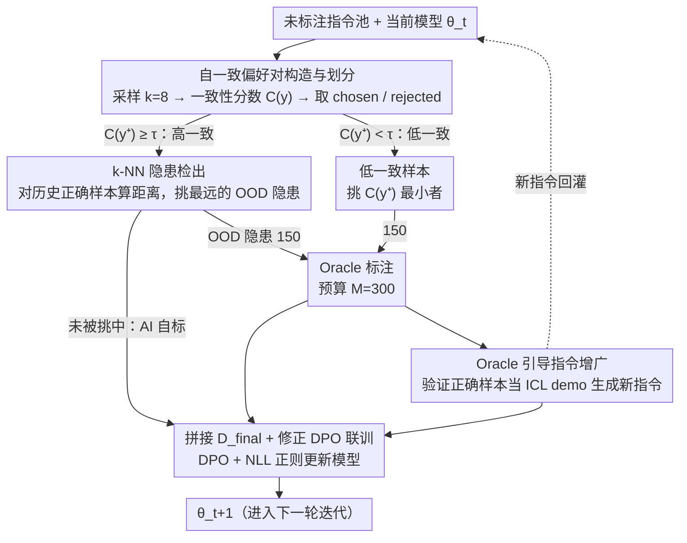

# CoAct: Co-Active LLM Preference Learning with Human-AI Synergy

**会议**: ACL 2026  
**arXiv**: [2604.17501](https://arxiv.org/abs/2604.17501)  
**代码**: https://github.com/rux001/CoAct (有)  
**领域**: LLM 对齐 / RLHF  
**关键词**: 偏好学习, 自奖励, 主动学习, 人机协同, DPO

## 一句话总结
CoAct 在偏好对齐中用自一致性把无标注样本切成"高一致 / 低一致"两堆，再用 k-NN 距离从高一致样本里挑出"自洽但可能错"的隐患样本送给 Oracle 标注，剩下的高一致样本直接当 AI 自标数据，最后用 oracle-verified 样本做 in-context demo 生成新指令，把人和 AI 的监督在一个 DPO 循环里捏成一团，在 GSM8K/MATH/WebInstruct 上比最强基线再涨 4–8 个点。

## 研究背景与动机

**领域现状**：偏好对齐（RLHF / DPO 及其变种）已经是把 LLM 接到人类偏好上的主流手段，但训练所需的高质量偏好对长期靠人标，scale 上不去。学界于是分成两条路：(1) Self-Rewarding / RLAIF —— 让模型自己当 judge 生成偏好对；(2) Active Preference Learning（APO、ActiveDPO 等）—— 在有限标注预算下，挑信息量最大的样本送人工标。

**现有痛点**：两条路各有死穴。Self-Rewarding 把模型当裁判，没有外部校验，容易把自身偏差放大成 self-bias，越训越偏；Active learning 反过来，质量靠 Oracle 兜底，但预算紧、未标注池里大量样本被白白浪费，数据利用率低。

**核心矛盾**：在固定的人工标注预算下，"数据规模 (Self-Rewarding)" 与 "数据质量 (Active Learning)" 是一对 trade-off，没人同时拿住两端。

**本文目标**：(1) 在不增加 oracle 预算的前提下，把未标注池里的"安全样本"也用起来；(2) 在高一致样本里识别出"自洽但错"的隐患，避免 Self-Rewarding 的偏差放大；(3) 让 oracle 的反馈不只是给标签，还能引导新指令生成，把数据多样性拉起来。

**切入角度**：作者从一个简单的观察出发 —— "模型偶尔答错容易，但要在多次独立采样里持续给出同一个错答案就难得多"。所以 self-consistency 既能当 AI 自标的可靠性 proxy，又能直接划出"模型自己心里有数"与"心里没底"的两片样本。

**核心 idea**：把 self-rewarding 和 active learning 在 self-consistency 这条信号下拼成一个闭环 —— 高一致的 AI 自标自用、低一致 + k-NN OOD 检出的高一致隐患统统送 Oracle、oracle-verified 样本反哺新指令生成，全部在一个修正后的 DPO 目标里联训。

## 方法详解

### 整体框架
CoAct 是一个迭代式的"人机协同偏好学习"框架。每一轮 $t$ 的输入是当前模型 $\theta_t$ 与未标注 instruction 池里的一个 batch $\mathcal{B}_t$，输出是更新后的模型 $\theta_{t+1}$。中间走三步：

1. **自一致偏好对构造**：对每条 instruction $x$ 用 temperature 采样生成 $k=8$ 个 response，按答案抽取后的相对频率打 consistency 分数 $C(y)$，最大者为 $y^+$、最小者为 $y^-$，并以阈值 $\tau$（GSM8K/MATH 用 4/8，WebInstruct 用 5/8）把样本切成高一致 $\mathcal{D}_{high}$ 与低一致 $\mathcal{D}_{low}$。
2. **Oracle 预算分配 + k-NN 隐患检出**：固定预算 $M=300$，按 $M_{low}{=}M_{high}{=}150$ 分给两堆。低一致里挑 $C(y^+)$ 最小的样本；高一致里用 k-NN 距离从历史 oracle-verified 正确样本的 hidden state 找出离 in-distribution 最远的样本（被视为"自洽但 OOD 的错"），合并后送给 Oracle 标注。
3. **Oracle 引导的指令增广 + 联训**：把高一致里被 Oracle 验证为正确的样本作为 ICL demo，让模型再生成 $N_{new}$ 条新 instruction，跑同样的自一致流程构造新偏好对。最终把 oracle-labeled + AI-labeled 拼成 $\mathcal{D}_{final}^{(t)}$，用带 NLL 正则的 DPO 目标更新模型。

### 关键设计

**1. 基于自一致性的偏好对构造与划分：用一份一致性分数同时打偏好对、贴可信度标签**

自奖励类方法常用 LLM-as-Judge 给样本打分，既贵又把模型自身偏置带进来。CoAct 换成一个纯统计的便宜 proxy：对每条 instruction $x$ 抽 $k$ 次 response，按答案抽取后算一致性分数 $C(y)=\frac{1}{k}\sum_m \mathbf{1}\{\text{ans}(y_m)=\text{ans}(y)\}$，把最 consistent 的当 chosen $y^+$、最不 consistent 的当 rejected $y^-$。同一个分数还顺手把 batch 切成两堆——$C(y^+)\geq\tau$ 的高一致样本默认拿来 AI 自标，$C(y^+)<\tau$ 的低一致样本直接送 Oracle。这一招的妙处在于把"用 AI 自标"和"找 Oracle 该标谁"这两个看似矛盾的目标，用同一根标尺统一了起来，不必再维护两套独立信号。

**2. k-NN 距离驱动的高一致样本隐患检出：在"看似可信"里揪出"自洽但错"，堵住 self-bias 放大**

只看自一致性会漏掉一种最危险的情况——模型对一个错误命题异常自信，反复采样都给同一个错答案。CoAct 给高一致样本再加一道"是否落在已知正确分布内"的校验：把上一轮 Oracle 验证过的正确样本的倒数第二层 hidden state 归一化后 $\phi(x)/\|\phi(x)\|_2$ 当作 in-distribution 集 $\mathcal{Z}_{ID}^{(t)}$，对当前高一致样本算 k-NN 距离 $r_k(z_i)=\min_{z\in\mathcal{Z}_{ID}^{(t)}}\|z_i-z\|_2$，距离最大的 Top-$M_{high}$ 视作 OOD、优先交给人标。这本质是把经典 OOD detection（Sun et al. 2022）迁到 preference learning 上，几乎 plug-and-play 地堵住了 self-rewarding 最大的漏洞。效果很直接：GSM8K/MATH/WebInstruct 上 Oracle 真正命中错误样本的比例分别提到 82.56% / 87.32% / 84.17%，远高于随机选与"最低 consistency"选的约 70%。

**3. Oracle 引导的指令增广 + 修正 DPO 目标：让 Oracle 反馈不只给标签，还当难度过滤器**

MetaMath 这类合成数据常常超出基础模型的可解范围，self-label 信号一噪声爆炸训练就崩。CoAct 让 Oracle 多担一份活：取高一致里被 Oracle 标为正确的样本 $\mathcal{D}_{correct}^{(t)}$ 作为 ICL demo，让模型据此生成 $N_{new}$ 条新 instruction $\mathcal{D}_{new}^{(t)}$，再跑一遍自一致流程过滤。这等于把"难度上限"锁死在模型当前可解的范围内。优化目标在标准 DPO 之外补了一个 NLL 正则，防止 chosen 序列的 likelihood 在迭代中崩塌：

$$\mathcal{L}(\theta_t)=-\mathbb{E}\Big[\log\sigma\big(\beta\log\tfrac{\theta_t(y^+|x)}{\theta_0(y^+|x)}-\beta\log\tfrac{\theta_t(y^-|x)}{\theta_0(y^-|x)}\big)-\alpha|y^+|\log\theta_t(y^+|x)\Big]$$

其中 $\beta=0.5,\alpha=1$。实验里这条"控制难度上限"的支路在弱底座上甚至比单纯扩数据更值钱——MATH 上 +Aug 与 +Self 两个消融的差距很小（39.85 vs 41.23），说明当模型本身弱时，把数据难度卡在可解范围内比硬堆数据量更关键。

### 损失函数 / 训练策略
最终训练数据是 $\mathcal{D}_{final}^{(t)}=\mathcal{D}_{oracle}^{(t)}\cup\mathcal{D}_{AI}^{(t)}$，用上面带 NLL 的 DPO 目标训 10 epoch，lr $5\times10^{-6}$，batch size 16，LoRA rank 8 / alpha 16。采样温度从 $\{0.35,0.4,\ldots,0.7\}$ 里抽以鼓励多样推理。共跑 4 轮 active learning iteration，每轮 oracle 预算固定 300（$M_{low}=M_{high}=150$）。

## 实验关键数据

### 主实验
Llama3-8B 与 Qwen3-4B 两个底座、GSM8K / MATH / WebInstruct 三个推理基准，对比 Random / Entropy / Pref Certainty / Pref+Ent 四个 active learning baseline。报告第 4 轮的精度（%）：

| 数据集 (底座) | Random | Entropy | Pref Cert. | Pref+Ent | **CoAct** | 相比 Base |
|---------------|--------|---------|-----------|----------|-----------|----------|
| GSM8K (Llama3-8B) | 34.57 | 36.56 | 37.28 | 39.41 | **43.58** | +20.05 |
| MATH (Llama3-8B) | 12.07 | 12.94 | 11.08 | 13.07 | **14.46** | +9.84 |
| WebInstruct (Llama3-8B) | 9.62 | 10.11 | 14.53 | 14.87 | **15.97** | +8.28 |
| GSM8K (Qwen3-4B) | 93.57 | 94.02 | 94.03 | 94.58 | **94.84** | +6.45 |
| MATH (Qwen3-4B) | 70.89 | 70.14 | 70.52 | 70.21 | **75.71** | +6.54 |
| WebInstruct (Qwen3-4B) | 44.12 | 47.83 | 51.25 | 52.48 | **53.96** | +18.04 |

跨四轮的平均增益：GSM8K +13.25%、MATH +8.19%、WebInstruct +13.16%。在 Qwen3-4B 上 MATH 直接把 baseline ≈70% 拉到 75.71%，差距尤其明显。

### 消融实验

| 配置 (Llama3-8B, iter 4) | GSM8K | MATH | WebInstruct | 说明 |
|---|---|---|---|---|
| Oracle-only（去掉 Aug 和 Self） | 36.38 | 11.95 | 13.53 | 仅用 active selection 的 oracle 数据 |
| +Aug（去掉 Self-label） | 39.85 | 13.34 | 13.89 | 加 oracle 引导的新指令 |
| +Self（去掉 Aug） | 41.23 | 12.12 | 15.21 | 加自一致 self-label 数据 |
| **Full (Aug + Self)** | **43.58** | **14.46** | **15.97** | 完整 CoAct |

k-NN 选择策略的 oracle 错误率（越高代表越能挖出真错样本）：GSM8K 82.56% / MATH 87.32% / WebInstruct 84.17%，全面碾压 random 与"最低 consistency"基线（≈70%）。consistency 阈值 $\tau$ 在 4/8 ~ 5/8 间最优，过低样本被噪声污染、过高有效训练量不足。

### 关键发现
- **k-NN 隐患检出是高一致样本的关键阀门**：去掉后 oracle 给到的"真错"率从 ~84% 掉到 ~70%，self-bias 放大风险显著上升。
- **强底座 + 弱信号差异变小**：Qwen3-4B 上四种 baseline 在 GSM8K 的差距只有 1.27%，但 Llama3-8B 上 spread 高达 9.01%，说明 active learning 的策略价值在基础模型还没饱和时最大。
- **自一致与 accuracy 高度相关**：4 轮训练后 GSM8K/MATH/WebInstruct 上 self-consistency 与正确性的 Pearson 相关系数分别到 0.9745 / 0.9756 / 0.9544，证明 $C(y)$ 作为可靠性 proxy 的合理性会随训练而进一步加强。
- **OOD 泛化**：在 GPQA 与 MMLU-Pro 上 CoAct 同样全面领先，说明 oracle 引导的指令增广带来的多样性确实有 OOD 收益，不是过拟合 in-domain。

## 亮点与洞察
- **一个信号承担两个目的**：self-consistency 既挑 chosen/rejected，又决定哪些样本送 oracle，把"AI 自标"和"主动学习"两条独立 pipeline 用同一标尺打通；这种"用同一个量表分流"思想很值得在 RLHF / data selection 里复用。
- **k-NN 隐患检出迁移得很优雅**：把 OOD detection 经典工具迁到 preference learning 的"高 confidence 错误"问题上，对 self-rewarding 类方法的最大隐患（self-bias）给出几乎 plug-and-play 的解药。
- **oracle 不只是给标签**：作者明确把 oracle 的角色拆成"verify pair"和"anchor instruction generation"两个独立功能，后者效果在 MATH 上比 self-label 还好（39.85 vs 41.23 ≈），暗示当底座弱时，"控制难度上限"比"扩充数据量"更值钱。
- **用 GPT-5 当 oracle 与人对比几乎无差**：实验直接显示 GPT-5（带 ground truth）vs GPT-5（仅模型判断）在三个 benchmark 上性能可比，给"强 LLM 当 oracle"提供了实证支持，能大幅降低标注成本。

## 局限与展望
- 每条指令采样 $k=8$ 个 response 算 self-consistency，训练侧推理开销是 baseline 的 ~8 倍，scale 上去时需要更高效的不确定性估计。
- 评测仅限有客观答案的推理任务（GSM8K/MATH/Physics），对开放式生成（创意写作、对话风格）这套 self-consistency 阈值机制是否还成立，论文没说。
- 一致性阈值 $\tau$ 仍需按数据集手调（GSM8K/MATH 用 4/8、WebInstruct 用 5/8），跨任务自适应没解。
- k-NN 用上一轮 oracle-verified 正确样本做 ID 集，第 1 轮初始 ID 集很小、检出能力弱；这也解释了为什么 Llama3-8B + MATH 在前两轮反而被 baseline 反超。
- 改进方向：把 k-NN 换成更可学习的 OOD scoring；把 self-consistency 拓展到 reward model 评分；探索把这套架构用到多 LLM 协同当 oracle，进一步压成本。

## 相关工作与启发
- **vs Self-Rewarding (Yuan et al. 2024)**：自奖励让模型当 judge，没有外部校验、易自我强化偏差；CoAct 用 self-consistency 替代 LLM-as-Judge，再用 oracle 把高一致里的隐患洗一遍，显著减弱 self-bias，但代价是引入了 oracle 调用。
- **vs Active Preference Learning / ActiveDPO (Lin et al. 2026, Das et al. 2025)**：APL 只用 oracle 标"信息量最高"的样本，未标注池绝大部分浪费；CoAct 把高一致的安全样本自标自用，等效扩大有效训练集，相同 oracle 预算下利用率高几倍。
- **vs Self-Consistency Preference Optimization (Prasad et al. 2025)**：SCPO 也用 self-consistency 构造 chosen/rejected，但没有人机协同路径，无法处理 self-consistent error；CoAct 把 SCPO 的 self-consistency 当起点，再叠了 oracle + k-NN 这一层"质量保险"。
- **vs Skywork-Reward-V2 (Liu et al. 2025a)**：Skywork 用一组强 LLM 聚合判断生成偏好数据，资源消耗大；CoAct 只需一个 oracle（甚至可以是 GPT-5），通过流程设计把成本压下来。

## 评分
- 新颖性: ⭐⭐⭐⭐ 把 self-rewarding 和 active learning 用 self-consistency 这条信号融合 + 把 OOD detection 思路搬来检 self-consistent error，组合很巧但单点技术都不算全新。
- 实验充分度: ⭐⭐⭐⭐ 双底座 × 三 in-domain × 三 OOD benchmark，消融、阈值敏感性、oracle 类型、self-consistency 与 accuracy 相关性都覆盖到了。
- 写作质量: ⭐⭐⭐⭐ 把"为什么自一致 + k-NN 一起用"的动机讲得很顺；公式与算法图配合到位，附录还给了带噪监督下的 Fisher 信息分析。
- 价值: ⭐⭐⭐⭐ 在偏好对齐数据愈来愈成 bottleneck 的当下，提供了一个能直接降标注成本的实用 recipe，且代码开源。

<!-- RELATED:START -->

## 相关论文

- [\[ACL 2026\] Budget-Aware Anytime Reasoning with LLM-Synthesized Preference Data](budget-aware_anytime_reasoning_with_llm-synthesized_preference_data.md)
- [\[ICML 2025\] Ad-Hoc Human-AI Coordination Challenge (AH2AC2)](../../ICML2025/llm_reasoning/ad-hoc_human-ai_coordination_challenge.md)
- [\[ACL 2026\] TemplateRL: Structured Template-Guided Reinforcement Learning for LLM Reasoning](templaterl_structured_template-guided_reinforcement_learning_for_llm_reasoning.md)
- [\[ACL 2026\] AIM-CoT: Active Information-driven Multimodal Chain-of-Thought for Vision-Language Reasoning](aim-cot_active_information-driven_multimodal_chain-of-thought_for_vision-languag.md)
- [\[AAAI 2026\] Dropouts in Confidence: Moral Uncertainty in Human-LLM Alignment](../../AAAI2026/llm_reasoning/dropouts_in_confidence_moral_uncertainty_in_human-llm_alignment.md)

<!-- RELATED:END -->
