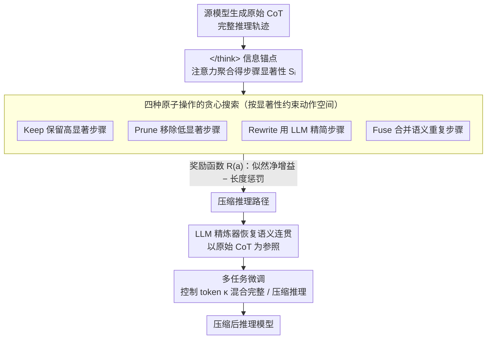

# CRISP: Compressing Redundancy in Chain-of-Thought via Intrinsic Saliency Pruning

**会议**: ACL 2026  
**arXiv**: [2604.17297](https://arxiv.org/abs/2604.17297)  
**代码**: [GitHub](https://github.com/)  
**领域**: LLM推理效率  
**关键词**: 思维链压缩, 注意力显著性, 推理冗余, 贪心搜索, 高效推理

## 一句话总结

提出 CRISP 框架，发现 `</think>` token 的注意力模式能可靠区分推理链中的关键步骤和冗余步骤，据此设计四种原子操作的贪心搜索压缩流水线，在保持准确率的同时减少50-60%的 token 用量。

## 研究背景与动机

**领域现状**：推理型 LLM（如 DeepSeek-R1、OpenAI o1）通过生成长链思维链（CoT）实现强大推理能力，但也带来巨大的计算开销和延迟。CoT 压缩成为实际部署的必需。

**现有痛点**：现有 CoT 压缩方法通常依赖外部代理模型（如独立的 LLM）来评估和剪枝推理步骤。但外部压缩器与源模型的内在推理动态不对齐——它们经常将自我纠正等关键中间步骤误判为冗余，破坏推理链的逻辑连贯性。

**核心矛盾**：需要找到一种信号来区分推理链中的"关键逻辑步骤"和"冗余步骤"，但这种信号不应来自外部模型（会引入不对齐），而应来自模型自身的内在机制。

**本文目标**：利用模型自身的内在信号（而非外部代理）来指导 CoT 压缩。

**切入角度**：观察到 `</think>` token 在深层注意力中充当"信息锚点"——模型在生成最终答案时主要关注 `</think>` 位置而非中间推理步骤，而 `</think>` 的注意力分布恰好反映了各推理步骤对最终答案的贡献大小。

**核心 idea**：利用 `</think>` token 的注意力模式作为步骤显著性的内在指标，通过四种原子操作（保留、剪枝、重写、融合）的贪心搜索构造压缩推理路径，再用 LLM 精炼器恢复语法连贯性。

## 方法详解

### 整体框架

CRISP 包含三个阶段：（1）原始 CoT 生成——从源模型获取完整推理轨迹；（2）关键推理路径搜索——利用 `</think>` 注意力评估步骤显著性，通过动态操作符压缩推理链；（3）精炼与微调——用 LLM 恢复压缩路径的语义连贯性，然后用多任务目标微调目标模型。

### 关键设计

**1. `</think>` 作为信息锚点的发现：用模型自己的注意力当步骤显著性信号，绕开外部代理**

现有 CoT 压缩多靠一个外部 LLM 来评判哪些步骤该删，但外部压缩器和源模型的推理动态对不齐，常把自我纠正这类关键中间步骤误判成冗余、切断逻辑链。CRISP 改用源模型自身的信号：注意力可视化显示，在深层里 `</think>` token 会逐渐把前面整条推理链的信息聚合到自己身上，生成最终答案时模型主要盯着 `</think>` 的位置而非中间步骤。于是把步骤显著性 $S_i$ 定义为所有层、所有头上 `</think>` 对步骤 $r_i$ 内 token 注意力权重之和的归一化。这个信号经得起验证——剪掉高注意力步骤后 PPL 飙升、剪掉低注意力步骤 PPL 几乎不动，说明它直接反映了源模型"自己认为什么重要"，比任何外部代理都更对齐。

**2. 四种原子操作的贪心搜索：在显著性引导下做连续粒度的压缩，而非一刀切阈值**

简单的阈值过滤要么切断逻辑依赖、要么留下冗余，粒度太糙。CRISP 定义四种原子操作覆盖从"完全保留"到"完全移除"的连续谱：Keep（保留高显著步骤）、Prune（移除低显著步骤）、Rewrite（用 LLM 精简步骤）、Fuse（合并语义重复步骤）。动作空间是动态的——根据显著性分数和步骤间语义相似度约束每一步允许哪些操作，再用贪心搜索逐步压缩。每个候选操作 $a$ 的取舍由奖励函数裁决：

$$R(a) = \log P_\theta(y\,|\,x, \mathcal{C} \oplus a(r_i)) - \log P_\theta(y\,|\,x, \mathcal{C}) - \beta \cdot \text{Len}(a(r_i))$$

前两项衡量这步操作对正确答案似然的净增益，最后一项按压缩后长度做惩罚，于是搜索天然朝"既不掉准确率又更短"的方向收敛。

**3. 压缩路径精炼与多任务微调：先补回语义连贯，再把压缩能力训进模型且不遗忘**

离散搜索（尤其 Prune 和 Fuse）会在骨架里留下语法断裂和逻辑断层，直接拿去训练会带噪。CRISP 先用一个更强的 LLM 精炼器、以原始 CoT 为参照把压缩路径的流畅性补回来，再做微调。微调用一个控制 token $\kappa$ 走多任务策略：带 $\kappa$ 的输入让模型生成压缩推理、不带的生成完整推理，两条路径混合训练，既学会了短链压缩又避免把原本的完整推理能力灾难性遗忘掉。

### 损失函数 / 训练策略

标准自回归负对数似然损失，混合原始轨迹和压缩轨迹训练。3个 epoch，学习率 $1 \times 10^{-5}$，基于 MATH 数据集的2500个样本。注意力阈值 $\tau_{\text{high}}$ 和 $\tau_{\text{low}}$ 分别取前30%和后20%分位数。

## 实验关键数据

### 主实验

| 方法 | 模型 | GSM8K Acc | GSM8K Tok | MATH-500 Acc | MATH-500 TE |
|------|------|----------|----------|-------------|------------|
| Original | 1.5B | 81.6 | 1669 | 78.2 | 2.22 |
| CRISP | 1.5B | **80.6** | **587** | **75.0** | **4.14** |
| Original | 7B | 90.8 | 1376 | 87.4 | 2.86 |
| CRISP | 7B | **90.1** | **374** | **84.2** | **7.35** |

### 消融实验

| 方法 | 1.5B 平均 TE | 7B 平均 TE | 说明 |
|------|------------|----------|------|
| Original | 2.10 | 2.81 | 基线 |
| CoD (提示策略) | 2.61 | 4.31 | 控制粒度不足 |
| TALE (外部压缩) | 2.31 | 3.15 | 外部不对齐 |
| A*-Thought | 2.99 | 4.04 | 搜索但无内在信号 |
| CRISP | **4.31** | **6.80** | 最优效率-准确率权衡 |

### 关键发现

- CRISP 在 Token Efficiency 上大幅领先所有基线（7B模型上6.80 vs 次优4.31）
- 7B模型上 GSM8K 只用374个 token（原始1376），准确率仅掉0.7%
- `</think>` 注意力验证实验清晰：剪除高注意力步骤 PPL 飙升，剪除低注意力步骤 PPL 几乎不变
- 显著性分数呈现非均匀分布，只有少量步骤对最终答案有高贡献

## 亮点与洞察

- **`</think>` 作为信息锚点的发现极有洞察力**：揭示了推理模型的内在注意力机制如何"总结"整个推理过程，这一发现对理解推理模型的工作原理有独立价值
- **四种原子操作的设计提供了灵活的压缩粒度**：比简单的保留/删除更精细，Fuse 和 Rewrite 允许在压缩的同时保留信息
- **Token Efficiency 指标的采用使得效率-准确率权衡可量化比较**

## 局限与展望

- 贪心搜索的计算开销（每步评估多个操作）可能在超长 CoT 上成为瓶颈
- 精炼步骤依赖外部 LLM，引入了额外成本
- 仅在数学推理数据集上验证，代码和逻辑推理的泛化性未测试
- 控制 token 的多任务训练策略相对简单，可能存在更好的训练方案

## 相关工作与启发

- **vs CoD/TALE（提示/外部压缩）**: CoD 通过提示限制长度但控制不精细，TALE 用外部模型压缩但引入不对齐。CRISP 利用模型自身的注意力信号，从根源避免了不对齐问题
- **vs RL方法（如长度惩罚）**: RL 方法计算开销大且对奖励设计敏感，CRISP 通过后处理压缩避免了 RL 的不稳定性

## 评分

- 新颖性: ⭐⭐⭐⭐⭐ `</think>` 信息锚点的发现有原创性，四种操作的贪心搜索设计精巧
- 实验充分度: ⭐⭐⭐⭐ 两个模型规模+三个基准+多种基线，但领域覆盖有限
- 写作质量: ⭐⭐⭐⭐⭐ 动机清晰，发现引人入胜，实验组织良好

<!-- RELATED:START -->

## 相关论文

- [\[NeurIPS 2025\] Inference-Time Chain-of-Thought Pruning with Latent Informativeness Signals](../../NeurIPS2025/llm_reasoning/inference-time_chain-of-thought_pruning_with_latent_informativeness_signals.md)
- [\[ACL 2026\] DRP: Distilled Reasoning Pruning with Skill-aware Step Decomposition for Efficient Large Reasoning Models](drp_distilled_reasoning_pruning_with_skill-aware_step_decomposition_for_efficien.md)
- [\[ACL 2026\] Is Chain-of-Thought Really Not Explainability? Chain-of-Thought Can Be Faithful without Hint Verbalization](is_chain-of-thought_really_not_explainability_chain-of-thought_can_be_faithful_w.md)
- [\[ACL 2026\] Render-of-Thought: Rendering Textual Chain-of-Thought as Images for Visual Latent Reasoning](render-of-thought_rendering_textual_chain-of-thought_as_images_for_visual_latent.md)
- [\[ACL 2026\] Learning to Edit Knowledge via Instruction-based Chain-of-Thought Prompting](learning_to_edit_knowledge_via_instruction-based_chain-of-thought_prompting.md)

<!-- RELATED:END -->
