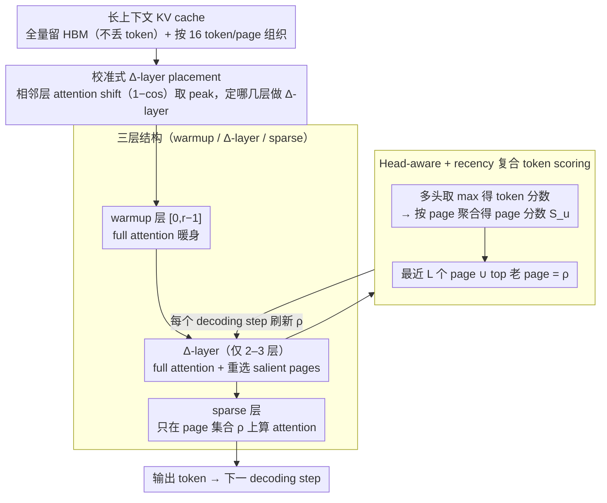

# DELTA: Dynamic Layer-Aware Token Attention for Efficient Long-Context Reasoning

**会议**: ACL 2026 Findings  
**arXiv**: [2510.09883](https://arxiv.org/abs/2510.09883)  
**代码**: https://github.com/hoenza/DELTA (有)  
**领域**: LLM 推理 / 长上下文 / 高效推断  
**关键词**: 稀疏 attention、KV cache、reasoning、Δ-layer、page-based selection

## 一句话总结
DELTA 是一种 **training-free 的层级稀疏 attention**：把 transformer 分成 "初始全 attention 层 + 少量 Δ-layer 重选 salient pages + 后续稀疏 attention 层" 三组，在 AIME / GPQA-Diamond 上 accuracy 持平或反超 full attention，同时把 attended token 数减少 $4.25\times$、端到端推理加速 $1.54\times$。

## 研究背景与动机
**领域现状**：DeepSeek-R1 / o3 / Qwen3 / GPT-OSS 等 LRM 通过"长 CoT 测试时扩展"在 AIME 这类基准上飙分，但 decoding 阶段每生成一个 token 都要扫整个 KV cache，长序列下吞吐被显存带宽彻底卡死（Llama-3-8B 32K 上下文 + bs128 已经 >500GB）。

**现有痛点**：① **Eviction-based** 方法（H2O / SnapKV / StreamingLLM / RaaS）永久丢弃 token，但 reasoning 链上"早期看似无用的 token"经常后期突然变关键，丢了就追不回来 → accuracy 暴跌；② **Selection-based** 方法（Quest / TidalDecode）保留全 cache 只选 top-k 计算，但每层都做选择会引入累计选择误差，且单层 score 不一定准。在 1k token budget 下 Quest 和 RaaS 在 AIME-2024 + DS-Qwen-14B 上 accuracy < 20%（full attention 60%）。

**核心矛盾**：reasoning 任务要求"长链一致性"——任何一段重要 token 被错选丢失，后续推理都会偏轨；而 full attention 又被带宽彻底卡死。如何在不重训、不丢 token、不每层都计算的前提下做高 recall 稀疏？

**本文目标**：设计一个 training-free 模块，做到 (1) 不动 KV cache（不丢 token，留给后续可能用到）；(2) 不每层全 attention（避开主带宽开销）；(3) 在 token 选择上保持高 recall 以撑住 reasoning 准确度。

**切入角度**：作者实测发现两个统计性质 —— ① **层间相关性**：相邻 transformer layer 的 attention map 几乎一样，深层是 refine 而非 reconstruct；② **sequential drift**：随 decoding 步推进，attention focus 缓慢漂移，所以选择必须 query-adaptive。结合这两条 → "只在少数层做 full attention + token 选择，其余层复用选出的 page"。

**核心 idea**：把 transformer 切成 "warmup 层 → Δ-layer 选择层 → 稀疏层" 三组，Δ-layer 每个 decoding step 重选一次（应对 drift），但全网只有几个 Δ-layer（应对带宽）。

## 方法详解

### 整体框架
Pipeline：① **三层分组**——layers [0, r-1] 做 full attention 暖身（早期 attention 太散乱，没法稳定选 page）；layers $\mathcal{D}$（如 [2, 14, 23]，只有 2–3 个）作为 Δ-layer，每个 decoding step 重跑 full attention 并刷新 page 选择；其余层用稀疏 attention，只在最近 Δ-layer 选出的 page 集合 $\rho$ 上计算。② **KV 内容不丢**——全 cache 始终留在 HBM，只是限制每层"读哪些 page"。③ **page-based 实现**——按 $P=16$ token/page 把 KV 组织成 page，token 分数聚合为 page 分数，便于 GPU coalesced 访问。④ **Δ-layer 校准**——在小 calibration set 上跑 full attention，对每对相邻层算 attention map 的 $1-\cos$ 距离，挑距离最大的层作 Δ-layer（这类层意味着"这里 attention 行为大变，前一层的 selection 不再可靠，需要刷新"）。

### 关键设计

**1. 三层结构（warmup / Δ-layer / sparse）：把"重新选 token"的开销死死压在 2–3 个关键层上**

full attention 被显存带宽卡死，但每层都做 token 选择又会让单层选择误差层层累积——DELTA 的破局点是把 N 层切成功能不同的三段，让大多数层"搭便车"。layers [0, 1] 先做 full attention 暖身，因为早期层 attention 太 diffuse，此时强行 top-k 选 page 并不可靠，得让 representation 先稳定下来；layer 2 是第一个 Δ-layer，负责建立初始的 salient page 集合；再在中后段挑 1–2 个 Δ-layer 应对推理过程中的 sequential drift；其余所有层都是 sparse 层，只在最近一个 Δ-layer 选出的 page 集合 $\rho$ 上计算。关键在于每个 decoding step 的 Δ-layer 都重新跑一次 full attention 并重选，而不是缓存旧结果,所以选择是 query-adaptive 的。这套切分直接对应作者实测的两条统计性质：相邻层 attention map 几乎一样（深层是 refine 而非 reconstruct），所以只需少数层做选择、其余层复用就够；而 attention focus 会随 decoding 步缓慢漂移，所以选择必须每步刷新、不能跨 step 沿用——两条性质一空间一时间，共同逼出"少数层选、每步刷"的结构。

**2. Head-aware + recency 复合 token scoring：既不让单个 head 的强信号被平均掉，也不让刚生成的 token 被误丢**

把多头 attention 压成一个 page 分数时有两个坑。一是用 mean 聚合多头会把"某个 head 强烈锁定关键 token"的信号稀释掉，所以 DELTA 对 token $t$ 取多头最大值 $s_t = \max_{j=1,\ldots,m} \alpha_j^i(t)$，保留每个 head 的"专家意见"；再按 page 聚合得到 page 分数 $S_u = \sum_{t:p(t)=u} s_t$。二是纯 top-score 选择会把刚生成的 token 误判为低分——它们的 attention 还没收敛，分数自然偏低，可一旦丢了，reasoning 的局部上下文就断了。DELTA 因此强制保留最后 $L$ 个 page，再从剩余 page 里按 $S_u$ 取 top $K-L$ 个，最终 $\rho$ = recency pages ∪ top-score old pages，用一个 recency 窗口补住了 score 机制的盲区。

**3. Page-based KV management + 校准式 Δ-layer placement：工程实现走 paged KV，Δ-layer 位置靠 attention shift 自动选**

这一条解决"怎么高效落地"和"Δ-layer 该放在哪几层"两件事。实现上借鉴 PagedAttention，把 KV cache 按每 page $P=16$ token 组织，token budget $k = K \cdot P$、recency budget $\ell = L \cdot P$；分数仍在 token 粒度上算，但 selection 在 page 粒度上做，整 page 整 page 地读，让 GPU 访问 coalesced、省掉零散 gather/scatter 的开销。Δ-layer 的位置则不靠手调：在小 calibration set 上跑一次 full attention，对每对相邻层算 attention map 的 $d_{\ell-1, \ell} = 1 - \cos(a_{\ell-1}, a_\ell)$，挑 shift 的 peak 作 Δ-layer——shift 大意味着"这里 attention 行为剧变、前一层的 selection 已不可靠、必须刷新"（如 DS-Qwen-14B 在 layer 4-5 之间 shift 高达 0.953），再加一条"沿深度均匀分布"的约束防止 Δ-layer 扎堆。这比手工调参更有依据，且实验显示同模型的 Δ-layer 配置在 4 个 dataset 间趋势稳定，校准一次即可复用。

### 损失函数 / 训练策略
**完全 training-free**。Δ-layer 校准只需小 calibration set 上跑 full-attention 一次，记录 attention map 并算 inter-layer shift；之后所有 inference 用 FlashInfer JIT + PyTorch topk 即可。page size $P=16$，budget $K=64$ pages (1k tokens) + $L=8$ recency pages 是默认配置。

## 实验关键数据

### 主实验

DELTA vs Full vs Quest vs RaaS（1k-token budget，accuracy %）：

| Model / Dataset | Full | DELTA-1k | DELTA-2k | Quest-1k | RaaS-1k |
|-----------------|------|----------|----------|----------|---------|
| DS-Qwen-14B / AIME-2024 | ~60 | ~50 | ~60 | <20 | <20 |
| DS-Qwen-7B / GPQA | base | base | **+30** | < base | < base |
| 多数 model × dataset | 100% | ≥100% | ≥ Full | 显著掉 | 显著掉 |

→ DELTA 即便在最严苛的 1k budget 下也能匹配 Full attention，2k budget 时常反超 Full（如 GPQA + DS-Qwen-7B 反超 30%），而 Quest/RaaS 在 1k budget 下崩盘。

吞吐与延迟（DS-Qwen-1.5B, bs=64, 18k 解码长度）：

| 指标 | Full | DELTA (K=64) | 改善 |
|------|------|--------------|------|
| 总解码时间 | 403 s | 261 s | **1.54× speedup** |
| 吞吐 | 2921 tok/s | 4517 tok/s | +55% |
| 单步 latency (long ctx) | 30 ms | 13 ms | ~2.3× |
| Attended token 数 | 全部 | 1/4.25 | **4.25× 减少** |

### 消融实验

Δ-layer 数量 vs 单步 forward 时间（DS-Qwen-7B, bs=64, TP=2, 16k tokens）：

| #Δ-layers | 单步 forward (相对) | 备注 |
|-----------|---------------------|------|
| 1 | 最低 | sparsity 最强，但易 stale |
| 3（默认） | 低 | accuracy 最佳 sweet spot |
| 5 | 中 | 收益递减 |
| 全部（=Full） | 最高 | 退化为 Full attention |

recency window $L$ vs accuracy（DS-Qwen-7B, Mixed120, 5 个 budget）：

| Budget $K$ | 最佳 $L$ | accuracy 区间 |
|-----------|----------|--------------|
| 64 (1k tokens) | 大 $L$ | 较低 budget 下需要更多 recency 保护 |
| 256 (4k) | $L=8$ | 大 budget 时 broader coverage 更重要 |
| 512 (8k) | $L=8$ | 同上 |

差异最高可达 10 个百分点，说明 $L$ 不能照搬，需要 budget-aware 调。

### 关键发现
- **DELTA-2k 多次反超 Full attention**：这反直觉但可解释 —— 稀疏 attention 滤掉了 noise token，让 reasoning 更聚焦；类似 dropout 的正则效应。
- **Δ-layer 位置由 inter-layer attention shift 决定**：DS-Qwen-14B 在 layer (4,5) 处 shift 高达 0.953，正是该模型 Δ-layer [2,6,42] 的选择依据；这套校准方法迁移到 1.5B/7B 也都跑得动。
- **Quest 和 RaaS 在长 reasoning 上全军覆没**：1k budget 下两者 accuracy <20%，证明 reasoning 任务对"任何形式的 token 永久丢失或单层选择误差"极度敏感，DELTA 的"全 cache 留 + 多层校准"组合是必需的。
- **DELTA 的 overhead 集中在短上下文**：1k context 时 page-selection 开销占 baseline FlashInfer 154%，但 32k 时降到 25%——长上下文越长 DELTA 越赚，这正是 reasoning 模型的工作区间。

## 亮点与洞察
- **"层间相关 + 步间漂移" 双观察**是整篇论文的 idea 核心 —— 把一个 well-known fact (attention sparsity) 升级为 "时间维度上需要刷新但空间维度上可以复用" 的具体设计原则，避免了过早 commit 单一稀疏模式。
- **保留全 KV cache 不丢 token** 是与 RaaS 等 eviction 方法的根本性区别，也是 reasoning task 不掉点的关键：作者明确指出"早期看似无用的 token 可能后期变关键"，所以只压缩 compute 不压缩 memory。
- **inter-layer cosine shift 选 Δ-layer** 是一套可迁移的诊断方法，对未来 layer-skipping / early-exit / mixture-of-depth 等"按层做 budget 分配"的工作都有参考价值。
- **Max-over-heads scoring** 是个被忽视的细节 —— 多 head attention 里关键 token 经常只被 1–2 个 head 锁定，平均会把这种 signal 抹平；max 保留住所有 head 的"专家意见"。

## 局限与展望
- **不省 memory，只省 compute**：full KV cache 仍占用 HBM，对极长 context（>200K）或小 GPU 仍会 OOM；作者建议未来与 quantization / offloading / 有保证的 eviction 结合。
- **只验证了 DeepSeek-R1 distilled 系列 + 数学/科学 QA**：能否迁移到对话、code generation、agent 等更长尾的 workload 没验证；不同架构（MoE、SSM）可能需要重做 Δ-layer 校准。
- **Δ-layer 和 $(K, L)$ 仍需手工/校准选**：虽然给了基于 attention shift 的方法，但仍是 per-model 调一次；理想是 per-sample 自适应（如 lightweight learned router），论文未做。
- **Max-head scoring 在 attention drift 快时可能滞后**：作者承认在快速 drift 场景下 max scoring 会跟不上，需要更高频 Δ-layer 或自适应 scheduling。

## 相关工作与启发
- **vs Quest (ICLR 2025)**：Quest 每层都用 page-rep 做选择，DELTA 只在 2–3 个 Δ-layer 做并跨层复用——后者避免了"每层选择都引入小误差，累计起来很大"的问题。
- **vs RaaS / SnapKV / H2O**：这些 eviction 方法虽然省 memory 但 reasoning 上 catastrophic failure（被 evict 的 token 找不回）；DELTA 不丢任何 token，付出的代价仅是不省 memory。
- **vs TidalDecode**：思路最相近（少数层做 full + 多数层复用），但 DELTA 加了 calibration-based Δ-layer 选取、page-based 高效实现、max-head + recency 复合 scoring 三层工程优化，且明确针对 reasoning 任务做了 benchmark。
- **vs SeerAttention-R**：需要 self-distillation 训 gating module，DELTA 是 training-free 的，更易部署。
- **启发**：层级稀疏 + 周期性刷新这套思路可以推广到多模态（视觉 token 也呈现类似 sparsity）、Mamba/SSM 架构的混合 attention 模块、甚至 RAG 中的 chunk-level relevance refresh。

## 评分
- 新颖性: ⭐⭐⭐⭐ "层间相关 + 步间漂移" 双观察催生的三层结构是简单但 elegant 的 insight 组合；training-free 且不丢 token 这两点同时满足是这条赛道的关键 differentiator
- 实验充分度: ⭐⭐⭐⭐ 4 模型 × 4 reasoning benchmark + 3 baseline + 多种 budget/recency/Δ-layer 配置 + 详细 overhead breakdown + Δ-layer 校准实验，全面
- 写作质量: ⭐⭐⭐⭐⭐ 故事线"现状 → 双观察 → 三层设计 → page-based 实现 → benchmark + speedup"层层递进；Algorithm 1/2 + 附录大量 ablation 工程细节扎实
- 价值: ⭐⭐⭐⭐⭐ 1.54× end-to-end speedup + accuracy 不掉 + training-free + 开源代码，是工业界 reasoning 模型 serving 可以立刻 ship 的工作

<!-- RELATED:START -->

## 相关论文

- [\[ACL 2026\] Long-Context Reasoning Through Proxy-Based Chain-of-Thought Tuning](long-context_reasoning_through_proxy-based_chain-of-thought_tuning.md)
- [\[ACL 2026\] Step-GRPO: Internalizing Dynamic Early Exit for Efficient Reasoning](step-grpo_internalizing_dynamic_early_exit_for_efficient_reasoning.md)
- [\[ACL 2026\] PPA-Plan: Proactive Pitfall Avoidance for Reliable Planning in Long-Context LLM Reasoning](ppa-plan_proactive_pitfall_avoidance_for_reliable_planning_in_long-context_llm_r.md)
- [\[ACL 2026\] Reliability-Aware Adaptive Self-Consistency for Efficient Sampling in LLM Reasoning](reliability-aware_adaptive_self-consistency_for_efficient_sampling_in_llm_reason.md)
- [\[ICLR 2026\] InftyThink: Breaking the Length Limits of Long-Context Reasoning in Large Language Models](../../ICLR2026/llm_reasoning/inftythink_breaking_the_length_limits_of_long-context_reasoning_in_large_languag.md)

<!-- RELATED:END -->
