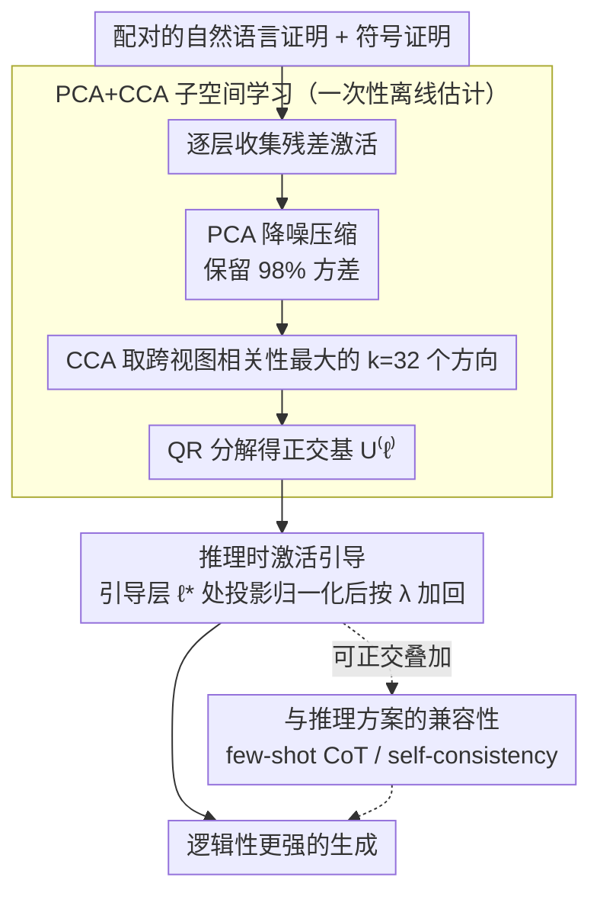

# Discovering a Shared Logical Subspace: Steering LLM Logical Reasoning via Alignment of Natural-Language and Symbolic Views

**会议**: ACL 2026  
**arXiv**: [2604.19716](https://arxiv.org/abs/2604.19716)  
**代码**: [https://github.com/lei-nlp-lab/logical_subspace_acl_2026](https://github.com/lei-nlp-lab/logical_subspace_acl_2026)  
**领域**: Human Understanding / LLM Reasoning  
**关键词**: 逻辑推理、多视图子空间、激活引导、CCA对齐、免训练推理

## 一句话总结

发现 LLM 内部存在一个共享的逻辑子空间，可同时对齐自然语言和符号逻辑两种推理表示，通过在推理时沿该子空间引导激活可无训练提升逻辑推理准确率最高达 11 个百分点。

## 研究背景与动机

**领域现状**：LLM 在复杂多步逻辑推理上仍然表现不佳。现有方法分为两个流派：（1）自然语言依赖方法——通过提示或训练优化思维链推理；（2）神经符号方法——附加外部符号求解器或验证器。

**现有痛点**：第一类方法仅在自然语言形式上优化推理链，未利用符号逻辑的结构化信息；第二类方法依赖外部符号组件，增加系统复杂性和维护成本。两者都未探索 LLM 内部是否存在统一的逻辑推理能力表示。

**核心矛盾**：同一逻辑推理问题可用自然语言证明和符号证明两种互补表示描述，但现有方法要么只关注一种表示，要么需要外部工具桥接两者。

**本文目标**：发现 LLM 内部是否存在一个对齐自然语言和符号语言两种视图的共享逻辑子空间，并利用它来增强推理能力。

**切入角度**：利用配对的自然语言证明和符号证明的残差激活，通过典型相关分析（CCA）学习低维共享子空间。

**核心 idea**：LLM 的残差流中存在一个低维逻辑子空间，它捕捉了跨自然语言和符号表示共享的逻辑推理能力；在推理时沿该子空间放大激活的投影即可增强推理，无需修改模型权重。

## 方法详解

### 整体框架

分为两个阶段：（1）学习多视图逻辑子空间——收集配对的 NL/符号推理链的残差激活，通过 PCA+CCA 学习最大化跨视图相关性的低维子空间；（2）推理时引导——在模型前向传播中，沿学到的子空间方向放大每个 token 的激活投影，引导生成朝逻辑推理方向偏移。整个引导方案称为 LSS（Logical Subspace Steering），它发生在激活层面，因此可与提示、采样层面的推理技巧正交叠加。

### 关键设计

**1. PCA+CCA 子空间学习：从两套表面形式不同的证明里挖出共享的逻辑骨架**

难点在于：同一道逻辑题的自然语言证明和符号证明，残差激活落在维度极高、又被各自语言风格污染的两个空间里，直接对齐会被表面噪声主导。作者先对每一层的激活做 PCA 降噪压缩，保留 98% 方差去掉零碎扰动；再用典型相关分析（CCA）在压缩后的 NL 空间和符号空间之间，找出相关性最大的 $k=32$ 个方向，最后经 QR 分解得到正交基 $U^{(\ell)} \in \mathbb{R}^{D \times k}$。CCA 的目标本身就是最大化跨视图相关，因此挑出来的方向必然是「两种表示都用得上」的——它捕捉的是跨表面形式共享的逻辑结构，而非某一种语言形式自带的风格信息，这正是后续引导能稳定生效的前提。

**2. 推理时激活引导：沿逻辑子空间放大投影，不动一根权重就把推理掰正**

学到子空间后，怎么让它真正影响生成是第二个问题。作者选一个引导层 $\ell^*$，对该层每个 token 的残差向量做替换：

$$\tilde{h}^{(\ell^*)}_t = h^{(\ell^*)}_t + \lambda \frac{P^{(\ell^*)} h^{(\ell^*)}_t}{\|P^{(\ell^*)} h^{(\ell^*)}_t\|_2} \|h^{(\ell^*)}_t\|_2$$

也就是把激活在子空间上的投影 $P^{(\ell^*)} h^{(\ell^*)}_t$ 归一化后、按原向量模长和强度 $\lambda$ 加回去，相当于沿逻辑方向施加一个幅度可控的扰动。整个干预只需一次性的子空间估计，加上每个 token 一次矩阵-向量乘法，推理吞吐几乎不掉（179 → 176 tok/s），却能把生成持续推向「更逻辑」的方向。

**3. 与推理方案的兼容性：和提示、采样层面的技巧正交，可以直接叠加**

LSS 干预发生在激活层面，而 few-shot CoT 改的是提示、self-consistency 改的是采样投票——三者作用在完全不同的层级。因此引导时无需为新场景重新搜参，直接复用同一套子空间、引导层和 $\lambda$ 即可：把 LSS 套在 3-shot CoT 或 SC-3 之上，准确率仍能在它们各自的基础上再叠加约 2 个点的增益，说明这三类方法的收益互不抵消。

### 损失函数 / 训练策略

无训练方法。子空间学习仅需在金标准证明上做一次 PCA+CCA 估计。引导强度 $\lambda$ 和引导层 $\ell^*$ 在验证集上选择。

## 实验关键数据

### 主实验

| 模型 | 基准 | Greedy-CoT | LSS-CoT | 提升 |
|------|------|-----------|---------|------|
| Llama-3.1-8B | FOLIO | 51.7% | 61.1% | +9.4 |
| Llama-3.1-8B | PrOntoQA (5-hop) | 70.6% | 75.4% | +4.8 |
| Phi-3-Mini | PrOntoQA (5-hop) | 59.6% | 70.6% | +11.0 |
| Gemma-2-9B | PrOntoQA (5-hop) | 87.4% | 90.2% | +2.8 |
| Gemma-2-9B | PW-CWA (3-hop) | 71.4% | 73.8% | +2.4 |

### 与推理方案叠加（Llama-3.1-8B, PrOntoQA）

| 方法 | 准确率 |
|------|--------|
| Greedy-CoT | 70.6% |
| 3-shot-CoT + LSS | 74.6% (+2.2 over 3-shot) |
| SC-3 + LSS | 81.0% (+2.0 over SC-3) |

### 消融实验

| 配置 | 关键指标 | 说明 |
|------|---------|------|
| 随机正交方向引导 | 无提升/性能下降 | 证明提升来自学到的逻辑子空间而非任意激活放大 |
| $\lambda$ 敏感性 | 最优 $\lambda$ 因模型而异 | 逻辑子空间方向提升稳健，随机方向无稳定提升 |
| Qwen3-4B (推理特化模型) | 87.2 → 93.2 (+6.0) | 即使强基座模型也能从 LSS 受益 |

### 关键发现
- 逻辑子空间编码了语义和逻辑结构信息
- NL 和符号视图的对齐在 LLM 高层更强
- 投影能量 $E^{(\ell)}(r)$ 与推理正确性正相关
- 引导使模型更多使用逻辑连接词（since, so）而减少模糊推理动词（think, know, assume）
- LSS 可作为弱模型的稳定器：Llama-3.2-3B 上 SC-3 甚至降低性能，但 LSS 稳定提升

## 亮点与洞察
- 首次发现 LLM 内部存在跨自然语言和符号语言共享的逻辑子空间，这是对 LLM 推理能力内部机制的重要探索
- 方法极其轻量：无训练、无外部工具、推理开销可忽略，仅需每个 token 一次矩阵-向量乘法
- 提出了增强 LLM 推理的第三条路径：不扩展上下文长度或采样预算，而是直接在激活层面对齐内部表示
- 与 few-shot CoT 和 self-consistency 正交可叠加，展现了良好的方法兼容性

## 局限与展望
- 需要配对的 NL 和符号证明来学习子空间，对于没有符号形式化的任务（如 FOLIO 使用 NL 和 FOL 对齐替代）适用性受限
- 最优引导层和强度因模型-任务对而异，需要验证集调参
- 子空间维度 $k=32$ 固定，未探索自适应维度选择
- 未来可探索跨任务迁移、与推理训练结合、以及更广泛的推理类型

## 相关工作与启发
- **vs RepE/Activation Engineering**：通用激活引导方法，本文专门针对逻辑推理，利用 NL-符号对齐学习更精准的引导方向
- **vs Neural-Symbolic Methods**：传统方法附加外部符号求解器，本文直接在内部表示层面融合两种视图
- **vs Self-Consistency**：SC 通过多次采样投票提升推理，本文通过单次引导达到类似效果且计算量更低

## 评分
- 新颖性: ⭐⭐⭐⭐⭐ 首次发现并利用 LLM 内部的多视图逻辑子空间，概念新颖
- 实验充分度: ⭐⭐⭐⭐ 4 个基准、5 个模型、丰富的消融和分析
- 写作质量: ⭐⭐⭐⭐⭐ 动机清晰、数学推导严谨、分析深入
- 价值: ⭐⭐⭐⭐ 提供了增强 LLM 推理的新范式，具有理论和实践价值

<!-- RELATED:START -->

## 相关论文

- [\[ACL 2026\] Logical Phase Transitions: Understanding Collapse in LLM Logical Reasoning](logical_phase_transitions_understanding_collapse_in_llm_logical_reasoning.md)
- [\[ACL 2026\] Semantic-Aware Logical Reasoning via a Semiotic Framework](semantic-aware_logical_reasoning_via_a_semiotic_framework.md)
- [\[NeurIPS 2025\] MuSLR: Multimodal Symbolic Logical Reasoning](../../NeurIPS2025/llm_reasoning/muslr_multimodal_symbolic_logical_reasoning.md)
- [\[ICLR 2026\] LogicReward: Incentivizing LLM Reasoning via Step-Wise Logical Supervision](../../ICLR2026/llm_reasoning/logicreward_incentivizing_llm_reasoning_via_step-wise_logical_supervision.md)
- [\[ICLR 2026\] ActivationReasoning: Logical Reasoning in Latent Activation Spaces](../../ICLR2026/llm_reasoning/activationreasoning_logical_reasoning_in_latent_activation_spaces.md)

<!-- RELATED:END -->
