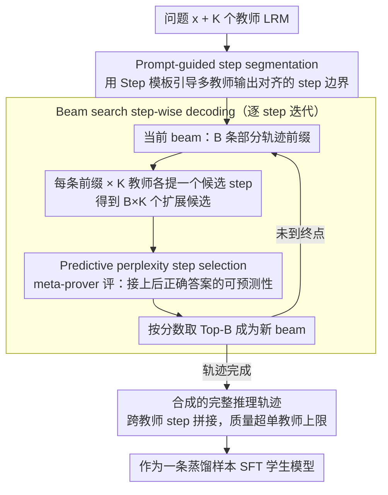

# Distilling Long-CoT Reasoning through Collaborative Step-wise Multi-Teacher Decoding (CoRD)

**会议**: ACL 2026  
**arXiv**: [2605.02290](https://arxiv.org/abs/2605.02290)  
**代码**: 待确认 (论文未直接给出)  
**领域**: 模型压缩 / 蒸馏 / Long-CoT 推理  
**关键词**: 多教师蒸馏、Long-CoT、step-wise decoding、beam search、predictive perplexity

## 一句话总结
作者提出 CoRD（Collaborative Reasoning Decoding），把多教师 Long-CoT 推理蒸馏从「先生成完整轨迹再后选」改造成「step-wise 协同解码」——每步让多个 LRM 提议候选 step，用 meta-prover 的 predictive perplexity 评分 + beam search 保留 Top-B 部分轨迹，最终 32B 学生在 AIME24/25 上超越所有单教师（79.6 / 70.2 vs 78.9 / 67.9）。

## 研究背景与动机

**领域现状**：DeepSeek-R1 一类大推理模型（LRM）通过 test-time scaling + Long-CoT 取得突破，但部署成本极高。把 LRM 的推理能力蒸馏到小模型已是主流方向，代表方法包括 S1、LIMO 等「curation-based」流派——多个教师各自生成完整推理轨迹（数千 token），再用启发式打分挑最高的那条作为训练数据。

**现有痛点**：当前流派有三个根本短板：
1. **PRM / MCTS 不适用 Long-CoT**：process reward model 会过早剪掉「看似次优但其实是 Aha moment 必经之路」的分支；MCTS 在长轨迹上 search space 指数爆炸。
2. **Curation 浪费算力**：每个教师各自生成完整长 trace，最后只留 1 条，其它全丢，且 post-hoc 选择无法动态调节探索方向。
3. **教师间无协同**：多教师只是被独立采样后 max，无法把不同教师的互补优势（如 R1-Qwen 擅长 problem formulation、Phi4 擅长 conclusion synthesis）拼成单个教师无法达成的更优轨迹。

**核心矛盾**：长 CoT 推理的「Aha moment」是动态涌现的——某教师 step t 的弱步骤，若与另一教师 step t+1 的强反思组合，可能产生更高质量。Post-hoc curation 把这种 cross-teacher 时序拼接的可能性消灭了。

**本文目标**：让多教师在 **每个 step** 协同决策，把推理过程本身（而非完整轨迹）当作 distillation 的最小单元。

**切入角度**：把推理过程类比为自回归解码——每个 step 是「token」，教师提议的 step 集合是「decoding vocabulary」，可以用 beam search 在 step 级别探索。

**核心 idea**：用 (i) prompt-guided step segmentation 让不同 LRM 输出对齐的 step 边界，(ii) predictive perplexity 评估「给当前前缀，正确答案的可预测性」作为短期 quality signal，(iii) beam search 在 step 级保留 Top-B 部分轨迹避开 greedy 短视。

## 方法详解

### 整体框架

形式化：对问题 $x$ 和 $K$ 个教师 LRM $\mathcal{T}$，传统 curation 是 $\tau(x_i)^* = \arg\max_{\tau^{(k)}} Q(x_i, \tau^{(k)})$（在 $K$ 条完整轨迹里 max）。CoRD 改为 step-wise：

$$\tau(x_i)^* = \{(s_1^*, \dots, s_T^*) \mid s_t^* = \arg\max_{s_t \in \{s_t^{(1)}, \dots, s_t^{(K)}\}} S(\tau_{<t} \oplus s_t^{(k)})\}$$

每步每个教师条件于共享前缀 $\tau_{<t}$ 提议候选 step $s_t^{(k)}$，由打分函数 $S(\cdot)$ 选出最佳。这是「step-wise autoregressive decoding」——decoding vocabulary 是教师提议集合。

### 关键设计

**1. Prompt-guided step segmentation：用模板把不同 LRM 的 Long-CoT 切到对齐的 step 边界，才谈得上跨模型替换**

要让多个教师在 step 级协同，第一道坎是「step」这个单位本身得对齐——可不同 LRM 的换行习惯、反思 cue（`wait`、`alternatively`）频率天差地别，直接按物理标记切，某些教师每个 step 只有几十 token、另一些却有几百，根本没法横向比。作者的做法是在 prompt 里嵌入 `<think> ### Step` 模板，引导 LRM 主动按「### Step 1. Understanding... ### Step 2. Recalling...」的格式输出，让 `\n\n`、`wait` 这些浅层标记自然落在 step 内部而非边界上。这等于把切分的控制权交给生成时的 LRM，强制它做「逻辑功能性」划分——每个 step 对应一个子任务（problem understanding / theorem recall / case analysis），于是不同教师同一位置的 step 才在语义上可比、可互换。消融里 prompt-guide 的 segmentation 公平性也最高（PP 0.774，优于 line-break 的 0.734 和 prefix 的 0.747）。

**2. Predictive perplexity step selection：不看这一步「对不对」，而看它让正确答案变得多可预测**

切好 step 后需要一个打分函数来挑每步最优候选，而 PRM 这类局部正确性评分有个硬伤——会过早剪掉「初看次优、实则是 Aha moment 必经之路」的分支。作者改用一个独立的 meta-prover（实验里直接复用教师池里最强的 QwQ-32B），对每个候选算前瞻性的分数：

$$S(\tau_{<t} \oplus s_t^{(k)}) = \exp\!\Big(\tfrac{1}{M} \log p_{\text{meta}}(A \mid \tau_{<t} \oplus s_t^{(k)})\Big)$$

其中 $A$ 是 ground-truth 答案序列、$M$ 是答案 token 数，整体是「接上这个 step 后，meta-prover 平均每个答案 token 的条件概率」，归一化到 $[0,1]$。它的好处是三重的：是 bounded 连续分数，能分辨细微的质量差异；通过答案 likelihood 隐式编码了「这条路是否朝正确方向走」的全局判断，天然包容「现在看着错、后面能自纠」的轨迹；而且不需要额外训练 reward model，复用最强教师即可。实验里光把打分从 PRM 换成 predictive perplexity，AIME24 就从 75.0 提到 79.6。

**3. Beam search step-wise decoding：在 step 级保留 Top-B 部分轨迹，既躲开 greedy 的短视又躲开 MCTS 的爆炸**

有了打分还不够——Long-CoT 的 strategic shift、self-correction 往往在某一步看着次优、几步后才显威力，greedy（$B=1$）会当场把它丢掉，MCTS 又要每步 rollout 完整剩余轨迹、长链上 search space 指数爆炸。Beam search 正好卡在中间：第 $t$ 步从上一轮 beam $\mathcal{B}_{t-1} = \{\tau_{<t}^{(b)}\}_{b=1}^B$ 出发，每条前缀让 $K$ 个教师各提一个候选 step，得到 $B \times K$ 个扩展候选，再按 predictive perplexity 选 Top-$B$ 成为 $\mathcal{B}_t$。复杂度 $\mathcal{O}(TKMB)$，远低于 MCTS 的 $\mathcal{O}(TK \log(TMB))$，只比 greedy 高 $B$ 倍（实验取 $B=4$）。更妙的是它带来一个 MCTS 给不了的副产物：MCTS 的 trajectory-level reward 会让搜索塌缩到「整体最强」的那个教师（QwQ-32B 一路统治），而 beam search 保留了 beam 级多样性，反而让 R1-Qwen-32B 在 early phase（problem formulation）、Phi4-Reasoning-Plus 在 late phase（conclusion synthesis）各自发挥，涌现出清晰的分工。

### 一个完整示例：三教师协同解一道 AIME 题

设教师池为 $K=3$（R1-Qwen-32B / QwQ-32B / Phi4-Reasoning-Plus），meta-prover 用 QwQ-32B，beam width $B=4$，正确答案 $A$ 已知。

- **Step 1（problem formulation）**：当前只有空前缀，4 条 beam 退化为 1 条。3 个教师各提一个「问题理解」候选 step，得到 3 个扩展。meta-prover 给三者算 predictive perplexity——R1-Qwen-32B 把约束条件列得最干净，分数 0.71，高于 QwQ 的 0.66 和 Phi4 的 0.59；由于候选不足 $B=4$，三条全部保留进 $\mathcal{B}_1$。
- **Step 2（theorem recall / case split）**：4 条（实际 3 条）前缀 × 3 教师 = 9 个候选 $\mathcal{C}_2$。其中「R1 前缀 + QwQ 的反思续写」组合拿到最高分 0.78——这正是单个教师给不出的跨教师拼接。按分数取 Top-4 进 $\mathcal{B}_2$，低分的「绕远路」分支被淘汰但不是被一步砍死。
- **…逐步推进…** 每步都是「$B\times K$ 候选 → 打分 → 留 Top-B」，beam 里逐渐沉淀出 early phase 由 R1/QwQ 主导、late phase 由 Phi4 主导的轨迹。
- **末步（conclusion synthesis）**：Phi4 的收尾候选让答案可预测性飙到最高，beam 收束出一条完整轨迹。这条最终轨迹既不是任何单一教师独立能生成的，整体质量（AIME24 79.6）也反超最强教师 Phi4 的 78.9。

整条轨迹随后作为一条蒸馏样本喂给学生做 SFT——学生学到的是「多教师 step 级合成」出来的、超出任何单教师上限的推理过程。

### 损失函数 / 训练策略
学生模型用纯 SFT 训练。教师 pool：QwQ-32B + R1-Distill-Qwen-32B + Phi4-Reasoning-Plus（heterogeneous）或单一 QwQ-32B 不同温度采样（homogeneous）。Meta-prover：QwQ-32B（最强者）。Beam width $B = 4$。基础数据集：LIMO-v1 (817 题)、S1k-1.1 (1000)、LIMO-v2 (800)。学生：R1-Qwen-7B/14B/32B。训练：8×H100，bs=8，5 epochs，lr=5e-6，max seq=20480，DeepSpeed Stage-3。生成时 max output=20,480 token（reasoning 16,384 + answer 4,096）。

## 实验关键数据

### 主实验：AIME24/25 学生 Pass@1（Heterogeneous teachers）

| 模型 / 方法 | AIME24 | AIME25 |
|------------|--------|--------|
| Teacher: R1-Qwen-32B | 71.6 | 53.8 |
| Teacher: QwQ-32B | 77.9 | 66.7 |
| Teacher: Phi4-Reasoning-Plus | 78.9 | 67.9 |
| Student R1-Qwen-32B w/o distill | 71.6 | 53.8 |
| Student 32B + Curation-Hetero | 75.0 | 62.1 |
| Student 32B + Integration-Hetero | 12.7 | 9.0 |
| **Student 32B + CoRD-Hetero** | **79.6** | **70.2** |
| Student 7B + Curation-Hetero | 56.6 | 42.1 |
| **Student 7B + CoRD-Hetero** | **60.8** | **45.6** |
| Student 14B + CoRD-Hetero | **74.8** | **62.3** |

CoRD 蒸馏的 32B 学生在两个 benchmark 上**全部超越**最强教师 Phi4-Reasoning-Plus，证明 collaborative step-wise composition 产生了「教师无法独立达到」的轨迹。Integration baseline（GPT5o-mini 把多教师轨迹融合）反而极度恶化（只剩 9-12 分），因为它把 Long-CoT 压成 short-form 丢失监督信号。

### 消融实验

**(a) Step segmentation（Heterogeneous, R1-Qwen-32B student）**

| 方法 | Acc | PP | AIME24 | AIME25 |
|------|-----|------|--------|--------|
| Line-break | 88.4 | 0.734 | 76.7 | 67.7 |
| Prefix | 91.3 | 0.747 | 77.1 | 67.3 |
| **Prompt-guide** | **93.1** | **0.774** | **79.6** | **70.2** |

**(b) Step selection criterion**

| 方法 | Acc | PP | AIME24 | AIME25 |
|------|-----|------|--------|--------|
| Random | 80.4 | 0.494 | 69.0 | 61.9 |
| Max-length | 80.0 | 0.502 | 68.8 | 59.0 |
| PRM (Qwen2.5-Math-PRM-72B) | 82.6 | 0.591 | 75.0 | 64.6 |
| Binary Judgment (LLM) | 91.7 | 0.626 | 77.7 | 66.3 |
| **Predictive Perplexity** | **93.1** | **0.774** | **79.6** | **70.2** |

**(c) Decoding strategy**

| 方法 | Acc | PP | AIME24 | AIME25 | 时间(s) |
|------|-----|------|--------|--------|--------|
| Greedy ($B=1$) | 81.6 | 0.719 | 76.7 | 66.5 | – |
| MCTS | 89.6 | 0.755 | 75.8 | 66.3 | 589.2 |
| **Beam Search ($B=4$)** | **93.1** | **0.774** | **79.6** | **70.2** | **288.7** |
| Curation 基线 | 84.8 | 0.652 | 75.0 | 62.1 | 168.3 |
| Curation×2（同算力） | 90.3 | 0.712 | 74.6 | 63.8 | 336.6 |

### 关键发现
- **CoRD 32B 学生超越所有 32B 教师**：79.6 vs Phi4 的 78.9 (AIME24)；70.2 vs Phi4 的 67.9 (AIME25)。蒸馏出「教师做不到的」推理。
- **Predictive perplexity 与学生表现强相关，answer accuracy 反而不可靠**：Integration baseline 在 reasoning 阶段 answer accuracy 91.2，但 perplexity 仅 0.223（说明轨迹被压成 short-CoT），蒸馏后学生只有 12.7 分。证明「轨迹的 'reasoning process' 质量」才是关键，单看最终答案对错会误导。
- **Heterogeneous > Homogeneous**：异构教师让 32B 学生 AIME24 从 75.8 涨到 79.6，AIME25 从 64.4 涨到 70.2。多样性来自架构而非采样温度。
- **教师分工自动涌现**：beam search 下 R1-Qwen-32B / QwQ-32B 主导 early phase（≤40% 进度，problem formulation/constraint analysis），Phi4-Reasoning-Plus 主导 late phase（≥80%，conclusion synthesis）。MCTS 反而塌缩到 globally strongest teacher。
- **Curation 给等量算力也追不上**：Curation×2（同算力 336.6s vs CoRD 288.7s）的学生表现 74.6 / 63.8 仍远低于 CoRD 79.6 / 70.2，说明问题不是「采样量」而是「step-wise composition 不可替代」。
- **泛化到非 AIME**：MATH500 94.8（vs Curation-Hetero 93.4），TaTQA 95.2（vs 88.2，表格推理，OOD），PubMedQA 91.8（vs 88.4，生物医学开放式 QA）。
- **8B 学生也受益**：R1-Llama-8B + CoRD-Hetero 在 AIME24 涨到 54.0（vs Curation 41.3），证明非 Qwen 系列也能 work。

## 亮点与洞察
- **「把推理当 token 来 decode」是观念上的一次跃迁**：传统 KD 在 token 级、curation 在 trajectory 级，CoRD 在 step 级——把 reasoning 的 grain size 调到刚好能跨模型 swap 的层级，从而打开「教师协同合成」的可能。
- **Predictive perplexity 是个被低估的 reward signal**：它是 forward-looking 的——不评价 step 局部「对不对」，而评价「这步之后正确答案是否更可预测」。这天然包容「初看错但带来更好后续」的 Aha 路径，恰好规避 PRM 的硬伤。
- **Prompt-guided segmentation 的 trick 可迁移**：用 `### Step N.` 模板控制 LRM 输出 step 边界，是一个零训练成本的标准化手段，可用于任何 multi-model 协同 / step-level evaluation 场景（agent step alignment、tool-use trajectory comparison 等）。
- **Specialization emerges from beam search**：教师在不同推理 phase 各显神通，是从 predictive perplexity scoring + beam-level diversity preservation 中自然涌现的，没有任何手工分工 prompt。这种 emergent specialization 让人想到 MoE，但在 inference-time 实现。
- **MCTS 在 Long-CoT 上反而劣化**：作者明确分析 MCTS 偏向 globally strongest teacher，因为 trajectory-level reward 会让 search 收敛到「整体最强」的分支，丢失局部互补性。这对设计 Long-CoT search 方法有警示意义——粒度选错就会丢失协同。

## 局限与展望
- **只在数学/英文上测**：作者承认未跨语言验证，且 LRM 主要 English-trained，多语言推理蒸馏未知。
- **只用 SFT**：未尝试 DPO 等偏好学习，CoRD 生成的 step-level preference data 天然可做 step-DPO，是显然的下一步。
- **Meta-prover 必须强**：实验显示用弱 meta-prover（R1-Qwen-32B 充当 prover）AIME25 从 70.2 跌到 53.2，意味着 CoRD 强依赖教师 pool 里至少有一个强模型作 scoring。
- **效率仍有改进空间**：CoRD 单题 288.7s，比 Curation (168.3s) 慢 ~70%，对大规模数据集（>10k 题）成本不低；虽然比 MCTS (589.2s) 快一半，但仍非线上推理友好。
- **未对比 token-level distillation**：传统 token logit matching（如 white-box KD）在 LRM 上的表现未对比，CoRD 是否优于纯 token KD 未知。
- **改进方向**：(i) 蒸馏 lighter meta-prover 减少打分开销；(ii) 把 CoRD 推到 multi-modal / agent / code reasoning；(iii) step-level preference learning（CoRD 的 beam candidates 天然是 step-level preference pair）。

## 相关工作与启发
- **vs S1 / LIMO**：S1k-1.1 / LIMO-v1/v2 都是 curation-based，给定 base 数据集 CoRD 在 AIME24/25 上一致优于这三个 dataset 的原始版（Fig 3），证明 step-wise generation 的数据质量上限高于人工 curation。
- **vs PRM-based RL（PRM800K, Math-Shepherd）**：PRM 评 step 局部正确性，CoRD 评 step 对最终答案的预测力，是更适合 Long-CoT「自纠错」特性的 reward。CoRD 在消融里直接打败 PRM（79.6 vs 75.0 on AIME24）。
- **vs MCTS-based reasoning (rStar, Mulberry, ToT)**：这些用 MCTS+rollout 评估 step，CoRD 用 beam search + 一次性 perplexity，速度快一倍且效果更好，原因是 perplexity 已经隐式包含「未来 informedness」，无需显式 rollout。
- **vs Mixture-of-Agents (Wang et al., 2024)**：MoA 在 response 级别融合多模型答案，CoRD 在 step 级别融合多模型推理，granularity 更细，且能产生 trajectory-level 监督信号。
- **vs Self-Consistency / Multi-pass inference**：这两者是单教师多采样后 majority vote，CoRD 是多教师 step-wise 协同，理论上能合成单教师永远生成不出的轨迹（实验里 32B 学生超教师就是证据）。

## 评分
- 新颖性: ⭐⭐⭐⭐⭐ 把 Long-CoT 蒸馏重定义为「step-wise collaborative decoding」，并搭配 predictive perplexity + beam search，组合 + 视角都新
- 实验充分度: ⭐⭐⭐⭐⭐ 5 个 benchmark + 3 个学生大小 + 2 个教师配置 + 4 种 baseline + 5 维消融（segmentation/selection/decoding/meta-prover/segmentation dynamics）+ 跨家族泛化
- 写作质量: ⭐⭐⭐⭐ 公式定义清晰，复杂度对比和 wall-clock 时间表给出工程参考；图 2/5 的 hit-rate 可视化直观
- 价值: ⭐⭐⭐⭐⭐ 学生超教师是 KD 领域罕见结果，且方法 training-free（不训练 reward model），对蒸馏 LRM 的实际部署有直接价值

<!-- RELATED:START -->

## 相关论文

- [\[ICLR 2026\] LogicReward: Incentivizing LLM Reasoning via Step-Wise Logical Supervision](../../ICLR2026/llm_reasoning/logicreward_incentivizing_llm_reasoning_via_step-wise_logical_supervision.md)
- [\[ACL 2026\] Long-Context Reasoning Through Proxy-Based Chain-of-Thought Tuning](long-context_reasoning_through_proxy-based_chain-of-thought_tuning.md)
- [\[CVPR 2026\] Rationale-Enhanced Decoding for Multi-modal Chain-of-Thought](../../CVPR2026/llm_reasoning/rationale-enhanced_decoding_for_multi-modal_chain-of-thought.md)
- [\[ACL 2026\] Reasoning Fails Where Step Flow Breaks](reasoning_fails_where_step_flow_breaks.md)
- [\[ACL 2026\] On the Step Length Confounding in LLM Reasoning Data Selection](on_the_step_length_confounding_in_llm_reasoning_data_selection.md)

<!-- RELATED:END -->
