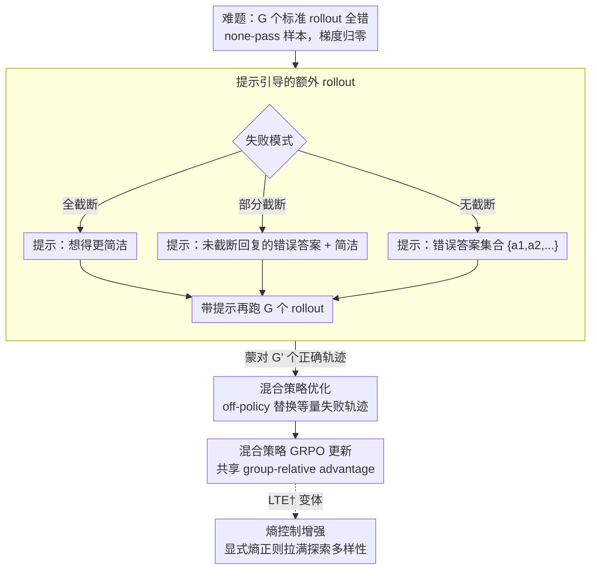

# Do Not Step Into the Same River Twice: Learning to Reason from Trial and Error

**会议**: ACL 2026  
**arXiv**: [2510.26109](https://arxiv.org/abs/2510.26109)  
**代码**: [GitHub](https://github.com/JamyDon/LTE)  
**领域**: LLM Reasoning / Reinforcement Learning  
**关键词**: 探索停滞, 试错学习, 强化学习, 提示引导探索, 数学推理

## 一句话总结

提出 LTE (Learning to reason from Trial and Error)，通过将模型自身生成的错误答案作为提示引导额外 rollout，在不依赖外部专家的情况下有效缓解 RLVR 中的探索停滞问题。

## 研究背景与动机

**领域现状**：RLVR（基于可验证奖励的强化学习）是提升 LLM 推理能力的核心范式，GRPO 是其事实标准算法。然而，RLVR 训练中存在严重的**探索停滞**(exploration stagnation)问题——当训练样本对模型过于困难时，所有 rollout 都无法生成正确答案，导致模型从这些样本中获得零梯度信号，永远无法突破自身能力上限。

**现有痛点**：已有方法试图通过引入外部引导来突破探索停滞：(1) 利用人工标注的标准解题过程，成本高且不可扩展；(2) 使用更强 LRM 生成的推理链（如 LUFFY），但更强模型并非总是可获取（如训练旗舰模型时）。这些方法更像是"治标不治本"的权宜之计。

**核心矛盾**：在标准 GRPO 的 0/1 奖励设定下，当所有 $G$ 个 rollout 都失败（none-pass samples）时，所有 group-relative advantage 退化为零（$\hat{A}_{i,t}=0$），梯度为零，策略完全无法从这些样本中学习。简单增加 rollout 数量（GRPOExtra）效果甚微，因为在相同策略分布下重复采样并不能带来本质突破。

**本文目标**：设计一个完全不依赖外部专家引导的方法来缓解 RLVR 中的探索停滞。

**核心idea**：类比人类学习——当学生被告知之前犯过的错误后，会避开这些错误，从而更有可能找到正确答案。LTE 收集模型在初始 rollout 中生成的错误答案，将其作为"不要重蹈覆辙"的提示，引导模型在额外 rollout 中探索不同的解题路径。

## 方法详解

### 整体框架

LTE 想解决的是 RLVR 训练里那些"模型怎么都做不对"的难题——标准 GRPO 下，一道题如果 $G$ 个 rollout 全军覆没，group-relative advantage 全部归零、梯度也归零，模型从这类样本身上学不到任何东西，能力上限被死死卡住。LTE 的做法是给这些"全错"样本（none-pass samples）一次补救机会：先跑 $G$ 个标准 rollout，一旦发现全错，就根据它们的失败模式选一个提示模板，把模型自己刚犯的错告诉它，再跑 $G$ 个"带提示"的额外 rollout；如果这次蒙对了，就用对的轨迹替换掉初始的错误轨迹，最后通过混合策略 GRPO 完成一次更新。整个闭环只用到模型自身的行为，不碰任何外部专家或更强模型。

### 关键设计

**1. 提示引导的额外 rollout：把模型刚犯的错当成"别再走这条路"的路标**

none-pass 样本之所以零梯度，是因为重复在同一个策略分布里采样根本跳不出原来的错误圈。LTE 的关键是不"无脑加采样"，而是把初始 rollout 暴露出的失败信息回灌给模型。它按三种失败模式分别处理：若所有回复都因超长被截断（all-truncated），提示就让模型"想得简洁些"；若只有部分被截断（some-truncated），则从没被截断的回复里抽出错误答案当提示、同时要求简洁；若都没截断（none-truncated），就纯粹把错误答案集合 $\{a_1, a_2, \ldots\}$ 摆出来。提示里还会明确要求模型不要在推理链中提及或直接套用这些答案，以免污染 CoT 的"干净度"。这一招本质上是用错误答案把解空间收窄——告诉模型"这些都验证过是错的"，于是它更有动力去试别的路径，和人被指出错误后会绕开同一个坑是一个道理。

**2. 混合策略优化：把"带提示蒙对"的轨迹以 off-policy 方式安全地塞进更新**

带提示生成的正确答案有个尴尬之处：它是在"附加了提示"这个不同输入条件下产生的，直接当 on-policy 样本算梯度会有分布偏差。LTE 的处理是，若额外 rollout 里有 $G'$ 个正确答案 $\{o'_1, \ldots, o'_{G'}\}$，就随机替换掉等量的初始失败轨迹，并把它们当 off-policy 数据。具体地，定义提示策略 $\hat{\pi}(\cdot|\cdot) = \pi_{\mathrm{old}}(\cdot|\mathcal{H}_q, \cdot)$（$\mathcal{H}_q$ 是该 prompt 的提示上下文），重要性采样比率改写为

$$\hat{r}'_{i,t}(\theta) = \frac{\pi_\theta(o'_{i,t}|q, o_{i,<t})}{\pi_{\theta_{\mathrm{old}}}(o'_{i,t}|\mathcal{H}_q, q, o_{i,<t})}$$

分子是不带提示的当前策略、分母是带提示的旧策略，正好抵消掉"提示"带来的条件差异。为防止比率爆炸，再套一层正则化重要性采样 $f(r) = r/(r+\gamma)$ 保证更新稳定。这样一来，替换后的所有 rollout 就能一起算 group-relative advantage，原本零梯度的样本重新有了可学的信号。

**3. 熵控制增强变体 LTE†：再补一个显式熵正则把探索拉满**

LTE 通过提示引导已经隐式地鼓励了探索，但作者发现还能再榨一点。LTE† 在 LTE 的基础上加一项熵损失，显式鼓励策略保持输出多样性，避免过早收敛到单一模式。这个变体的另一个用处是公平对比：DAPO、LUFFY 等强基线都带熵控制，加上熵项后 LTE† 才和它们站在同一条起跑线上，实验里也正是 LTE† 在 Pass@k 这种探索上限指标上最为突出。

### 损失函数 / 训练策略

LTE 的目标函数是混合策略版 GRPO：on-policy 部分沿用标准 GRPO 的 clip 损失，off-policy 部分对提示引导轨迹用上面那套正则化重要性采样，两部分共享同一组 group-relative advantage。实现基于 verl 框架，每个 prompt 采 8 个 rollout，温度 1.0，最大回复长度 8192，训练 500 步。

## 实验关键数据

### 主实验 (Pass@1)

| 模型 | 方法 | MATH-500 | AIME24 | AIME25 | Avg. |
|------|------|----------|--------|--------|------|
| Qwen3-8B-Base | GRPO | 77.70 | 22.08 | 15.83 | 43.99 |
| Qwen3-8B-Base | GRPOExtra | 75.75 | 22.29 | 14.79 | 41.72 |
| Qwen3-8B-Base | LTE | 78.85 | 30.62 | 27.29 | 49.01 |
| Qwen3-8B-Base | LUFFY | 80.20 | 29.17 | 21.25 | 47.15 |
| Qwen3-8B-Base | LTE† | 79.80 | 30.83 | 25.83 | 49.56 |

### Pass@k (探索上限)

| 模型 | 方法 | AIME24 | AIME25 | Avg. |
|------|------|--------|--------|------|
| Qwen3-8B-Base | GRPO | 43.33 | 30.00 | 56.82 |
| Qwen3-8B-Base | LTE | 70.00 | 46.67 | 66.78 |
| Qwen3-8B-Base | LUFFY | 60.00 | 33.33 | 61.55 |
| Qwen3-8B-Base | LTE† | 66.67 | 50.00 | 67.58 |

### 消融实验

| 配置 | 关键指标 | 说明 |
|------|---------|------|
| GRPOExtra vs LTE | -7.29 Pass@1, -10.04 Pass@k | 无提示的额外 rollout 效果极差 |
| LTE vs LUFFY (无熵控制) | +1.86 Pass@1 | 不依赖外部专家仍优于 LUFFY |
| LTE† vs LUFFY (有熵控制) | +2.41 Pass@1, +2.15 Pass@k | 加熵控制后优势更明显 |

### 关键发现
- LTE 在训练过程中持续减少 none-pass 样本数量，有效缓解了探索停滞
- LTE 维持更高的长尾熵值，鼓励测试时的深度思考（更长的回复长度）
- 简单增加 rollout 数量(GRPOExtra)甚至可能比标准 GRPO 更差，验证了"量变不能带来质变"
- LTE† 在 Pass@k 指标上尤其突出，说明 LTE 有效拓展了探索上限

## 亮点与洞察
- **"试错学习"的优雅类比**：将人类通过错误反馈改进的学习方式迁移到 RL 训练中，直觉简洁且有效
- **零外部依赖**：完全利用模型自身的行为信息（错误答案）作为引导，实际部署无门槛
- **三种失败模式的差异化处理**：根据截断情况分别设计提示模板，体现了对问题的深入理解
- **Pass@k 的巨大提升**：特别是在 AIME24 上从 43.33 提升到 70.00(Pass@k)，证明了 LTE 显著拓展了模型的探索上限
- **与 LUFFY 的有力对比**：不使用任何外部专家轨迹的 LTE† 竟然超越了依赖更强模型的 LUFFY

## 局限与展望
- 额外 rollout 引入了约 2 倍的采样开销（对 none-pass 样本），训练效率有待优化
- 仅在数学推理任务上验证，其他推理领域（代码、逻辑）的适用性未知
- 提示模板是手工设计的，自动化的提示生成策略可能带来进一步提升
- 部分基线（ReLIFT、EvoCoT）在 Qwen3 上表现不佳，可能存在模型兼容性问题
- 未来可探索更动态的提示策略（如利用更丰富的错误模式信息而非仅错误答案）

## 相关工作与启发
- **vs LUFFY**：LUFFY 使用更强 LRM 的推理轨迹作为 off-policy 样本，LTE 仅用自身错误答案作为提示，在两个 LM 上均超越 LUFFY
- **vs GRPOExtra**：简单增加 rollout 数量在 Qwen3-8B-Base 上甚至比 GRPO 更差(-2.27 Avg)，证明了提示引导的必要性
- **vs DAPO**：DAPO 通过 clip-higher 等技术改进优化算法本身，LTE 通过改进采样策略增强探索，两者正交且可互补
- **vs EvoCoT**：EvoCoT 使用 ground truth 答案作为提示，LTE 使用自身错误答案作为"反面教材"，思路完全不同且效果更好

## 评分
- 新颖性: ⭐⭐⭐⭐⭐ 利用模型自身错误作为探索引导的想法简洁而新颖，"不要踏入同一条河"的隐喻贴切
- 实验充分度: ⭐⭐⭐⭐ 多模型多基准评估，含 Pass@1 和 Pass@k，训练动态分析全面
- 写作质量: ⭐⭐⭐⭐ 结构清晰，问题定义精确，算法伪代码完整
- 价值: ⭐⭐⭐⭐⭐ 提供了一种零外部依赖的探索停滞解决方案，实用性极强

<!-- RELATED:START -->

## 相关论文

- [\[ICML 2026\] Hidden Error Awareness in Chain-of-Thought Reasoning: The Signal Is Diagnostic, Not Causal](../../ICML2026/llm_reasoning/hidden_error_awareness_in_chain-of-thought_reasoning_the_signal_is_diagnostic_no.md)
- [\[ACL 2026\] Which Reasoning Trajectories Teach Students to Reason Better? A Simple Metric of Informative Alignment](which_reasoning_trajectories_teach_students_to_reason_better_a_simple_metric_of_.md)
- [\[ACL 2026\] Reasoning Fails Where Step Flow Breaks](reasoning_fails_where_step_flow_breaks.md)
- [\[ACL 2026\] TemplateRL: Structured Template-Guided Reinforcement Learning for LLM Reasoning](templaterl_structured_template-guided_reinforcement_learning_for_llm_reasoning.md)
- [\[ACL 2026\] Is Chain-of-Thought Really Not Explainability? Chain-of-Thought Can Be Faithful without Hint Verbalization](is_chain-of-thought_really_not_explainability_chain-of-thought_can_be_faithful_w.md)

<!-- RELATED:END -->
